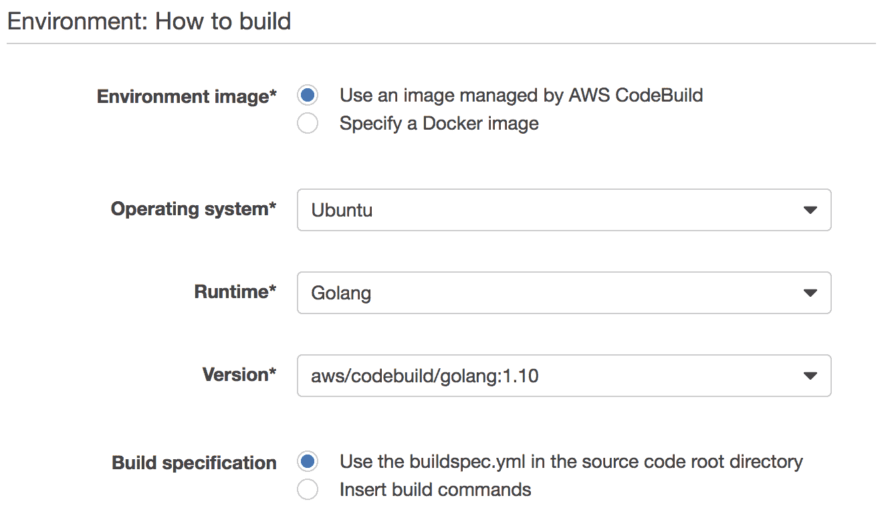
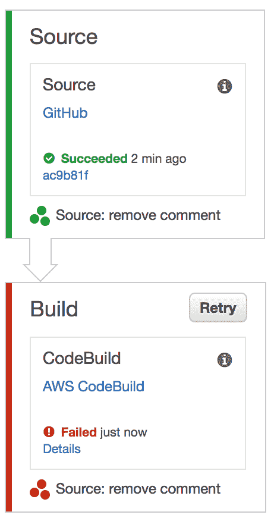
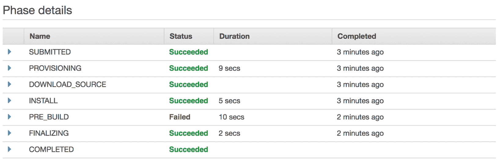
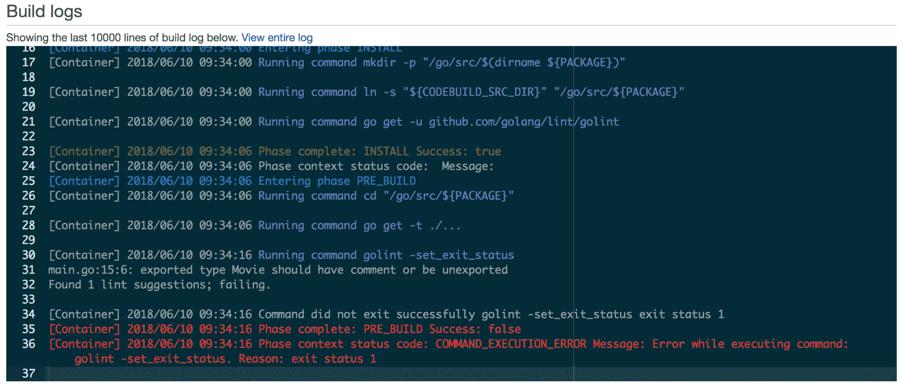
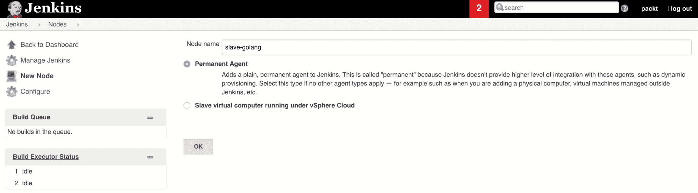
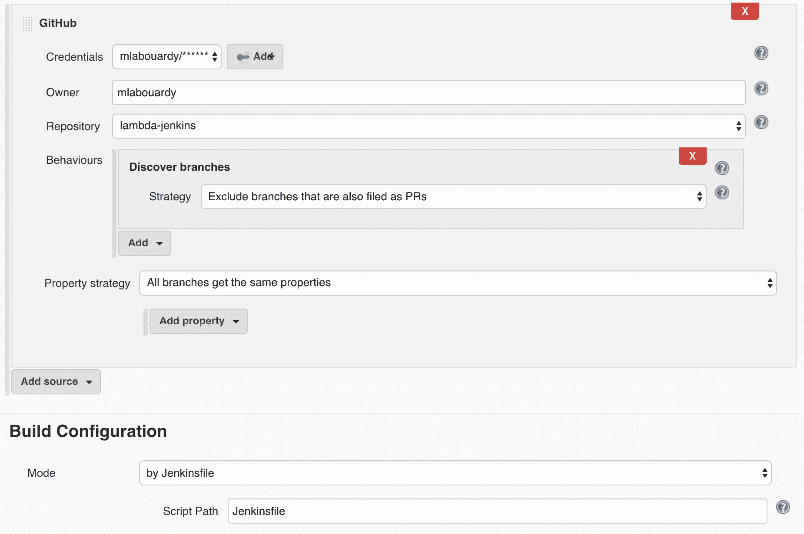
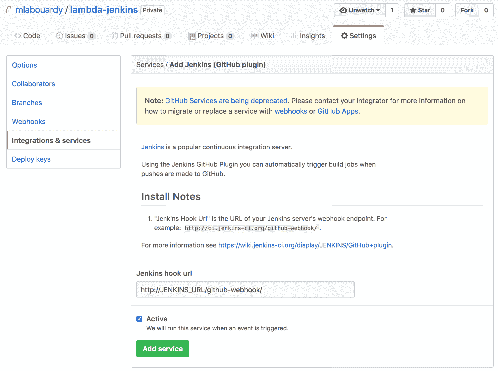
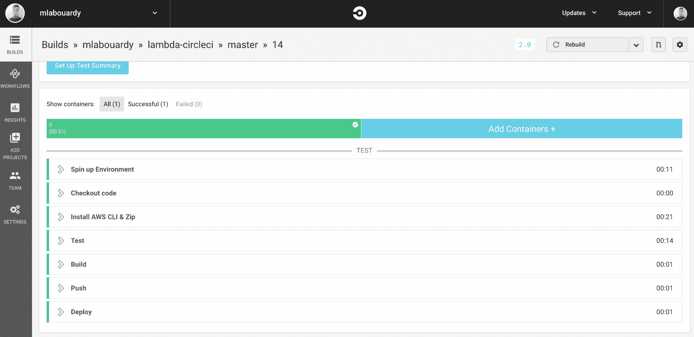

# 实现 CI/CD 管道

本章将讨论高级概念，例如：

*   如何设置高弹性和容错 CI/CD 管道，以自动部署无服务器应用程序
*   为 Lambda 函数提供集中代码存储库的重要性
*   如何将代码更改自动部署到生产环境中。

# 技术要求

在开始本章之前，请确保创建了前几章中构建的函数的源代码，并将其上载到集中的 GitHub 存储库中。此外，强烈建议有 CI/CD 概念方面的经验。本章的代码包托管在 GitHub 上的[https://github.com/PacktPublishing/Hands-On-Serverless-Applications-with-Go](https://github.com/PacktPublishing/Hands-On-Serverless-Applications-with-Go) 。

# 持续集成和部署工作流

持续集成、持续部署和持续交付是加快软件上市时间、从反馈中推动创新、同时确保通过每次迭代构建高质量产品的绝佳方式。但这些做法意味着什么？在 AWS Lambda 中构建无服务器应用程序时，如何应用它们

# 连续积分

**持续集成**（**CI**）是拥有一个集中的代码存储库，并在将所有更改和功能集成到中央存储库之前通过一个复杂的管道的过程。每当发生代码提交时，经典 CI 管道就会触发构建，运行单元测试和所有预集成测试，构建工件，并将结果推送到工件管理存储库。

# 连续部署

**持续部署**（**CD**是持续集成的延伸。通过持续集成管道所有阶段的每个更改都会自动发布到您的阶段环境。

# 连续交付

**连续交付**（**CD**）与 CD 类似，但在将发布部署到生产之前需要人工干预或业务决策。

现在已经定义了这些实践，您可以使用这些概念来利用自动化的威力并构建端到端部署过程，如下图所述：


在接下来的部分中，我们将介绍如何使用最常用的 CI 解决方案构建此管道。

为了说明这些概念，将只使用`FindAllMovies`函数的代码，但相同的步骤可以应用于其余的 Lambda 函数。

# 自动部署 Lambda 功能

在本节中，我们将了解如何通过以下不同方式构建一个管道，以自动化上一章中构建的 Lambda 函数的部署过程：

*   AWS 托管解决方案，如 CodePipeline 和 CodeBuild
*   内部解决方案，如 Jenkins
*   SaaS 解决方案，如 Circle CI

# 使用 CodePipeline 和 CodeBuild 进行连续部署

AWS CodePipeline 是一种工作流管理工具，允许您自动执行软件的发布和部署过程。用户定义了一组形成 CI 工作流的步骤，这些步骤可以在 AWS 管理的服务（如 CodeBuild 和 CodeDeploy）或第三方工具（如 Jenkins）上执行。

在本例中，AWS CodeBuild 将用于测试、构建和部署 Lambda 函数。因此，应该在代码库中创建一个名为`buildspec.yml`的构建规范文件

`buildspec.yml`定义了一组将在 CI 服务器上执行的步骤，如下所示：

```go
version: 0.2
env:
 variables:
 S3_BUCKET: "movies-api-deployment-packages"
 PACKAGE: "github.com/mlabouardy/lambda-codepipeline"

phases:
 install:
 commands:
 - mkdir -p "/go/src/$(dirname ${PACKAGE})"
 - ln -s "${CODEBUILD_SRC_DIR}" "/go/src/${PACKAGE}"
 - go get -u github.com/golang/lint/golint

 pre_build:
 commands:
 - cd "/go/src/${PACKAGE}"
 - go get -t ./...
 - golint -set_exit_status
 - go vet .
 - go test .

 build:
 commands:
 - GOOS=linux go build -o main
 - zip $CODEBUILD_RESOLVED_SOURCE_VERSION.zip main
 - aws s3 cp $CODEBUILD_RESOLVED_SOURCE_VERSION.zip s3://$S3_BUCKET/

 post_build:
 commands:
 - aws lambda update-function-code --function-name FindAllMovies --s3-bucket $S3_BUCKET --s3-key $CODEBUILD_RESOLVED_SOURCE_VERSION.zip
```

构建规范分为以下四个阶段：

*   **安装**：
    *   设置 Go 工作区
    *   安装过梁
*   **预建**：
    *   安装 Go 依赖项
    *   检查我们的代码是否格式良好，是否遵循 Go 最佳实践和常见约定
    *   使用`go test`命令运行单元测试
*   **构建**：
    *   使用`go build`命令构建一个二进制文件
    *   从生成的二进制文件创建部署包`.zip`
    *   将`.zip`文件存储在 S3 存储桶中
*   **后期构建**：
    *   使用新的部署包更新 Lambda 函数的代码

单元测试命令将返回一个空响应，因为我们将在下一章中编写 Lambda 函数的单元测试。

# 源提供程序

现在我们的工作流已经定义，让我们创建一个连续的部署管道。打开 AWS 管理控制台（[https://console.aws.amazon.com/console/home](https://console.aws.amazon.com/console/home) ），从**开发者工具**部分导航到 AWS CodePipeline，并创建一个名为 MoviesAPI 的新管道，如以下屏幕截图所示，如下所示：


在“源位置”页面上，选择 GitHub 作为源提供程序，如下所示：


除了 GitHub 之外，AWS CodePipeline 还支持 AmazonS3 和 AWS CodeCommit 作为代码源提供程序。

单击连接到 GitHub 按钮并授权 CodePipeline 访问您的 GitHub 存储库；然后，选择存储代码的 Github 存储库和要构建的目标 git 分支，如下所示：


# 生成提供程序

在构建阶段，选择 AWS CodeBuild 作为构建服务器。Jenkins 和 Solano CI 也是受支持的构建提供程序。请注意以下屏幕截图：


创建管道的下一步是定义一个新的 CodeBuild 项目，如下所示：


将构建服务器设置为 Ubuntu 实例，Golang 作为运行时环境，如下一个屏幕截图所示：



构建环境也可以基于 DockerHub 或私有注册表中公开的 Docker 映像，例如**弹性容器注册表**（**ECR**）。

CodeBuild 将把工件（`deployment`包）存储在 S3 存储桶中，并更新 Lambda 函数的`FindAllMovies`代码。因此，应附加具有以下策略的 IAM 角色：

```go
{
  "Version": "2012-10-17",
  "Statement": [
    {
      "Sid": "VisualEditor0",
      "Effect": "Allow",
      "Action": [
        "s3:PutObject",
        "s3:GetObject",
        "lambda:UpdateFunctionCode"
      ],
      "Resource": [
        "arn:aws:s3:::movies-api-deployment-packages/*",
        "arn:aws:lambda:us-east-1:305929695733:function:FindAllMovies"
      ]
    }
  ]
}
```

在前面的代码块中，`arn:aws:lambda:us-east-1`帐户 ID 应替换为您的帐户 ID。

# 部署提供程序

随着项目的构建，下一步要在管道中进行配置的是部署到环境中。在本章中，我们将选择 No Deployment 选项，并让 CodeBuild 使用 AWS CLI 将新代码部署到 Lambda，如下一个屏幕截图所示：


此部署过程需要解释无服务器应用程序模型和 CloudFormation，这将在后面的章节中详细解释。

审查细节；准备好后，单击“保存”，应按如下方式创建一个新管道：


管道将启动，构建阶段将失败，如以下屏幕截图所示：



如果我们点击 Details 链接，它会将您带到该特定构建的 CodeBuild 项目页面。此处可以看到描述构建规范文件的阶段：



如图所示，预构建阶段失败；在底部的日志部分，我们可以看到这是由于`golint`命令：



在 Golang 中，所有顶级导出名称（大写）都应该有文档注释。因此，应在 Movie struct 声明顶部添加新注释，如下所示：

```go
// Movie entity
type Movie struct {
  ID string `json:"id"`
  Name string `json:"name"`
}
```

将新的更改提交到 GitHub，新的构建将触发管道的执行：


您可能想知道将代码更改推送到代码存储库是如何触发新构建的。答案是 githubwebhooks。创建 CodeBuild 项目时，会在 GitHub 存储库中自动创建一个新的 Webhook。因此，对代码存储库的所有更改都将通过 CI 管道进行，如下一个屏幕截图所示：


管道完成后，应通过所有代码构建阶段，如下一个屏幕截图所示：


打开 S3 控制台，点击管道使用的 bucket；存储新部署包时，应使用与提交 ID 相同的密钥名：


最后，CodeBuild 将使用`update-function-code`命令更新 Lambda 函数的代码

# 与 Jenkins 的连续管道

多年来，詹金斯一直是人们选择的工具。它是一个用 Java 编写的开源持续集成服务器，构建在 Hudson 项目之上。由于其插件驱动的体系结构和丰富的生态系统，它具有高度的可扩展性。

在接下来的部分中，我们将与 Jenkins 一起以代码的形式编写第一个*管道，但首先我们需要设置 Jenkins 环境。*

# 分布式构建

要开始，请按照本指南中的官方说明安装 Jenkins:[https://jenkins.io/doc/book/installing/](https://jenkins.io/doc/book/installing/) 。一旦 Jenkins 启动并运行，请将浏览器指向`http://instance_ip:8080`。此链接将显示 Jenkins 仪表板，如下一个屏幕截图所示：


使用 Jenkins 的优点之一是它的主/从架构。它允许您设置一个 Jenkins 集群，其中有多个工作人员（代理）负责构建应用程序。这种体系结构有许多好处：

*   响应时间，没有很多作业等待在队列中构建
*   增加了并发生成的数量
*   支持多种平台

以下步骤描述了为 Jenkins build server 启用新工作进程的配置过程。worker 是 EC2 实例，安装了最新稳定版本`JDK8`和`Golang`（请参见[第 2 章](02.html)、*AWS Lambda 入门*的说明）。

工作程序运行后，将其 IP 地址复制到剪贴板，返回 Jenkins 主仪表板，单击 Manage Jenkins，然后单击 Manage Nodes。单击 New Node，给员工一个名字，然后选择 Permanent Agent，如下一个屏幕截图所示：



然后，将节点根目录设置为 Go 工作区，粘贴节点的 IP 地址并选择 SSH 密钥，如下所示：


如果所有配置都正确，则节点将联机，如下所示：


# 找詹金斯的工作

现在我们的集群已经部署好了，我们可以编写第一个 Jenkins 管道了。这个管道是在一个名为`Jenkinsfile`的文本文件中定义的。此定义文件必须提交到 Lambda 函数的代码存储库。

`Pipeline`插件必须安装在 Jenkins 上，才能使用*管道作为代码*功能。此功能提供了许多即时好处，例如代码检查、回滚和版本控制。

考虑下面的 Ty0T0，它实现了一个基本的五级连续输送管道，用于∧T1·λ函数：

```go
def bucket = 'movies-api-deployment-packages'

node('slave-golang'){
    stage('Checkout'){
        checkout scm
    }

    stage('Test'){
        sh 'go get -u github.com/golang/lint/golint'
        sh 'go get -t ./...'
        sh 'golint -set_exit_status'
        sh 'go vet .'
        sh 'go test .'
    }

    stage('Build'){
        sh 'GOOS=linux go build -o main main.go'
        sh "zip ${commitID()}.zip main"
    }

    stage('Push'){
        sh "aws s3 cp ${commitID()}.zip s3://${bucket}"
    }

    stage('Deploy'){
        sh "aws lambda update-function-code --function-name FindAllMovies \
                --s3-bucket ${bucket} \
                --s3-key ${commitID()}.zip \
                --region us-east-1"
    }
}

def commitID() {
    sh 'git rev-parse HEAD > .git/commitID'
    def commitID = readFile('.git/commitID').trim()
    sh 'rm .git/commitID'
    commitID
}
```

管道使用基于 Groovy 语法的**域特定语言**（**DSL**，将在我们之前添加到集群的节点上执行。每次将更改推送到 GitHub 存储库时，您的更改都将经历多个阶段：

*   从源代码管理检出代码
*   运行单元和质量测试
*   构建部署包并将此工件存储到 S3 存储桶
*   更新`FindAllMovies`函数的代码

注意使用 git commit ID 作为部署包的名称，以便为每个版本提供一个有意义的重要名称，并且在出现问题时能够回滚到特定的提交。

现在我们的管道已经定义好了，我们需要通过单击 new Item 在 Jenkins 上创建一个新作业。然后，输入作业的名称并选择“多分支管道”。设置存储 Lambda 函数代码的 GitHub 存储库以及到`Jenkinsfile`的路径，如下所示：



在构建之前，必须在 Jenkins workers 上配置对 S3 具有写访问权限的 IAM 实例角色和对 Lambda 的更新操作。

保存后，管道将在主分支上执行，作业应变为绿色，如图所示：


管道完成后，您可以单击每个阶段以查看执行日志。在下面的示例中，我们可以看到`Deploy`阶段的日志：


# Git 挂钩

最后，要让 Jenkins 在推送到代码存储库时触发构建，请单击 GitHub 存储库中的**设置**，然后在**集成&服务**上搜索**Jenkins（GitHub 插件）**，并用类似于以下内容的 URL 填充它：



现在，无论何时将代码推送到 GitHub 存储库，都会触发完整的 Jenkins 管道，如下所示：


让 Jenkins 在检测到更改时创建构建的另一种方法是定期轮询目标 git 存储库（cron 作业）。此解决方案效率有点低，但如果 Jenkins 实例位于专用网络中，则可能会很有用。

# 与循环 CI 的连续集成

CircleCI 是一种“CI/CD 即服务”。它是一个与基于 GitHub 和 BitBucket 的项目很好地集成的平台，并且内置了对 Golang 应用程序的支持。

在下一节中，我们将看到如何使用 CircleCI 自动化 Lambda 函数的部署过程。

# 身份和访问管理

签入圆圈 CI（[https://circleci.com/vcs-authorize/](https://circleci.com/vcs-authorize/) ）使用您的 GitHub 帐户。然后，选择存储 Lambda 函数代码的存储库，然后单击设置项目按钮，以便 Circle CI 可以自动推断设置，如以下屏幕截图所示：


与 Jenkins 和 CodeBuild 类似，CircleCI 需要访问一些 AWS 服务。因此，需要 IAM 用户。返回 AWS 管理控制台，创建一个名为**circleci**的新 IAM 用户。生成 AWS 凭据，单击 CircleCI 项目中的设置，然后粘贴 AWS 访问和密钥，如以下屏幕截图所示：


确保将具有读/写 S3 存储桶和 Lambda 函数权限的 IAM 策略附加到 IAM 用户。

# 配置 CI 管道

现在我们的项目已经建立，我们需要定义 CI 工作流；为此，我们需要在`.circleci`文件夹中创建一个名为`config.yml`的定义文件，该文件包含以下内容：

```go
version: 2
jobs:
  build:
    docker:
      - image: golang:1.8

    working_directory: /go/src/github.com/mlabouardy/lambda-circleci

    environment:
        S3_BUCKET: movies-api-deployment-packages

    steps:
      - checkout

      - run:
         name: Install AWS CLI & Zip
         command: |
          apt-get update
          apt-get install -y zip python-pip python-dev
          pip install awscli

      - run:
          name: Test
          command: |
           go get -u github.com/golang/lint/golint
           go get -t ./...
           golint -set_exit_status
           go vet .
           go test .

      - run:
         name: Build
         command: |
          GOOS=linux go build -o main main.go
          zip $CIRCLE_SHA1.zip main

      - run:
          name: Push
          command: aws s3 cp $CIRCLE_SHA1.zip s3://$S3_BUCKET

      - run:
          name: Deploy
          command: |
            aws lambda update-function-code --function-name FindAllMovies \
                --s3-bucket $S3_BUCKET \
                --s3-key $CIRCLE_SHA1.zip --region us-east-1
```

构建环境将是 DockerHub 中的正式 Docker 映像。从该图中，将创建一个新的容器，并按照如下方式执行*步骤*部分中列出的命令：

1.  从 GitHub 存储库中检出代码。
2.  安装 AWS CLI 和 ZIP 命令。
3.  执行自动化测试。
4.  从源代码构建一个二进制文件并压缩部署包。与构建相对应的提交 ID 将用作 zip 文件的名称（请注意，`CIRCLE_SHA1`环境变量的用法）。
5.  将人工制品保存在 S3 存储桶中。
6.  使用 AWS CLI 更新 Lambda 函数的代码。

定义模板并将其提交到 GitHub 存储库后，将触发一个新的构建，如下所示：


当管道成功运行时，它将如下所示：



这一点很重要。这一章只不过水果挞的表面，可以提供足够的基础，让你开始实验，并建立你的端到端工作流程为你的 lambda 功能。

# 总结

在本章中，我们学习了如何从头开始设置 CI/CD 管道，以自动化 Lambda 功能的部署过程，以及如何使用不同的 CI 工具和服务实现此解决方案，从 AWS 托管服务开始，到高度可扩展的构建服务器。

在下一章中，我们将通过为我们的无服务器 API 编写自动化单元和集成测试来构建此管道的改进版本，并构建一个单页应用程序，其中 REST 后端支持无服务器功能。

# 问题

1.  使用 CodeBuild 和 CodePipeline 为其他 Lambda 函数实现 CI/CD 管道。
2.  使用 Jenkins 管道实现类似的工作流。
3.  使用 CircleCI 实现相同的管道。
4.  如果当前 git 分支是主管道，则向现有管道添加新阶段以发布新版本。
5.  将管道配置为在每次部署或更新新 Lambda 函数时在空闲通道上发送通知。