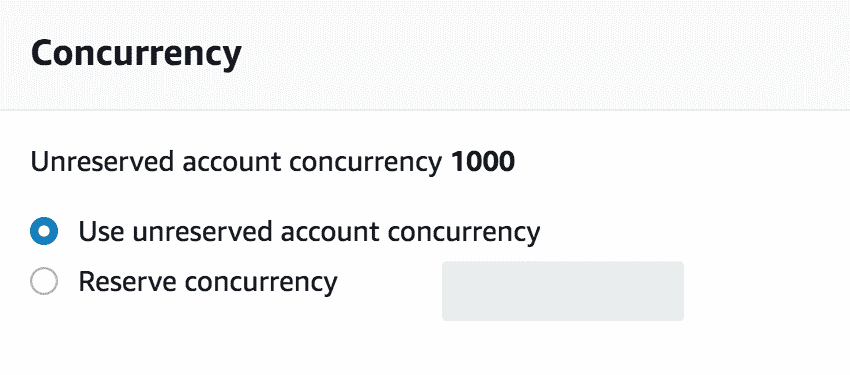

# 八、扩展应用

本章是对前面技术章节的短暂休息，我们将深入讨论以下内容：

*   无服务器自动缩放的工作原理
*   Lambda 如何在没有容量规划或计划扩展的情况下处理高峰服务使用期间的流量需求
*   AWS Lambda 如何使用并发创建与函数代码并行的多个执行
*   它如何影响您的成本和应用性能

# 技术要求

本章是前一章的后续，因为它将使用前一章中构建的无服务器 API；在处理本节之前，建议先阅读上一章。

# 负载测试和缩放

在这一部分中，我们将生成随机工作负载，以查看当传入请求增加时 Lambda 是如何工作的。为了实现这一点，我们将使用负载测试工具，例如**Apache Bench**。在本章中，我将使用`hey`，这是一个基于 Go 的工具，由于 Golang 内置的并发性，它比经典的`HTTP`基准测试工具效率更高、速度更快。您可以从终端安装以下`Go`包下载：

```go
go get -u github.com/rakyll/hey
```

确保`$GOPATH`变量设置为无论当前目录如何都能执行`hey`命令，或者您可以将`$HOME/go/bin`文件夹添加到`$PATH`变量中。

# Lambda 自动标定

现在，我们可以通过执行以下命令来运行第一个线束或负载测试：

```go
hey -n 1000 -c 50 https://51cxzthvma.execute-api.us-east-1.amazonaws.com/staging/movies
```

如果您更喜欢 apache benchmark，可以使用相同的命令，将**嘿**关键字替换为**ab.**

该命令将打开 50 个连接，并针对`FindAllMovies`函数的 API 网关端点 URL 发送 1000 个请求。测试结束时，**嘿**将显示总响应时间信息和每个请求的详细信息，如下所示：


确保将调用 URL 替换为您自己的 URL。另外，请注意，截图的某些部分被裁剪成只关注有用的内容。

除了总响应时间外，**hey**还提供了一个响应时间直方图的输出，该直方图显示了第一个请求需要更多的时间（大约 2 秒）来响应，这可以用**冷启动**来解释，因为 Lambda 必须下载部署包并初始化一个新容器。然而，由于**热启动**和使用以前请求中的现有容器，其余请求都很快（小于 800 毫秒）

从前面的基准来看，我们可以说 Lambda 在流量增加时遵守了自动缩放的承诺；虽然这可能是一件好事，但也有缺点，我们将在下一节中看到。

# 下游资源

在我们的 moviesapi 示例中，使用了 DynamoDB 表来解决无状态问题。此表要求用户提前定义读写吞吐量，以创建必要的底层基础设施来处理定义的流量。在[第 5 章](05.html)中*使用 DynamoDB 管理数据持久性时*创建表时，我们使用了默认吞吐量，即五个读取容量单元和五个写入容量单元。这五个读取容量单元对于不需要大量读取的 API 来说是一种魅力。在前面的负载测试中，我们创建了 50 个并发执行，也就是说，50 个读取与`movies`表并行。因此，该表的读取吞吐量将很高，并且`Scan`操作将变慢，DynamoDB 可能会开始限制请求。

我们可以通过进入 DynamoDB 控制台并点击`movies`表中的**度量**选项卡来验证这一点，如以下屏幕截图所示：


很明显，读取容量图经历了一个高峰，这导致读取请求受到限制，并且该表被所有这些传入请求压垮。

DynamoDB 的节流请求可以通过启用自动缩放机制来增加配置的读写容量以处理突然增加的流量，或者通过重用存储在内存缓存引擎中的查询结果来修复（可以使用带有 Redis 或 Memcached 引擎的 AWS ElastiCache 等解决方案）以避免使表负担过重，并缩短函数的执行时间数毫秒。但是，您不能限制和保护您的数据库资源，以免在响应 Lambda 函数的伸缩事件时过载。

# 私有 Lambda 函数

如果 Lambda 函数在专用 VPC 内运行，则会出现另一个并发问题，因为它需要将**弹性网络接口**（**ENI**）连接到 Lambda 容器，并等待它为自己分配 IP。AWS Lambda 使用 ENI 安全连接到专有网络中的内部资源。

除了性能差（连接 ENI 平均需要 4 秒）外，启用 VPC 的 Lambda 功能还迫使您维护和配置一个 NAT 实例以访问互联网，以及多个可用性区域中的多个 VPC 子网，这些子网能够支持您功能的 ENI 扩展要求，这可能会导致 VPC 的 IP 地址不足。

总之，Lambda 函数的自动缩放是一把双刃剑；它不需要你方的容量规划。然而，这可能会导致糟糕的表现和令人惊讶的每月账单。这就是**并发执行**模型发挥作用的地方。

# 并行执行

AWS Lambda 动态扩展容量以响应不断增加的流量。但是，在任何给定时间执行的函数代码数量有限。这个数字称为并发执行，它是根据 AWS 区域定义的。每个 AWS 区域的默认并发限制为 1000。那么，如果您的函数超过了这个定义的阈值，会发生什么呢？请继续阅读以了解。

# Lambda 节流

如果并发执行计数超过限制，Lambda 将对函数应用节流（速率限制）。因此，其余的传入请求将不会调用该函数。

调用客户端负责根据返回的`HTTP`代码（`429`=请求过多）实施退避策略，重试由于节流而失败的请求。值得一提的是，Lambda 函数可以配置为在一定次数的重试后，将未处理的事件存储到名为**死信队列**的队列中。

节流在某些情况下可能很有用，因为并发执行能力在所有函数之间共享（在我们的示例中，`find`、`update`、`insert`和`delete`函数）。您可能希望确保一个函数不会消耗所有的容量，并避免剩余的 Lambda 函数被耗尽。如果其中一个函数的使用次数超过其他函数，则这种情况可能会频繁发生。例如，考虑 Type T4^函数。假设现在是假日季节，许多客户会使用您的应用查看可供出租的电影列表，这可能会导致调用`FindAllMovies`Lambda 函数的多个实例

幸运的是，AWS 添加了一个新功能，允许您提前为每个 Lambda 函数保留和定义一个并发执行值。此属性允许您为函数指定多个保留并发，以便确保函数始终具有足够的容量来处理即将发生的事件或请求。例如，您可以按如下方式设置函数的速率限制：

*   `FindAllMovies`功能：500
*   `InsertMovie`功能：100
*   `UpdateMovie`功能：50
*   其余的将在其他人之间共享

在下一节中，我们将看到如何为`FindAllMovies`定义保留并发性，以及它如何影响 API 的性能。

您可以使用以下公式估算并发执行计数：`events/requests per second * function duration`。

# 并发保留

导航至 AWS Lambda 控制台（[https://console.aws.amazon.com/lambda/home](https://console.aws.amazon.com/lambda/home) ）并点击 FindAllMovies 功能。在并发部分，我们可以看到我们的功能只受账户中可用并发总量的限制，即**1000**、**，如下图所示：**

 **

我们将通过在保留帐户的并发字段中定义 10 来改变这一点。这样可以确保在任何给定时间内只并行执行 10 次函数。此值将从无保留帐户的并发池中扣除，如下所示：


您可以设置的最大保留并发度为 900，因为 AWS Lambda 为其他函数保留 100，以便它们仍然可以处理请求和事件。

或者，AWS CLI 可与`put-function-concurrency`命令一起使用，以设置并发限制：

```go
aws lambda put-function-concurrency --function FindAllMovies --reserved-concurrent-executions 10
```

再次使用前面给出的相同命令生成一些工作负载：

```go
hey -n 1000 -c 50 https://51cxzthvma.execute-api.us-east-1.amazonaws.com/staging/movies
```

这一次，结果将不同，因为 1000 个请求中有 171 个请求失败，出现 502 代码错误，如下所示：


在 10 次并发执行之后，将应用限制，并使用 502 响应代码拒绝部分请求

我们可以通过返回功能控制台来确认这一点；我们将看到一条类似于以下屏幕截图所示的警告消息：


如果您打开与`movies`表相关的度量并跳转到读取容量图表，您可以看到我们的读取容量仍处于控制之下，并且低于定义的 5 个读取单元容量：


如果您计划对 Lambda 函数进行维护，并且希望临时停止其调用，则可以使用节流，这可以通过将函数并发性设置为 0 来实现。

Throttle 按预期工作，您现在可以保护下游资源不受 Lambda 函数的过多负载的影响。

# 总结

在本章中，我们了解到，由于每个 AWS 区域设置的执行限制，Lambda 无法无限扩展。可以通过联系 AWS 支持团队来提高该限制。我们还介绍了功能级别的并发保留如何帮助您保护下游资源、匹配子网大小（如果您使用的是启用 VPC 的 Lambda 功能），以及在功能开发和测试期间控制成本

在下一章中，我们将在无服务器 API 的基础上构建一个用户友好的 UI，该 API 具有 S3 静态托管网站功能。**