# 九、使用 S3 构建前端

在本章中，我们将学习以下内容：

*   如何使用 AWS 简单存储服务构建使用 API 网关响应的静态网站
*   如何使用 CloudFront 发行版优化对网站资产（如 JavaScript、CSS、图像）的访问
*   如何为无服务器应用设置自定义域名
*   如何创建 SSL 证书以使用 HTTPS 显示您的内容
*   使用 CI/CD 管道自动化 web 应用的部署过程。

# 技术要求

在继续本章之前，您应该对 web 开发有一个基本的了解，并了解 DNS 是如何工作的。本章的代码包托管在 GitHub 上的[https://github.com/PacktPublishing/Hands-On-Serverless-Applications-with-Go](https://github.com/PacktPublishing/Hands-On-Serverless-Applications-with-Go) 。

# 单页应用

在本节中，我们将学习如何构建一个 web 应用，该应用将调用我们在前几章中构建的 API 网关调用 URL，并列出电影，如下所示：

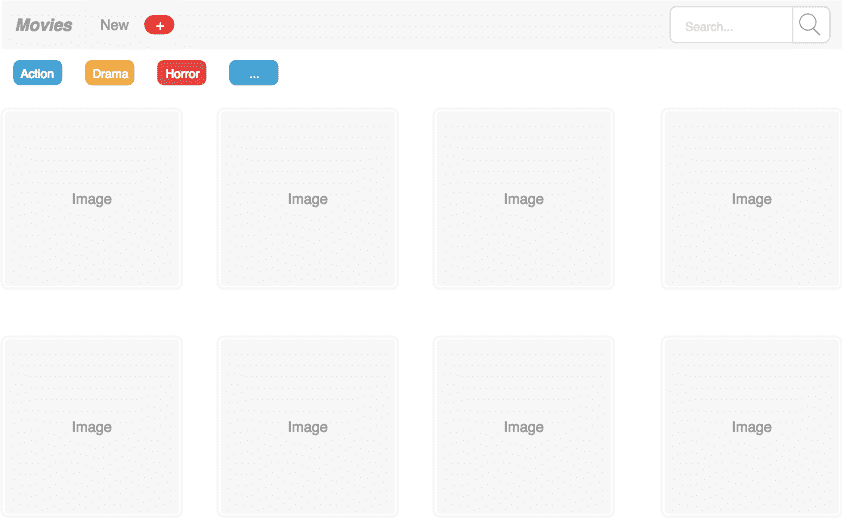

对于每部电影，我们将显示其封面图像和标题。此外，用户可以通过单击“恐怖”右侧的按钮，按电影类别筛选电影。最后，要向数据库添加新电影，如果用户单击导航栏上的“新建”按钮，将弹出一个模式。模态将要求用户填写以下字段：


现在已经定义了应用模型，我们将使用 JavaScript 框架快速构建 web 应用。例如，我将使用**Angular 5**，这是 Angular 的最新稳定版本。

# 使用 Angular 开发 web 应用

Angular 是 Google 开发的一个完全集成的框架。它允许您构建动态 web 应用，而无需考虑选择哪些库以及如何处理日常问题。请记住，我们的目标是接触大量的受众，之所以选择 Angular 是因为它是最常用的框架之一。但是，您可以选择自己熟悉的框架，如 React、Vue 或 Ember。

除了内置的即用模块外，Angular 还利用了**单页应用****（SPA）**架构的强大功能。此体系结构允许您在页面之间导航，而无需刷新浏览器，因此在应用更流畅、响应更快时，可以获得更好的用户体验，包括更好的性能（您可以预加载和缓存额外页面）。

Angular 有自己的 CLI。您可以通过[进行安装 https://cli.angular.io](https://cli.angular.io) 用于逐步指导。这本书是献给拉姆达的。因此，在接下来的章节中只介绍角度的基本概念，以便于非 web 开发人员理解本章。

安装**Angular CLI**后，我们需要使用以下命令创建一个新的 Angular 应用：

```go
ng new frontend
```

CLI 将生成基本模板文件，并安装运行 Angular 5 应用所需的所有**npm**依赖项。文件结构如下所示：

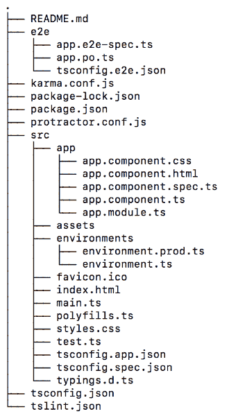

接下来，在`frontend`目录下，使用以下命令启动本地 web 服务器：

```go
ng serve
```

该命令将编译所有的`TypeScripts`文件，构建项目，并在端口`4200`上启动 web 服务器：


打开浏览器并导航至[http://localhost:4200](http://localhost:4200) 。这是您应该在浏览器中看到的内容：


既然我们的示例应用已经构建并运行，那么让我们创建我们的 web 应用。角度结构基于组件和服务体系结构（类似于模型视图控制器）。

# 生成第一个角度分量

对于那些对 Angular 没有太多经验的人来说，组件基本上是 UI 的乐高积木。您的 web 应用可以分为多个组件。每个组件都有以下文件：

*   **组件\u NAME.COMPONENT.ts**：用 TypeScript 编写的组件逻辑定义
*   **组件\ u NAME.COMPONENT.html**：组件的 html 代码
*   **组件\ u NAME.COMPONENT.css**：组件的 css 结构
*   **组件\u NAME.COMPONENT.spec.ts**：组件类的单元测试

在我们的示例中，我们至少需要三个组件：

*   导航栏组件
*   电影列表组件
*   电影成分

在我们创建第一个组件之前，让我们先安装**引导程序**，这是 Twitter 开发的前端 web 框架，用于构建有吸引力的用户界面。它附带了一组用于表单、按钮、导航和其他界面组件的基于 CSS 的设计模板，以及可选的 JavaScript 扩展。

继续从终端安装引导程序 4：

```go
npm install bootstrap@4.0.0-alpha.6
```

接下来，导入`.angular-cli.json`文件中的引导 CSS 类，以使 CSS 指令在应用的所有组件中可用：

```go
"styles": [
   "styles.css",
   "../node_modules/bootstrap/dist/css/bootstrap.min.css"
]
```

现在，我们可以通过发出以下命令来创建导航栏组件：

```go
ng generate component components/navbar
```

覆盖`navbar.component.html`中默认生成的 HTML 代码，使用引导框架提供的导航栏：

```go
<nav class="navbar navbar-toggleable-md navbar-light bg-faded">
  <button class="navbar-toggler navbar-toggler-right" type="button" data-toggle="collapse" data-target="#navbarSupportedContent" aria-controls="navbarSupportedContent" aria-expanded="false" aria-label="Toggle navigation">
    <span class="navbar-toggler-icon"></span>
  </button>
  <a class="navbar-brand" href="#">Movies</a>

  <div class="collapse navbar-collapse" id="navbarSupportedContent">
    <ul class="navbar-nav mr-auto">
      <li class="nav-item active">
        <a class="nav-link" href="#">New <span class="sr-only">(current)</span></a>
      </li>
    </ul>
    <form class="form-inline my-2 my-lg-0">
      <input class="form-control mr-sm-2" type="text" placeholder="Search ...">
      <button class="btn btn-outline-success my-2 my-sm-0" type="submit">GO !</button>
    </form>
  </div>
</nav>
```

打开`navbar.component.ts`并将选择器属性更新为`movies-navbar`。这里的选择器只是一个标记，可用于引用其他组件上的组件：

```go
@Component({
  selector: 'movies-navbar',
  templateUrl: './navbar.component.html',
  styleUrls: ['./navbar.component.css']
})
export class NavbarComponent implements OnInit {
   ...
}
```

需要在`app.component.html`文件中添加`movies-navbar`选择器，如下所示：

```go
<movies-navbar></movies-navbar> 
```

Angular CLI 使用实时重新加载。因此，每次更改代码时，CLI 都会重新编译、重新注入（如果需要），并要求浏览器刷新页面：

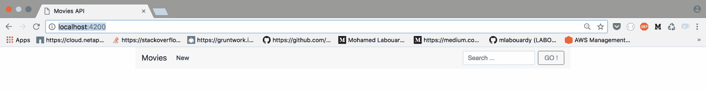

添加`movies-navbar`标记后，新组件的`navbar.component.html`文件中的所有内容都将显示在浏览器中。

同样，我们将为电影项目创建一个新组件：

```go
ng generate component components/movie-item
```

我们将在界面中将电影显示为卡片；将`movie-item.component.html`代码替换为以下代码：

```go
<div class="card" style="width: 20rem;">
  
  <div class="card-block">
    <h4 class="card-title">Movie</h4>
    <p class="card-text">Some quick description</p>
    <a href="#" class="btn btn-primary">Rent</a>
  </div>
</div>
```

在浏览器中，您应该会看到类似的内容：


创建另一个组件以显示电影列表：

```go
ng generate component components/list-movies
```

此组件将使用 Angular`ngFor`指令在`movies`数组中的`movie`上迭代，并通过调用`movie-item`组件（这称为合成）打印出电影：

```go
<div class="row">
  <div class="col-sm-3" *ngFor="let movie of movies">
    <movie-item></movie-item>
  </div>
</div>
```

`movies`数组在`list-movies.component.ts`中声明，并在类构造函数中初始化：

```go
import { Component, OnInit } from '@angular/core';
import { Movie } from '../../models/movie';

@Component({
  selector: 'list-movies',
  templateUrl: './list-movies.component.html',
  styleUrls: ['./list-movies.component.css']
})
export class ListMoviesComponent implements OnInit {

  public movies: Movie[];

  constructor() {
    this.movies = [
      new Movie("Avengers", "Some description", "https://image.tmdb.org/t/p/w370_and_h556_bestv2/cezWGskPY5x7GaglTTRN4Fugfb8.jpg"),
      new Movie("Thor", "Some description", "https://image.tmdb.org/t/p/w370_and_h556_bestv2/bIuOWTtyFPjsFDevqvF3QrD1aun.jpg"),
      new Movie("Spiderman", "Some description"),
    ]
  }

  ...

}
```

`Movie`类是一个简单的实体，有`name`、`cover`、`description`三个字段，以及访问和修改类属性的 getter 和 setter：

```go
export class Movie {
  private name: string;
  private cover: string;
  private description: string;

  constructor(name: string, description: string, cover?: string){
    this.name = name;
    this.description = description;
    this.cover = cover ? cover : "http://via.placeholder.com/185x287";
  }

  public getName(){
    return this.name;
  }

  public getCover(){
    return this.cover;
  }

  public getDescription(){
    return this.description;
  }

  public setName(name: string){
    this.name = name;
  }

  public setCover(cover: string){
    this.cover = cover;
  }

  public setDescription(description: string){
    this.description = description;
  }
}
```

如果运行上述代码，我们将在浏览器中看到三部电影：

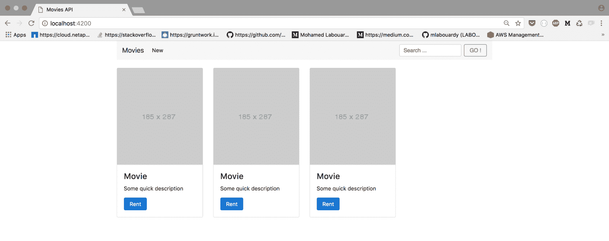

现在，电影属性在 HTML 页面中是硬编码的，为了改变这一点，我们需要将电影项传递给`movie-item`元素。更新`movie-item.component.ts`以添加新的电影字段，并使用`Input`注释使用角度输入绑定：

```go
export class MovieItemComponent implements OnInit {
  @Input()
  public movie: Movie;

  ...
}
```

在前面组件的 HTML 模板中，使用`Movie`类的 getter 获取属性值：

```go
<div class="card">
    
    <div class="card-block">
      <h4 class="card-title">{{movie.getName()}}</h4>
      <p class="card-text">{{movie.getDescription()}}</p>
      <a href="#" class="btn btn-primary">Rent</a>
    </div>
</div>
```

最后，让`ListMoviesComponent`将`MovieItemComponent`子对象嵌套在`*ngFor`中继器中，并在每次迭代中将`movie`实例绑定到子对象的`movie`属性：

```go
<div class="row">
  <div class="col-sm-3" *ngFor="let movie of movies">
    <movie-item [movie]="movie"></movie-item>
  </div>
</div>
```

在浏览器中，应确保电影的属性已正确定义：

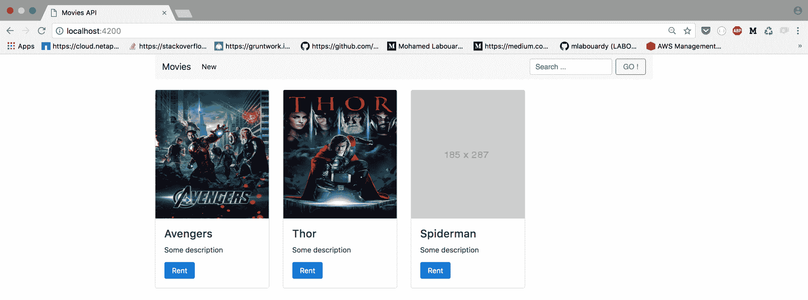

到目前为止一切进展顺利。然而，电影列表仍然是静态的和硬编码的。我们将通过调用无服务器 API 从数据库中动态检索电影列表来解决这个问题。

# 使用 Angular 访问 Rest web 服务

在前面的章节中，我们创建了两个阶段，`staging`和`production`环境。因此，我们应该创建两个环境文件来指向正确的 API 网关部署阶段：

*   `environment.ts`：包含开发 HTTP URL：

```go
export const environment = {
  api: 'https://51cxzthvma.execute-api.us-east-1.amazonaws.com/staging/movies'
};
```

*   `environment.prod.ts`：包含生产 HTTP URL：

```go
export const environment = {
  api: 'https://51cxzthvma.execute-api.us-east-1.amazonaws.com/production/movies'
};
```

如果执行了`ng build`或`ng serve`，则`environment`对象将读取`environment.ts`中的值；如果您使用`ng build --prod`命令为生产模式构建应用，则`environment`对象将读取`environment.prod.ts`中的值。

要创建服务，我们需要使用命令行。命令如下：

```go
ng generate service services/moviesApi
```

`movies-api.service.ts`将实现`findAll`功能，使用`Http`服务调用 API 网关`findAll`端点。`map`方法将帮助将响应转换为 JSON 格式：

```go
import { Injectable } from '@angular/core';
import { Http } from '@angular/http';
import 'rxjs/add/operator/map';
import { environment } from '../../environments/environment';

@Injectable()
  export class MoviesApiService {

    constructor(private http:Http) { }

    findAll(){
      return this.http
      .get(environment.api)
      .map(res => {
        return res.json()
      })
    }

}
```

在调用`MoviesApiService`之前，需要在提供者部分的`app.module.ts`主模块中导入。

更新`MoviesListComponent`调用新服务。在浏览器控制台上，您应该会收到一条错误消息，说明 API 网关返回的响应中不存在 Access Control Allow Origin 标头。这将是下一节的主题：


# 跨来源资源共享

出于安全目的，如果外部请求与网站的确切主机、协议和端口不匹配，浏览器将阻止流。在我们的示例中，我们有不同的域名（localhost 和 API 网关 URL）。

这种机制称为**同源策略**。要解决这个问题，您可以使用 CORS 头、代理服务器或 JSON 解决方案。在本节中，我将演示如何在 Lambda 函数返回的响应中使用 CORS 头来解决此问题：

1.  修改`findAllMovie`函数代码，添加`Access-Control-Allow-Origin:*`以启用来自任何地方的跨源请求（或指定域而不是*）：

    ```go
    return events.APIGatewayProxyResponse{
        StatusCode: 200,
        Headers: map[string]string{
          "Content-Type": "application/json",
          "Access-Control-Allow-Origin": "*",
        },
        Body: string(response),
      }, nil
    ```

2.  提交您的更改；应该触发一个新的构建。在 CI/CD 管道的末尾，`FindAllMovies`Lambda 函数的代码将被更新。测试它；您应该将新密钥作为`headers`属性的一部分：

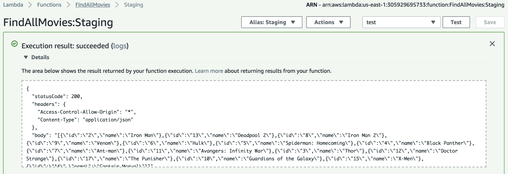

1.  如果刷新 web 应用页面，JSON 对象也将显示在控制台中：

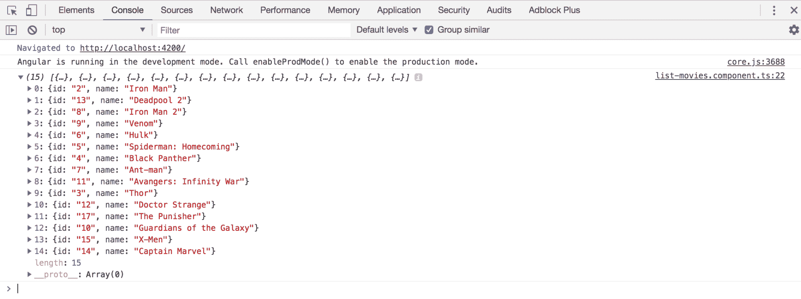

4.  更新`list-movies.component.ts`从`MoviesApiService`调用`findAll`函数。返回的数据将存储在`movies`变量中：

```go
constructor(private moviesApiService: MoviesApiService) {
  this.movies = []

  this.moviesApiService.findAll().subscribe(res => {
    res.forEach(movie => {
    this.movies.push(new Movie(movie.name, "Some description"))
    })
  })
}
```

5.  因此，将检索并显示电影列表：


6.  我们没有封面图片；您可以更新 DynamoDB`movies`表以添加图像和描述属性：

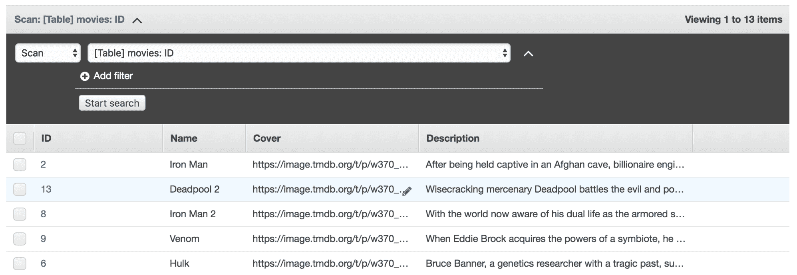

NoSQL 数据库允许您随时更改表模式，而无需首先定义结构，而关系数据库要求您在使用数据之前使用预定义的模式来确定数据的结构。

7.  如果您刷新 web 应用页面，您应该拥有电影及其相应的描述和海报封面：


8.  让我们通过实现一个新的电影功能来改进这个 web 应用。由于用户需要填写电影的图像封面和描述，我们需要更新`insert`Lambda 函数，除了在后端生成的随机唯一 ID 之外，还需要添加封面和描述字段：

```go
svc := dynamodb.New(cfg)
req := svc.PutItemRequest(&dynamodb.PutItemInput{
  TableName: aws.String(os.Getenv("TABLE_NAME")),
  Item: map[string]dynamodb.AttributeValue{
    "ID": dynamodb.AttributeValue{
      S: aws.String(uuid.Must(uuid.NewV4()).String()),
    },
    "Name": dynamodb.AttributeValue{
      S: aws.String(movie.Name),
    },
    "Cover": dynamodb.AttributeValue{
      S: aws.String(movie.Cover),
    },
    "Description": dynamodb.AttributeValue{
      S: aws.String(movie.Description),
    },
  },
})
```

9.  将新更改推送到代码存储库并部署后，打开 REST 客户端并发出 POST 请求，以使用以下 JSON 方案添加新电影：

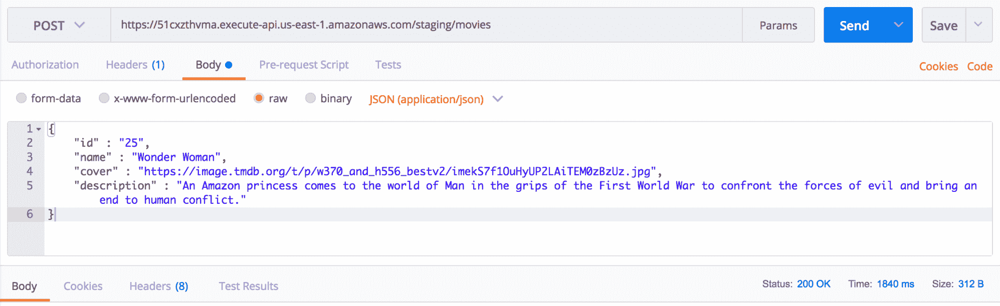

10.  返回一个`200`成功代码，在 web 应用中，新电影应列出：

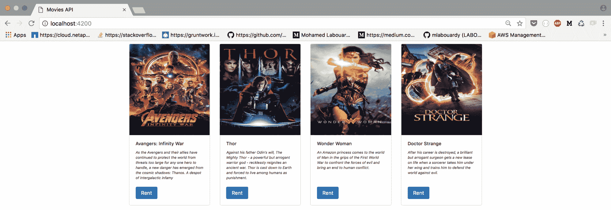

如*单页应用*部分所示，当用户点击新建按钮时，会弹出一个模式，并显示一个创建表单。为了构建此模式并避免使用 jQuery，我们将使用另一个库，该库基于引导标记和 CSS 提供一组本机角度指令：

*   使用以下命令安装此库：

```go
npm install --save @ng-bootstrap/ng-bootstrap@2.0.0
```

*   一旦安装完毕，您需要将其导入`app.module.ts`主模块，如下所示：

```go
import {NgbModule} from '@ng-bootstrap/ng-bootstrap';

@NgModule({
  declarations: [AppComponent, ...],
  imports: [NgbModule.forRoot(), ...],
  bootstrap: [AppComponent]
})
export class AppModule {
}
```

*   要保存创建表单，我们需要创建一个新组件：

```go
ng generate component components/new-movie
```

*   该组件将有两个`input`字段用于电影的标题和封面链接。另外，电影描述中的`textarea`元素：

```go
<div class="modal-header">
 <h4 class="modal-title">New Movie</h4>
 <button type="button" class="close" aria-label="Close" (click)="d('Cross click')">
 <span aria-hidden="true">&times;</span>
 </button>
</div>
<div class="modal-body">
 <div *ngIf="showMsg" class="alert alert-success" role="alert">
 <b>Well done !</b> You successfully added a new movie.
 </div>
 <div class="form-group">
 <label for="title">Title</label>
 <input type="text" class="form-control" #title>
 </div>
 <div class="form-group">
 <label for="description">Description</label>
 <textarea class="form-control" #description></textarea>
 </div>
 <div class="form-group">
 <label for="cover">Cover</label>
 <input type="text" class="form-control" #cover>
 </div>
</div>
<div class="modal-footer">
   <button type="button" class="btn btn-success" (click)="save(title.value, description.value, cover.value)">Save</button>
</div>
```

*   每次用户单击保存按钮时，将调用一个`save`函数来响应单击事件。`MoviesApiService`服务中定义的`insert`函数调用 API 网关`insert`端点上的`POST`方法：

```go
insert(movie: Movie){
  return this.http
    .post(environment.api, JSON.stringify(movie))
    .map(res => {
    return res
  })
}
```

*   在导航栏的新元素上添加单击事件：

```go
<a class="nav-link" href="#" (click)="newMovie(content)">New <span class="badge badge-danger">+</span></a>
```

*   点击事件将调用`newMovie`并通过调用`ng-bootstrap`库的`ModalService`模块打开模态：

```go
import { Component, OnInit, Input } from '@angular/core';
import { NgbModal } from '@ng-bootstrap/ng-bootstrap';

@Component({
 selector: 'movies-navbar',
 templateUrl: './navbar.component.html',
 styleUrls: ['./navbar.component.css']
})
export class NavbarComponent implements OnInit {

 constructor(private modalService: NgbModal) {}

 ngOnInit() {}

 newMovie(content){
 this.modalService.open(content);
 }

}
```

*   编译这些更改后，单击导航栏中的新项，将弹出模式。填写必填字段并单击保存按钮：

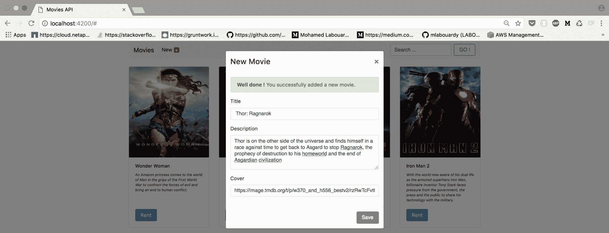

*   电影将保存在数据库表中。如果刷新页面，电影将显示在电影列表中：

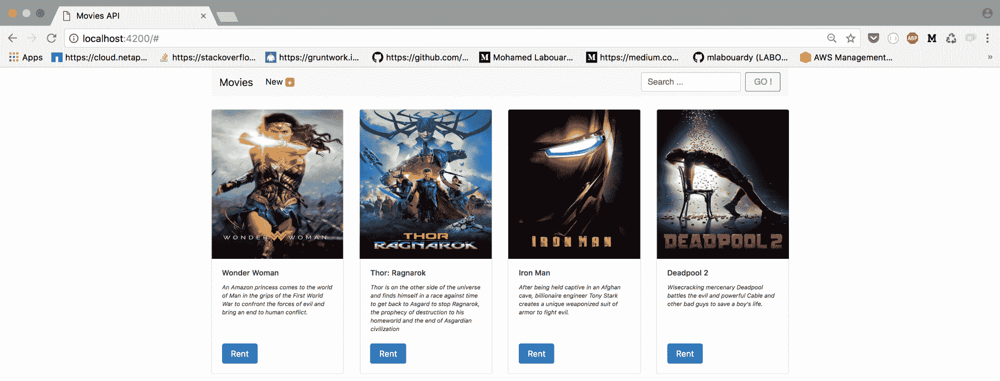

# S3 静态网站托管

现在我们的应用已经创建，让我们将其部署到远程服务器。与其在 EC2 实例中维护 web 服务器（如 Apache 或 Nginx），不如让它保持无服务器状态，并使用启用了 S3 网站托管功能的 S3 存储桶。

# 设置 S3 存储桶

要开始，请从 AWS 控制台或使用以下 AWS CLI 命令创建 S3 存储桶：

```go
aws s3 mb s3://serverlessmovies.com
```

接下来，为生产模式构建 web 应用：

```go
ng build --prod
```

`--prod`标志将生成代码的优化版本，并执行其他构建步骤，如 JavaScript 和 CSS 缩小、死代码消除和绑定：

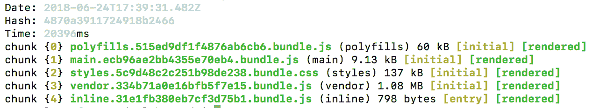

这将为您提供带有`index.html`的`dist/`目录以及所有准备好生产的捆绑`js`文件。将 bucket 配置为承载网站：

```go
aws s3 website s3://serverlessmovies.com  -- index-document index.html
```

将*dist/*文件夹中的所有内容复制到我们之前创建的 S3 bucket 中：

```go
aws s3 cp --recursive dist/ s3://serverlessmovies.com/
```

您可以通过 S3 铲斗仪表板或使用`aws s3 ls`命令验证文件是否已成功存储：

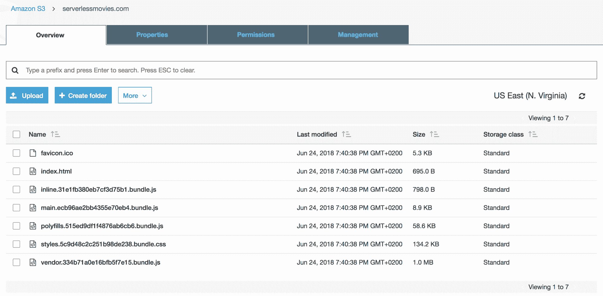

默认情况下，当您创建 S3 bucket 时，它是私有的。因此，应使用以下 bucket 策略使其可公开访问：

```go
{
  "Id": "Policy1529862214606",
  "Version": "2012-10-17",
  "Statement": [
    {
      "Sid": "Stmt1529862213126",
      "Action": [
        "s3:GetObject"
      ],
      "Effect": "Allow",
      "Resource": "arn:aws:s3:::serverlessmovies.com/*",
      "Principal": "*"
    }
  ]
}
```

在 bucket 配置页面上，单击权限选项卡，然后单击 bucket 策略，将策略内容粘贴到编辑器中，然后保存它。将弹出一条警告消息，指示存储桶已公开：

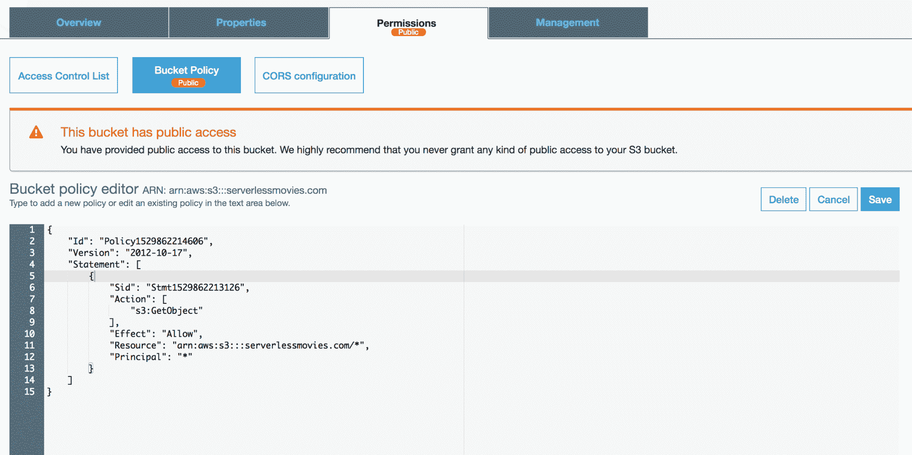

要访问 web 应用，请将浏览器指向[http://serverlessmovies.s3-website-us-east-1.amazonaws.com](http://serverlessmovies.s3-website-us-east-1.amazonaws.com) （将其替换为您自己的 bucket 名称）：


现在，我们的应用已部署到生产环境中，让我们创建一个自定义域名，以便有一个用户友好的链接来访问网站。为了将域流量路由到 S3 存储桶，我们将使用**Amazon route 53**创建指向存储桶的别名记录。

# 设置 53 号干线

如果您是 Route 53 的新手，请使用您拥有的域名创建一个新的托管区域，如下图所示。您可以使用现有域名，也可以从 Amazon 注册商或外部 DNS 注册商（如 GoDaddy）处购买。请确保选择公共托管区域：


一旦创建，`NS`和`SOA`记录将自动为您创建。如果您从 AWS 购买了域名，您可以跳过此部分。如果没有，您必须更改您购买域名的注册器上的名称服务器记录。在这个例子中，我买了[http://serverlessmovies.com/ 来自 GoDaddy 的](http://serverlessmovies.com/)[域名，所以在域名设置页面，我将域名服务器更改为指向 AWS 提供的`NS`记录值，如下所示：](http://serverlessmovies.com/)

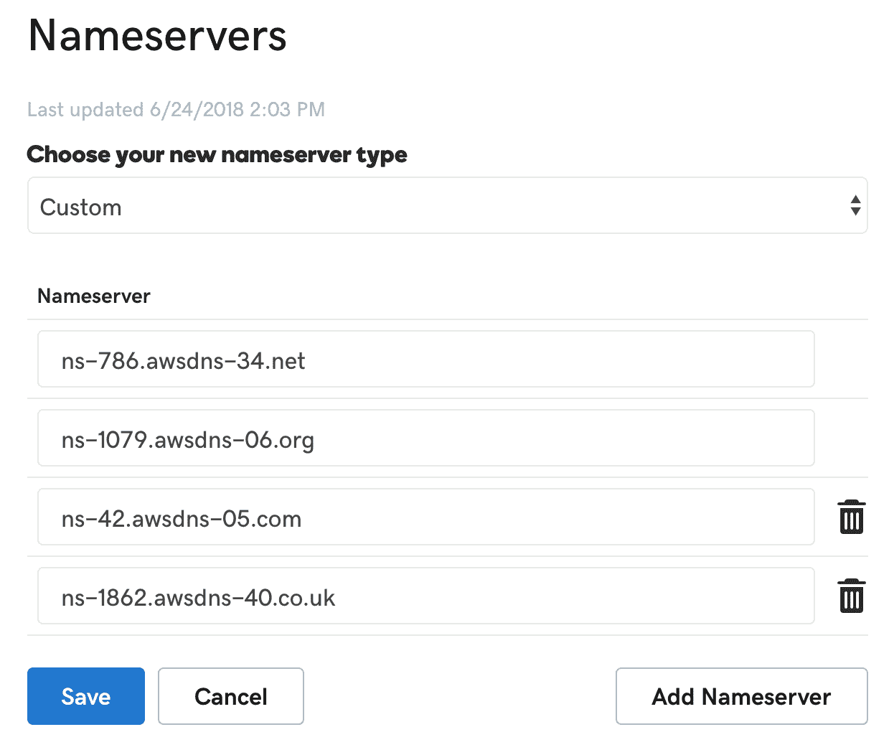

传播更改可能需要几分钟的时间。一旦注册官验证了，跳到`Route 53`并创建一个新的`A`别名记录，该记录指向我们之前创建的 S3 网站，方法是从下拉列表中选择目标 S3 bucket：

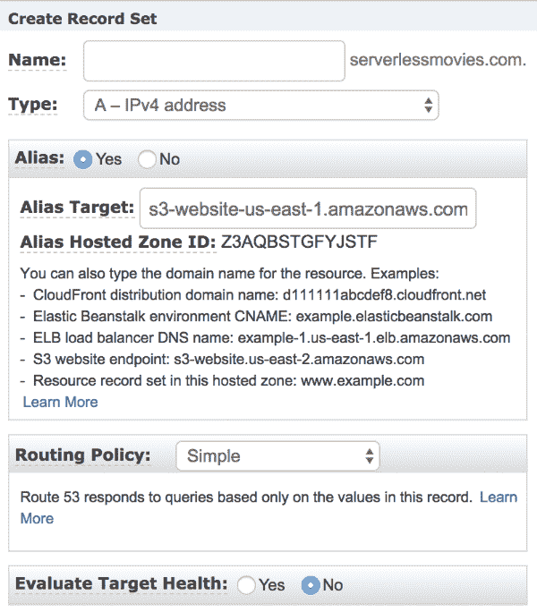

完成后，您将能够打开浏览器，输入域名，并查看 web 应用：

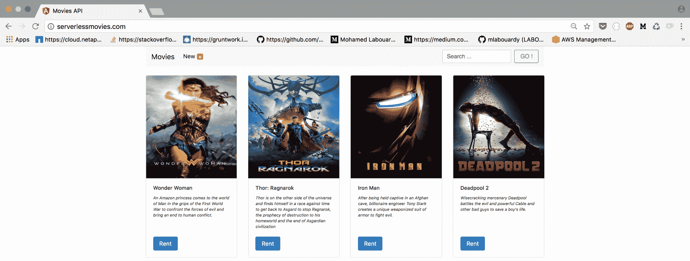

拥有一个安全的网站可以带来不同，让用户更加信任您的 web 应用，这就是为什么在下一节中，我们将使用 AWS 提供的免费 SSL 在您的自定义域名上显示带有`HTTPS`的内容。

# 证书管理器

您可以通过**AWS 证书管理器****（ACM】**轻松获取 SSL 证书。单击请求证书按钮创建新的 SSL 证书：

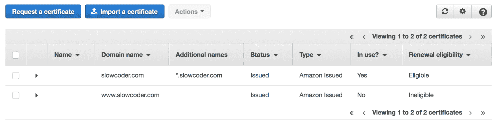

选择请求公共证书并添加您的域名。您可能还希望通过添加星号来保护子域：

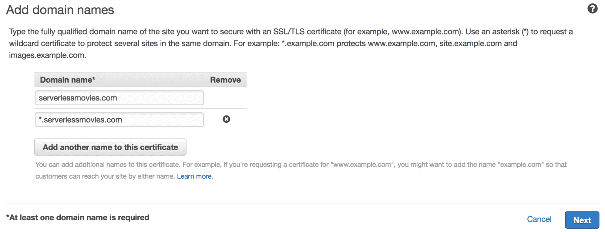

在这两个域名下，单击在路由 53 中创建记录按钮。这将自动在路由 53 中创建一个具有给定值的`CNAME`记录集，然后 ACM 将检查该记录集，以验证您是否拥有这些域：

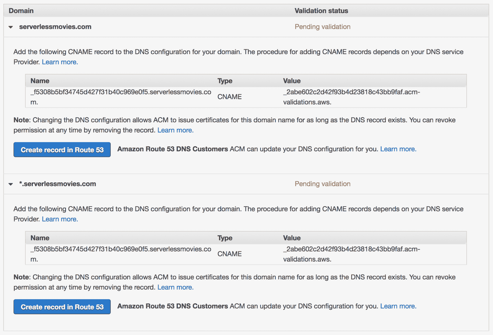

一旦 Amazon 验证域名是您的，证书状态将从待定验证更改为已颁发：

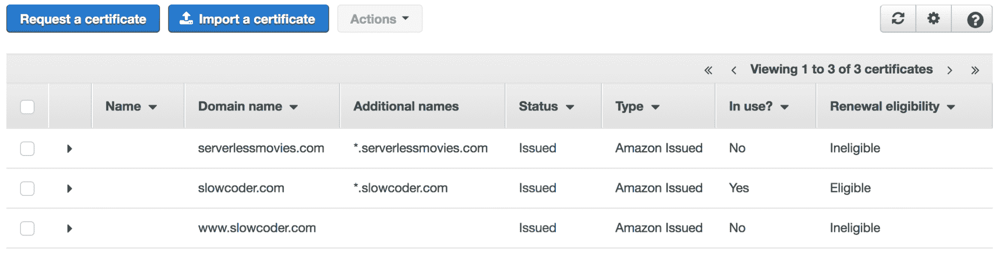

但是，我们无法将 S3 bucket 配置为使用 SSL 加密流量。这就是为什么我们将在 S3 存储桶前面使用**CloudFront**分发，也称为 CDN。

# 云锋分布

除了使用 CloudFront 在网站上添加 SSL 终端外，CloudFront 主要用作**内容交付网络****【CDN】**在全球多个边缘位置存储静态资产（如 HTML 页面、图像、字体、CSS 和 JavaScript），这使得下载速度更快，响应时间更短。

也就是说，导航到 CloudFront，然后创建一个新的 web 发行版。在“源域名”字段中设置 S3 网站 URL，并将其他字段保留为默认字段。您可能需要将`HTTP`流量重定向到`HTTPS`：

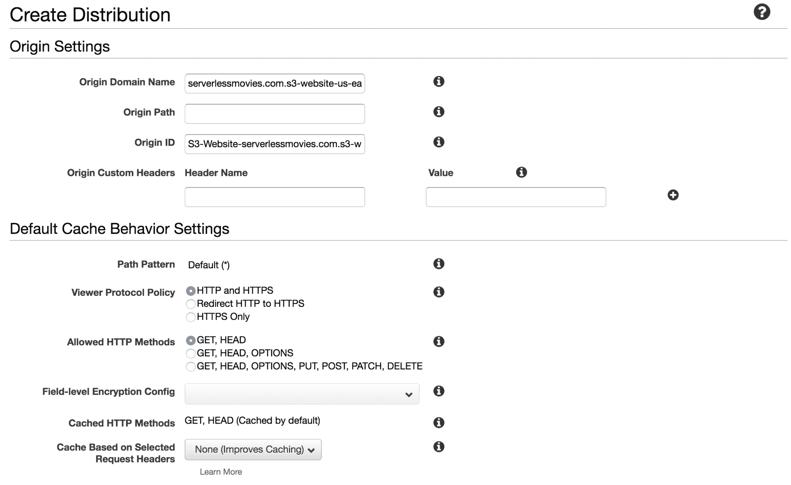

接下来，选择我们在*证书管理器*部分创建的 SSL 证书，并将您的域名添加到备用域名（CNAMEs）区域：

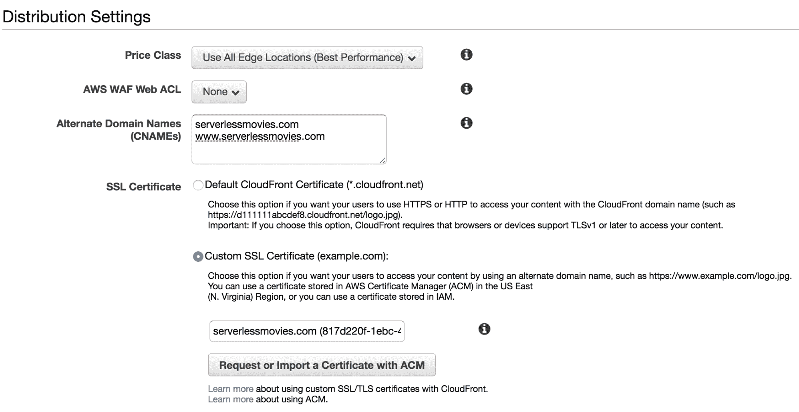

单击 Save 并等待几分钟，同时 CloudFront 将所有文件复制到 AWS 边缘位置：

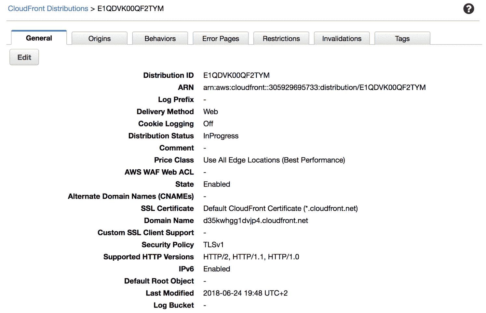

CDN 完全部署后，跳转到域名托管区域页面并更新网站记录以指向 CloudFront 分发域：

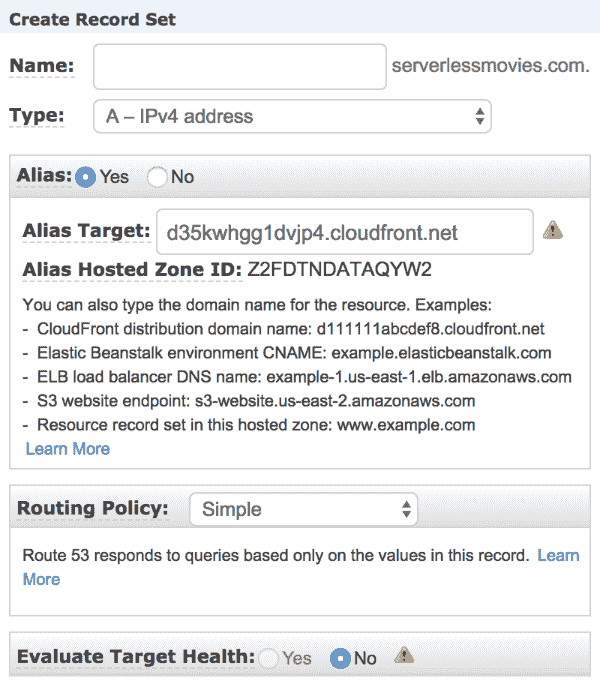

如果再次转到 URL，则应重定向至`HTTPS`：


请随意为 API 网关 URL 创建新的`CNAME`记录。记录可能是[https://api.serverlessmovies.com](https://api.serverlessmovies.com) ，指向[https://51cxzthvma.execute-api.us-east-1.amazonaws.com/production/movies](http://51cxzthvma.execute-api.us-east-1.amazonaws.com/production/movies) 。

# CI/CD 工作流

我们的无服务器应用已部署到生产环境中。但是，为了避免在每次实现新功能时重复执行相同的步骤，我们可以创建一个 CI/CD 管道来自动化上一节中描述的工作流。我选择 CircleCI 作为 CI 服务器。但是，您可以使用 Jenkins 或 CodePipeline，请务必阅读前面的章节以了解更多详细信息。

如前几章所示，应该在模板文件中定义管道。以下是用于自动化 web 应用部署过程的管道示例：

```go
version: 2
jobs:
  build:
    docker:
      - image: node:10.5.0

    working_directory: ~/serverless-movies

    steps:
      - checkout

      - restore_cache:
          key: node-modules-{{checksum "package.json"}}

      - run:
          name: Install dependencies
          command: npm install && npm install -g @angular/cli

      - save_cache:
          key: node-modules-{{checksum "package.json"}}
          paths:
            - node_modules

      - run:
          name: Build assets
          command: ng build --prod --aot false

      - run:
          name: Install AWS CLI
          command: |
            apt-get update
            apt-get install -y awscli

      - run:
          name: Push static files
          command: aws s3 cp --recursive dist/ s3://serverlessmovies.com/
```

将按顺序执行以下步骤：

*   从代码存储库中签出更改
*   安装 AWS CLI、应用 npm 依赖项和 Angular CLI
*   使用`ng build`命令构建工件
*   将人工制品复制到 S3 存储桶

现在，对 web 应用代码的所有更改都将通过管道进行，并将自动部署到生产环境中：


# API 文档

在完成本章之前，我们将介绍如何为迄今为止构建的无服务器 API 创建文档。

在 API 网关控制台上，选择要为其生成文档的部署阶段。在下面的示例中，我选择了`production`环境。然后，单击“导出”选项卡并单击“导出为招摇”部分：


Swagger 是 OpenTAPI AuthT1 的一个实现，它是 Linux 基金会定义的如何描述和定义 API 的标准。此定义称为**OpenAPI 规范文档**。

您可以将文档保存在 JSON 或 YAML 文件中。然后，导航到[https://editor.swagger.io/](https://editor.swagger.io/) 并将内容粘贴到网站编辑器上，进行编译，生成如下 HTML 页面：


AWS CLI 还可用于使用`aws apigateway get-export --rest-api-id API_ID --stage-name STAGE_NAME --export-type swagger swagger.json`命令导出 API 网关文档。

API 网关和 Lambda 函数类似于无服务器应用。可以编写 CI/CD，以便在每次 API 网关上实现新端点或资源时自动生成文档。管道必须执行以下步骤：

*   创建一个 S3 存储桶
*   在 bucket 上启用静态网站功能
*   从[下载大摇大摆的用户界面 https://github.com/swagger-api/swagger-ui](https://github.com/swagger-api/swagger-ui) 并将源代码复制到 S3
*   创建 DNS 记录（[docs.serverlessmovies.com](http://docs.serverlessmovies.com)）
*   运行`aws apigateway export`命令生成招摇定义文件
*   使用`aws s3 cp`命令将`spec`文件复制到 S3

# 总结

总之，我们已经了解了如何使用多个 Lambda 函数从头开始构建无服务器 API，以及如何使用 API 网关创建统一的 API 并将传入请求分派到正确的 Lambda 函数。我们使用 DynamoDB 数据存储解决了 Lambda 的无状态问题，并研究了使用保留并发如何帮助保护下游资源。然后，我们在 S3 存储桶中托管了一个无服务器 web 应用，前面有 CloudFront，以优化 web 资产的交付。最后，我们学习了如何使用 route 53 将域流量路由到 web 应用，以及如何使用 SSL 终端保护它。

下图说明了我们迄今为止实施的体系结构：

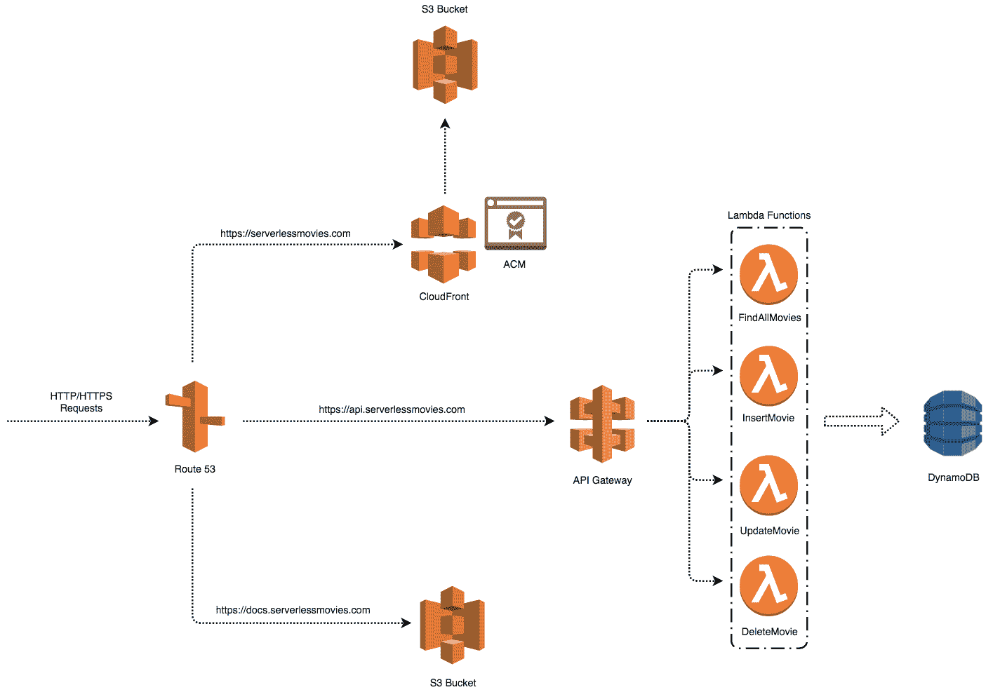

在下一章中，我们将改进 CI/CD 工作流，添加单元和集成测试，以便在将 Lambda 功能部署到生产环境之前捕获 bug 和问题。

# 问题

1.  实现一个 Lambda 函数，该函数将电影类别作为输入，并返回与该类别对应的电影列表。
2.  实现一个 Lambda 函数，该函数将电影的标题作为输入，并返回标题中包含关键字的所有电影。
3.  在 web 应用上实现一个删除按钮，通过从 API 网关调用`DeleteMovie`Lambda 函数来删除电影。
4.  在 web 应用上实现一个编辑按钮，以允许用户更新电影属性。
5.  使用 CircleCI、Jenkins 或 CodePipeline 实现 CI/CD 工作流，以自动化 API 网关文档的生成和部署。