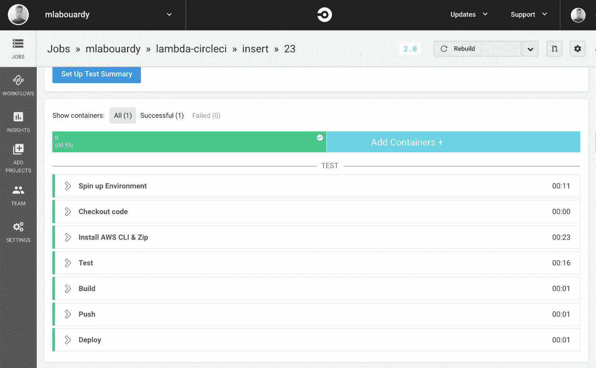
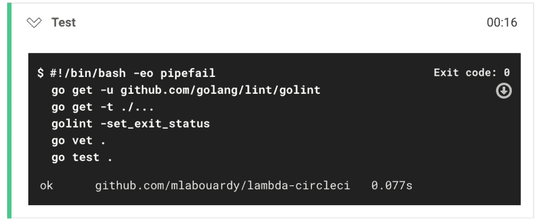
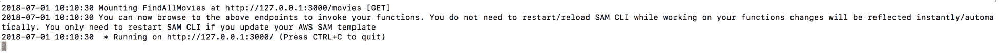
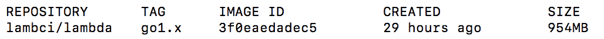
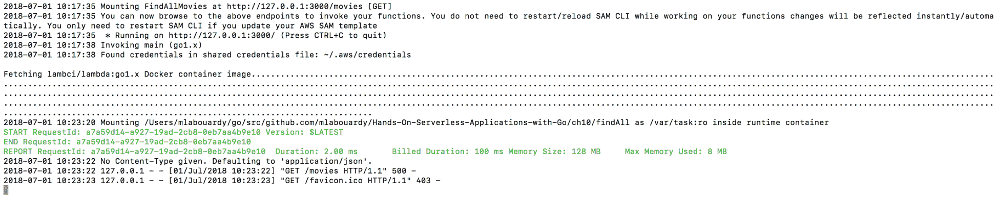
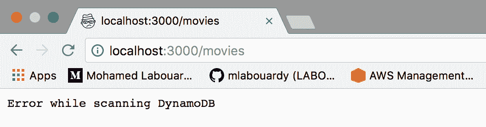
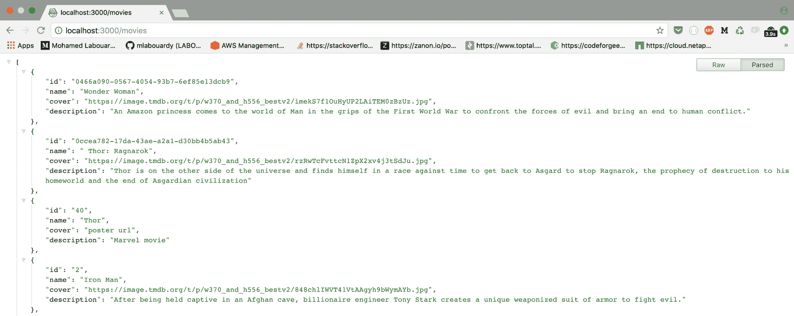
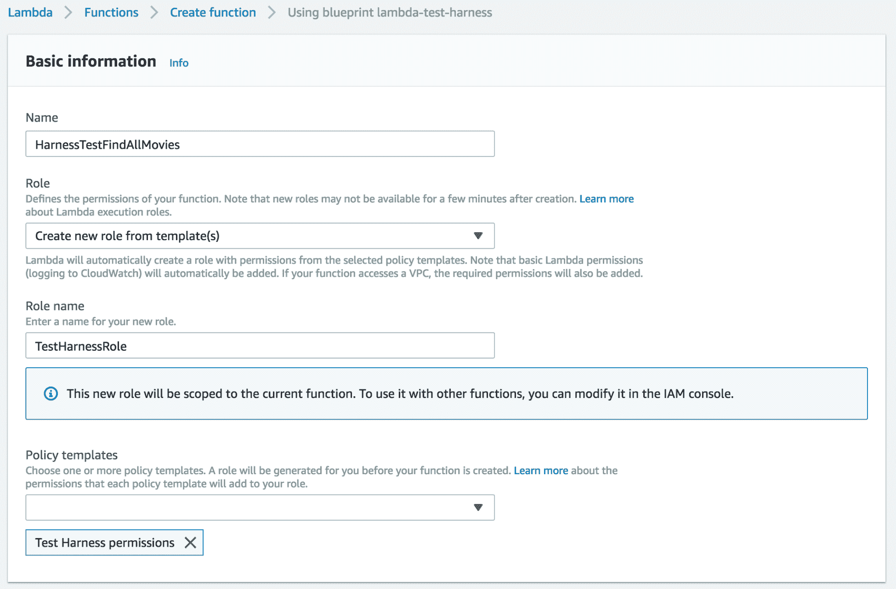

# 测试无服务器应用程序

本章将教您如何使用 AWS 无服务器应用程序模型在本地测试无服务器应用程序。我们还将介绍使用第三方工具进行 Go 单元测试和性能测试，以及如何使用 Lambda 本身执行测试。

# 技术要求

本章是[第 7 章](07.html)*实施 CI/CD 管道*的后续章节，因此建议先阅读该章节，以便轻松阅读。此外，建议具有测试驱动开发实践的经验。本章的代码包托管在 GitHub 上的[https://github.com/PacktPublishing/Hands-On-Serverless-Applications-with-Go](https://github.com/PacktPublishing/Hands-On-Serverless-Applications-with-Go) 。

# 单元测试

单元测试 Lambda 函数意味着测试函数处理程序时完全隔离（尽可能）外部资源（如以下事件：DynamoDB、S3、Kinesis）。这些测试允许您在实际将新更改部署到生产环境之前捕获 bug，并维护源代码的质量、可靠性和安全性。

在编写第一个单元测试之前，在 Golang 中进行测试的一些背景知识可能会有所帮助。要在 Go 中编写新的测试套件，文件名必须以` _test.go`结尾，并包含带有`TestFUNCTIONNAME`前缀的函数。`Test`前缀有助于识别测试例程。在构建部署包时，以`_test`后缀结尾的文件将被排除，并且只有在发出`go test`命令时才会执行。此外，Go 还附带了一个内置的`testing`包，其中包含许多辅助功能。但是，为了简单起见，我们将使用名为`testify`的第三方软件包，您可以使用以下命令安装该软件包：

```go
go get -u github.com/stretchr/testify
```

这是我们在上一章中构建的 Lambda 函数的一个示例，用于列出 DynamoDB 表中的所有电影。下面是我们要测试的代码：

```go
func findAll() (events.APIGatewayProxyResponse, error) {
  ...

  svc := dynamodb.New(cfg)
  req := svc.ScanRequest(&dynamodb.ScanInput{
    TableName: aws.String(os.Getenv("TABLE_NAME")),
  })
  res, err := req.Send()
  if err != nil {
    return events.APIGatewayProxyResponse{
      StatusCode: http.StatusInternalServerError,
      Body: "Error while scanning DynamoDB",
    }, nil
  }

  ...

  return events.APIGatewayProxyResponse{
    StatusCode: 200,
    Headers: map[string]string{
      "Content-Type": "application/json",
      "Access-Control-Allow-Origin": "*",
    },
    Body: string(response),
  }, nil
}
```

为了完全覆盖代码，我们需要测试所有的边缘情况。我们可以执行的测试示例包括：

*   在没有为函数分配 IAM 角色的情况下测试行为。
*   使用分配给该功能的 IAM 角色进行测试。

为了模拟 Lambda 函数在没有 IAM 角色的情况下运行，我们可以删除凭证文件或取消设置 AWS 环境变量（如果您在本地使用）。然后，发出`aws s3 ls`命令以验证 AWS CLI 无法找到 AWS 凭据。如果您看到以下消息，您应该准备好了：

```go
Unable to locate credentials. You can configure credentials by running "aws configure".
```

在名为`main_test.go`的文件中编写单元测试：

```go
package main

import (
  "net/http"
  "testing"

  "github.com/aws/aws-lambda-go/events"
  "github.com/stretchr/testify/assert"
)

func TestFindAll_WithoutIAMRole(t *testing.T) {
  expected := events.APIGatewayProxyResponse{
    StatusCode: http.StatusInternalServerError,
    Body: "Error while scanning DynamoDB",
  }
  response, err := findAll()
  assert.IsType(t, nil, err)
  assert.Equal(t, expected, response)
}
```

测试函数以`Test`关键字开头，后跟函数名和我们要测试的行为。接下来，它调用`findAll`处理程序，并将实际结果与预期响应进行比较。然后，您可以执行以下步骤：

1.  使用以下命令启动测试。该命令将在当前文件夹中的任何文件中查找任何测试并运行它们。确保设置`TABLE_NAME`环境变量：

```go
TABLE_NAME=movies go test
```

伟大的我们的测试之所以有效，是因为在扫描发电机 B 值时，预期和实际响应体等于**误差：**


2.  如果在运行时将 IAM 角色分配给 Lambda 函数，则编写另一个测试函数以验证处理程序的行为：

```go
package main

import (
  "testing"

  "github.com/stretchr/testify/assert"
)

func TestFindAll_WithIAMRole(t *testing.T) {
  response, err := findAll()
  assert.IsType(t, nil, err)
  assert.NotNil(t, response.Body)
}
```

同样，测试应通过，因为预期和实际响应主体不为空：


现在，您已经在 Go 中运行了单元测试；让我们为需要输入参数的 Lambda 函数编写另一个单元测试。我们以`insert`方法为例。我们要测试的代码如下（完整代码可以在 GitHub 存储库中找到）：

```go
func insert(request events.APIGatewayProxyRequest) (events.APIGatewayProxyResponse, error) {
  ...
  return events.APIGatewayProxyResponse{
    StatusCode: 200,
    Headers: map[string]string{
      "Content-Type": "application/json",
      "Access-Control-Allow-Origin": "*",
    },
  }, nil
}
```

此场景作为输入参数的有效负载无效。函数应返回一个带有`Invalid payload`消息的`400`错误：

```go
func TestInsert_InvalidPayLoad(t *testing.T) {
  input := events.APIGatewayProxyRequest{
    Body: "{'name': 'avengers'}",
  }
```

```go

  expected := events.APIGatewayProxyResponse{
    StatusCode: 400,
    Body: "Invalid payload",
  }
  response, _ := insert(input)
  assert.Equal(t, expected, response)
}
```

另一个用例是当给定有效负载时；函数应将电影插入数据库并返回`200`成功代码：

```go
func TestInsert_ValidPayload(t *testing.T) {
  input := events.APIGatewayProxyRequest{
    Body: "{\"id\":\"40\", \"name\":\"Thor\", \"description\":\"Marvel movie\", \"cover\":\"poster url\"}",
  }
  expected := events.APIGatewayProxyResponse{
    StatusCode: 200,
    Headers: map[string]string{
      "Content-Type": "application/json",
      "Access-Control-Allow-Origin": "*",
    },
  }
  response, _ := insert(input)
  assert.Equal(t, expected, response)
}
```

这两项测试应该成功通过。这一次，我们将在代码覆盖模式下使用`-cover`标志运行`go test`命令：

```go
TABLE_NAME=movies go test -cover
```

单元测试涵盖了 78%的代码：


如果您想要深入了解哪些语句被测试覆盖，哪些不被测试覆盖，可以使用以下命令生成 HTML 覆盖率报告：

```go
TABLE_NAME=movies go test -cover -coverprofile=coverage.out
go tool cover -html=coverage.out -o coverage.html
```

如果在浏览器中打开`coverage.html`，可以看到单元测试未涉及的语句：


您可以通过利用 Go 的接口模拟 DynamoDB 调用来改进单元测试。这允许您模拟 DynamoDB 的实现，而不是直接使用具体的服务客户端（例如，[）https://aws.amazon.com/blogs/developer/mocking-out-then-aws-sdk-for-go-for-unit-testing/](https://aws.amazon.com/blogs/developer/mocking-out-then-aws-sdk-for-go-for-unit-testing/) ）。

# 自动单元测试

拥有单元测试是很棒的。然而，没有自动化的单元测试是没有用处的，因此您的 CI/CD 管道应该有一个测试阶段，以便对提交到代码存储库的每个更改执行单元测试。这种机制有很多好处，比如确保您的代码库处于无 bug 状态，允许开发人员持续检测和修复集成问题，从而避免发布日期最后一刻出现混乱。以下是我们在前几章中构建的用于自动部署 Lambda 函数的管道示例：

```go
version: 2
jobs:
 build:
 docker:
 - image: golang:1.8

 working_directory: /go/src/github.com/mlabouardy/lambda-circleci

 environment:
 S3_BUCKET: movies-api-deployment-packages
 TABLE_NAME: movies
 AWS_REGION: us-east-1

 steps:
 - checkout

 - run:
 name: Install AWS CLI & Zip
 command: |
 apt-get update
 apt-get install -y zip python-pip python-dev
 pip install awscli

 - run:
 name: Test
 command: |
 go get -u github.com/golang/lint/golint
 go get -t ./...
 golint -set_exit_status
 go vet .
 go test .

 - run:
 name: Build
 command: |
 GOOS=linux go build -o main main.go
 zip $CIRCLE_SHA1.zip main

 - run:
 name: Push
 command: aws s3 cp $CIRCLE_SHA1.zip s3://$S3_BUCKET

 - run:
 name: Deploy
 command: |
 aws lambda update-function-code --function-name InsertMovie \
 --s3-bucket $S3_BUCKET \
 --s3-key $CIRCLE_SHA1.zip --region us-east-1
```

Lambda 函数源代码的所有更改都将触发新的构建，并将重新执行单元测试：



点击测试阶段，会看到详细的`go test`命令结果：



# 集成测试

与单元测试（测试系统的一个单元）不同，集成测试的重点是将 Lambda 函数作为一个整体进行测试。那么，我们如何在本地开发环境中测试 Lambda 函数而不将其部署到 AWS？请继续阅读以了解更多信息。

# RPC 通信

如果您阅读 AWS Lambda 官方 Go 库（[中的代码 https://github.com/aws/aws-lambda-go](https://github.com/aws/aws-lambda-go) ），您会注意到基于 Go 的 Lambda 函数是通过**TCP**使用`net/rpc`调用的。每个 Go Lambda 函数都会在`_LAMBDA_SERVER_PORT`环境变量定义的端口上启动服务器，并等待传入的请求。要与函数交互，请使用两种 RPC 方法：

*   `Ping`：用于检查该功能是否仍在运行
*   `Invoke`：用于执行请求

有了这些知识，我们可以模拟 Lambda 函数的执行，并执行集成测试或预部署测试，以减少在将函数部署到 AWS 时但在检查其新行为之前的等待时间。在将新更改提交到代码存储库之前，我们还可以在开发生命周期的早期阶段修复 bug。

下面的示例是一个简单的 Lambda 函数，用于计算给定数字的斐波那契值。斐波那契数列是前面两个数的和。以下代码是使用递归的斐波那契级数的实现：

```go
package main

import "github.com/aws/aws-lambda-go/lambda"

func fib(n int64) int64 {
  if n > 2 {
    return fib(n-1) + fib(n-2)
  }
  return 1
}

func handler(n int64) (int64, error) {
  return fib(n), nil
}

func main() {
  lambda.Start(handler)
}
```

Lambda 函数正在通过 TCP 侦听端口，因此我们需要通过设置`_LAMBDA_SERVER_PORT`环境变量来定义端口：

```go
_LAMBDA_SERVER_PORT=3000 go run main.go
```

要调用该函数，您可以使用`net/rpc`go 包中的`invoke`方法，或者安装一个将 RPC 通信抽象为单个方法的 Golang 库：

```go
go get -u github.com/djhworld/go-lambda-invoke 
```

然后，通过设置运行该函数的端口和要计算其斐波那契数的数字来调用该函数：

```go
package main

import (
  "fmt"
  "log"

  "github.com/djhworld/go-lambda-invoke/golambdainvoke"
)

func main() {
  response, err := golambdainvoke.Run(3000, 9)
  if err != nil {
    log.Fatal(err)
  }
  fmt.Println(string(response))
}
```

使用以下命令调用 Fibonacci Lambda 函数：

```go
go run client.go
```

因此，`fib(9)=34`按预期返回：


另一种方法是使用`net/http`包构建 HTTP 服务器，以模拟 API 网关后面运行的 Lambda 函数，并以测试任何 HTTP 服务器以验证处理程序的相同方式测试该函数。

在下一节中，我们将看到如何使用 AWS 无服务器应用程序模型以更简单的方式在本地测试 Lambda 函数。

# 无服务器应用模型

**无服务器应用模型**（**SAM**），是 AWS 中定义无服务器应用的一种方式。它是**CloudFormation**的扩展，允许在模板文件中定义在 AWS 中运行函数所需的所有资源。

有关如何使用 SAM 从头开始构建无服务器应用程序的说明，请参见[第 14 章](14.html)、*基础设施代码*。

此外，AWS SAM 允许您创建一个开发环境，以便在本地测试、调试和部署您的功能。执行以下步骤：

1.  要开始，请使用`pip`Python 软件包管理器安装 SAM CLI：

```go
pip install aws-sam-cli
```

确保安装所有必备组件并确保 Docker 引擎正在运行。有关更多详细信息，请查看[上的官方文件 https://docs.aws.amazon.com/lambda/latest/dg/sam-cli-requirements.html](https://docs.aws.amazon.com/lambda/latest/dg/sam-cli-requirements.html) 。

2.  安装后，运行`sam --version`。如果一切正常，它应该输出 SAM 版本（*v0.4.0*在编写本书时）。
3.  为 SAM CLI 创建`template.yml`，我们将在其中定义运行时和运行函数所需的资源：

```go
AWSTemplateFormatVersion : '2010-09-09'
Transform: AWS::Serverless-2016-10-31
Description: List all movies.
Resources:
 FindAllMovies:
 Type: AWS::Serverless::Function
 Properties:
 Handler: main
 Runtime: go1.x
 Events:
 Vote:
 Type: Api
 Properties:
 Path: /movies
 Method: get
```

SAM 文件描述运行时环境和处理程序的名称，其中包含调用 Lambda 函数时将执行的代码。另外，模板定义了将触发函数的事件；在本例中，它是一个 API 网关端点。

*   为 Linux 构建部署包：

```go
GOOS=linux go build -o main
```

*   使用`sam local`命令在本地运行该功能：

```go
sam local start-api
```

HTTP 服务器将在端口`3000`上运行和侦听：



如果您导航到`http://localhost:3000/movies`，在返回响应之前应该需要几分钟，因为它需要获取 Docker 映像：


SAM local 利用容器的功能在 Docker 容器中运行 Lambda 函数的代码。在前面的屏幕截图中，它正在从 DockerHub（一个图像存储库）中提取`lambci/lambda:go1.x`Docker 图像。您可以通过运行以下命令来确认，以列出计算机上的所有可用映像：

```go
docker image ls
```

**这是前面命令的输出：**

 **

拉取图像后，将根据您的`deployment`包创建一个新容器：



在浏览器中，将显示一条错误消息，因为我们忘记设置 DynamoDB 表的名称：



我们可以通过创建一个`env.json`文件来解决这个问题，如下所示：

```go
{
    "FindAllMovies" : {
        "TABLE_NAME" : "movies"
    }
}
```

运行`sam`命令，这次使用`--env-var`参数：

```go
sam local start-api --env-vars env.json
```

您还可以使用`Environment`属性在同一 SAM 模板文件中声明环境变量。

这一次，DynamoDB`movies`表中应该有所有的电影，功能应该按预期工作：



# 负载测试

我们已经了解了如何使用基准测试工具，如 Apache 基准测试，以及如何测试线束。在本节中，我们将了解如何将 Lambda 本身用作无服务器测试测试平台。

想法很简单：我们将编写一个 Lambda 函数来调用我们想要测试的 Lambda 函数，并将其结果写入 DynamoDB 表以进行报告。幸运的是，这里不需要编码，因为 Lambda 函数已经在蓝图部分可用：


为函数指定名称并创建新的 IAM 角色，如以下架构中所述：



单击“创建函数”，创建函数时应授予执行以下操作的权限：

*   将日志推送到 CloudWatch。
*   调用其他 Lambda 函数。
*   将数据写入 DynamoDB 表。

以下屏幕截图为您提供了完成上述任务后的大致情况：


在启动负载测试之前，我们需要创建一个 DynamoDB 表，Lambda 将在其中记录测试的输出。此表必须有一个哈希键字符串`testId`和一个范围号`iteration`：


创建后，使用以下 JSON 模式调用 Lambda 函数。它将异步调用给定函数 100 次。指定唯一的`event.testId`来区分每个单元测试运行：

```go
{
    "operation": "load",
    "iterations": 100,
    "function": "HarnessTestFindAllMovies",
    "event": {
      "operation": "unit",
      "function": "FindAllMovies",
      "resultsTable": "load-test-results",
      "testId": "id",
      "event": {
        "options": {
          "host": "https://51cxzthvma.execute-api.us-east-1.amazonaws.com",
          "path": "/production/movies",
          "method": "GET"
        }
      }
    }
  }
```

结果将记录在 JSON 模式中给出的 DynamoDB 表中：


您可能需要修改函数的代码以保存其他信息，例如运行时间、资源使用情况和响应时间。

# 总结

在本章中，我们学习了如何为 Lambda 函数编写单元测试，以覆盖函数的所有边缘情况。我们还学习了如何使用 AWS SAM 设置本地开发环境，以在本地测试和部署该功能，以确保在将其部署到 AWS Lambda 之前其行为按预期工作。

在下一章中，我们将介绍如何使用 AWS 托管服务（如 CloudWatch 和 X-Ray）对无服务器应用程序进行故障排除和调试。

# 问题

1.  为`UpdateMovie`Lambda 函数编写一个单元测试。
2.  为`DeleteMovie`Lambda 函数编写一个单元测试。
3.  修改前面章节中提供的`Jenkinsfile`以包括自动单元测试的执行。
4.  在使用 AWS CodeBuild 将部署包推送到 S3 之前，修改`buildspec.yml`定义文件以包括单元测试的执行。
5.  为前几章中实现的每个 Lambda 函数编写 SAM 模板文件。**