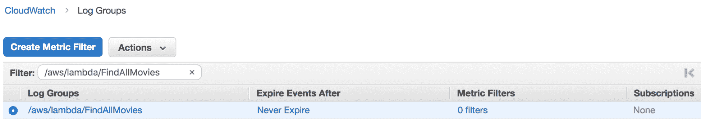
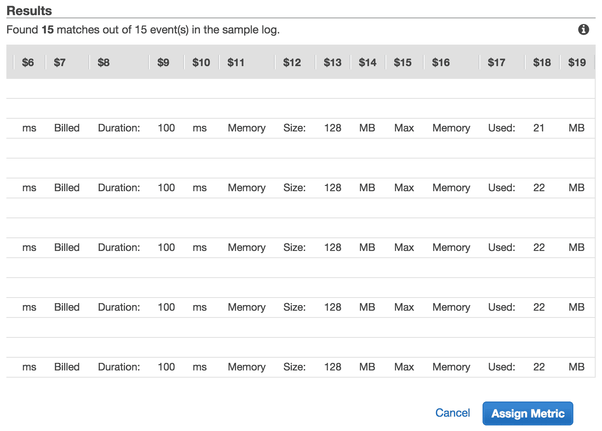
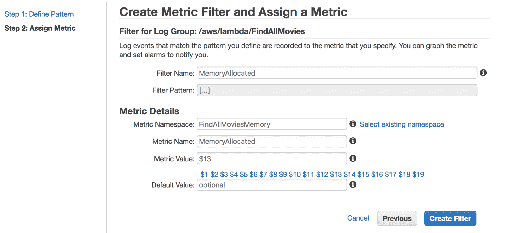
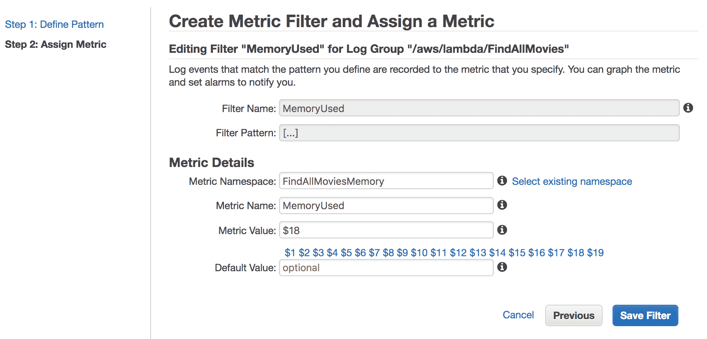
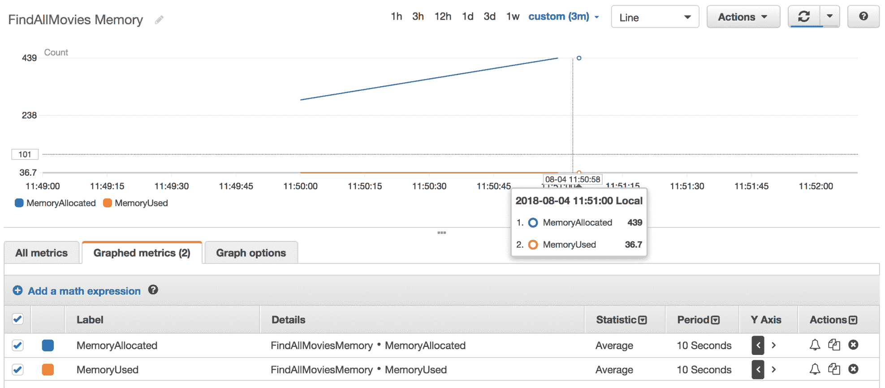

# 十三、设计经济高效的应用

在本章中，我们将讨论 AWS Lambda 的定价模型，并学习如何根据预期负载估算该定价。我们还将介绍一些技巧，以优化和降低无服务器应用的成本，同时保持灵活性和可用性。本章将介绍以下主题：

*   Lambda 定价模型
*   最佳内存大小
*   代码优化
*   Lambda 成本和内存跟踪

# Lambda 定价模型

AWS Lambda 改变了 Ops 团队提供和管理其组织基础设施的方式。客户现在可以在支付较低价格的情况下运行他们的代码，而不必担心底层基础设施。每月前 100 万次请求是免费的，此后每 100 万次请求收费 0.20 美元，因此您可以无限期地使用 Lambda 的免费层。然而，如果您不特别注意函数的资源使用和代码优化，密集的用例和巨大的工作负载应用可能会不必要地花费您数千美元。

为了控制 Lambda 成本，您必须了解 Lambda 定价模型的工作原理。决定功能成本的因素有三个：

*   **执行次数**：调用次数；每个请求支付 0.0000002 美元。
*   **已分配内存**：为您的功能配置的 RAM 量（范围在 128 MB 到 3008 MB 之间）。
*   **执行时间**：从您的代码开始执行到返回响应或以其他方式终止，计算持续时间。时间四舍五入到最接近的 100 毫秒（Lambda 以 100 毫秒为增量计费），您可以设置的最大超时时间为 5 分钟。
*   **数据传输**：如果您的 Lambda 函数启动外部数据传输，将按照 EC2 数据传输速率（[收费 https://aws.amazon.com/ec2/pricing](https://aws.amazon.com/ec2/pricing) ）。

# Lambda 成本计算器

现在您已经熟悉了定价模型，让我们看看如何提前计算 Lambda 函数的成本

在前面的章节中，我们为`FindAllMovies`函数分配了 128MB 的内存，并将执行超时设置为 3 秒。假设该函数每秒执行 10 次（一个月内执行 2500 万次）。您的费用计算如下：

*   **每月计算费用**：每月计算价格为每 GB/s$0.00001667，免费层提供 400000 GB/s。总计算（秒）=25 米*（1 秒）=25000000 秒。计算总量（GB/s）=25000000*128 MB/1024=3125000 GB/s

总计算–自由层计算=每月计费计算 GB/s

3125000 GB/s–400000 免费层 GB/s=2725000 GB/s

每月计算费用=2725000 GB/s*$0.00001667=$45.42

*   **每月请求费用**：每月请求价格为每 100 万次请求 0.20 美元，免费层每月提供 100 万次请求。

总请求–免费层请求=每月计费请求

2500 万次请求–100 万次免费层请求=2400 万次每月计费请求

每月申请费用=2400 万*$0.2/M=$4.8

因此，每月总费用是计算费用和请求费用的总和，如下所示：

总费用=计算费用+请求费用=45.24 美元+4.8 美元=50.04 美元

# 最佳内存大小

正如我们在上一节中所看到的，分配的 RAM 数量会影响计费。此外，它还会影响函数接收的 CPU 和网络带宽。因此，您需要选择最佳内存大小。为了为您的函数找到合适的平衡以及最佳的价格和性能水平，您必须使用不同的内存设置测试 Lambda 函数，并分析函数使用的实际内存。幸运的是，AWS Lambda 在关联的日志组中写入一个日志条目。日志包含函数为每个请求分配和使用的内存量。以下是日志输出的示例：


通过比较 Memory Size（内存大小）和 Max Memory Used（最大已用内存）字段，可以确定函数是否需要更多内存，或者是否过度配置了函数的内存大小。如果您的功能需要更多内存，您可以始终从“基本设置”部分为其提供更多内存，如下所示：


单击 Save，然后再次调用该函数。在日志的输出中，您会注意到内存大小会影响执行时间：


同时，增加功能记忆设置将带来显著的性能提升。成本将随着内存设置（以λ为单位）的增加而线性增加。类似地，减少函数内存设置可能有助于降低成本，但这也会增加执行时间，在最坏的情况下，会导致超时或内存超出错误。

为 Lambda 函数提供最小的内存设置并不总是提供最低的总成本。由于内存不足，该功能将失败并超时。此外，可能需要更长的时间才能完成。因此，你将付出更多。

# 代码优化

在上一节中，我们看到了使用不同的内存设置大规模测试函数如何导致分配更多的 CPU 容量，这可能会影响 Lambda 函数的性能和成本。但是，在优化资源使用之前，您需要首先优化函数的代码，以帮助减少执行函数所需的内存和 CPU 量。与传统应用相反，AWS Lambda 为您管理和修补基础设施，这使开发人员能够专注于编写高质量、高效且世界一流的代码，以快速执行

为函数分配更多的资源会导致更快的执行，直到达到某个阈值，增加更多内存将不再提供更好的性能。

在以经济高效的方式使用 AWS Lambda 设计函数时，应牢记以下几点：

*   热容器可用于某些请求。记住这一点，我们可以通过实现以下功能来提高 Lambda 函数的性能：
    *   通过使用全局变量和单例模式，避免在每次调用时重新初始化变量。
    *   保持活动状态并重用在上一次调用期间建立的数据库和 HTTP 连接。在 Go 中，您可以使用`init`函数设置所需的状态，并在加载函数处理程序时运行一次性计算。
*   将您的体系结构设计为异步的；与紧耦合组件相比，解耦组件完成其工作所需的计算时间可能更少。另外，避免花费 CPU 周期等待对同步请求的响应。
*   使用 AWS X-Ray 等监视和调试工具分析和排除性能瓶颈、延迟峰值以及其他影响 Lambda 应用性能的问题。
*   使用并发保留设置限制，以防止无限制的自动缩放、冷启动，并保护下游服务。您还可以通过在 Lambda 触发器和函数之间放置一个**简单队列服务**（**SQS**）来限制执行次数，以调整 Lambda 函数的触发频率。

# Lambda 成本和内存跟踪

在 AWS Lambda 中设计经济高效的无服务器应用的关键在于监控您的成本和资源使用情况。不幸的是，CloudWatch 没有提供关于资源使用或 Lambda 函数成本的现成指标。幸运的是，对于每次执行，Lambda 函数都会向 CloudWatch 写入一个执行日志，如下所示：

```go
REPORT RequestId: 147e72f8-5143-11e8-bba3-b5140c3dea53 Duration: 12.00 ms Billed Duration: 100 ms  Memory Size: 128 MB Max Memory Used: 21 MB 
```

前面的日志显示为给定请求分配和使用的内存。可以使用简单的 CloudWatch 日志度量过滤器提取这些值。此功能使您能够在日志中搜索特定关键字。

打开 AWS CloudWatch 控制台并从导航窗格中选择日志组。接下来，搜索与 Lambda 函数关联的日志组。其名称如下：`/aws/lambda/FUNCTION_NAME`：



接下来，单击“创建度量过滤器”按钮：


定义解析以空格分隔的术语的度量筛选模式。公制过滤器模式必须使用名称指定字段，用逗号分隔，整个模式用方括号括起来，例如，`[a,b,c]`。然后，单击 TestPattern，根据日志中的现有数据测试过滤器模式的结果。将打印以下记录：


如果不知道字段的数量，可以使用方括号中的省略号：



列`$13`将存储分配给函数的内存，`$18`表示实际使用的内存。接下来，单击 Assign Metric 为已分配的内存创建一个度量：



单击“创建筛选器”按钮保存它。您现在应该可以看到新创建的筛选器：


应用相同的步骤为内存使用创建另一个筛选器：



一旦定义了这两个过滤器，请确保 Lambda 函数正在运行，并等待几秒钟，同时该函数将使用一些值填充新的 CloudWatch 度量：


回到 CloudWatch，根据我们之前创建的两个指标创建一个新图表：



如果使用的内存超过某个阈值（例如，相对于您分配的内存的 80%），您可以更进一步，创建一个近乎实时的 CloudWatch 警报。此外，关注函数的持续时间也很重要。您可以按照本节中描述的相同过程从 Lambda 执行日志中提取计费持续时间，并根据提取的值设置警报，以便在您的函数花费可疑的长时间完成时收到通知。

# 总结

开始使用 AWS Lambda 很容易–您不必配置和管理任何底层基础设施，而且在几秒钟内启动并运行一些有用的东西非常便宜。另外，与 EC2 相比，AWS Lambda 的一个巨大优势是您不必为空闲资源付费。这是非常强大的，但也是 Lambda 最大的风险之一。在开发过程中忘记成本是很常见的，但一旦您开始在生产中运行繁重的工作负载和多个功能，成本可能会很高。因此，在这成为一个问题之前，跟踪 Lambda 的成本和使用情况是非常重要的。

最后一章将介绍代码为（**IaC**的**基础设施的概念，以帮助您以自动化的方式设计和部署 N 层无服务器应用，从而避免人为错误和可重复的任务。**