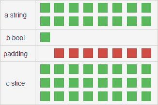
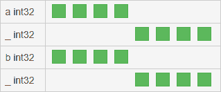

# 十六、使用 CGO

本章将向您介绍 CGO，一个 C 语言的 Go 运行时。它使从 Go 应用程序调用 C 代码成为可能，而且由于 C 有大量可用的库，这意味着它们可以在 Go 中使用。

本章将介绍以下主题：

*   使用 C 和 Go 中的 CGO
*   理解类型差异

# 技术要求

本章要求安装 Go 并设置您最喜爱的编辑器。更多信息请参见[第三章](03.html)、*Go*概述。

此外，它要求在您的计算机中安装 GCC 编译器。这可以在 Unix 机器上使用软件包管理器轻松完成。对于 Ubuntu，命令如下所示：

```go
 sudo apt install gcc
```

# CGO 简介

CGO 是一种可以在 Go 应用程序中运行 C 代码的工具。自 2009 年 Go 达到 1.0 版以来，这个特性就一直存在，它允许我们在标准库之外可用的软件包比现在少的时候使用现有的 C 库。

C 代码通过`C`伪包进行访问，并使用包名后跟标识符进行访问和调用，例如`C.print`。

`import`声明前面有一系列特殊注释，用于指定应用程序应导入的 C 源文件：

```go
package example

// #include <stdio.h>
import "C"
```

此语句也可以是多行注释，它可以包含更多的`include`指令，如前面示例中的指令，甚至可以直接包含实际的 C 代码：

```go
package example

/*
#include <stdio.h>
#include <stdlib.h>
#include <errno.h>

void someFunction(char* s) {
    printf("%s\n", s);
}
*/
import "C"
```

重要的是避免 C 注释和`import`语句之间出现空行，否则库和代码将由 CGO 导入应用程序。

# 从 Go 调用 C 代码

要使用现有的 C 代码（由我们或其他人编写），我们需要从 Go 调用 C。让我们执行一个快速完整的示例，其中我们仅使用 C 功能将字符串打印到标准输出：

```go
package main

/*
#include <stdio.h>
#include <stdlib.h>

void customPrint(char* s) {
    printf("%s\n", s);
}
*/
import "C"

import "unsafe"

func main() {
    s := C.CString(`Printing to stdout with CGO
        Using <stdio.h> and <stdlib.h>`)
            defer C.free(unsafe.Pointer(s))
            C.customPrint(s)
}
```

我们在这里导入两个 C 核心库，如下所示：

*   `stdio.h` ：包含输入输出方式。我们正在使用`printf`。
*   `stdlib.h`：包含一般功能，包括内存管理。

查看前面的代码，我们注意到我们正在打印的变量不是一个正常的 Go`string`，而是由`C.CString`函数获取的，该函数获取一个字符串并返回一个`char`片段，因为在 C 中字符串就是这样处理的。该函数定义如下：

```go
func C.CString(string) *C.char
```

我们可以观察到的第二件事是，我们正在推迟对`C.free`的调用，传递我们定义的`s`变量，但转换为不同的类型。此函数调用是必需的，因为语言不是垃圾收集的，为了释放所使用的内存，应用程序需要专门调用 C`free`函数。此函数接收一个通用指针，该指针由 Go 中的`unsafe.Pointer`类型表示。根据 Go 文件，以下内容适用：

“任何类型的指针值都可以转换为指针。”

这正是我们正在做的，因为字符串变量的类型是`*C.char`指针。

# 从 C 调用 Go 代码

我们刚刚看到了如何使用 C 包和`import`语句从 Go 应用程序调用 C 代码。现在，我们将看到如何从 C 调用 Go 代码，这需要使用另一个名为`export`的特殊语句。这是一条注释，需要放在要导出的函数上方的行中，后跟该函数的名称：

```go
//export theAnswer
func theAnswer() C.int {
    return 42
}
```

Go 函数需要在 C 代码中声明为外部函数。这将允许 C 代码使用它：

```go
extern int theAnswer();
```

我们可以通过创建一个导出函数的 Go 应用程序来测试此功能，该函数由 C 函数使用。在 Go`main`函数中调用：

```go
package main

// extern int goAdd(int, int);
//
// static int cAdd(int a, int b) {
//     return goAdd(a, b);
// }
import "C"
import "fmt"

//export goAdd
func goAdd(a, b C.int) C.int {
    return a + b
}

func main() {
    fmt.Println(C.cAdd(1, 3))
}
```

我们可以在前面的示例中看到，`goAdd`函数，它通过`export`语句导出到 C。导出名称与函数名称匹配，并且注释和函数之间没有空行。

我们可以注意到，导出函数签名中使用的类型不是正则 Go 整数，而是`C.int`变量。我们将在下一节中看到 C 和 Go 系统的区别。

# C 和 Go 型系统

为了在 C 和 Go 之间传递数据，我们需要通过执行正确的转换来传递正确的类型。

# 字符串和字节片

`string`类型是 Go 中的基本类型，在 C 中不存在。它有`char`类型，表示一个字符，类似于 Go 的`rune`类型，字符串由`char`类型的数组表示，该数组以`\0`结尾。

该语言可以将字符数组直接声明为数组或字符串。第二个声明不是为了结束字符串而结束`0`值：

```go
char lang[7] = {'G', 'o', 'l', 'a', 'n', 'g', '\0'};

char lang[] = "Golang";
```

我们已经了解了如何使用以下函数将 Go 字符串转换为 C 字符数组：

```go
func C.CString(string) *C.char
```

此函数将在堆中分配字符串，以便应用程序负责使用`C.free`函数释放此类内存。

为了将字节片转换为名为`*char`的 C 字符指针，我们可以使用以下函数：

```go
func C.CBytes([]byte) unsafe.Pointer
```

碰巧，对于`C.CString`，应用程序在堆中分配数据，并将释放数据的责任留给 Go 应用程序。

这两个函数的主要区别在于，第一个函数产生`char[]`，而另一个函数产生`*char`。这两种类型相当于 Go`string`和`[]byte`，因为第一种类型的字节不能更改，而第二种类型的字节可以更改。

有一系列函数用于将 C 类型转换回 Go 类型。就字符串而言，有两个函数：`C.GoString`从整个数组中创建字符串，`C.GoStringN`使用显式长度创建字符串：

```go
func C.GoString(*C.char) string

func C.GoStringN(*C.char, C.int) string
```

要将 C`*char`转换回 Go`[]byte`，只有一个功能：

```go
func C.GoBytes(unsafe.Pointer, C.int) []byte
```

我们可以使用`C.CBytes`函数使用 C 修改字节片并将其转换回 Go 片：

```go
package main

/*
#include <stdio.h>
#include <stdlib.h>
#include <string.h>

char* reverseString(char* s) {
    int l = strlen(s);
    for (int i=0; i < l/2; i++) {
        char a = s[i];
        s[i] = s[l-1-i];
        s[l-1-i] = a;
    }
    return s;
}
*/
import "C"

import (
    "fmt"
    "unsafe"
)

func main() {
    b1 := []byte("A byte slice")
    c1 := C.CBytes(b1)
    fmt.Printf("Go ptr: %p\n", b1)
    fmt.Printf("C ptr: %p\n", c1)
    defer C.free(c1)
    c2 := unsafe.Pointer(C.reverseString((*C.char)(c1)))
    b2 := C.GoBytes(c2, C.int(len(b1)))
    fmt.Printf("Go ptr: %p\n", b2)
    fmt.Printf("%q -> %q", b1, b2)
}
```

执行此应用程序将显示，当将字节片`b1`转换为 C 类型作为`c1`变量时，它将更改地址。C 函数返回的 C 片`c2`将与`c1`具有相同的地址，因为它是相同的片。当再次转换回 Go 并分配给`b2`时，它将具有与初始 Go 字节片`b1`不同的另一个地址。

我们可以使用 C 字符串函数实现相同的结果。让我们使用上一个示例中相同的 C 代码，并更改其余代码：

```go
package main

/*
#include <stdio.h>
#include <stdlib.h>
#include <string.h>

char* reverseString(char* s) {
    int l = strlen(s);
    for (int i=0; i < l/2; i++) {
        char a = s[i];
        s[i] = s[l-1-i];
        s[l-1-i] = a;
    }
    return s;
}
*/
import "C"

import (
    "fmt"
    "unsafe"
)

func main() {
    s1 := "A byte slice"
    c1 := C.CString(s1)
    defer C.free(unsafe.Pointer(c1))
    c2 := C.reverseString(c1)
    s2 := C.GoString(c2)
    fmt.Printf("%q -> %q", s1, s2)
}
```

需要注意的是，将 Go 字符串和字节值传输到 C 时，会复制这些值。因此，C 代码不能直接编辑它们，但会编辑副本，保留原始 Go 值不变。

# 整数

在 C 语言中，可用的整数类型与 Go 有许多相似之处，因为在两种语言中，每种整数类型都有有有符号和无符号版本，但它们在名称和字节大小方面有所不同。C`sizeof`功能可以检查每种类型的尺寸。

以下是 C 中可用的整数类型列表：

**签名类型**

| **型** | **尺寸** | **范围** |
| `char` | 1 字节 | [-128, +127] |
| `int` | 2 或 4 字节 | 参见`short`和`long` |
| `short` | 2 字节 | [-32 768, +32 767] |
| `long` | 4 字节 | [-2 147 483 648, +2 147 483 647] |
| `long long` | 8 字节 | [-9 223 372 036 854 775 808, +9 223 372 036 854 775 807] |

**无符号类型**

| **型** | **尺寸** | **范围** |
| 未签字的`char` | 1 字节 | [0, +255] |
| 未签字的`int` | 2 或 4 字节 | 参见未签字的`short`或未签字的`long` |
| 未签字的`short` | 2 字节 | [0, +65 535] |
| 未签字的`long` | 4 字节 | [0, +4 294 967 295] |
| 未签字的`long long` | 8 字节 | [0, +18 446 744 073 709 551 615 ] |

`C`中`int`的大小取决于体系结构，对于 16 位处理器，它过去是 2 字节，而对于现代处理器（32 位和 64 位），它是 4 字节。

当我们从 Go 领域移动到 C 领域，反之亦然，我们将丢失所有变量溢出信息。当我们试图将一个整数变量装入另一个没有足够大小的变量时，编译器不会发出警告。我们可以通过一个简单的例子看到这一点，如下所示：

```go
package main

import "C"

import "fmt"

func main() {
    a := int64(0x1122334455667788)

    // a fits in 64 bits
    fmt.Println(a)
    // short overflows, it's 16
    fmt.Println(C.short(a), int16(0x7788))
    // long also overflows, it's 32
    fmt.Println(C.long(a), int32(0x55667788))
    // longlong is okay, it's 64
    fmt.Println(C.longlong(a), int64(0x1122334455667788))
}
```

我们可以看到，`a`的值是一个确定的数字，但是`short`和`long`变量没有足够的字节，所以它们的值会不同。转换显示，转换时仅从变量中提取最后一个字节，而丢弃其他字节。

下面是 C 类型和类似 Go 类型的有用列表，以及如何在 Go 代码中使用它们：

| **C 型** | **Go 型** | **CGO 型** |
| `char` | `int8` | `C.char` |
| `short` | `int16` | `C.short` |
| `long` | `int32, rune` | `C.long` |
| `long long` | `int64` | `C.longlong` |
| `int` | `int` | `C.int` |
| 未签字的`char` | `uint8, byte` | `C.uchar` |
| 未签字的`short` | `uint16` | `C.ushort` |
| 未签字的`long` | `uint32` | `C.ulong` |
| 未签字的`long long` | `uint64` | `C.ulonglong` |
| 未签字的`int` | `uint` | `C.uint` |

您可以在执行转换时使用此表作为参考，并避免因使用错误类型而产生的错误，因为使用 CGO 时没有溢出警告。

# 浮动类型

在 C 中，`float`类型与 Go 类型非常相似：

*   C 提供 32 位的`float`和 64 位的`double`。
*   Go有`float32`和`float64`。

当从 64 位值转换为 32 位值时，这可能会导致舍入错误，如下代码所示：

```go
package main

import "C"

import (
    "fmt"
    "math"
)

func main() {
    a := float64(math.Pi)

    fmt.Println(a)
    fmt.Println(C.float(a))
    fmt.Println(C.double(a))
    fmt.Println(C.double(C.float(a)) - C.double(a))
}
```

上例显示了`math.Pi`值如何从`3.141592653589793`变为`3.1415927`，从而导致约`1/10<sup>7</sup>`的错误。

# 不安全转换

我们现在将看到如何使用`unsafe`包从 C 编辑 Go 变量。

# 直接编辑字节片

还可以使用脏技巧直接编辑 Go 字节片。从 Go 的角度来看，切片是三个值：

*   指向第一个元素的指针
*   切片大小
*   切片的容量

在 C 语言中，字节片只是一系列字节，字符串是以`\0`结尾的字符片。

如果我们使用`unsafe`包将指针传递到切片的第一个元素，我们将能够直接编辑现有的字节切片，而无需执行复制和转换。我们可以在以下应用程序中看到如何执行此转换：

```go
package main

/*
#include <stdio.h>
#include <stdlib.h>
#include <string.h>

void reverseString(char* s) {
    int l = strlen(s);
    for (int i=0; i < l/2; i++) {
        char a = s[i];
        s[i] = s[l-1-i];
        s[l-1-i] = a;
    }
}
*/
import "C"

import (
  "fmt"
  "unsafe"
)

func main() {
    b1 := []byte("A byte slice")
    fmt.Printf("Slice: %s\n", b1)
    C.reverseString((*C.char)(unsafe.Pointer(&b1[0])))
    fmt.Printf("Slice: %s\n", b1)
}
```

使用表达式`(*C.char)(unsafe.Pointer(&b1[0]))`执行转换，该表达式执行以下操作：

*   获取指向切片的元素零的指针
*   将其转换为不安全的指针
*   将`byte`指针转换为共享内存表示的`C.char`指针

# 数字

使用`unsafe`包，我们还可以将一个数值变量指针转换为它的 C 对应项。这允许我们直接在 C 代码中编辑它：

```go
package main

/*
void half(double* f) {
    *f = *f/2;
}
*/
import "C"

import (
    "fmt"
    "math"
    "unsafe"
)

func main() {
    a := float64(math.Pi)
    fmt.Println(a)
    C.half((*C.double)(unsafe.Pointer(&a)))
    fmt.Println(a)
}
```

前面的例子正是这样做的；在 C 函数中，它将`a`的值减半，而不在 Go 中复制和分配新值。

# 处理切片

Go-slices 和 C-slices 在一个基本方面有所不同，Go 版本同时嵌入了长度和容量，而在 C 中，我们所拥有的只是指向第一个元素的指针。这意味着在 C 中，长度和容量必须存储在其他地方，例如另一个变量中。

让我们看下面的 Go 函数，它计算一系列`float64`数字的平均值：

```go
func mean(l []float64) (m float64) {
    for _, a := range l {
        m += a
    }
    return m / float64(len(l))
}
```

如果我们想在 C 中有一个类似的函数，我们需要传递一个指针及其长度。这将避免诸如分段错误之类的错误，当应用程序试图访问尚未分配给它的内存时会发生这种错误。如果仍将内存分配给应用程序，则结果是它提供了对未知值内存区域的访问，从而导致不可预测的结果：

```go
double mean(int len, double *a) {
    if (a == NULL || len == 0) {
        return 0;
    }
    double m = 0;
    for (int i = 0; i < len; i++) {
        m+=a[i];
    }
    return m / len;
}
```

我们可以使用 Go 包装器尝试此函数，该包装器接受一个切片，并将长度传递给 C 函数：

```go
func mean(a []float64) float64 {
    if len(a) == 0 {
        return 0
    }
    return float64(C.mean(C.int(len(a)), (*C.double)(&a[0])))
}
```

为了验证所发生的情况，我们还可以创建一个类似的函数来传递不正确的长度：

```go
func mean2(a []float64) float64 {
    if len(a) == 0 {
        return 0
    }
    return float64(C.mean(C.int(len(a)*2), (*C.double)(&a[0])))
}
```

使用此函数时，我们将看到应用程序不应产生任何分割错误，但得到的结果将不同。这是因为第二个将向平均值计算中添加一系列额外值，如下所示：

```go
var a = make([]float64, 10)

func init() {
    for i := range a {
        a[i] = float64(i + 1)
    }
}

func main() {
    cases := [][]float64{a, a[1:4], a[:0], nil}
    for _, slice := range cases {
        fmt.Println(slice, mean(slice))
    }
    for _, slice := range cases {
        fmt.Println(slice, mean2(slice))
    }
}
```

# 使用结构

在了解了切片是如何工作的之后，我们将知道如何用 C 语言处理复杂数据并使用结构。关于这一点，让我们看以下部分。

# Go中的结构

Go 结构使用一种称为对齐的技术，该技术包括向数据结构添加一个或多个字节，以使其更好地适应内存地址。考虑下面的数据结构：

```go
struct {
    a string
    b bool
    c []byte
}
```

64 位体系结构在此结构上调用`unsafe.Sizeof`，这将给我们带来意想不到的结果。我们期待的是：

*   字符串中的 16 个字节；8 表示指向第一个元素的指针，8 表示长度
*   布尔值为 1 字节
*   切片 24 个；8 表示地址，8 表示长度，8 表示容量

总数应该是 41，但函数返回 48。这是因为编译器在布尔值之后插入额外的字节，以达到 8 字节（64 位）并优化 CPU 的操作。该结构可以在内存中表示为：



我们可以看到布尔变量需要 1 位，编译器增加了 7 个额外的位。这非常有用，因为它避免了存储的其他变量，一半存储在一个内存插槽中，另一半存储在另一个内存插槽中。这将要求每个操作进行两次读取和两次写入，性能将显著下降。

如果两个或多个字段足够小，可以放入一个 64 位插槽中，则它们将按顺序存储。我们可以通过以下示例看到这一点：

```go
struct {
    a, b bool
    c rune
    d byte
    e string
}
```

此结构转换为 64 位体系结构上的以下内存表示形式：


我们可以清楚地看到，`rune`和`byte`这两个布尔变量都在同一个内存地址中，并且添加了一个字节的填充以对齐最后一个字段。

# 手动填充

GO 可以使用字段的空白标识符手动指定结构中的填充。采用以下数据结构：

```go
struct{
    a int32
    b int32
}
```

这将具有以下表示形式：


我们可以使用空白标识符手动指定填充，并优化 64 位架构的数据结构：

```go
struct{
    a int32
    _ int32
    b int32
    _ int32
}
```

这将允许应用程序在其自己的内存位置存储每一个 Tyt0}，因为空白字段将充当填充：



# C 语言中的结构

C 中的结构与 Go 使用的对齐概念相同，但它们总是使用 4 字节填充对齐。与 Go 不同，它可以完全避免填充，这有助于通过减少内存使用来节省空间。让我们在以下几节中了解更多有关这方面的信息。

# 无包装结构

除非另有规定，否则我们定义的每个结构都将被解包。我们可以用 C 定义一个结构，如下所示：

```go
typedef struct{
  unsigned char a;
  char b;
  int c;
  unsigned int d;
  char e[10];
} myStruct;
```

我们可以直接使用 Go 代码中的值来使用它并填充它，而不会产生任何问题：

```go
func main() {
    v := C.myStruct{
        a: C.uchar('A'),
        b: C.char('Z'),
        c: C.int(100),
        d: C.uint(10),
        e: [10]C.char{'h', 'e', 'l', 'l', 'o'},
    }
    log.Printf("%#v", v)
}
```

这个小测试将为我们提供以下输出：

```go
main._Ctype_struct___0{
    a:0x41, 
    b:90, 
    c:100, 
    d:0xa, 
    e:[10]main._Ctype_char{104, 101, 108, 108, 111, 0, 0, 0, 0, 0},
     _:[2]uint8{0x0, 0x0},
}
```

这告诉我们，有一个额外的空白字段用于填充，因为最后一个字段是 10 个字节，比 4 的倍数（即 12 个字节）少了 2 个字节。

# 填充结构

我们可以使用`pragma pack`指令在 C 中定义压缩结构。我们可以按如下方式包装以前的结构：

```go
#pragma pack(1)
typedef struct{
  unsigned char a;
  char b;
  int c;
  unsigned int d;
  char e[10];
} myStruct;
```

如果我们尝试在 Go 代码中使用 C 结构，如果使用字段`c`和`d`，我们将获得一个编译错误：

```go
pack := C.myStruct{
    a: C.uchar('A'),
    b: C.char('Z'),
    c: C.int(100),
    d: C.uint(10),
    e: [10]C.char{},
}
```

如果我们尝试像对未打包版本那样打印结构，我们将看到原因：

```go
main._Ctype_struct___0{
    a:0x41, 
    b:90, 
    _:[8]uint8{0x0, 0x0, 0x0, 0x0, 0x0, 0x0, 0x0, 0x0}, 
    e:[10]main._Ctype_char{104, 101, 108, 108, 111, 0, 0, 0, 0, 0},
}
```

我们可以从输出中看到，`c`和`d`字段（均为 4 字节）被一个 8 字节的空字段替换，Go 无法访问。因此，我们无法从 Go 填充结构，但我们可以在应用程序的 C 部分访问此字段：

```go
myStruct makeStruct(){
  myStruct p;
  p.a = 'A';
  p.b = 'Z';
  p.c = 100;
  p.d = 10;
  p.e[0] = 'h';
  p.e[1] = 'e';
  p.e[2] = 'l';
  p.e[3] = 'l';
  p.e[4] = 'o';
  p.e[5] = '\0';
  p.e[6] = '\0';
  p.e[7] = '\0';
  p.e[8] = '\0';
  p.e[9] = '\0';
  return p;
}
```

这将允许我们返回具有正确值的结构。我们可以打印出来，看到`_`字段同时包含`c`和`d`的值：

```go
main._Ctype_struct___0{
    a:0x41, 
    b:90, 
    _:[8]uint8{0x64, 0x0, 0x0, 0x0, 0xa, 0x0, 0x0, 0x0}, 
    e:[10]main._Ctype_char{104, 101, 108, 108, 111, 0, 0, 0, 0, 0}
}
```

现在我们有了数据，我们需要创建一个能够承载数据的 Go 结构：

```go
type myStruct struct {
    a uint8
    b int8
    c int32
    d uint32
    e [10]uint8
}
```

现在，我们需要从 C 结构中读取原始字节并手动解压缩：

```go
func unpack(i *C.myStruct) (m myStruct) {
    b := bytes.NewBuffer(C.GoBytes(unsafe.Pointer(i), C.sizeof_myStruct))
    for _, v := range []interface{}{&m.a, &m.b, &m.c, &m.d, &m.e} {
        binary.Read(b, binary.LittleEndian, v)
    }
    return
}
```

我们可以使用`C.GoBytes`函数，它适用于任何指针（不仅仅是字节），并指定我们定义的结构的大小，该结构存储在常量`C.sizeof_myStruct`中。然后，我们可以使用带有**小端码**（**LE**编码的`binary.Read`函数按顺序读取每个字段。

我们可以看到，结果结构包含正确字段中的所有数据：

```go
main.myStruct{
    a:0x41, 
    b:90, 
    c:100, 
    d:0xa, 
    e:[10]uint8{0x68, 0x65, 0x6c, 0x6c, 0x6f, 0x0, 0x0, 0x0, 0x0, 0x0},
}
```

# CGO 建议

我们现在已经了解了如何将 CGO 与整数、浮点、切片和结构一起使用。这是一个非常强大的工具，有助于在我们的 Go 应用程序中使用大量现有的 C 代码。正如我们在上一章中为反思所做的那样，我们现在将讨论 CGO 不太明显的缺点。

# 编译和速度

Go 的标志之一是编译速度极快。当使用 CGO 时，编译所涉及的工作量要高得多，而且不仅仅是将所有的`.go`文件传递给 Go 编译器。编译过程大致如下所示：

*   CGO 需要创建 C 才能转到 C 存根。
*   需要调用`make`命令来编译所有 C 源文件。
*   所有文件合并在一个`.o`文件中。
*   系统的链接器需要验证 Go 和 C 之间的所有引用是否有效。

如果这个过程进展顺利，您可以启动应用程序，但是如果遇到任何问题，您需要检查 C 和 Go 之间的错误，这不像调试纯 Go 应用程序那么容易。

另一个缺点是并不是每个操作系统都有现成的`make`命令。C 部分可能需要一些额外的标志才能正确编译，而`go install`或`go build`无法处理这些标志。您需要为您的应用程序创建一个编译脚本，例如`makefile`脚本。

# 表演

在讨论如何让 C 和 Go 相互对话时，我们看到，对于每种类型，都需要执行一个转换操作。对于数字来说，这可能很简单，但对于字符串、字节或切片来说，这会稍微复杂一点，当我们谈论结构时，情况甚至会更复杂一点。这些操作在内存使用和性能方面都不是免费的。这对于许多应用程序来说都不是问题，但如果您试图实现高性能，这可能是您的瓶颈。

C 代码不知道它的 Go 对应程序中发生了什么。当需要调用它时，Go 需要以适合它的格式将有关其堆栈的信息传递给 C。当 C 代码完成执行时，有关堆栈状态和使用的变量的信息需要从 C 传回 Go。

# 来自 C 的依赖关系

在使用 CGO 时，您将面临与其他语言在创建 C 代码的绑定或包装时相同的问题。你完全依赖它。

Go 应用程序必须处理 C 使用内存和其他资源的方式，而 C 应用程序不知道 Go 在做什么，也不使用任何类型的并发，既不使用 goroutine，也不使用线程。

此外，如果您不是 C 开发人员，C 代码很难调试、维护和替换。这样，有时最好从头开始编写库，而不是依赖现有的 C 实现。

一个很好的例子是`go-git`（[https://github.com/src-d/go-git](https://github.com/src-d/go-git) ），它通过模仿现有的 C 库[libgit2](https://libgit2.org/)在纯 Go 中实现 Git 协议功能。

# 总结

在本章中，我们看到了Go库中一个非常强大的工具：CGO。这允许 Go 应用程序运行 C 代码，而 C 代码又可以调用 Go 函数。我们看到它需要一个特殊的`import`语句`import "C"`，这是一个伪包，包含所有可供使用的 C 代码。要导出 Go 代码并使其对 C 可用，有一个特殊注释`//export`，它使 Go 函数在 C 名称空间中可用。

我们看到 C 和 Go 类型的系统在某些方面非常相似，但在其他方面却非常不同。我们看到字符串和字节数组可以转换为 C 类型，反之亦然。C 和 Go 中的整数也非常相似，主要区别在于`int`类型。在 C 中，这是 4 个字节，而在 Go 中，这是 4 或 8 个字节，具体取决于体系结构。浮动也非常相似，在 C 和 Go 中都有 4 位和 8 位版本，只是名称不同。

也可以直接编辑数字 Go 变量或字节片，而无需创建副本。这可以使用`unsafe.Pointer`功能强制进行不允许的铸造。C 中的切片只是指向第一个元素的指针，切片的长度需要存储在另一个变量中。这就是为什么我们创建了 Go 函数，该函数接受切片并将这两个参数传递给它们的 C 对应项。

在讨论数据结构之前，我们必须提到什么是对齐，Go 是如何实现的，以及 C 对齐与 Go 对齐的区别。CGO 中的数据结构使用对齐，使用起来非常简单。如果它们没有打包，我们可以很容易地传递它们并提取值。如果结构是打包的，我们就不能访问它的一些字段，我们需要一个变通方法来手动执行转换。

最后一个主题集中在 CGO 的缺点上，从其较慢的构建时间到由于所需的转换而导致的性能下降，以及应用程序如何因 C 代码而变得更难维护。

我希望到目前为止您喜欢这个 Go 旅程，并且它将帮助您编写现代、并发和高效的应用程序。

# 问题

1.  什么是 CGO？
2.  如何从 Go 调用 C 代码？
3.  如何在 C 中使用 Go 代码？
4.  Go 和 C 在数据类型上有什么区别？
5.  如何在 C 代码中编辑 Go 值？
6.  压缩数据结构的主要问题是什么？
7.  CGO 的主要缺点是什么？