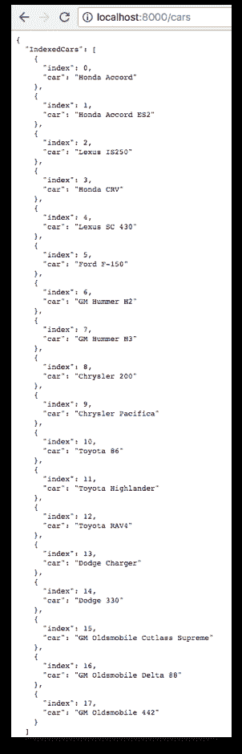

# 三、使用高阶函数

我们经常会遇到这样的问题，“只是好奇，将纯函数式编程概念应用到命令式语言（而不是让其他人难以阅读代码）有什么好处？”

在本章中，我们将使用高阶函数来解决这个常见的误解。

本章的目标是：

*   了解**函数式编程**（**FP**的特点）
*   理解泛型的用途
*   了解 FP 如何提高性能
*   懂咖喱吗
*   实现`Map`、`Filter`和`Reduce`功能
*   使用 Goroutines 和 Go 通道实现延迟评估

## FP 的特点

让我们从纯 FP 语言的需求开始。纯 FP 语言必须支持以下内容：

*   一类函数
*   **尾部呼叫优化**（**TCO**）
*   高阶函数
*   纯函数
*   不变数据

为了实现纯 FP，语言必须像对待任何其他变量类型一样对待函数。一种不变的语言怎么会有变化的变量？我们以 FP 方式实现这一点的方法是创建新变量，而不是修改现有变量。我们将在本章后面的`Map`函数中看到如何实现这一点。

Go 是一种多维语言，支持命令式、面向对象和 FP 样式。我们可以用 Go 编写一个纯命令式或函数式的程序。这是我们选择的编程风格决定的。这是Go和 FP 的一大优点。这不是一个全有或全无的问题。我们可以在有意义的时候和地点将代码迁移到 FP。

Go 需要**尾部呼叫优化**（**TCO**来处理生产性能要求。每次递归函数调用自身时，都会向堆栈帧添加一个新块；我们很快就感受到了这种疏漏的缓慢影响。我们将在实现`Reduce`功能时看到如何缓解此问题。

最后一个需求是对**高阶函数**（**HOF**的支持。高阶函数将函数作为参数和/或返回函数作为结果。HOFs 允许我们用更少的代码以可读的方式将函数链接在一起。

HOF 可以说是任何 FP 语言的焦点，在快速了解 FP 特征之后，我们将研究如何在 Go 中利用它们：

| **特性** | **支持Go吗？** | **说明** |
| **匿名函数** | 对 | 没有名字的函数。例如，此函数调用打印消息的匿名函数。

```go
func anonymousGreeting() func(string) {
   return func(name string) {
      fmt.Printf("Hey %s!n", name)
   } 
}
```

 |
| **关闭** | 对 | 闭包是一个关闭的内部函数，也就是说，可以访问其外部作用域中的变量。换句话说，闭包是一个函数的作用域，它通过对该函数的引用而保持活动状态。 |
| **成分** | 对 | 组合使我们能够组合简单的函数来构建更复杂的函数。Curry 和 Pipeline 是组合概念的示例实现。 |
| **延续** | 对 | Continuations 类似于带有参数的 GOTO 语句。延续是一个函数参数（`next`），我们传递给一个函数（`factorial`），该函数指定函数应该返回的位置。阶乘函数不定义返回值。它是一个接受 int 和另一个传递当前状态的函数。

```go
func factorial(x int, next func(int)) {
   if x == 0 {
      next(1)
   } else {
      factorial(x-1, func(y int) {
         next(x * y)
      })
   }
}
```

调用将继续，直到满足基本条件（`x == 0`），然后堆栈上所有部分执行的后续函数都将弹出并求值。我们可以这样称呼`factorial`：

```go
factorial(4, func(result int) {
   fmt.Println("result", result)
})
```

打印：**结果：24**使用 Monads 编程是一种**延续传递样式**（**CPS**）的形式，这给了我们更多的控制；使用词法工作流解决方案，在遇到错误时，我们可以将执行指向工作流的单个惯用 Go 错误处理程序的错误路径（绕过后续链接函数调用）。CPS 也可以使用 goroutine 和 channels 进行编程。 |
| **咖喱** | 对 | Currying 是一个函数，它接受 x 个参数并返回 x 个函数的组合，每个函数接受 1 个参数。在 FP 中，每个函数都是一个参数的函数。 |
| **声明性** | 对 | 声明式风格，与命令式风格相反，意味着我们编写表达式，而不是一步一步的指令。命令函数不用作数据；相反，它是用于它的副作用，即打印“Hello”。

```go
Info.Println("Hello")
```

 |
| **任一数据类型** | 对 | 或者是接受两个参数的类型构造函数。它允许我们说一个值是两种类型中的一种。例如，`Either Car Truck`。如果我们的结果类型为`Either Success Failure`，我们可以使用其中一个来创建错误处理系统。比数据类型稍微复杂一些。

```go
data Either a b = Left a &#124; Right b
```

 |
| **一级功能** | 对 | 第一类函数可以作为参数传递，也可以作为值返回。 |
| **功能性成分** | 对 | 函数组合意味着我们将单片应用程序分解为最小的计算单元。然后，我们可以以新的方式重新组合函数，通过链接函数调用来创建新的功能。 |
| **欣德利-米尔纳型系统** | 不 | HM 推断类型而不需要任何类型定义。HM 类型系统支持多态类型，其中列表可以包含不同类型的项。如果 Go 使用 HM，那么 b 的类型将被推断为下面的`float64`（而不是抛出运行时错误，*常量 1.8 被截断为整数*）

```go
a := 1
b := a + 1.8
```

 |
| **幂等性** | 对 | 幂等性意味着我们可以重复调用我们的函数，并且每次都会产生相同的结果。 |
| **不可变数据** | 对 | 不可变的不可变数据结构一旦创建，就不会更改。无法添加、删除或重新排序数据。为了进行*更新*，我们需要创建一个包含更改的副本。不变性是 FP 的核心租户，因为没有它，应用程序中的数据流就会变得有损且不一致。FP（如生活中）的真正常数是变化。突变隐藏着变化。更多原因请参见下面的*不可变数据*部分。 |
| **不可变变量** | 对 | Go 有 const 关键字，但它只适用于 int 和 string。为了拥有一个不可变的对象，我们可以这样编写它：

```go
type Car struct {
   const Make, Model string
}
```

或者只允许通过方法调用访问字段，方法调用可以进行编码以防止变异。 |
| **Lambda 表达式** | 对 | Lambda 表达式是一个匿名函数，通常用作数据、作为参数传递、作为数据返回并用于调用另一个函数。请注意，lambda 表达式在其外观的上下文中执行，也就是说，它们只能访问词法范围中的变量，并且只接受一个参数。关于什么是和什么不是 lambda 表达式检查的示例：`2-design-patterns/ch04-solid/01_lambda/main.go`**技巧 1**：如果我们可以调用一个函数而不使用它的返回值，那么它是不纯净的。**技巧 2**：如果我们需要传递多个参数，请使用部分应用的函数。**技巧 3**：当我们看到下面这样的代码时，我们很可能看到一个 Lambda 表达式：

```go
return f(func(x int) int {
   return r(r)(x)
})
```

 |
| **列表单子** | 对 | 列表单子用于模拟可返回任意数量结果的非确定性计算。列表单子可以返回零个或多个结果。return 函数在列表中插入一个值，如下所示：

```go
return a = [a]
```

bind 函数从列表中提取值，对其应用函数并生成如下新列表：

```go
[a] -> (a -> [b]) -> [b]
```

给定以下函数定义：

```go
f :: String -> [String]
f a = [a, prevChar a, nextChar a]
```

```go
g :: String -> [String]
g a = [lower a, upper a]
```

列表 monad 允许我们组成**f**和**g**如下：

```go
           g   &#124; w
      &#124; W ---> &#124;
      &#124;        &#124; W
      &#124; 
    f &#124;    g   &#124; x
X --> &#124; X ---> &#124;
      &#124;        &#124; X
      &#124; 
      &#124;    g   &#124; y
      &#124; Y ---> &#124;
               &#124; Y
```

f 看起来像这样：`f "X" --> ["W", "X", "Y"]`g 看起来像这样：
`map g (f "X") --> [["w", "W"], ["x", "X"], ["y", "Y"]]`当我们合成 f 和 g 时，我们得到`["w", "W","x", "X","y", "Y"]`使用组合运算符“.”我们可以按如下方式编写列表单子组合：`f >=> g = concat . map g . f` |
| **可能是数据类型** | 对 | 可能表示可能不会返回结果的计算，即可选值。a 可能是一个包含 a 类型值（表示为 a）的值，也可能是一个空值（表示为 Nothing）可能的以下定义：

```go
data Maybe a = Nothing &#124; Just a
```

说，`Maybe`a 不是不存在就是存在。如果不存在，则为`Nothing`；如果是，则只有 a，其中 a 是一个值。可能是一种多态类型，可以用来定义一个函数，该函数可以生成另一种类型的值，或者根本不生成任何值。

```go
f :: a -> Maybe b
```

 |
| **可能是单子** | 对 | Maybe Monad 是一种错误 Monad，其中所有错误都用`Nothing`表示。（这两种类型都提供了更多功能。）考虑到`Maybe`的多态性和结合性，我们可以说。

```go
f :: a -> Maybe b 
g :: b -> Maybe c 
h :: a -> Maybe c 
h = f >=> g 
```

**h**是**f**和**g**的单体成分。`Maybe`单子的定义如下：

```go
instance Monad Maybe where
   return x = Just x

   Nothing >>= f = Nothing
   Just x >>= f = f x
```

 |
| **一元错误处理** | 对 | `Maybe`帮助我们处理错误。它代表的是预期的结果，而不是意外的错误。这两种方法都类似于一个`Maybe`，它也允许我们返回一个任意值，而不是`Nothing.`，而不是担心从函数调用中接收 null，这可能会导致 null 指针异常，我们的类型系统将强制以类型安全的方式处理错误条件。使用其中一种作为返回类型，e 可以运行任务、获得结果、检查值：

```go
func runTask(success bool) maybe.Either {
```

即使任务失败，我们也会得到一个非零的结果。

```go
func (e either) Succeeded() StringOption {
   if e.err == nil {
      return SomeString(e.val)
   }
   return EmptyString()
}
```

详见`2-design-patterns/ch04-solid/02_maybe` |
| **无副作用** | 对 | *无副作用*表示调用纯函数时唯一发生的事情是：

*   我们传入参数
*   我们得到了一个结果；`Nothing`其他情况也会发生。

**提示 1:**如果我们的函数打印输出，那么它是不纯的。**提示 2:**如果调用我们的函数导致系统中任何其他地方的状态/数据发生变化，那么我们的函数是不纯净的。**技巧 3:**如果我们的函数没有返回值，那么它要么是不纯的，要么是完全无用的。 |
| **操作员超载** | 不 | 运算符重载，也称为*特殊多态性*，是多态性的一种特殊情况，其中不同的运算符（如+、=或==）被视为多态函数，因此根据其参数的类型具有不同的行为。 |
| **期权类型** | 对 | 我们可以在 Go 中创建选项 typeclass：

```go
fmt.Println("Has value:", option.SomeString("Hi"))
fmt.Println("Is empty :", option.Empty())
```

以下是输出：

```go
Has value: Hi
Is empty : <EMPTY>
```

 |
| **参数多态性** | 不 | 参数多态性是指**泛型**。这是一种数据类型通用编程风格，我们使用非特定数据类型编写函数。例如，我们可以实现处理非特定类型集合的通用算法。泛型提供了代码重用、类型安全和易于阅读的代码。有关简单示例，请参见下面的泛型部分。 |
| **部分功能应用** | 对 | 为函数提供的参数少于预期的参数称为部分函数应用程序。在这里，我们的函数接受具有多个参数的函数，并返回具有较少参数的函数。 |
| **纯函数** | 对 | 纯函数将输入映射到输出。当给定相同的输入时，纯函数将始终返回相同的输出（也称为*决定论*，并且不会产生任何可观察到的副作用。纯函数的确定性意味着我们的 FP 程序的正确性可以被正式证明，这对于任务关键型应用程序来说是一个巨大的好处。就像一个数学函数一样，我们函数的输出完全依赖于它的输入而不是其他。例如，下面函数的输出总是比传递给它的值（x）多返回两个值：

```go
func addTwo(x int) int {
   return x + 2
}
```

 |
| **模式匹配** | 不 | 模式匹配使编译器能够根据一些模式匹配一个值，以选择代码的一个分支。

```go
type ErrorMessage =
&#124; YourNameInvalid
&#124; YourPhoneInvalid
&#124; NoTicketsMustBeGreaterThan0
&#124; CreditCardNoInvalid
&#124; CreditCardExpDateInvalid
```

前面代码中我们的`ErrorMessage`的值将是五种不同错误选择之一（`YourNameInvalid`、`YourPhoneInvalid`等等）在 Go 中，我们可以在运行时使用 union 类型来实现这一点。 |
| **流水线** | 对 | 流水线允许我们将一个函数的输出作为输入传递给另一个函数。函数调用可以按顺序链接以实现工作流。流水线鼓励代码重用和并行执行。 |
| **递归** | 对 | FP 语言使用递归代替循环，在循环中函数调用自身直到达到结束条件。在 Go 中，每个递归调用都会创建一个调用堆栈。TCO 通过在递归中对函数本身进行最后一次调用来避免创建新堆栈。即使我们可以在没有 TCO 的情况下在 Go 中递归编码，但由于性能差，这并不实用。请注意，纯 FP 语言中的递归是由 HOFs 从视线中抽象出来的。 |
| **参考透明度** | 对 | 引用透明性是纯函数的一个属性，其中我们的函数总是为相同的输入返回相同的输出。我们的函数表达式 f（x）和计算函数的结果是可互换的。例如，1+1 始终等于 2。正如我们在[第 2 章](02.html)、*操作集合*中看到的，这意味着我们可以缓存第一次函数调用的结果并提高性能。

**提示：**如果我们可以缓存以前函数调用的结果，那么我们就具有引用完整性。 |
| **和或并类型** | 对 | 我们可以使用带有`Success()`和`Failure()`方法的接口实现一个 union 类型，该接口将返回成功或失败。有关详细信息，请参阅`2-design-patterns/ch04-solid/02_maybe`

```go
package maybe

type SuccessOrFailure interface {
   Success() bool
   Failure() bool
}
```

 |
| **尾部呼叫优化** | 不 | 尾部调用优化使递归函数调用更有效。当一个函数调用另一个函数作为其最后一个操作时，会发生尾部调用。TCO 就像一个 GOTO 语句。例如：

```go
 func f(x) {// some code;return g(x)}
```

当被调用函数 g（x）结束 b/c 时，程序不需要返回调用函数。在最后一行之后没有可执行代码。在尾部调用之后，程序不需要任何关于 g 的调用堆栈信息。如果没有 TCO，程序将为 g 创建不必要的调用堆栈；大量递归调用将导致堆栈溢出。有了 TCO，递归程序将更快，消耗更少的资源。 |
| **类型类别** | 对 | 类型类允许我们定义可以在不同类型上使用的函数，每个类型的实现可能不同。每个类表示一组类型，并与一组特定的成员函数相关联。例如，类型类 Eq 表示所有相等类型的集合，这正是可以使用（=）运算符的类型集合。 |
| **机组类型** | 对 | 单位类型正好有一个值。它也被称为身份。乘法的单位是 1，加法的单位是 0，字符串串联的单位是空字符串。定义为 int 类型元组的类型可以包含多少个值？极大的(-∞, …, 0, 1, 2... ∞)
定义为空元组的类型可以包含多少个值？单位类型的值是，您可以在我们可能返回 nil（或 null）的地方使用它。当我们不关心值是多少时，我们返回一个单位。我们不返回 nil，我们返回一个值；单位值。所有函数返回值；不再有空指针异常！单位类型在需要空值的地方也很有用。例如，在 F#中，可能产生副作用但不返回值的异步操作是 Async<unit>类型的实例</unit> |

这些并不是纯 FP 的全部特征，只是一些更重要的特征。可能最重要的一点是支持第一类函数。

上表介绍了许多概念，我们将在本书后面更详细地介绍这些概念。如果你的好奇心太大，可以跳过前面；否则，只要顺其自然，我们最终就会达到目的。

在*支持的Go中？上表*列：

*   **对！**：表示 Go 中存在 FP 特性。
*   **是**：表示在 Go 中通过一些努力可以实现该特性或要求。
*   **否**：表示该 FP 特征或要求缺失，如果不对 Go 编译器进行重大升级，或者不使用与 Go 相关的其他技术，则很难或不可能实现。

### 功能组合

函数组合是我们组合函数时发生的事情。一个函数的输出是下一个函数的输入。我们可以使用范畴论中的对象和态射来帮助我们正确地排序。以下图为例。。。


我们可以把函数 f 和 g 结合起来，从 A 到 B 到 C。注意顺序很重要。我们必须先通过 f 从 A 到 B，然后通过 g 从 B 到 C。

我们用以下符号（f.g）（x）表示。上面写着，*f-compose-g，输入 x*。该表达式等于 g（f（x）），其读数为 g 中 x 的*f。所以*（f.g）（x）=g（f（x））*。*

这是 Go 中的 compose 函数的外观：

```go
func Compose(f StrFunc, g StrFunc) StrFunc {
   return func(s string) string {
      return g(f(s))
   }
}
```

其中`StrFunc`定义为：

```go
type StrFunc func(string) string
```

在我们的`main.go`中，我们定义了我们的`f`和`g`功能，分别识别和强调：

```go
func main() {
   var recognize = func(name string) string {
         return fmt.Sprintf("Hey %s", name)
      }
   var emphasize = func(statement string) string {
      return fmt.Sprintf(strings.ToUpper(statement) + "!")
      }
```

我们组成`f`和`g`如下：

```go
var greetFoG = Compose(recognize, emphasize)
fmt.Println(greetFoG("Gopher"))
```

以下是输出：

```go
HEY GOPHER!
```

请注意，顺序很重要。如果我们翻转`f`和`g`的顺序，然后创作，会发生什么？

```go
var greetGoF = Compose(emphasize, recognize)
fmt.Println(greetGoF("Gopher"))
```

以下是输出：

```go
Hey GOPHER!
```

### 单子使我们能够连成链

链接延续意味着我们可以执行一系列函数，其中一个函数的输出就是下一个函数的输入。查看以下链接高阶函数的示例：

```go
cars := LoadCars()
for _, car := range cars.Filter(ByHasNumber()).
       Filter(ByForeign()).
       Map(Upgrade()).
       Reduce(JsonReducer(cars), Collection{}) {
       log.Println(car)
}
```

您将看到以下输出：

```go
{"car": {"make": "Honda", "model": " Accord ES2 LX"}}
{"car": {"make": "Lexus", "model": " IS250 LS"}}
{"car": {"make": "Lexus", "model": " SC 430 LS"}}
{"car": {"make": "Toyota", "model": " RAV4 EV"}}
```

如果我们要实现 for 循环、错误检查和其他脚手架（在典型的命令式编程风格中进行编码时通常需要），那么需要多少代码？

我们不是告诉 Go 如何过滤、映射和减少我们的集合，而是声明我们想要完成的任务。在本章后面，我们确实实现了`Filter`、`Map`和`Reduce`功能，但如果 Go 标准库已经为我们提供了这些功能，该怎么办？

我们如何期望 Go 为汽车提供 HOF 实施？那是不合理的，对吧？少了什么？答案是*泛型*。

本章中的 ChainLink 实现有点像穷人的 monad。在本书的最后一章中，我们将探索一个真正的单子，并发现其中涉及到更多的操作（绑定、返回、单子错误处理）。真正的单子也不依赖于全局变量。相似之处在于，它们都允许我们按顺序执行操作，其中一个函数的输出是下一个函数的输入。这是一个需要记住的关键概念。

### 仿制药

参数多态性意味着泛型。可以编写泛型函数或数据类型，以使用相同的逻辑处理任何数据值，而无需将值强制转换为特定的数据类型。这大大提高了代码重用。

下面是一个通用`IsEqual`实现的 C#代码示例。通用`IsEqual`函数将接受任何类型（实现`Equals`的类型）。我们在运行时通过简单地指示类型`T`来传递`IsEqual`整数和字符串，此时执行`IsEqual`：

```go
namespace Generics
{
   private static void Main() {
      if(Compute<int>.IsEqual(2, 2)) {
            Console.WriteLine("2 isEqualTo 2");
         }
      if(!Compute<String>.IsEqual("A", "B")) {
            Console.WriteLine("A is_NOT_EqualTo B");
         }
   }
    public class Compute<T> {
        public static bool IsEqual(T Val1, T Val2) {
            return Val1.Equals(Val2);
        }
    }
}
```

目前，要在 Go 中执行此操作，我们必须使用空接口并执行类型转换。正是类型转换会导致性能下降，这通常使这种泛型处理变得不切实际。

### 一类函数

第一类函数允许我们通过向基函数提供函数参数来生成新函数。在下面的代码中，我们的基本函数是`Filter`。通过将`ByMake("Toyota")`传递到`Filter`，我们从我们的收藏中删除了大部分汽车产品，只留下丰田：

```go
cars := Filter(ByMake("Toyota"))
```

通过使用`Map`函数包装，我们还能够将在单个元素上工作的任何函数转换为在列表上工作的函数。如果没有新的编程功能风格，我们可能会尝试实现一个`for`循环，并在每辆车上应用`fmt.Sprintf`转换，如下所示：

```go
// cars: Honda Accord, Honda Accord ES2, Lexus IS250, Honda CR-V, Lexus SC 430,...
for _, car := range cars {
       thisCar := fmt.Sprintf("%s %s", car, map[string]string{
              "Honda": "LX",
              "Lexus": "LS",
              "Toyota": "EV",
              "Ford": "XL",
              "GM": "X",
       }[GetMake(car)])
       // upgrade a car by appending "LX" ... to the end of the model name
       mappedCars = append(mappedCars, thisCar)
}
// mappedCars: Honda Accord LX, Honda Accord ES2 LX, Lexus IS250 LS...
```

相反，我们可以在编写数据转换时将`Upgrade`函数传递给`Map`：

```go
Filter(ByMake("Toyota")).Map(Upgrade())
```

我们不再需要编写处理数组的`for`循环，因为我们可以调用`Map`内联。

HOFs 可以大大减少开发复杂逻辑所需的时间。我们可以更快地将更小的、特定于任务的功能组合到复杂业务逻辑的解决方案中，只需更少的脚手架代码，这意味着我们需要修复的 bug 更少。我们的功能本质上是可重用的构建块。

HOF 是独立的，使它们易于在我们的代码库中重用、重构和重组。这使我们的程序更灵活，更能适应未来的代码更改。

更可读的代码，更快的实现，更少的 bug。FP 的好处正在累积！

### 关闭

闭包是在其外部范围内关闭变量的函数。我们真的需要一个例子来理解这句话！这里有一个很好的例子：

```go
func addTwo() func() int {
       sum := 0
 return func() int { // anonymous function
 sum += 2
 return sum
 }
}

func main() {
       twoMore := addTwo()
       fmt.Println(twoMore())
       fmt.Println(twoMore())
}
```

您将看到以下输出：

```go
2
4
```

前面的闭包由`addTwo`函数构成。在`addTwo`中，`sum`和匿名函数都在同一个词法范围内声明。由于`addTwo`同时关闭`sum`和匿名函数，并且由于 sum 是在匿名函数之前声明的，因此匿名函数始终可以访问并修改`sum`变量。一旦将`addTwo`分配给`twoMore`，只要应用程序继续运行，`addTwo`函数的匿名函数就可以访问`sum`变量并保持该变量。

#### 动态范围

如果我们在定义函数的外部作用域中意外初始化了`sum`，会怎么样？请注意，与我们的匿名函数在同一范围内没有 sum 变量初始化：

```go
func addTwoDynamic() func() int {
    return func() int { 
        sum += 2
 return sum
    }
}
```

当我们在`main()`函数中运行此函数时：

```go
twoMoreDynamic := addTwoDynamic()
fmt.Println(twoMoreDynamic())
fmt.Println(twoMoreDynamic())
```

我们的 Go 运行时在调用匿名函数的环境中查找，而不是在定义匿名函数的环境中查找（在词法范围中就是这样）。如果`addTwoDynamic`嵌套了几个堆栈帧，我们的 Go 运行时将查找`addTwoDynamic`为 sum 定义的位置。如果在那里找不到它，它将继续向上堆栈，直到找到和为止。因此，我们看到动态作用域增加了复杂性，并可能导致 sum 的值以不可预测的方式发生变化，或者至少以更难调试的方式发生变化。

以下是输出：

```go
7
9
```

怎么搞的？由于 sum 没有在定义匿名函数的作用域中定义，所以 Go 在全局作用域中找到它。它的值是 5。`addTwoDynamic`五加二得七。`addTwoDynamic`又做了一次，得到了 9 分。可能不是我们想要的。

能够传递词汇上下文是非常强大的，可以保证我们不会产生动态范围界定可能产生的副作用。我们将看一个实际的例子，在这个例子中，我们在应用程序启动时创建一个应用程序上下文，例如，数据库连接、记录器等，并在整个应用程序中根据需要传递该上下文。

### 纯函数

纯函数是一种函数，当给定相同的输入时，它将始终返回相同的输出，并且不会产生任何可观察到的副作用。这是什么好处？让我看看。我们可以并行运行任何纯函数，因为我们的函数不需要访问共享内存。由于副作用而产生的竞争条件在纯功能中是不可能的。在多核上并发运行代码的性能提高是 FP 的另一个令人敬畏的好处。

### 不可变数据

不变的数据结构：

*   只有一种状态，永不改变
*   更易于构造、调试、测试和推理
*   没有副作用吗
*   提高性能和可扩展性，因为它们更容易缓存
*   更安全的是，它们可以防止空指针引用
*   线程安全吗
*   它们总是处于稳定状态

由于不可变的数据结构永远不会更改，这意味着在数据修改操作期间不会发生故障。当不可变数据结构初始化时，它将失败或成功，返回一个永远不会更改的有效数据结构。

为了改变不可变的数据结构，我们必须创建一个新的树。假设我们要更新现有树数据结构（*上一个根）*中 g 的值。首先，我们将创建 g'节点并通过遍历连接到 g 的节点并仅复制重建树所需的值来构建新树。可以创建对其他节点的引用，而无需创建新节点（这些节点为白色）。新根就位后，新叶节点将添加到新树结构中。

创建新根目录后，可以保留上一个/旧根目录，也可以将其标记为删除。


这似乎是一项艰巨的工作，但最大的好处之一是我们不再需要担心数据的意外变化。例如，如果一个 Goroutine 在我们的数据结构中循环，而另一个 Goroutine 正在从中删除元素，该怎么办？我们不再需要关心如何处理种族条件和验证我们的先决条件是否仍然有效。当我们使用不变的数据结构时，我们的代码变得更健壮，更容易推理。

你能想到今天有什么解决方案可以利用不变的数据结构吗？

有没有想过 git 是如何工作的？

对全栈开发感兴趣吗？ReactJS 如何更新其模型？

在足球比赛中，我们可能会输给一支球队，因为他们有一名具有特殊技能的球员。当我们再次面对球队时，我们可能会忘记过去，但这不会改变历史；改变过去是不可能的。如果不保存过去，我们就无法从中吸取教训，历史就会重演。易变性隐藏了变化。

#### Go 的持久数据结构

退房[https://godoc.org/github.com/mndrix/ps](https://github.com/mndrix/ps)

根据其文档：

完全持久的数据结构。持久数据结构是一种数据结构，在修改时始终保留其自身的早期版本。此类数据结构实际上是不可变的，因为它们的操作不会更新现有的结构，而是始终生成新的结构。

持久数据结构通常在它们之间共享结构。这允许操作避免复制整个数据结构。

ps 具有用于操作数据列表和地图的小型但有效的 API：

```go
type List interface {
   Cons(val interface{}) List
   ForEach(f func(interface{}))
   Head() interface{}
   IsNil() bool
   Reverse() List
   Size() int
   Tail() List
}
func NewList() List
type Map interface {
   Delete(key string) Map
   ForEach(f func(key string, val interface{}))
   IsNil() bool
   Keys() []string
   Lookup(key string) (interface{}, bool)
   Set(key string, value interface{}) Map
   Size() int
   String() string
   UnsafeMutableSet(key string, value interface{}) Map
}
func NewMap() Map
```

更多详情请参见[https://godoc.org/github.com/mndrix/ps](https://godoc.org/github.com/mndrix/ps)

### 表达方式的使用

使用表达式（而不是语句）意味着在 FP 中，我们将一个值传递给一个函数，该函数通常以某种方式对其进行转换，然后返回一个新值。因为 FP 函数没有副作用，所以不返回值的 FP 函数是无用的，并且是代码气味的标志。在[第一章](01.html)、*Go*中的纯函数式编程中，我们看到命令式编程侧重于程序如何运行的逐步机制，而在声明式编程中，我们声明了我们想要的结果。

下面是命令式编程的一个示例：

```go
var found bool
car_to_look_for := "Blazer"
cars := []string{"Accord", "IS250", "Blazer" }

for _, car := range cars {
       if car == car_to_look_for {
              found = true;
       }
}
fmt.Printf("Found? %v", found)
```

下面是一个声明式编程的示例：

```go
fmt.Printf("Found? %v", cars.contains("Blazer"))
```

我们有更少的、更容易阅读的声明性 FP 代码。

## HOF 应用示例

让我们构建一个示例应用程序，它将演示应用函数式编程概念的好处。

我们的应用程序将读取以下`cars.csv`文件：

```go
"Honda Accord"
"Honda Accord ES2"
"Lexus IS250"
"Honda CR-V"
"Lexus SC 430"
"Ford F-150"
"Toyota Highlander"
"Toyota RAV4"
"GM Hummer H2"
"GM Hummer H3"
```

我们将应用高阶函数和各种函数编程结构对汽车列表进行过滤、映射、缩减，并将其转换为我们心中的内容。
我们的项目结构如下：

```go
$ tree
.
├── README.md
└── chapter4
 ├── 01_hof
 │ ├── cars.csv
 │ ├── cars.go
 │ ├── generator.go
 │ ├── more_cars.csv
 │ ├── restful.go
 │ ├── types.go
 │ └── utils.go
 └── main.go
```

在`chapter4`目录的根目录下是我们的`main.go`文件。因为我们计划从`main.go`构建一个 Go 可执行文件并运行它，所以我们使用了`main`包名并包含了一个`main()`函数。

其他文件将位于名为`01_hof`的子目录中，其中`hof`表示高阶函数。

### 第四章应用程序代码

让我们检查一下我们的`chapter4`实现，从`main.go`开始：

```go
package main

import (
       . "github.com/l3x/learn-fp-in-go/chapter4/01_hof"
 "log"
 "os"
 "github.com/julienschmidt/httprouter"
 "net/http"
)
```

`. "github.com/l3x/learn-fp-in-go/chapter4/01_hof"`导入中的点（`.`）使我们不必在该目录中的函数前面加上`hof`，这是该目录中所有 Go 文件使用的包名：

```go
func init() {
       log.SetFlags(0)
       log.SetOutput(os.Stdout)
}
```

我们将使用`log`包将输出记录到标准输出。将 0 值传递给`log.SetFlags`会告诉记录器打印，而无需预先设置时间戳。我们还告诉记录器打印到`stdout`，而不是默认的`stderr`，因为我们希望所有输出都能一致显示以便于阅读。对于生产应用程序，我们可能不会向`stdout`输出任何信息，因为除了命令帮助和使用信息之外，程序在`stdout`上没有任何有用的信息可以发送。

`log`功能可以轻松配置为预先设置时间戳和行号。`log.SetFlags(log.Lshortfile | log.Ldate)`设置将输出打印到`stdout`： `2017/04/07 utils.go:17: car: Honda Accord`。

#### 生成和运行时指令

验证 Go 环境是否正确配置后，我们可以将目录更改为项目目录，并使用以下命令启动 RESTful web 服务器：

```go
$ RUN_HTTP_SERVER=TRUE ./chapter4
```

有关我如何管理我的 Go 环境的详细信息，请参见[附录](03.html)、*杂项信息和 How Tos*中的*我的 Go 构建和运行过程*部分。

我们需要打开另一个终端窗口来运行`chapter4`可执行文件。让我们构建并运行`chapter4`应用程序，使用以下命令来练习我们的 HOFs：

```go
$ go build && ./chapter4
```

输出的前几行应该如下所示：

```go
ByMake - Honda
-----------------------
car: Honda Accord
car: Honda Accord ES2
. . .
```

#### 更多应用程序代码

我们在`main()`函数中要做的第一件事是检查`RUN_HTTP_SERVER`环境变量。如果设置为`true`，则程序将设置两条路由。第一条路线`/cars`返回索引页面，该页面显示从`.csv`文件加载的所有车辆。第二条路径`/cars/:id`检索单个 car 对象并返回其 JSON 表示：

```go
func main() {
       if os.Getenv("RUN_HTTP_SERVER") == "TRUE" {
              router := httprouter.New()
              router.GET("/cars", CarsIndexHandler)
              router.GET("/cars/:id", CarHandler)
              log.Println("Listening on port 8000")
              log.Fatal(http.ListenAndServe(":8000", router))
```

`IndexedCars`变量在`types.go`中定义如下：

```go
IndexedCar struct {
       Index int `json:"index"`
 Car   string` json:"car"`
}
```

在查看另一个逻辑之前，让我们看一下下面的 Ty0t0 文件。我们声明一个导出的包级别变量`CarsDB`，该变量被分配了一个`IndexedCars`切片：

```go
package hof

import (
       "fmt"
 s "strings"
 "regexp"
 "log"
 "encoding/json"
)

var CarsDB = initCarsDB()

func initCarsDB() []IndexedCar {
       var indexedCars []IndexedCar
       for i, car := range LoadCars() {
              indexedCars = append(indexedCars, IndexedCar{i, car})
       }
       lenCars := len(indexedCars)
       for i, car := range LoadMoreCars() {
              indexedCars = append(indexedCars, IndexedCar{i + lenCars, car})
       }
       return indexedCars
}

func LoadCars() Collection {
       return CsvToStruct("cars.csv")
}
```

请注意，`01_hof`目录中的每个 Go 源文件都使用包名`hof`。

我们在`strings`包前面加了`s`，这样我们就可以很容易地用`s`引用字符串实用程序函数，比如：`s.Contains(car, make)`而不是`strings.Contains(car, make)`。

由于`var CarsDB = initCarsDB()`是在包级别定义的，因此在启动`chapter4`可执行文件时将对其进行评估。`initCarsDB()`函数只需要在这个`cars.go`文件中引用，所以我们不需要大写它的第一个字符。

另一方面，`LoadCars()`函数被主包引用，因此我们需要将其第一个字符大写，以使其可访问。

现在，让我们把注意力转向 else 块中的 FP goodies。

#### 过滤函数

我们利用的第一个 HOF 是`Filter`函数：

```go
} else {
       cars := LoadCars()

       PrintCars("ByMake - Honda", cars.Filter(ByMake("Honda")))
```

您将看到以下输出：

```go
ByMake - Honda
-----------------------
car: Honda Accord
car: Honda Accord ES2
car: Honda CR-V
```

`Filter`函数在`cars.go`文件中。观察`fn`论点。它被传递到`Filter`函数中，然后用`car`参数调用。如果`fn(car)`——即`ByMake("Honda")`——返回`true`，则该车被添加到集合中：

```go
func (cars Collection) Filter(fn FilterFunc) Collection {
       filteredCars := make(Collection, 0)
       for _, car := range cars {
              if fn(car) {
                     filteredCars = append(filteredCars, car)
              }
       }
       return filteredCars
}
```

当我们在`cars collection`类型上定义`Filter`函数时，它被称为方法。Go 方法是具有特殊接收器参数的函数。在我们的`Filter`函数中，`cars`集合是接收器。请注意，`cars`位于第一组参数中，`func`关键字和`Filter`名称之间。注意，`cars`是一个具有`Filter`行为的数据结构。`Filter`方法接受`FilterFun`作为其参数，并返回一个过滤后的集合。

##### 现实检查

什么一个`for`循环？变异的`car`变量？有什么好处？我们必须面对事实。Go 编译器不提供 TCO，因此递归实现根本不实用。也许 Go 2.0 将提供一个纯函数库，其中包含我们最喜欢的 HOF 以及泛型。在此之前，我们将尽可能多地使用函数式编程风格，必要时进行一些命令式编程。我们稍后将探讨的另一个选项是名为**Gleam**的执行系统，它提供了纯 Go 映射器和还原器，提供了高性能和并发性。

数据转换非常常见，因此最好有一个简写。HOF 能够简化执行数据转换的代码的编写和读取，这是 FP 最大的优势之一。

#### 过滤网

在`types.go`文件中，我们看到它的定义：

```go
FilterFunc func(string) bool
```

回顾`main.go`中的行，我们看到我们使用了`ByMake`过滤功能：

```go
PrintCars("ByMake - Honda", cars.Filter(ByMake("Honda")))
```

`ByMake`函数在`cars.go`文件中定义：

```go
func ByMake(make string) FilterFunc {
       return func(car string) bool {
 return s.Contains(car, make)
 }
}
```

`ByMake`函数是 HOF，因为它返回一个函数。回想一下，`Filter`是一个 HOF，因为它接受一个函数。在本例中，`ByMake`就是那个函数，`fn`，我们将在下一节中看到。

##### 过滤函数

`Filter`函数是一个 HOF，它接受另一个 HOF，即`ByMake`，并执行数据转换。

```go
func (cars Collection) Filter(fn FilterFunc) Collection {
   filteredCars := make(Collection, 0)
   for _, car := range cars {
      if fn(car) {
         filteredCars = append(filteredCars, car)
      }
   }
   return filteredCars
}
```

### 宁静资源

让我们打开`http://localhost:8000/cars`查看`cars.csv`和`more_cars.csv`的完整车辆列表：



让我们看看下一个函数在函数中的作用：

```go
PrintCars("Numeric", cars.Filter(ByHasNumber()))
```

您将看到以下输出：

```go
Numeric
-----------------------
car: Honda Accord ES2
car: Lexus IS250
car: Lexus SC 430
car: Ford F-150
car: Toyota 86
car: Toyota RAV4
car: GM Hummer H2
car: GM Hummer H3
```

本例中使用的`FilterFunc`方法为`ByHasNumber()`。其操作方式类似于`ByMake FilterFunc`，如果车内有编号，则使用 Go 的 regexp`MatchString`功能返回`true`：

```go
func ByHasNumber() FilterFunc {
       return func(car string) bool {
 match, _ := regexp.MatchString(".+[0-9].*", car)
 return match
 }
}
```

#### 链接函数

现在我们已经掌握了窍门，让我们把几个过滤器连在一起：

```go
PrintCars("Foreign, Numeric, Toyota",
       cars.Filter(ByForeign()).
              Filter(ByHasNumber()).
              Filter(ByMake("Toyota")))
```

您将看到以下输出：

```go
Foreign, Numeric, Toyota
-----------------------
car: Toyota 86
car: Toyota RAV4
```

#### 更多的汽车

是时候增加更多的汽车了：

```go
moreCars := LoadMoreCars()

PrintCars("More Cars, Domestic, Numeric, GM",
       cars.AddCars(moreCars).
              Filter(ByDomestic()).
              Filter(ByHasNumber()).
              Filter(ByMake("GM")))
```

其结果如下：

```go
More Cars, Domestic, Numeric, GM
-----------------------
car: GM Hummer H2
car: GM Hummer H3
car: GM Oldsmobile Delta 88
car: GM Oldsmobile 442
```

等等，什么？`AddCars`？那是怎么回事？`AddCars`既不接受函数也不返回函数。更糟糕的是，它变异了`cars`集合。

##### 现实检查

汽车系列保持*纯*并不重要；坦率地说，这是不可行的，因为 Go 编译器目前不提供 TCO。重要的是，我们的代码使用函数式编程技术进行了改进。诚然，这一个，`AddCars`是我们拥有的最远的纯函数，但它很有用，它确实提高了我们程序的可读性。当我们使用非纯函数时，尤其是那些改变其状态的函数时，我们确实需要小心，但是这种用法对于我们的目的来说是完全合适的。

我们在`cars.go`中发现`AddCars`：

```go
func (cars Collection) AddCars(carsToAdd Collection) Collection {
       return append(cars, carsToAdd...)
}
```

#### Map 函数

回到`main.go`。这一次，你将被介绍给`Map`霍夫。鉴于`Filter`会减少结果集合中的项目数量，`Map`将返回与接收到的项目数量相同的项目。`Map`函数将集合转换为一个新集合，其中每个项目都以某种方式更改：

```go
PrintCars("Numeric, Foreign, Map Upgraded",
       cars.Filter(ByHasNumber()).
              Filter(ByForeign()).
              Map(Upgrade()))
```

下面是这个的输出：

```go
Numeric, Foreign, Map Upgraded
-----------------------
car: Honda Accord ES2 LX
car: Lexus IS250 LS
car: Lexus SC 430 LS
car: Toyota 86 EV
car: Toyota RAV4 EV
```

我们将名为`Upgrade`的`MapFunc`函数传递给`Map`：

```go
func Upgrade() MapFunc {
       return func(car string) string {
 return fmt.Sprintf("%s %s", car, UpgradeLabel(car))
 }
}
```

`Upgrade`调用`UpgradeLabel`函数，将相应的升级标签附加到车型名称的末尾：

```go
func UpgradeLabel(car string) string {
       return map[string]string{
 "Honda": "LX",
 "Lexus": "LS",
 "Toyota": "EV",
 "Ford": "XL",
 "GM": "X",
 }[GetMake(car)]
}
```

##### 改进了 Map 函数的性能

FP 的最大好处之一是性能。

今天的程序在很大程度上通过使用多个 CPU 核一次执行多个操作来实现更好的性能。

这意味着并行运行代码，要做到这一点，我们的代码必须是线程安全的。具有共享可变状态的程序不是线程安全的。这些程序将被限制在一个核心中。

FP 通过返回变量的新实例而不是更改原始实例来解决这个瓶颈/线程安全问题。


让我们看看`Map`函数，看看如何使用 FP 实现这一点：

```go
func (cars Collection) Map(fn MapFunc) Collection {
       mappedCars := make(Collection, 0, len(cars))
       for _, car := range cars {
              mappedCars = append(mappedCars, fn(car))
       }
       return mappedCars
}
```

`Map`没有附加到 cars 集合，而是接收一个新变量`mappedCars`。`mappedCars`系列是变异的，而不是原来的 cars 系列。

从战术上讲，当我们调用`Map(Upgrade())`时，我们所做的是将数据更改的时刻推到最后一刻——在本例中，在填充`mappedCars`之后。

在整个职业生涯中，我们一直围绕 FP 概念进行规划。我们在本章中所做的部分工作是识别这些 FP 模式，并了解我们应该如何以及为什么利用它们。

#### Reduce 函数

接下来，我们来看一下`Reduce`函数。`Reduce`是霍夫斯的瑞士军刀。有了`Reduce`功能，我们可以用`Filter`或`Map`做任何事情。

`Reduce`函数，也称为`fold`、`accumulate`、`aggregate`、`compress`或`inject`获取种子值并将 reducer 函数的逻辑应用于种子，并可能多次调用自身以获得结果。通常，reduce 函数将组合数据元素以返回单个聚合值，因此术语为`fold`。因此，我们将所有数据折叠成一个结果。

回到`main.go`，我们应用`ByMake`过滤器过滤掉所有非本田产品的汽车。然后，我们调用`Reduce`函数将本田汽车的集合转换为 JSON 字符串的集合：

```go
PrintCars("Filter Honda, Reduce JSON",
       cars.Filter(ByMake("Honda")).
              Reduce(JsonReducer(cars), Collection{}))
```

其结果如下：

```go
Filter Honda, Reduce JSON
-----------------------
car: {"car": {"make": "Honda", "model": " Accord"}}
car: {"car": {"make": "Honda", "model": " Accord ES2"}}
car: {"car": {"make": "Honda", "model": " CR-V"}}
```

`Reduce`函数是接受`Reducer`函数的 cars 收集方法。再次，我们看到一个`for`循环和回调，*没有 TCO，没有递归*。没关系。所以，我们的`Reduce`功能的内脏不是*纯*。没关系。它仍然可读、性能好、安全；本着Go编程的精神，它完成了任务：

```go
func (cars Collection) Reduce(fn ReducerFunc, accumulator Collection) Collection {
       var result = accumulator
       for _, car := range cars {
              result = append(fn(car, result))
       }
       return result
}
```

第二个参数`Collection{}`是累加器，它是分配给结果的初始值。`Reducer`函数从累加器值开始，对集合中的每个项执行转换，并返回结果。此`Reduce`功能提供了执行减速的框架，但正是减速器功能（`fn`完成了重载。请注意，我们可以将任何有效的 reducer 函数（`fn`）传递到`Reduce`框架中，以获得截然不同的结果。

我们的`JsonReducer`函数完成了将 cars 集合中的每个项目转换为 JSON 字符串的实际工作：

```go
func JsonReducer(cars Collection) ReducerFunc  {
       return func(car string, cars Collection) Collection {
 carJson := fmt.Sprintf("{"car": {"make": "%s", "model": "%s"}}", GetMake(car), GetModel(car))
 cars = append(cars, carJson)
 return cars
 }
}
```

Reduce 是一个接受函数的 HOF 函数。`JsonReducer`是返回函数的 HOF 函数。

#### 更多高阶函数

现在，让我们回到`main.go`来看看更多的霍夫在行动。

我们使用我们的`ByMake`过滤器和新型减速器。此减速机`Reducer2`将返回一个`CarTypes`切片，而不是 JSON：

```go
PrintCars2("Reduce - Lexus",
       cars.Filter(ByMake("Lexus")).
              Reduce2(CarTypeReducer(cars), []CarType{}))
```

下面是这个的输出：

```go
Reduce - Lexus
-----------------------
car: {Lexus IS250}
car: {Lexus SC 430}
```

以下是另一个示例，显示了链接（也称为函数组合）的简单程度：

```go
PrintCars("ByModel - Accord up/downgraded",
       cars.Filter(ByModel("Accord")).
              Map(Upgrade()).
              Map(Downgrade()))
```

下面是这个的输出：

```go
ByModel - Accord up/downgraded
-----------------------
car: Honda Accord 
car: Honda Accord ES2
```

我们看到了`Upgrade`映射函数如何在汽车模型的末尾添加适当的标签。通过在`Upgrade`之后应用`Downgrade`，我们有效地撤销了`Upgrade`。

#### 发电机

是时候检查发电机了。生成器非常有用，因为它们允许我们延迟表达式计算。我们只在需要时计算所需的表达式。生成器还可以节省内存，因为使用生成器，我们只创建和使用所需的内容，不再需要：

```go
PrintCars("GenerateCars(1, 3)",
       cars.GenerateCars(1, 3))
```

我们将在`generate.go`文件中找到`GenerateCars`的实现：

```go
package hof

import (
       "sync"
 "log"
)

func carGenerator(iterator func(int) int, lower int, upper int) func() (int, bool) {
       return func() (int, bool) {
              lower = iterator(lower)
              return lower, lower > upper
       }
}

func iterator(i int) int {
       i += 1
 return i
}
```

我们定义我们的进口。`sync`导入提示我们需要同步 goroutine。`iterator`函数将传递给`carGenerator`函数，并跟踪我们生成的汽车数量。我们将根据需要生产汽车。

#### RESTful 服务器

如果我们的 RESTful 服务器在端口`8000`上运行，我们可以打开 web 浏览器到`http://localhost:8000/cars/1`并看到以下内容：

```go
{
  "index": 1,
  "car": "Honda Accord ES2"
}
```

这是一个`IndexedCar`结构的表示。它有一个索引和一个汽车品牌和模型字符串。

以下是`types.go`中的实际`IndexedCar`结构：

```go
IndexedCar struct {
       Index int `json:"index"`
 Car   string` json:"car"`
}
```

#### GenerateCars 函数

以下是实际的发电机功能：

```go
func (cars Collection) GenerateCars(start, limit int) Collection {
       carChannel := make(chan *IndexedCar)
```

`GenerateCars`是`cars`集合中的另一种方法，可以轻松地与其他 HOF 组合数据转换。`GenerateCars`采用启动指数和限制，即我们想要返回的车辆数量。我们创建指向`IndexedCars`的`carChannel`指针：

```go
var waitGroup sync.WaitGroup
```

我们使用`sync.WaitGroup`作为计数信号，等待我们的 goroutine 集合完成：

```go
numCarsToGenerate := start + limit - 1
generatedCars := Collection{}
waitGroup.Add(numCarsToGenerate)
```

我们计算想要生成的汽车数量，并将该数量传递给`waitGroup.Add`函数：

```go
next := carGenerator(iterator, start -1, numCarsToGenerate)
```

我们的`carGenerator`函数返回一个我们分配给名为`next`的变量的函数：

```go
carIndex, done := next()
```

`next`变量返回两个变量：`carIndex`和`done`。只要有更多的汽车生产，`done`将是`false`。因此，我们可以使用`done`来控制`for`循环，该循环启动一个 Goroutine，每辆车生成一个 Goroutine：

```go
for !done {
       go func(carIndex int) {
              thisCar, err := GetThisCar(carIndex)
              if err != nil {
                     panic(err)
              }
              carChannel <- thisCar
              generatedCars = append(generatedCars, thisCar.Car)
              waitGroup.Done()
       }(carIndex)

       carIndex, done = next()
}
```

`next`变量返回代码块中的两个变量`GetThisCar(carIndex)`；紧接着，前面的代码调用 RESTful 汽车服务，返回请求的汽车。

如果遇到错误，我们使用内置函数`panic`停止当前 Goroutine 的执行。由于我们在调用堆栈中使用了一个延迟函数，即`csvfile.Close()`，因此如果出现死机，它将被执行。请注意，我们可以使用内置的恢复功能对终止序列进行更多的控制。

将`thisCar`变量发送到`carChannel`，并将`Car`字段追加到`generatedCars`集合中。

##### 咖喱餐

注意到`generatedCars`系列有什么特别之处吗？（提示：我们的 Goroutine 是一个匿名函数）。

这是正确的。我们正在制作`generatedCars`系列。我们的 Goroutine 覆盖了`generatedCars`系列。这使我们能够从 Goroutine 中引用并附加到它，而不管它运行在哪个内核中。

我们站在巨人的肩膀上。我们使用 Go 通道和 Goroutines 来模拟 FP 生成器和其他 HOF。我们的代码是可读的，并且不需要太多的代码就可以全部工作。

##### 近距离观察咖喱

在继续之前，让我们看看下面的咖喱与非咖喱代码示例，以提高我们对咖喱的理解：

```go
package main

import "fmt"

// numberIs numberIs a simple function taking an integer and returning boolean
type numberIs func(int) bool

func lessThanTwo(i int) bool { return i < 2 }

// No curried parameters
func lessThan(x int, y int) (bool) {
   return x < y
}

func main() {
   fmt.Println("NonCurried - lessThan(1,2):", lessThan(1, 2))
   fmt.Println("Curried - LessThanTwo(1):", lessThanTwo(1))
}
```

您会立即看到，curried 示例只需要一个参数，而非 curried 示例需要两个参数。Curry 的思想是通过部分应用更小、更通用的函数来创建新的、更具体的函数。我们将在[第 8 章](07.html)、*功能参数*中了解更多信息。

另一个优点是使用函数类型。`numberIs`是一种数据类型，它是一个接受 int 并返回 bool 的函数。这是正确的。在 FP 中，我们并不害怕函数。我们将它们视为常规的旧数据类型。在 FP 中，一切都是数据，数据永远不会改变。它只会被传递、创建和返回。

角度*x*的值等于*A*相邻侧的长度除以*H*y 电位（[的长度 http://www.mathopenref.com/cosine.html](http://www.mathopenref.com/cosine.html) ：

*cos x=A/H*


在命令式编程中，我们被引导相信函数和数据是不同的东西。在 FP 中，我们看到函数没有副作用。一个很好的 FP 示例是几何余弦函数。对于直角三角形，如果我们对（*a*）相邻边通过 15，对（*H*）y 电势通过 30，那么我们得到角 a 的余弦为 0.5。因为我们可以依赖这个事实——每次通过 15 和 30，得到 0.5——即使我们的命令式编程帽打开，我们知道我们可以将这些值放入查找表中。设想一个电子表格，其中行号表示 a，列表示 H。第 15 行第 30 列的单元格的值为 0.5。

看，函数就是数据！然而，我们并不总是希望在每个用例中存储每个可能参数组合的每个计算值，只要这样做是有意义的。

想象一下系统的性能，其中每个函数调用都是表查找。现在想象一下我们的重用潜力，其中应用程序的评估部分是通用的。如果你的头脑仍然完好无损，等到[第 9 章](11.html)、*应用*的范畴论，我们将讨论范畴论和类型类的应用。

##### 扩展我们的 currying 示例

但是等等，还有更多！让我们在`func main()`上方添加以下内容：

```go
func (f numberIs) apply(s ...int) (ret []bool) {
   for _, i := range s {
      ret = append(ret, f(i))
   }
   return ret
}
```

`apply`函数是绑定到函数类型的方法，即`numberIs`。我们的 apply 函数将`numberIs`函数应用于每个参数。每个计算出的值都附加到新创建的布尔数组中，然后返回给调用者。

接下来我们更新`main()`如下：

```go
func main() {
   fmt.Println("NonCurried - lessThan(1,2):", lessThan(1,2))
   fmt.Println("Curried - LessThanTwo(1):", lessThanTwo(1))
   // use anonymous function
 isLessThanOne := numberIs(func(i int) bool { return i < 1 }).apply 
 isLessThanTwo := numberIs(lessThanTwo).apply // use named function
 s := []int{0, 1, 2}
   fmt.Println("Curried, given:", s, "...")
   fmt.Println("isLessThanOne:", isLessThanOne(s...))
   fmt.Println("isLessThanTwo:", isLessThanTwo(s...))
}
```

下面是这个的输出：

```go
NonCurried - lessThan(1,2): true
Curried - LessThanTwo(1): true
Curried, given: [0 1 2]...
isLessThanOne: [true false false]
isLessThanTwo: [true true false]
```

在纯 FP 中，每个函数都是一个参数的函数。我们可以在Go中使用咖喱来实现这一点。

现在，回到汽车。

##### 使用 WaitGroup 变量管理并发性

将`thisCar`追加到`generatedCars`集合后，执行`waitGroup.Done()`。这将递减`WaitGroup`变量的计数。此计数对应于我们分配给较低变量的迭代器值，并应用于分配给 done`return`变量的`lower > upper`表达式：

```go
func carGenerator(iterator func(int) int, lower int, upper int) func() (int, bool) {
       return func() (int, bool) {
 lower = iterator(lower)
 return lower, lower > upper
 }
}
```

我们使用迭代器来了解要启动多少 goroutine：

```go
func iterator(i int) int {
       i += 1
 return i
}
```

##### 完成 GenerateCars 功能

在`GenerateCars`函数的末尾，我们执行另一个匿名 Goroutine。此 Goroutine 的目的是等待所有以前启动的 Goroutine 生成器完成。我们使用`waitGroup.Wait`来了解最后一台发电机是何时完工的。然后，可以安全地关闭`carChannel`：

```go
        go func() {
              waitGroup.Wait()
              println("close channel")
              close(carChannel)
       }()

 for thisCar := range carChannel {
              generatedCars = append(generatedCars, thisCar.Car)
       }
       return generatedCars
}
```

`carChannel`将一直阻塞，直到收到新车；这是调用`GetThisCar(carIndex)`的结果。回想一下`WaitGroup.Add(numCarsToGenerate)`告诉`WaitGroup`我们要处理多少辆车。`waitGroup.Done()`函数将该数字计数为 0，此时`waitGroup.Wait()`被执行，而`carChannel`被关闭。

我们等待所有 goroutine 从 RESTful HTTP 服务器获取数据，然后返回`generatedCars`集合。这是 FP 中的一种常见模式：我们在数据转换操作中尽可能多地消除状态更改。我们等待所有数据收集处理完成，然后最终返回最终结果。

我们的 FP 工作很像电工。电工们关掉电源，把大楼里所有的电线都接上，当一切就绪后，他们打开电源开关，所有的灯都亮了。数据就是力量。不要让你的数据飞到最后一刻。

在`main.go`文件中，添加以下代码：

```go
PrintCars("GenerateCars(1, 3)",
       cars.GenerateCars(1, 3))
```

以下是其输出：

```go
GenerateCars(1, 3)
-----------------------
car: Honda CR-V
car: Honda Accord ES2
car: Lexus IS250
```

#### 处理并发性

我们通过计算我们已经启动了多少个`GetThisCar`Goroutines 来管理我们的`GetThisCar`Goroutines，并且我们利用`WaitGroup`变量来减少它们完成时的计数。虽然我们的`GetThisCar`goroutine 确实是并行执行的，但重要的是我们处理它们并发性的方式。使用下一个迭代器和`waitGroup`变量，我们能够简单有效地处理它们的生命周期：从每个 Goroutine 开始，接收它们的结果，并在计数器指示所有 Goroutine 完成时关闭`carChannel`。曾经尝试使用 java 或 C++管理多线程操作吗？请注意，我们如何不必处理管理互斥体和难以调试的竞争条件？并发实现的易用性是 Go 的许多优点之一。

**Concurrency**: A property of systems in which several processes are executing at the same time and potentially interacting with each other. Concurrency is about dealing with lots of things at once.

**Parallelism**: This is a type of computation in which many calculations are carried out simultaneously, operating on the principle that large problems can often be divided into smaller ones, which are then solved in parallel. Parallelism is about doing lots of things at once.

See Rob Pike's epic video, *Concurrency Is Not Parallelism*, at [https://www.youtube.com/watch?v=cN_DpYBzKso](https://www.youtube.com/watch?v=cN_DpYBzKso).

#### 霍夫的最后一个例子

我们的最后一个 HOF 示例是 doozy。我们生成 14 个 CAR，过滤`ByDomestic`，用`Upgrade`函数映射，用`ByHasNumber`过滤，并将其简化为 JSON 字符串集合：

```go
PrintCars("GenerateCars(1, 14), Domestic, Numeric, JSON",
       cars.GenerateCars(1, 14).
              Filter(ByDomestic()).
              Map(Upgrade()).
              Filter(ByHasNumber()).
              Reduce(JsonReducer(cars), Collection{}))
```

其结果如下：

```go
GenerateCars(1, 14), Domestic, Numeric, JSON
-----------------------
car: {"car": {"make": "Ford", "model": " F-150 XL"}}
car: {"car": {"make": "GM", "model": " Hummer H2 X"}}
car: {"car": {"make": "GM", "model": " Hummer H3 X"}}
```

这是六行代码。您认为使用命令式编码风格需要多少行代码？

“这个项目已经太臃肿了，再臃肿一点也不会有什么坏处。”不，最终会的。那就太晚了。”

-罗布派克

“问题是，添加更多的膨胀通常比正确集成容易得多，这需要思考、时间和艰难的决定。”

-罗杰·佩佩

## 总结

FP 是一种声明式编程风格。与我们的命令式或面向对象的实现选项相比，它更具可读性，并且通常需要更少的代码。

在本章中，我们实现了`Map`、`Filter`和`Reduce`高阶函数。我们研究了闭包，并研究了 curry 如何实现函数组合。

我们的`Reduce`实现演示了如何使用 Goroutines 和 Go 通道执行惰性评估。我们使用`WaitGroup`变量和一些常识来管理它的并发性。

在下一章中，我们将考虑 API 软件设计。我们将研究如何使用接口和闭包构建可组合系统，以强制执行单一责任原则和打开/关闭原则。