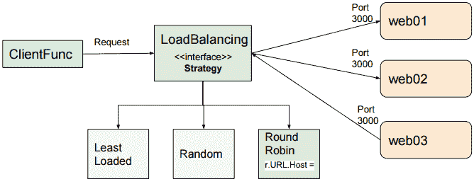
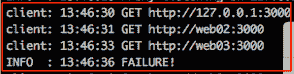
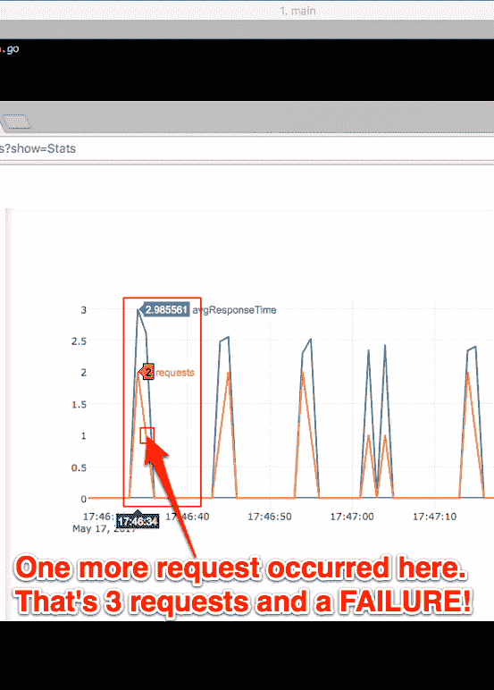

# 六、日志装饰器

`Logging`装饰器从 Go 的标准库中的`Logger`包中获取一个指向日志的指针。请注意，我们可以通过自定义`InfoHandler`，因为我们选择使用`io.Writer`接口实现它：

```go
Logging(log.New(InfoHandler, "client: ", log.Ltime)),
func Logging(l *log.Logger) Decorator {
       return func(c Client) Client {
 return ClientFunc(func(r *http.Request) (*http.Response, error ) {
 l.Printf("%s %s", r.Method, r.URL)
 return c.Do(r)
 })
 }
}
```

我们在运行客户机的`Do`方法之前执行`Printf`命令。

#### 负载平衡装饰器

我们利用策略模式来实现负载平衡装饰器。

`LoadBalancing`装饰器应用策略模式来应用逻辑，确定哪个后端服务器将接收下一个传入的客户端请求。

##### 战略模式

策略模式使用组合而不是继承来选择执行哪种行为。我们示例中的行为实现了一个负载平衡算法。策略模式的生产实现通常有一个管理应用程序，用于选择在运行时选择的策略：


我们不使用来自管理应用程序的请求或配置指令的上下文来选择负载平衡策略，而是将示例硬编码为使用`RoundRobin`行为。

这是电话：

```go
LoadBalancing(RoundRobin(0, "web01:3000", "web02:3000", "web03:3000")),
```

第一个参数`RoundRobin`是所选策略。我们传递`RoundRobin`函数，我们传递迭代`RoundRobin`函数，以便通过后端服务器的主机地址。它们通过可变参数传递，即后端。

我们没有使用请求收集上下文来确定要采用的策略，而是定义一个接受请求的`Director`函数类型。我们选择`RoundRobin`策略并修改请求的嵌入式 URL 成员，以指定要连接到的服务器：



以下是我们进行`r.URL.Host`赋值的`RoundRobin`函数：

```go
func RoundRobin(robin int64, backends ...string) Director {
       return func(r *http.Request) {
 if len(backends) > 0 {
 r.URL.Host = backends[atomic.AddInt64(&robin, 1) % int64(len(backends))]
 }
 }
}
```

或者，如果我们定义了其他负载平衡策略，例如**负载最少的**或**随机的**，我们只需要实现该函数并将其传递给`LoadBalancing`函数作为其主管。

`LoadBalancing`函数返回一个 decorator，该 decorator 基于给定的控制器，将客户端请求分布到多个后端服务器上，在我们的示例中为`RoundRobin`：

```go
func LoadBalancing(dir Director) Decorator {
       return func(c Client) Client {
 return ClientFunc(func(r *http.Request)(*http.Response, error) {
 dir(r)
 return c.Do(r)
 })
 }
}
```

`Director`修改每个 HTTP 请求以遵循选择的负载平衡策略：

```go
type Director func(*http.Request)
```

最后，我们有一个`FaultTolerance`装饰器，它根据给定的尝试和退避持续时间，扩展具有容错能力的客户端：

```go
func FaultTolerance(attempts int, backoff time.Duration) Decorator {
       return func(c Client) Client {
 return ClientFunc(func(r *http.Request) (*http.Response, error) {
 var res *http.Response
 var err error
 for i := 0; i <= attempts; i++ {
 if res, err = c.Do(r); err == nil {
 Info.Println("SUCCESS!")
 break
 }
 Debug.Println("backing off...")
 time.Sleep(backoff * time.Duration(i))
 }
 if err != nil { Info.Println("FAILURE!") }
 return res, err
 })
 }
}
```

我们只想将`backing off`信息输出到跟踪文件，所以我们使用`Debug.Println`函数。

注意到每个装饰师的共同点了吗？它们提供额外的功能，并最终调用`c.Do(r)`。有的在调用`c.Do(r)`前提供附加功能；有些人可以在电话之前和之后这样做。

##### 控制反转与依赖注入

这是一个表格**依赖注入**（**DI**。DI 是一种服务；例如，`FaultTolerance`被传递给一个依赖对象——例如，客户端——在那里使用它。

这也可以被视为**控制反转**（**IoC**）（DI 是 IoC 的子集）。我们传递给`LoadBalancing`函数的是控制器函数，它提供了控制流。这将确定将请求定向到哪个后端服务器。

IoC 是一种设计原则，其中框架决定控制流。与之相反的是程序编程，其中自定义代码以预定的方式确定应用程序的控制流。

##### 我们的第一次失败

我们的第一次失败包括三个请求：



##### 简易指标-第 2 项，共 3 项

我们的 easy metrics 图显示了请求发生的时间及其平均响应时间：



打开 easy metrics web 应用程序时，将鼠标指针移到各行上以获取更多上下文信息。例如，当您将鼠标移动到前面屏幕截图中红色箭头所指的位置时，您将看到在该位置发生了另一个请求。

##### 搜索跟踪日志文件

为了更深入地了解尝试失败的原因，我们可以查看跟踪文件。

摸索是一个古老的苏格兰术语，意思是在某人吃饭时看着他，希望他能给你一些食物。在本例中，我们将仔细查看跟踪日志文件，以期获得一些了解：

```go
INFO : 13:46:19 Metrics server listening on 127.0.0.1:3000
INFO : 13:46:20 Proxy listening on 127.0.0.1:8080
DEBUG : 2017/05/17 13:46:30 requester.go:114: makeRequest:
client: 13:46:30 GET http://127.0.0.1:3000
DEBUG : 2017/05/17 13:46:30 metrics.go:66: - randInt: 3081
DEBUG : 2017/05/17 13:46:31 decorator.go:107: backing off...
client: 13:46:31 GET http://web02:3000
DEBUG : 2017/05/17 13:46:31 metrics.go:66: - randInt: 2887
DEBUG : 2017/05/17 13:46:32 decorator.go:107: backing off...
client: 13:46:33 GET http://web03:3000
DEBUG : 2017/05/17 13:46:33 metrics.go:66: - randInt: 1847
DEBUG : 2017/05/17 13:46:34 decorator.go:107: backing off...
INFO : 13:46:36 FAILURE! 
```

下面是对`FaultTolerance`函数调用的调用：

```go
FaultTolerance(2, time.Second),
```

我们`FaultTolerance`装饰师的关键线路如下：

```go
func FaultTolerance(attempts int, backoff time.Duration) Decorator
   . . .
       for i := 0; i <= attempts; i++ {
              if res, err = c.Do(r); err == nil {
                     Info.Println("SUCCESS!")
                     break
 }
              Debug.Println("backing off...")
              time.Sleep(backoff * time.Duration(i))
       }
       if err != nil { Info.Println("FAILURE!") }
       return res, err
   . . .
```

这表明，如果我们一开始没有成功，我们将重试两次，并在每次尝试之间等待一秒钟。

工作在`metrics.go`文件中执行。请注意，工作可能需要 0 到 5000 毫秒：

```go
func work() {
       randInt := rand.Intn(5000)
       decorator.Debug.Printf("- randInt: %v", randInt)
       workTime := time.Duration(randInt) * time.Millisecond
 time.Sleep(workTime)
}
```

最后，回想一下，在定义`proxyTimeoutClient`时，我们将每个请求超时设置为 1 秒：

```go
proxyTimeoutClient := &http.Client{Transport: tr, Timeout: 1 * time.Second}
```

我们尝试了三次，没有一次尝试的时间少于一秒钟，因此我们的第一组请求导致了失败。

#### 图表的其余部分

图的其余部分显示了多个请求。我们将重点关注以下两个方面：


请注意，在第一组绿色请求中，我们进行了三次尝试。另外请注意，红色表示请求在`web03`、`web01`和`web02`之间以循环方式进行负载平衡。`INFO`表示一个`FAILURE!`。

下一组请求中的第一个请求在 10 秒后开始，并被发送到`web03`后端服务器。`INFO`表示`SUCCESS!`

##### 简易指标-三分之三

我们可以在下面的 easy metrics 图中看到`FAILURE!`和`SUCCESS!`请求：


#### 检查跟踪日志

与我们前面看到的失败尝试类似，这三个请求都没有在一秒钟内执行。因此，他们失败了。

但是，下一个请求只需 0.495 秒，它将立即成功：

```go
DEBUG : 2017/05/17 13:47:30 requester.go:114: makeRequest:
client: 13:47:30 GET http://web03:3000
DEBUG : 2017/05/17 13:47:30 metrics.go:66: - randInt: 1445
DEBUG : 2017/05/17 13:47:31 decorator.go:107: backing off...
client: 13:47:31 GET http://web01:3000
DEBUG : 2017/05/17 13:47:31 metrics.go:66: - randInt: 3237
DEBUG : 2017/05/17 13:47:32 decorator.go:107: backing off...
client: 13:47:33 GET http://web02:3000
DEBUG : 2017/05/17 13:47:33 metrics.go:66: - randInt: 4106
DEBUG : 2017/05/17 13:47:34 decorator.go:107: backing off...
INFO : 13:47:36 FAILURE!
DEBUG : 2017/05/17 13:47:36 requester.go:65: > 7 requests done.
DEBUG : 2017/05/17 13:47:40 requester.go:114: makeRequest:
client: 13:47:40 GET http://web03:3000
DEBUG : 2017/05/17 13:47:40 metrics.go:66: - randInt: 495
INFO : 13:47:41 SUCCESS!
DEBUG : 2017/05/17 13:47:41 requester.go:65: > 8 requests done.
```

在这个跟踪输出中，最后要观察的是指示执行了多少请求的两行：**`> 8 requests done`。**

 **因为这是`DEBUG`输出，所以我们不需要猜测这个输出来自哪个文件和行。

### decorator/requestor.go 文件

`DEBUG`输出引导我们找到最后一个 go 源文件，即`requestor.go`：

```go
package decorator

import (
       "io"
 "io/ioutil"
 "net/http"
 "os"
 "os/signal"
 "sync"
 "syscall"
 "time"
)

type response struct {
       duration      time.Duration
       err           error
}
```

response 结构用于记录持续时间和运行请求时出现的任何错误。当我们将符号的名称大写时，例如，下面代码中名为`Job`的结构中的“J”，我们告诉 Go 将其导出。导入包时，我们将只能访问导出的符号。

```go
type Job struct {
       Client       Client
       NumRequests  int
       Request      *http.Request
       IntervalSecs int
       responseChan chan *response
}
```

专用字段`responses`是一个响应指针通道，其缓冲区大小等于`NumRequests`。

#### 在 main（）中声明的作业变量

它从一个资本`J`开始出口。我们在主函数中使用它来声明要运行的请求总数以及发出每个请求之间的等待时间：

```go
job := &Job{
       Client:       client,
       Request:      req,
       NumRequests:  10,
       IntervalSecs: 10,
}
```

#### 返回 requestor.go 文件

作业结构定义后有`displayProgress`方法：

```go
func (b *Job) displayProgress(stopChan chan struct{}) {
       var prevResponseCount int
       for {
              select {
              case <-time.Tick(time.Millisecond * 500):
                     responseCount := len(b.responseChan)
                     if prevResponseCount < responseCount {
                            prevResponseCount = responseCount
                            Debug.Printf("> %d requests done.", responseCount)
                     }
              case <-stopChan:
                     return
 }
       }
}
```

每隔 500 毫秒，`displayProgress`检查是否已处理新响应。它通过检查作业响应通道的大小来实现这一点。如果它找到一个新的响应，它将打印一行，如下所示：

```go
DEBUG : 2017/05/17 19:04:36 requestor.go:38: > 3 requests done.
```

它将继续循环，直到`stopChan`通道上收到一个值。

#### 使用渠道管理生命周期

我们使用三个渠道来管理请求者组件的生命周期：

*   `responseChan chan *response`
*   `stopChan chan struct{}`
*   `interruptChan := make(chan os.Signal, 1)`

每 5000 毫秒，我们检查`responseChan`是否收到新的响应。如果是这样，我们将打印一条消息，指示请求已完成。

首先，`stopChan`用于停止`displayProgress`功能的运行。

然后，当用户按下*Ctrl*+*C*时，`interruptChan`用来发出关闭所有东西的信号。

`Job`的`Run`方法发出所有请求，显示汇总结果，并阻塞，直到收到所有响应：

```go
func (j *Job) Run() {
       j.responseChan = make(chan *response, j.NumRequests)
       stopChan := make(chan struct{})
       go j.displayProgress(stopChan)
```

我们首先创建`responseChan`作为缓冲通道，其大小等于要处理的请求数。接下来，我们创建`stopChan`作为空结构的通道。我们使用空结构，因为它不占用空间。我们在`displayProgress`中看到，我们不关心通道中的值。只要在`stopChan`上接收到任何内容，即使是空结构，都足以发出停止处理的信号。我们推出了**`j.displayProgress(stopChan)`作为一款 Goroutine。**

 **我们以无缓冲的方式创建`interruptChan`（大小为 1）。由于我们希望捕获`SIGTERM`，这是 kill 命令（*Ctrl*+*C*发送的默认信号，并且我们希望这对 Unix 和 Windows 系统都有效，因此我们使用`syscall.SIGTERM`作为`signal.Notify`的第三个参数：

```go
interruptChan := make(chan os.Signal, 1)
signal.Notify(interruptChan, os.Interrupt, syscall.SIGTERM)
go func() {
       <-interruptChan
       stopChan <- struct{}{}
       close(j.responseChan)
       os.Exit(130)
}()
```

我们的 Goroutine 街区等待来自`interruptChan`的信号。如果收到，则发送空结构实例到`stopChan`后关闭`j.responseChan`最后运行`os.Exit(130)`，表示*Ctrl*+*C*导致致命错误。

对于每个`intervalSecs`，我们在`WaitGroup`中添加 1，并启动下一个请求。一旦我们迭代了`j.NumRequests`次，我们就会跳出循环并运行`wg.Wait()`。这将阻塞，直到所有请求完成处理。请注意，每个请求处理 Goroutine 的最后一行是`wg.Done()`函数，用于递减`WaitGroup`计数器：

```go
var wg sync.WaitGroup
intervalSecs := time.Duration(j.IntervalSecs)
requestsPerformed := 0
for range time.Tick(intervalSecs * time.Second)  {
       wg.Add(1)
       go func() {
              client := j.Client
              j.makeRequest(client)
              wg.Done()
       }()
       requestsPerformed++
       if requestsPerformed >= j.NumRequests {
              break
 }
}
wg.Wait()
```

#### 所有请求都已完成

当`WaitGroup`计数器达到零时，`wg.Wait()`被解除阻塞，处理继续到下一行，我们将空结构的一个实例传递给`stopChan`。如前所述，`stopChan`向`Job`的`displayProgress`方法发出停止处理的信号：

```go
        stopChan <- struct{}{}
       Debug.Printf("All requests done.")
       close(j.responseChan)
}
```

最后，我们使用`Debug`记录器打印`All requests done.`并关闭`Job`的`responseChan`。

#### 启动 makeRequest goroutine

我们的`Run`方法启动 Goroutine`j.NumRequests`次。每个 Goroutine 都运行以下代码：

```go
go func() {
       client := j.Client
       j.makeRequest(client)
       wg.Done()
}()
```

`makeRequest`函数在 goroutine 中调用并传递给客户端。我们使用`Debug`记录器指示我们将发出请求并记录开始时间：

```go
func (j *Job) makeRequest(c Client) {
       Debug.Printf("makeRequest: ")
       start := time.Now()
       resp, err := c.Do(j.Request)
       if err == nil {
              io.Copy(ioutil.Discard, resp.Body)
              resp.Body.Close()
       }
       t := time.Now()
       finish := t.Sub(start)
       j.responseChan <- &response{
              duration:   finish,
              err:        err,
       }
}
```

关键线路是`resp, err := c.Do(j.Request)`。

#### 我们的 DI 框架正在运行

这是我们实际执行请求的时候。此时将执行所有装饰程序：

```go
client := Decorate(proxyTimeoutClient,
       Authorization("mysecretpassword"),
       LoadBalancing(RoundRobin(0, "web01:3000", "web02:3000", "web03:3000")),
       Logging(log.New(InfoHandler, "client: ", log.Ltime)),
       FaultTolerance(2, time.Second),
)
```

装饰程序按顺序执行。`Authorization`先行，然后是`LoadBalancing`、`Logging`和`FaultTolerance`。

我们通过使用一个`Do`方法定义客户端接口来创建 IoC 框架：

```go
type Client interface {
       Do(*http.Request) (*http.Response, error)
}
```

将每个 decorator 包装在一个 return`c.Do(r)`语句周围，该语句在`Job`的`makeRequest`方法中执行以下行时触发：

```go
resp, err := c.Do(j.Request)
```

我们创建了一个简单的框架来控制执行，并使用围绕客户机接口的装饰器来丰富每个 HTTP 请求。这是国际奥委会，正如我们所看到的，它并不太复杂。


## 总结

在本章中，我们了解了使用类型层次结构的任何设计或糟糕的设计都不会导致技术债务。我们研究了 decorator 模式，并学习了一种使用 IoC 扩展应用程序功能的好方法。

我们看到了多个单一方法接口的示例，并学会了理解“少即是多”这一事实以及良好的设计是值得的。

希望在本章结束时，我们都能同意，我们可以利用设计模式来编写更好的 Go 代码。

在下一章中，我们将使用适配器设计模式和其他函数式编程技术来设计和构建更好的 API。******
