# 八、在架构级别应用 FP

大多数函数式编程（FP）书籍只讨论代码级的好处，但 FP 原则在架构级应用时提供更好的回报。

在本章中，我们将讨论一些基于 FP 相同理念和理念的建筑风格。

我们还将构建一个分层应用程序，借助控制反转（InversionofControl，IoC）来控制逻辑流，从而解决循环依赖性问题。我们构建的应用程序允许管理员在两个云存储服务提供商帐户之间移动文件。

本章的目标如下：

*   了解系统工程和应用程序架构的基础知识
*   讨论与 FP 理念相同的架构风格
*   防止循环依赖性错误
*   了解如何运用好莱坞原则
*   了解观察者模式和依赖注入之间的区别
*   使用 IoC 控制逻辑流
*   构建分层应用程序架构
*   创建一个有效的表驱动框架来测试我们的 API
*   讨论 FP 和 Go 在微服务架构中的位置

## 应用程序架构

四年前，我发表了一篇题为*应用程序架构注意事项*的文章。

考虑下面的图表：


在评估应用程序的架构时，我谈到了要考虑的事情。

有关设计应用程序架构时要考虑的事项的列表，请参见 http://lexsheehan.blogspot.com/2013/05/application-architecture-considerations.html 。

以下列出了其中一些事项：

*   **功能**：应用程序是否满足其业务需求？
*   **性能**：应用程序运行是否足够快？例如，如果有任何视图显示时间超过 7 秒，则需要重新设计某些内容。
*   **可伸缩性**：您的应用程序可伸缩性如何？您能否轻松添加和删除组件而不影响应用程序的性能或可靠性？应用程序代码的松散（或紧密）耦合程度如何？

它都是高层次的，主要讨论非功能需求和交叉关注点，例如，安全性、错误处理和日志记录。

如果您只对纯函数式编程技术感兴趣，可以跳过本章。然而，如果您想构建一个应用程序框架，在其中可以放置纯函数编程组件，这将是一个很好的章节。

### 什么是软件架构？

设计软件架构是定义结构化解决方案以满足应用程序的用户、业务和系统需求的过程。在每种情况下，我们都必须询问，“*您需要什么？*”即需求，以及“*您为什么需要它？*”，并以业务利益相关者理解的方式记录我们的理解。最后，我们必须实施“*如何实施”*

 *

软件架构的艺术在于能够理解什么是重要的，能够在构建应用程序组件及其接口时做出关键决策，能够就难以改变的事情做出正确决策。

*应用程序架构注意事项*文章主要关注“*什么？【T3]”，而本章主要关注使用 Go 的“*如何？【T5]”。**

### 客户机-服务器架构

客户机-服务器模型的实现如下图所示：

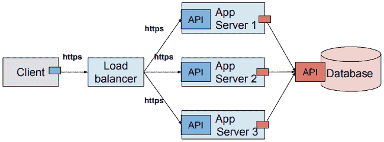

在我们的示例中，客户机通过负载平衡器与应用服务器的 API 通信。每个应用服务器都使用一个数据库 API 客户端与数据库进行交互。未标记的小方框表示 API 客户机。有些客户机直接与其服务器通信，例如，我们的数据库客户机。其他的，比如我们的应用服务器客户端，通过提供服务的中介，例如负载平衡。

### 云架构

API 公开了可用的功能，并定义了控制应用程序或服务如何相互通信的需求。

随着我们进入基于云的架构，我们的系统开始变得更像这样：


客户端/服务器架构和云架构最有共同之处是什么？

是否查看所有公开底层资源功能的 API？

Go 非常适合服务器端应用程序，即虚拟网络中的所有内容（大灰盒）。这几乎就是整个云基础设施以及其中运行的所有内容。

这对于大局来说很好，但是构建应用程序呢？在构建单个 Go 应用程序时，API 发挥了多少作用？

视情况而定。我们讨论的是小型实用程序应用程序还是企业 CRM 应用程序？

小型实用程序应用程序的接口可以简单地由它接受的命令行参数定义。

大型**客户关系管理**（**CRM**）应用程序将由功能层组成，这与我们前面看到的虚拟网络图不同。例如，opportunity management 系统需要一个 API 来生成报价和电子签名组件。服务和供应系统需要 API 访问计费和开票系统。

如果我们打算构建大型、复杂的应用程序，我们必须努力构建我们的解决方案。

### 为什么建筑很重要？

非常像大型建筑，复杂的软件应用必须建立在坚实的基础上。在软件中，我们有时将其称为我们的应用程序框架。

如果我们不考虑我文章中提到的事情；比如功能性、安全性、可扩展性、可测试性和性能，那么我们可能会对缺乏前瞻性的后果毫无准备。

随着时间的推移，我们发现应用程序的测试、部署和维护成本越来越高，我们面临的风险也会增加。

设计需要花费一些时间和精力，但这一努力很快就会得到回报。

## 系统工程的作用

系统工程是一门专注于整个系统的设计和应用的学科，它可能由许多部分组成。

### 真实系统

真正的系统包括以下内容：

*   产品
*   过程
*   人
*   信息
*   技巧
*   资源
*   服务

### IT 系统专业组

系统工程关注于在开发生命周期的早期识别需求。它考虑整个问题空间。考虑所有方面和变量，并将社会因素与技术因素联系起来。然后进行设计综合，整合所有专业组，如：

| 

*   成本
*   开发
*   处置
*   制造

*   绩效
*   流程改进

 | 

*   风险评估
*   进度表
*   支持
*   测试

*   验证

 |

在从概念、设计综合、验证、部署到生产和运营的结构化开发过程中，团队努力。

### 系统工程是精益的

系统工程就是用更少的资源为我们的客户创造更多的价值。

精益 IT 部门了解其客户的业务以及客户价值的含义，并致力于不断提高客户价值。目标是通过零浪费的完美价值创造过程为客户提供最大价值。

例如，如果您的客户向消费者销售鸡肉，那么每个新项目都必须从以下问题开始：该项目是否有助于我们的客户销售更多的鸡肉？

为了实现这一点，精益思想将管理的重点从优化单独的技术和垂直部门转变为通过整个价值流优化产品和服务的流程，这些价值流水平地跨技术和部门流向客户。

与传统业务系统相比，消除整个价值流中的浪费，而不是在孤立的点上消除浪费，创造了需要更少人力、更少资本和更少时间以更低的成本制造产品和服务的流程，缺陷也大大减少。精益公司能够以高品种、高质量、低成本和快速的生产时间响应不断变化的客户需求。信息管理变得更简单、更准确。

### 要求、范围和条款

每次开发软件时，我们都会满足客户的业务和技术需求，目标是提供满足用户需求的优质产品。

有些需求是特定于任务的。例如，如果需要编写脚本将特定日志文件从一台服务器移动到另一台服务器。其他时候，我们可能需要编写一个命令行输入工具来解析用户在控制台输入中键入的文本，并计算他们输入的字符、单词或行数。本章不涉及这些类型的应用程序。我们只在本章中考虑系统级需求。

#### 定义术语

让我们从定义几个术语开始。

##### 软件需求

客户实现目标/解决问题所需的条件或能力。

##### 系统

完成既定目标的子系统和/或要素的综合集合。

##### 系统架构

系统在其环境中的基本特性，体现在其子系统、元素、关系及其设计和演化原则中。

##### 系统元素

**原子**：无法进一步分解的元素

**可分解**：可分解成更小元素的元素

##### 系统边界

定义系统的范围，在系统和系统所在的环境之间建立区别。

## 管理复杂性

作为系统工程师，我们必须构建和集成元素和子系统，以实现预期目标。可以有很多活动部分：各种 API 和通信协议、各种数据模式、各种需要遍历的安全接口。我们最大的挑战是，我们如何管理所有这些复杂性？

### 这项工作的最佳工具

帮助管理复杂性的最佳工具是合成。函数式编程来营救！


我们的工作是将系统的元素分解为原子部分，将它们重新组合成子系统，并将它们连接到一个分布式的、基于微服务的环境中。

我们如何知道何时对元素进行了充分分解？

答：当我们可以将元素视为一个黑匣子时，也就是说，当我们不需要对函数的可见性来理解它的功能时。

### 分而治之

FP 为我们提供了将单片应用程序划分为微服务所需的工具和技术。


在[第 4 章](https://cdp.packtpub.com/learning_functional_programming_in_go/wp-admin/post.php?post=220&action=edit)、*Go*中的 SOLID Design 中，我们了解到我们的应用程序应该由遵循 Unix 理念的组件构建，即做好一件事。我们在构建微服务时遵循相同的规则。此外，根据**单一责任原则**（**SRP**），我们将每个微服务视为一个单独的实体，其整个生命周期在其预定义的边界内保持分离。我们的微服务的这种脱钩使我们能够创建、移动和重新启动我们的微服务，与周围环境隔离。

“这就是 Unix 的哲学：编写能够做一件事并且做得很好的程序。编写能够协同工作的程序。”-Doug McIlroy

### 为状态管理而设计

通常，我们发现应用程序 API 的设计是正确的，给人一种应用程序服务是无状态的错觉。然而，仔细检查后，我们发现它们的架构存在问题。

#### 添加微服务

当他们添加一个微服务时，看起来是这样的：

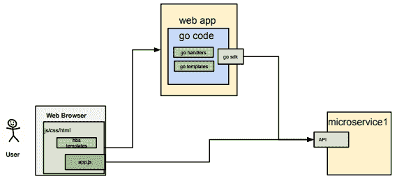

当他们再添加两个时，看起来是这样的：


在启动应用程序和车载用户之前，他们对自己的架构感觉良好。

问题开始出现：

*   可伸缩性
*   可利用性
*   国家管理
*   数据完整性问题

真正发生的不是创建无状态架构，而是将应用程序状态下推到单个数据库，这只会使问题复杂化。

他们所有所谓的无状态微服务现在都耦合到单一的、共享的单片数据库。

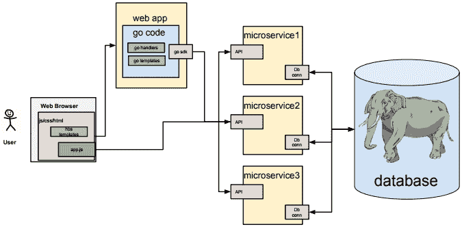

这是他们应该设计的。。。

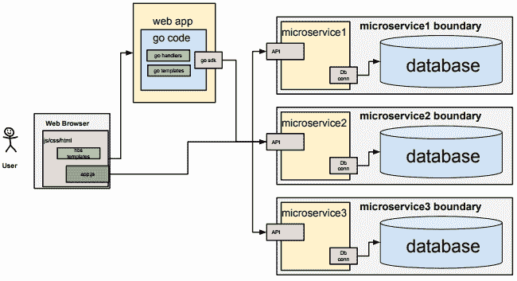

…每个微服务都拥有自己的数据。可以通过数据库复制共享和管理查找表，但其域中的数据保持隔离。

## FP 影响的架构

让我们讨论一些借鉴 FP 思想的流行架构。

*   领域驱动设计（DDD）
*   基于事件的架构
*   CQRS
*   功能反应式架构

让我们从 DDD 开始。

DDD 的其他名称包括六边形架构、干净架构、端口和适配器、洋葱型架构和应用程序式架构。我们称之为 DDD 或分层架构。

## 领域驱动设计

为了创造好的软件，我们必须了解客户的业务。我们无法创建潜在客户管理软件应用程序，除非我们充分了解销售渠道的工作原理；我们必须了解销售领域。这就是**领域驱动设计**（**DDD**的内容。在本章后面部分中查找分层应用程序架构图。中间是什么？

对我们的业务领域和需求的坚定理解是成功设计系统解决方案的关键。

在这个模型中，我们考虑两个主要层。内部是应用程序用例处理程序、业务域逻辑，外部是我们所有的基础结构代码、数据库连接和消息传递。

将该模型与依赖倒置原则相结合，该原则规定高级模块不应依赖于低级模块。我们看到我们的依赖关系应该始终指向域层。

这两个区域之间的交互是通过端口和适配器实现的。客户端请求或事件从外部世界到达 API 端口，特定于技术的适配器将其转换为可以传递到应用层的函数调用或消息。

### 依赖规则

在构建大型 Go 应用程序时，我们很快就会面临的一个问题是如何管理依赖关系。Go 应用程序越大，我们就越有可能遇到循环依赖性错误，除非我们的设计考虑了依赖性规则。

依赖规则是什么？Go 编译器为什么认为它如此重要？

依赖规则说，较低级别层中的源代码可以使用较高级别层中的代码，但较高级别层可能不会使用较低级别层中的代码。依赖项只能指向一个方向。

低层和高层之间有什么区别？

考虑下面的图表：


We'll see the code above in action later in this chapter.

在函数方面，依赖规则表示如果函数`A`（来自包`A`）调用函数`B`（来自包`B`），则函数`B`不能调用包`A`中的任何函数。

然而，应用程序控制流几乎可以流向任何方向（在包之间）。

实际上，在编写 CRM 应用程序时，我们可能会发现营销活动组件可能需要引用 opportunity 组件中的函数。如果我们的 opportunity 组件需要引用 campaign 组件中的函数，那么我们可能会遇到循环依赖错误。

#### 循环依赖

循环依赖是 Go 中的编译错误。这表明我们的代码已经违反了依赖规则。当一个包导入另一个包，而另一个包又导入原始包时，就会发生这种情况。这可能发生在包`A`到`B`到`A`之间，或者导致包`A`在调用链的任何位置被导入的任何组合。

##### 工作代码

让我们看一些示例代码来说明这个概念。首先，让我们看看工作代码。`packageb`包有一个简单的公共功能，无需导入：

`dependency-rule-good/src/packagea/featurea.go`

```go
package packageb

func Btask() {
   println("B")
}
```

`packagea`包有一个简单的公共功能和进口`packageb`：

```go
// dependency-rule-good/src/packageb/featureb.go

package packagea

import b "packageb"

func Atask() {
   println("A")
   b.Btask()
}
```

这是我们从`packagea`运行`Atask`的主要功能：

```go
// dependency-rule-good/main.go

package main

import a "packagea"

func main() {
   a.Atask()
}
```

输出：

```go
A
B
```

##### 循环依赖错误代码

这次我们将`packagea`导入`featureb.go`：

```go
// circulardep/src/packageb/featureb.go

package packageb

import a "packagea"

func Btask() {
   println("B")
   a.Atask()
}
```

`featurea.go`文件保持不变：

```go
package packagea

import b "packageb"

func Atask() {
   println("A")
   b.Btask()
}
```

`main.go`文件也保持不变：

```go
package main

import a "packagea"

func main() {
   a.Atask()
}
```

以下是输出：

```go
import cycle not allowed
package main
imports packagea
imports packageb
imports packagea
```

我们在将`packagea`导入`featureb.go`时违反了依赖规则。

##### 戈兰差异

如果到目前为止您大部分时间都在用其他语言（如 Ruby）编程，那么当您遇到循环依赖错误时，您可能会感到惊讶。

为什么像 Ruby 这样的语言中没有循环依赖错误？

首先，Ruby 是一种解释语言，所以我们永远不会得到编译错误。此外，Ruby 通过名称空间确定作用域。只要 Ruby 对代码块有唯一的引用，并且代码已经加载到内存中，就不应该有依赖引用错误。

这是否意味着 Ruby 在这方面优于 Go？

视情况而定。我们是否希望在不考虑依赖性规则的情况下尽快开发？我们是否希望我们的应用程序随着时间的推移变得越来越复杂？我们想在项目开始时在设计上投入更多的时间吗？

Go 不仅鼓励我们编写更好的代码，就像这个例子一样，Go 还让我们编写更好的代码。

#### 循环依赖的求解

我们如何编写遵循依赖性规则并仍然反映业务应用程序逻辑中经常遇到的多方向控制流的 Go 代码？

我们可以使用分层架构、接口驱动开发和一种称为依赖注入的好莱坞原则来实现这一点。

让我们一步一步来。

## 领域驱动设计

我们可以使用分层域驱动架构作为工具，以模块化和可组合的方式构建大规模功能程序。该架构帮助我们可视化单独的应用程序关注点，并使我们能够编写其源代码依赖项仅指向内部的 Go 代码。

所有引用，即导入语句都必须指向内部。在所有其他包中都可以找到导入**域**语句。导入**用例**可以在**接口**和**基础设施**包中找到。导入**接口**可以在**基础设施**包中找到，不允许导入**基础设施**包：

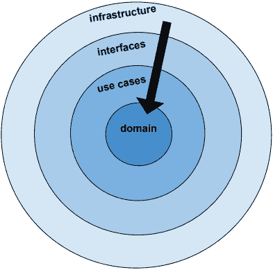

前面的图表有点自相矛盾。我们越往里走，我们的软件就越高级。**域**实体是高级概念。然而，我们越是向外移动，我们的软件水平就越低。**基础设施**是我们与文件系统、云提供商或其他数据存储库（例如数据库或云存储）交互的地方。

当我们遵守依赖性规则时，我们的源代码依赖性只指向内部。我们的系统变得高度内聚，也就是说，具有密切相关职责的组件被划分到适当的层中，从而提高内聚性。通过对接口编程和利用依赖注入，我们创建了一个松散耦合，使我们能够在不影响其他组件的情况下交换系统的各个部分。

### 接口驱动开发

回忆一下[第 4 章](04.html)中的以下引用*Go*中的固体设计？

“根据能力对事物进行分类是有意义的，因为一切都是由其行为来定义的。”

由于这是一本关于函数式编程的书，现在是一个很好的时机来提及使用接口的一个主要好处是，它们允许我们对应用程序的函数进行分组，以便对现实生活中的行为进行建模。

在上一章中，我们模拟了鸭子的行为：

```go
type StrokeBehavior interface {
       PaddleFoot(strokeSupply *int)
}

type EatBehavior interface {
       EatBug(strokeSupply *int)
}
```

在本章中，我们将介绍如何在**谷歌云平台**（**GCP**中操作文件。我们的界面定义了四种感兴趣的行为：

```go
type GcpHandler interface {
   ListBuckets(flowType domain.FlowType, projectId string) (buckets []domain.Bucket, err error)
   FileExists(fileName string) (fileExists bool, err error)
   DownloadFile(fileName string) (success bool, err error)
   UploadFile(fileName string) (success bool, err error)
}
```

让我们不要对`interface`术语感到困惑。我们刚才谈到了 Go 接口，而当我们谈到分层架构中的接口层时，它是一种将应用程序分层为独立的、内聚的关注点的方法。

本章将重点介绍如何使用 Go 完成此任务的机制。

对于解耦高层和底层之间的依赖关系，我们的最佳选择是什么？

在接下来的部分中，我们将介绍两种候选解决方案，观察者模式和依赖注入。

### 好莱坞原则

演员们为了在好莱坞的等级制度中更上一层楼，遭受着巨大的羞辱。谁来决定一个演员最终是当舞台演员还是布拉德·皮特？选角导演。

演员试演电影中的一个角色，建议不要问他们是否得到了这个角色。事实上，如果导演想要你，他会找到你的。这就是好莱坞的原则“*不要打电话给我们，我们会打电话给你”*。

在传统的节目中，演员会先试演，然后问导演他们是否得到了这个角色。好莱坞的原则不是这样的。

这种控制反转需要什么？

我们需要一个公开公共函数的 API 和一个在运行时将依赖组件绑定到主题的框架。

我们的框架选项是什么？

#### 观察者模式

观察者模式是一种选择。它通过将回调对象（观察者）注入要观察的对象来工作。当主体的状态发生变化时，主体只是在所有观察者中引发一个事件。

观察者对事件的反应超出了受试者的范围或关注范围。


下面是该模式的一个实现：

```go
//main.go

package main

import (
   . "observer"
)

func main() {

   subject := Subject{}
   oa := Observable{Name: "A"}
   ob := Observable{Name: "B"}
   subject.AddObserver(&Observer{})
   subject.NotifyObservers(oa, ob)

   oc := Observable{Name: "C"}
   subject.NotifyObservers(oa, ob, oc)

   subject.DeleteObserver(&Observer{})
   subject.NotifyObservers(oa, ob, oc)

   od := Observable{Name: "D"}
   subject.NotifyObservers(oa, ob, oc, od)
}
```

观察者实现`Callback`接口。我们为观察者-接收器实现了一种`Notify`方法。`Notify`是观察者的回调函数：

```go
// src/observer.go

package observer

type Observable struct {
   Name string
}

type Observer struct {
}

func (ob *Observer) Notify(o *Observable) {
   println(o.Name)
}

type Callback interface {
   Notify(o *Observable)
}
```

本课题实现了三种方法：`AddObserver`、`DeleteObserver`、`NotifyObservers`：

```go
// src/subject.go

package observer

type Subject struct {
   callbacks []Callback
}

func (o *Subject) AddObserver(c Callback) {
   o.callbacks = append(o.callbacks, c)
}
func (o *Subject) DeleteObserver(c Callback) {
   o.callbacks = append(o.callbacks, c)

   newCallbacks := []Callback{}
   for _, cb := range o.callbacks {
      if cb != c {
         newCallbacks = append(newCallbacks, cb)
      }
   }
   o.callbacks = newCallbacks
}

func (o *Subject) NotifyObservers(oes ...Observable) {
   for _, oe := range oes {
      for _, c := range o.callbacks {
         c.Notify(&oe)
      }
   }
}
```

`AddObserver`方法是订阅的地方，即观察者和被摄体之间的关系。

`NotifyObservers`方法充当一个简单的服务定位器。它遍历订阅的观察者列表并执行回调。

以下是输出：

```go
A
B
A
B
C
```

当我们通过执行`subject.DeleteObserver(&Observer{})`将观察者从服务定位器中移除时，所有后续通知均无效，因为没有订阅的观察者响应已发布的事件。

#### 依赖注入

**依赖注入**（**DI**）是控制反转的一种形式，也会影响应用程序中的控制流。尽管观察者模式的回调机制可以在应用程序中的许多地方多次修改流，但 DI 通常在应用程序初始化期间执行控制配置流。

由于本章主要介绍分层架构和管理依赖关系以防止循环依赖错误，因此我们将不探讨发布/订阅架构和观察者模式。相反，我们将选择 DI 来协调主函数中的依赖关系。

## 云存储桶应用程序

图片胜过千言万语，对吗？让我们使用一些图表来帮助描述我们的基本应用程序架构。

接下来，我们将看到我们的应用程序的高级架构，我们称之为`onion`。（洋葱有层，所以我们将用这个比喻来提醒我们层。）它将文件从**源云存储桶**移动到本地文件系统，然后移动到**接收器云存储桶**。

下图中的紫色 API 框表示我们的`onion.go`应用程序为管理用户公开的 web 服务 API。红色 API 代表谷歌云平台存储 API：


管理员将指示`onion.go`应用程序将日志文件从**源云存储桶**下载到本地文件系统。管理员随后可以通知`onion.go`将文件上传到**接收器云桶**。

紫色路径，例如，`/health`、`/list-source-buckets`和`/list-sink-buckets`是洋葱应用程序向管理用户公开的 web 服务 API。

### 目录结构

我们应用程序的目录结构如下所示：

```go
├── downloads
├── keys
│   └── google-cloud-storage
├── pkg
│   └── darwin_amd64
├── src
│   ├── domain
│   ├── infrastructure
│   ├── interfaces
│   ├── usecases
│   └── utils
└── vendors
    ├── pkg
    └── src
```

我们项目的源代码是`main.go`，它位于项目根目录中。应用程序的其余部分被划分为与应用程序的架构层（域、用例、接口和基础设施）对应的目录。

在研究其他层的细节之前，让我们先看看如何将它们结合在一起。那项工作是在我们的`main.go`文件中完成的。我们首先用`GetOptions()`初始化配置选项。

#### 梅因，加油

我们来看看`main.go`的内容：

```go
func init() {
   GetOptions()
   if Config.LogDebugInfo {
      InitLog("trace-debug-log.txt", os.Stdout, os.Stdout, os.Stderr)
   } else {
      InitLog("trace-log.txt", ioutil.Discard, os.Stdout, os.Stderr)
   }
   // use a filename in a downloads subdirectory
 fileName = os.Getenv("TEST_FILENAME")
   if len(fileName) == 0 {
      fileName = defaultFileName // CloudflareLogFilename(time.Now())
 }
   // . . .
   HandlePanic(os.Chdir(Config.ProjectRoot))
}
```

如果我们的`log_debug_info`设置为真，我们将`Debug`语句指示标准输出；否则，我们将丢弃它们。为了简单起见，我们对日志文件的名称进行了硬编码，但是我们可以使用配置值或函数调用来动态生成文件名。

我们在`init`函数中做的最后一件事是将应用程序的工作目录更改为项目根目录。如果执行此操作时出错，我们的`utils`包中的`HandlePanic()`函数将显示堆栈跟踪，以便于调试。

我们在 utils 包中找到了`HandlePanic()`函数。与大多数函数不同，我们不会从`HandlePanic()`返回错误。我们通过添加产生错误的源代码文件的文件名和行号来处理它，并发出警报。

#### 函电

以下是我们的`HandlePanic()`功能：

```go
func HandlePanic(err error) {
   if err != nil {
      _, filePath, lineNo, _ := runtime.Caller(1)
      _, fileName := path.Split(filePath)
      msg := fmt.Sprintf("[file:%s line:%d]: %s", fileName, lineNo, err.Error())
      panic(msg)
   }
}
```

值得注意的是，我们导入我们的 utils 包时，在它前面加上一个句号，如下所示：

```go
import . "utils"
```

这允许我们引用公共函数（以大写字母开头），而不包括`utils`包名。

### 依赖注入

在 decorator 一章中，我们研究了控制反转。我们看到了 decorator 框架如何使用依赖注入将 decorator（例如，**容错性**）注入到（main 的）流中。

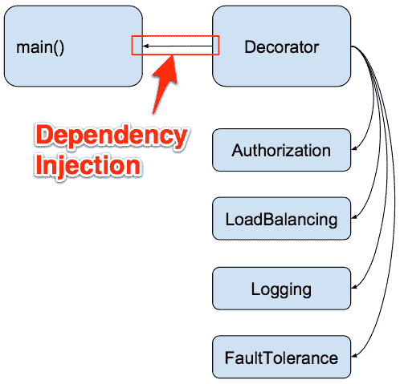

我们将使用相同的依赖注入概念来连接我们的应用程序，并提供对函数调用和接口之间流动的数据的控制。

还记得我们的电工类比吗？现在是重新审视这个概念的好时机。我们的工作很像一个电工，他先把房子的电源关掉，然后把电线铺好，然后打开电源。接通电源后，我们的电工可以测试开关，以验证家里的电气系统接线是否正确。

我们创建连接应用程序各层的接口。在 main 函数中，我们实例化了我们的交互者。我们的交互者使用接口来调用函数，从而控制松散耦合系统各部分之间的数据流。

我们有两个交互器——一个用于与 Google 云平台交互，`GcpInteractor`，另一个用于向本地文件系统读写文件。

#### func main（）

现在，我们来看一下`main()`函数：

```go
func main() {
   gcpi, err := infrastructure.GetGcpInteractor()
   HandlePanic(errors.Wrap(err, "unable to get gcp interactor"))
   li, err := infrastructure.GetLocalInteractor()
   HandlePanic(errors.Wrap(err, "unable to get local interactor"))

   wsh = WebserviceHandler{}
   wsh.GcpInteractor = gcpi
   wsh.LocalInteractor = li
```

我们将两个交互器都注入到我们的 web 服务处理程序中，这允许我们的管理员用户通过我们的公共 web 服务 API（例如，`/list-source-buckets`）操纵我们的存储库。

请注意，DI 发生在对象创建时。将 DI 与参数化函数或上下文的使用进行对比，后者包含可通过函数调用链传递的单个函数调用的所有相关信息。

DI 通常在应用程序的生命周期内发生一次。参数化函数和上下文传递会发生很多次。

### 架构中的层

我们正在构建一个基于分层架构的应用程序框架，该架构将允许我们以较少的困难来扩展应用程序。

在基于分层架构构建了坚实的应用程序框架之后，我们将在后续章节中回到纯函数式编程主题和技术。

我们将洋葱应用程序分为四层：

*   领域
*   用例
*   接口
*   基础设施

我们将在接下来的章节中详细讨论它们。

#### 域层

下图说明了分层架构中的各层。箭头表示我们只在一个方向导入包。域永远不会从用例、接口或基础设施导入。**域**层中的红色背景表示我们正在本节中查看该层：

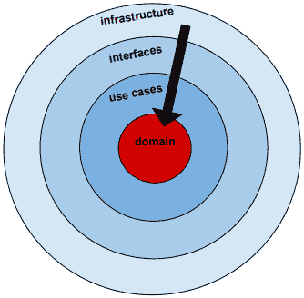

**域**层是我们定义业务实体的地方。这些是我们在定义应用程序的本质时最初会想到的核心业务对象。

从下面的类型定义中，我们很快发现我们的应用程序在云存储提供商的存储桶之间移动文件：

```go
type (
   HostProvider int
   FlowType  int
)

type CloudStorage struct {
   HostProvider HostProvider //Host location for log files, e.g., google cloud bucket
 ProjectId    string       //Project Id for this GCP storage account
 FlowType     FlowType     //source or sink
}

type LocalRepository interface {
   FileExists(fileName string) (fileExists bool, err error)
}

type BucketRepository interface {
   List(projectId string) (buckets []Bucket, err error)
   FileExists(fileName string) (fileExists bool, err error)
   DownloadFile(fileName string) (success bool, err error)
   UploadFile(fileName string) (success bool, err error)
}

type FileRepository interface {
   Store(file File)
   FindById(id int) File
}

type Bucket struct {
   Name    string `json:"name"`
}
type Buckets struct {
   Buckets []Bucket `json:"buckets"`
}
```

`LocalRepository`和`BucketRepository`不涉及具体实现。**域**层不关心 bucket 是 Google bucket 还是 AWS bucket。使用术语存储库。对于**域**层，存储库只是一个保存和检索文件的地方。

在继续之前，让我们先看看正在移动的日志文件的内容：

```go
// downloads/eventset1.jsonl

{"eventId":1000,"timestamp":1500321544026000125,"description":"something bad happened","userId":997776,"country":"AF","deviceType":"UD10","ip":"19.123.3.22","srcPort":80}{"eventId":1001,"timestamp":1500321544026000126,"description":"something pretty bad happened","userId":429444,"country":"AL","deviceType":"KG90","ip":"44.74.43.30","srcPort":80}{"eventId":1002,"timestamp":1500321544026000127,"description":"something super bad happened","userId":458696,"country":"NZ","deviceType":"VM30","ip":"101.4.66.210","srcPort":8000}
```

此`.jsonl`文件包含三个 JSON 对象。

每行的格式在我们的`domain/log_file.go`文件中定义：

```go
// domain/log_file.go

type User struct {
   UserId int `json:"userId"`
 Country string `json:"country"`
 DeviceType string `json:"deviceType"`
 IP string `json:"ip"`
 SrcPort int `json:"srcPort"`
}

type LogFile struct {
   EventId     int `json:"eventId"`
 Timestamp   int64 `json:"timestamp"`
 Description string `json:"description"`
 User
}
```

我们定义一个函数将 JSON 文本转换为 Go 结构：

```go
func NewLogFile(logfileJson string) (logFile *LogFile, err error) {
   err = json.Unmarshal([]byte(logfileJson), &logFile)
   if err != nil {
      return nil, errors.Wrap(err, "unable to unmarshal json")
   }
   return
}
```

我们定义了一个对`LogFile`对象进行操作的方法，将其转换为 JSON 文本表示：

```go
func (lf *LogFile) ToJson() (logFileJson string, err error) {
   logFileBytes, err := json.Marshal(lf)
   if err != nil {
      return "", errors.Wrap(err, "unable to marshal json")
   }
   logFileJson = string(logFileBytes)
   return
}
```

值得注意的是，在这两种情况下，在将错误返回给函数的调用方之前，我们都会用自己更具体的错误消息包装底层错误。

应用程序引用的包越少，维护应用程序就越容易。第三方软件包可以经常更新，这通常是一件好事，例如，如果它们修复了安全问题，但如果它们以破坏我们的应用程序的方式更改其公共接口，则对我们的应用程序来说可能是一件坏事。

`github.com/pkg/errors`包是值得麻烦的少数包之一。它允许我们在不更改或隐藏原始错误消息的情况下向错误消息添加上下文。

软件包错误（[https://github.com/pkg/errors](https://github.com/pkg/errors) 提供简单的错误处理原语。您也可以参考：[https://dave.cheney.net/2016/04/27/dont-just-check-errors-handle-them-gracefully](https://dave.cheney.net/2016/04/27/dont-just-check-errors-handle-them-gracefully) 。

`Write`方法允许我们将`LogFile`对象的内容写入磁盘：

```go
func (lf *LogFile) Write(logFilename, contents string) (err error) {
   overwrite := true
 flag := os.O_WRONLY | os.O_CREATE
 if overwrite {
      flag |= os.O_TRUNC
 } else {
      flag |= os.O_EXCL
 }
   osFile, err := os.OpenFile(logFilename, flag, 0666)
   if err != nil {
      return errors.Wrapf(err, "unable to open %s", logFilename)
   }
   bytes := []byte(contents)
   n, err := osFile.Write(bytes)
   if err == nil && n < len(bytes) {
      err = io.ErrShortWrite
      return errors.Wrapf(io.ErrShortWrite, "not all bytes written for %s", logFilename)
   }
   if err1 := osFile.Close(); err1 != nil {
      return errors.Wrapf(err, "unable to close %s", logFilename)
   }
   return
}
```

在`file.go`中，我们定义了我们的`File`结构，它包含文件属性。例如，文件名和字节。它还将`LogFile`定义为嵌入式字段。

```go
// domain/file.go

type File struct {
   Id         int
   Name       string `json:"name"`
 ErrorMsg   string `json:"error"`
 Contents   LogFile `json:"logFile"`
 Bytes      []byte  `json:"bytes"`
}
```

我们还定义了用于处理从 GCP bucket 接收（并发送到）的`.jsonl`文件的结构：

```go
type CloudFile struct {
   Name       string `json:"name"`
}
type CloudFiles struct {
   Names       []CloudFile
}

type CloudPath struct {
   Path       string `json:"path"`
}
type CloudPaths struct {
   Paths  []CloudPath
}
```

`file.go`文件还包含以下操作文件的功能：

*   `NewFile`
*   `NameOnly`
*   `Exists`
*   `Path`
*   `Read`
*   `Write`
*   `Parse`

我们的`api.go`文件定义了我们用来传达文件是否存在或对文件执行的操作是否成功的结构：

```go
// domain/api.go

type Existence struct {
   Exists    bool `json:"exists"`
}

type Outcome struct {
   Success    bool `json:"success"`
}

type OutcomeAndMsg struct {
   Success    bool `json:"success"`
 Message    string `json:"message"`
}

type MultiStatus struct {
   OutcomeAndMsgs []OutcomeAndMsg
}
```

#### 用例层

现在让我们看看用例层：


用例层与用户想要做的事情有关，也就是说，他们使用这个应用程序的用例。

它引用存储库、本地文件系统以及云中的源和接收器存储桶。

我们可以直接引用域实体，也可以通过本地和 GCP 交互器引用接口实体。

如果我们能够以任何方式引用一个基础设施实体，那么我们的设计就失败了。例如，我们应该能够用 AWS S3 bucket API 替换 Google 云平台存储 API，并且不会以任何方式改变用例层。

在我们的应用程序中，用户可能需要检查本地文件是否存在或获取该文件，以便将其上载到 GCP 中的 bucket 中。

`LocalInteractor`结构控制进出本地文件系统的流：

```go
// usecases/usecases.go
type LocalInteractor struct {
   LocalRepository domain.LocalRepository
}

func (interactor *LocalInteractor) LocalFileExists(fileName string) (fileExists bool, err error) {
   return interactor.LocalRepository.FileExists(fileName)
}
```

`GcpInteractor`结构控制文件流和云存储桶中文件的相关信息。*使用 bucket 做*的事情包括列出 bucket 中的文件、检查文件是否存在、上传和下载文件：

```go
type GcpInteractor struct {
   SourceBucketRepository domain.BucketRepository
   SinkBucketRepository domain.BucketRepository
}
```

有两种类型的铲斗。一个用作文件源，另一个用作文件的接收器（或目标）。

注意我们可以引用`usecases`包中的`BucketRepository`结构，但是`domain`包中的任何文件都不会引用`usecases`：

```go
func (interactor *GcpInteractor) ListSinkBuckets(projectId string) (buckets []domain.Bucket, err error) {
   return interactor.SinkBucketRepository.List(projectId)
}
```

`usecases.go`中的`GcpInteractor`方法定义了操作我们谷歌云账户中文件的用例：

```go
func (interactor *GcpInteractor) SourceFileExists(fileName string) (fileExists bool, err error) {
   return interactor.SourceBucketRepository.FileExists(fileName)
}
```

`DownloadFile`和`UploadFile`方法可以说是我们最重要的方法：

```go
func (interactor *GcpInteractor) DownloadFile(fileName string) (success bool, err error) {
   return interactor.SourceBucketRepository.DownloadFile(fileName)
}

func (interactor *GcpInteractor) UploadFile(fileName string) (success bool, err error) {
   return interactor.SinkBucketRepository.UploadFile(fileName)
}
```

这一层的逻辑非常精简。当我们开发需要执行业务规则的更复杂的应用程序时，这些用例可能是放置它们的最佳位置。

例如，如果我们在应用程序中实现了安全性，我们可以将以下规则定义为：

*   只有 sink 组或更高级别的用户才能列出 sink bucket 中的文件
*   只有`source-downloads`组中的用户才能下载文件
*   只有`super-admins`组中的用户才能上传文件

然后我们可能会将授权逻辑放在用例层。

##### 兼容接口

为了使依赖注入工作，我们的应用程序必须具有兼容的接口，例如，`domain.go`中的`FileExists(fileName string) (fileExists bool, err error)`和`gcphandler.go`中的`FileExists(fileName string) (fileExists bool, err error)`。

行`return interactor.SourceBucketRepository.FileExists(fileName)`将`FileExists`行为委托给接口，接口由`gcphandler.go`实现，然后注入到交互器中。下面，我们为 BucketRepository 定义了接口：

```go
// domain/domain.go

type BucketRepository interface {
   List(projectId string) (buckets []Bucket, err error)
   FileExists(fileName string) (fileExists bool, err error)
   DownloadFile(fileName string) (success bool, err error)
   UploadFile(fileName string) (success bool, err error)
}
```

`BucketRepository`接口与`GcpHandler`接口兼容：

```go
// interfaces/gcpstorage.go

type GcpHandler interface {
   ListBuckets(flowType domain.FlowType, projectId string) (buckets []domain.Bucket, err error)
   FileExists(fileName string) (fileExists bool, err error)
   DownloadFile(fileName string) (success bool, err error)
   UploadFile(fileName string) (success bool, err error)
}
// infrastructure/gcphandler.go
func (handler *GcpHandler) FileExists(fileName string) (fileExists bool, err error) {
   . . .
   br, err := handler.Client.Bucket(bucketName).Object(fullPath).NewReader(ctx)
   . . .
   return true, err
}
```

我们不要忘记 main 中发生的连接，它将`/source-file-extsts`URL 端点与`GcpInteractor`关联：

`main.go`

```go
func main() {
   gcpi, err := infrastructure.GetGcpInteractor()
   . . .
   wsh = WebserviceHandler{}
   wsh.GcpInteractor = gcpi 
   . . .

    {Api{wsh.SourceFileExists, "/source-file-exists"}, "fileName="+fileName}
```

这是执行依赖项注入的框架的关键，它允许我们编写跨越应用程序各层的代码，而不违反依赖项规则。

#### 界面层

在本节中，我们将了解接口层：


接口层提供了与外部存储库（例如，云存储桶或本地文件存储）通信的方法。如果我们的外部存储库需要将事件传回我们的应用程序，例如，磁盘空间不足，则这些事件将流经此接口层。

我们首先定义接口，即接口层支持的功能。

此文件包含与**谷歌云平台**（**GCP**存储 API 接口的处理程序：

```go
// interfaces/gcpstorage.go

type GcpHandler interface {
   ListBuckets(flowType domain.FlowType, projectId string) (buckets []domain.Bucket, err error)
   FileExists(fileName string) (fileExists bool, err error)
   DownloadFile(fileName string) (success bool, err error)
   UploadFile(fileName string) (success bool, err error)
}
```

为了简化我们的实现，我们只为源和接收器存储桶定义一个`GcpHandler`接口。结果是，`DownloadFile`将可用，但对接收器桶不有用，`UploadFile`对源桶不有用。

接下来，我们定义一个可以注册接口处理程序的结构：

```go
type GcpRepo struct {
   gcpHandlers map[string]GcpHandler
   gcpHandler  GcpHandler
}

type SourceBucketRepo GcpRepo
type SinkBucketRepo GcpRepo
```

我们有两种类型的 GCP 存储库。源桶和接收器桶。

前面，我们提供了满足用例需求的接口。在以下代码中，我们实现了注入实际实现的代码（在运行时）：

```go
func NewSourceBucketRepo(gcpHandlers map[string]GcpHandler) *SourceBucketRepo {
   bucketRepo := new(SourceBucketRepo)
   bucketRepo.gcpHandlers = gcpHandlers
   bucketRepo.gcpHandler = gcpHandlers["SourceBucketRepo"]
   return bucketRepo
}

func (repo *SourceBucketRepo) List(projectId string) (buckets []domain.Bucket, err error) {
   return repo.gcpHandler.ListBuckets(domain.SourceFlow, projectId)
}

func (repo *SourceBucketRepo) FileExists(fileName string) (fileExists bool, err error) {
   return repo.gcpHandler.FileExists(fileName)
}

func (repo *SourceBucketRepo) DownloadFile(fileName string) (success bool, err error) {
   return repo.gcpHandler.DownloadFile(fileName)
}
// UploadFile is not operational for a source bucket
func (repo *SourceBucketRepo) UploadFile(fileName string) (success bool, err error) {
   return false, nil
}
```

如何改进上述代码？

我们的 NewsinkBucketReporto 函数可以重写如下：

```go
func NewSourceBucketRepo(gcpHandlers map[string]GcpHandler) *SourceBucketRepo {
   return &SourceBucketRepo{
      gcpHandlers: gcpHandlers,
      gcpHandler: gcpHandlers["SourceBucketRepo"],
      }
}
```

看到区别了吗？注意，与 C 语言不同，返回局部变量`SourceBucketRepo`的地址完全可以。当我们返回`SourceBucketRepo`复合文本时，表达式将被计算，Go 将分配一个新的`SourceBucketRepo`实例。因此，与我们的`SourceBucketRepo`变量相关的存储将在`NewSourceBucketRepo`函数返回后继续存在。

连接注入以处理接收器桶依赖关系的代码与源桶代码非常相似：

```go
func NewSinkBucketRepo(gcpHandlers map[string]GcpHandler) *SinkBucketRepo {
   return &SinkBucketRepo{
      gcpHandlers: gcpHandlers,
      gcpHandler: gcpHandlers["SinkBucketRepo"],
   }
}

func (repo *SinkBucketRepo) List(projectId string) (buckets []domain.Bucket, err error) {
   return repo.gcpHandler.ListBuckets(domain.SinkFlow, projectId)
}

func (repo *SinkBucketRepo) FileExists(fileName string) (fileExists bool, err error) {
   return repo.gcpHandler.FileExists(fileName)
}

func (repo *SinkBucketRepo) DownloadFile(fileName string) (success bool, err error) {
   return false, nil
}

func (repo *SinkBucketRepo) UploadFile(fileName string) (success bool, err error) {
   return repo.gcpHandler.UploadFile(fileName)
}

func (repo *SinkBucketRepo) ListFileNamesToFetch(fileName string) (cloudFiles domain.CloudFiles, err error) {
   return cloudFiles, err
}
```

本地存储接口类似于 GCP bucket 接口。两者都有检查文件是否存在和检索文件的方法。我们添加了一些逻辑，表明这是实现缓存机制以提高性能的好地方（以牺牲额外的 RAM 需求为代价）：

```go
// interfaces/localstorage.go

type LocalHandler interface {
   FileExists(fileName string) (fileExists bool, err error)
}

var FileCache map[string][]string  //slice of json values, one for each LogFile

type LocalRepo struct {
   localHandlers map[string]LocalHandler
   localHandler  LocalHandler
   fileCache map[string]domain.File
}

type LocalFileSystemRepo LocalRepo
```

我们在`NewLocalRepo()`函数中看到了相同的依赖注入逻辑：

```go
func NewLocalRepo(localHandlers map[string]LocalHandler) *LocalFileSystemRepo {
   localRepo := new(LocalFileSystemRepo)
   localRepo.localHandlers = localHandlers
   localRepo.localHandler = localHandlers["LocalFileSystemRepo"]
   return localRepo
}
```

接下来我们实现`FileExists()`功能：

```go
func (repo *LocalFileSystemRepo) FileExists(fileName string) (fileExists bool, err error) {
   return repo.localHandler.FileExists(fileName)
}
```

如果我们想要实现文件缓存，我们可以在接口层创建一个`FileCache`全局变量，如下所示：

```go
var FileCache map[string][]string  //slice of json values, one for each LogFile

```

我们可以在`init()`函数中初始化它：

```go
func init() {
 FileCache = make(map[string][]string)
}
```

但如果我们这样做了，我们还应该做什么？

如果两个上传文件的请求同时发生怎么办？会发生什么？

如果我们实现了一个`DeleteFile`函数呢？

需要某种形式的资源锁定和竞争条件缓解。

对我们来说，最大的胜利是现在我们有了一个放置缓存逻辑的位置。当需要扩展应用程序的功能时，分层会有所帮助。

现在我们来看看`interfaces/webservice.go`文件。

首先，让我们定义一个`Api`结构：

```go
type Api struct {
   Handler func(res http.ResponseWriter, req *http.Request)
   Url     string
}
```

我们已经了解了如何使用`Api`结构将应用程序端点与其对应的 web 服务实现相关联。

`main.go`文件定义了一个嵌入此`Api`结构的`enpoint`结构：

```go
type endpoint struct {
   Api
   uriExample  string
}
```

大体上，我们使用 web 服务端点（处理程序和 URL）初始化`endpoints`切片：

```go
var endpoints = []endpoint{
   {Api{wsh.Health, "/health"}, ""},
   {Api{wsh.ListSourceBuckets, "/list-source-buckets"}, "projectId="+Config.GcpSourceProjectId},
   {Api{wsh.ListSinkBuckets, "/list-sink-buckets"}, "projectId="+Config.GcpSinkProjectId},
   {Api{wsh.SourceFileExists, "/source-file-exists"}, "fileName="+fileName},
   {Api{wsh.DownloadFile, "/download-file"}, "fileName="+fileName},
   {Api{wsh.UploadFile, "/upload-file"}, "fileName="+fileName},
   {Api{wsh.LocalFileExists, "/local-file-exists"}, "fileName="+fileName},
}
```

稍后，我们将遍历端点，并将 URL 与其各自的处理程序相关联：

```go
Info.Println("Example API endpoints:")
{
   for _, ep := range endpoints {
      http.HandleFunc(ep.Api.Url, ep.Api.Handler)
      printApiExample(ep.Api.Url, ep.uriExample)
   }
}
```

我们创建了一个`printApiExample()`助手函数，以便在控制台中打印以下内容：

```go
Example API endpoints:
http://localhost:8080/health
http://localhost:8080/list-source-buckets?projectId=rdbx-168418
http://localhost:8080/list-sink-buckets?projectId=rdbx-168418
http://localhost:8080/source-file-exists?fileName=eventset1.jsonl
http://localhost:8080/download-file?fileName=eventset1.jsonl
http://localhost:8080/upload-file?fileName=eventset1.jsonl
http://localhost:8080/local-file-exists?fileName=eventset1.jsonl
http://localhost:8080/get-local-file?fileName=eventset1.jsonl
```

接下来，我们定义我们的交互接口。我们的本地文件系统只有一个：

```go
type LocalInteractor interface {
   LocalFileExists(fileName string) (fileExists bool, err error)
}
```

我们为 GCP bucket 定义了五个接口：

```go
type GcpInteractor interface {
   ListSourceBuckets(projectId string) (buckets []domain.Bucket, err error)
   ListSinkBuckets(projectId string) (buckets []domain.Bucket, err error)
   SourceFileExists(fileName string) (fileExists bool, err error)
   DownloadFile(fileName string) (success bool, err error)
   UploadFile(fileName string) (success bool, err error)
}
```

我们创建一个`WebserviceHandler`结构来提供对本地文件和云存储桶文件的访问：

```go
type WebserviceHandler struct {
   LocalInteractor LocalInteractor
   GcpInteractor   GcpInteractor
}
```

**健康 API**

Health 是一个有用、简单的实用工具 web 服务，其定义如下：

```go
func (handler WebserviceHandler) Health(res http.ResponseWriter, req *http.Request) {
   res.WriteHeader(http.StatusOK)
   res.Header().Set("Content-Type", "application/json")
   io.WriteString(res, `{"alive": true}`)
}
```

如果我们想要 JSON 结果，它的定义如下：

```go
$ curl http://localhost:8080/health
{"alive": true}
```

如果只需要 HTTP 头状态码，定义如下：

```go
$ curl -s -I http://localhost:8080/health
HTTP/1.1 200 OK
Date: Sun, 23 Jul 2017 22:19:03 GMT
Content-Length: 15
Content-Type: text/plain; charset=utf-8
```

**文件存在 API**

以下是用于检查本地文件是否存在的 web 服务方法：

```go
func (handler WebserviceHandler) LocalFileExists(res http.ResponseWriter, req *http.Request) {
   fileName := req.FormValue("fileName")
   exists, err := handler.LocalInteractor.LocalFileExists(fileName)
   handleExists(sf("Running LocalFileExists for fileName: %s...", fileName), "find file", req, res, err, exists)
}
```

下面是一个用于检查源云存储桶中是否存在文件的示例：

```go
func (handler WebserviceHandler) SourceFileExists(res http.ResponseWriter, req *http.Request) {
   fileName := req.FormValue("fileName")
   exists, err := handler.GcpInteractor.SourceFileExists(fileName)
   handleExists(sf("Running SourceFileExists for fileName: %s...", fileName), "file exists", req, res, err, exists)
}
```

**扩展功能**

我们可以通过添加`WebserviceHandler`方法轻松地扩展我们的应用程序，这些方法可以访问源和接收器存储桶以及本地文件系统，所有这些都可以在相同的函数调用中进行。

我们使用接口的设计在其他方面也很灵活。例如，在启动应用程序时使用测试配置设置，我们可以指示应用程序的主功能在连接交互程序时使用测试模拟实现。这可以使我们的测试与一个快速的测试存根桶接口交互，该接口提供固定的响应来测试应用程序中的控制流，而无需花时间初始化连接和处理网络延迟。

现在我们来看`interfaces/webservice_helpers.go`文件。

首先，我们将`sf`变量定义为`fmt.Sprintf`函数。这使我们可以缩写代码，将`sf`替换为`fmt.Sprintf`：

```go
var sf = fmt.Sprintf
```

接下来，我们定义应用程序中为数不多的全局变量之一。这是遇到错误时我们返回给 web 客户端的标准响应。这个值永远不会改变。因此，无论出于何种目的，它都是一个常数：

```go
var ErrorResponse = []byte("Error")
```

在以下代码中，我们实现了一个函数来确定返回给用户的数据格式：

```go
func getFormat(r *http.Request) (format string) {
   //format = r.URL.Query()["format"][0]
 // Hard code json for now
 format = "json"
 return
}
```

诚然，我们已经将该值硬编码为`json`，但我们也可以很容易地从查询参数中提取该值。要记住的是，我们使用一个函数来返回这个值。函数返回的值可以从一个请求更改为下一个请求。我们不需要编写代码来同步结果，以确保返回的每个格式都与每个请求正确对应。我们既不需要数据修改锁定逻辑，也不需要编写代码来防止竞争条件。

如果我们将格式定义为一个全局字符串呢？这可能会导致什么错误？我们可以用它来横向扩展这个应用程序吗？

一般规则是，仅当值为常量时，才使用全局引用。否则，我们应该通过函数调用返回所有结果。为什么？因为使用更改的全局变量会使我们的应用程序状态不可预测。

##### 为什么全局变量是坏的

在[第一章](01.html)、*Go*中的纯函数编程中，我们简要讨论了不可变变量，但没有深入探讨它们为何如此糟糕。现在我们有了一个具体的例子。

**功能性杂质**

[第 1 章](https://cdp.packtpub.com/learning_functional_programming_in_go/wp-admin/post.php?post=362&action=edit#post_47)、*Go*中的纯函数编程也涵盖了纯函数编程，纯函数总是返回相同的结果，给定相同的输入，并且从来没有副作用。全局变量导致引用它的任何函数都是不纯的。

**代码复杂度和 bug**

根据定义，全局变量可用于许多函数。当一个函数根据其值表现出不同的行为，而其他函数正在更改该全局值时，很快就很难理解程序流的因果方面。

**性能和比赛条件**

可变全局变量需要一种锁定机制，一次只允许一个函数更新其值。这通常很难编程，并且经常会导致竞争条件，其中许多想要更新全局变量的函数必须排队等待。

**测试困难**

测试必须考虑全局变量的值。这通常意味着每个测试人员必须知道全局变量的存在，它的允许值，并在运行每个测试之前初始化全局变量的值。

##### 格式化响应

在每个 web 服务请求处理程序中，我们使用`setFormat`函数和`getFormat`函数来格式化响应数据。我们只是在示例代码中使用 JSON，很容易看出如何扩展实现以包括 XML 和 CSV 等格式。

（我们还在`interfaces/webservice_helpers.go`：

```go
func setFormat(format string, data interface{}) ([]byte, error) {
   var apiOutput []byte
   if format == "json" {
      output, err := json.Marshal(data)
      if err != nil {
         return nil, errors.Wrap(err, "unable to marshal data to json")
      }
      apiOutput = output
   } else {
      Error.Printf("invalid data format encountered")
      apiOutput = ErrorResponse
   }
   return apiOutput, nil
}
```

处理程序帮助程序的格式类似。让我们先看看我们如何处理成功或失败。

我们的函数签名包含七个参数。这太多了，这使得它很可能成为重构的候选者。在下一章中，我们将研究如何通过传递函数而不是简单的值来简化复杂的 API。

因为`debugMsg`和`msg`都是字符串，所以它们共享一个`string`声明。类似地，`err`、`error`、`success`均为`bool`类型；`bool`只需在 bool 参数列表后键入一次。这是惯用的Go。这是一种独特的编程风格，可以帮助我们编写更简单、更容易理解的代码。

让我们检查一下`handleSuccess()`函数：

```go
func handleSuccess(debugMsg, msg string, req *http.Request, res http.ResponseWriter, err error, success bool) {
   Debug.Printf(debugMsg)
   response := domain.Outcome{}
   response.Success = success
   if err != nil {
      Error.Printf("Failed to %s. %v", msg, err)
   }
   output, err := setFormat(getFormat(req), response)
   if err != nil {
      output = ErrorResponse
      Error.Printf("Failed to setFormat. %v",  err)
   }
   Debug.Printf("string(output): %s", string(output))
   fmt.Fprintln(res, string(output))
}
```

`handleSuccess()`函数由`webservices.go`中的`SourceFileExists()`函数调用：

```go
func (handler WebserviceHandler) SourceFileExists(res http.ResponseWriter, req *http.Request) {
   fileName := req.FormValue("fileName")
   exists, err := handler.GcpInteractor.SourceFileExists(fileName)
   handleExists(sf("Running SourceFileExists for fileName: %s...", fileName), "file exists", req, res, err, exists)
}
```

我们从一个`Debug.Printf`声明开始。它从 web 服务处理程序方法中获取第一个参数，例如`SourceFileExists`：

```go
sf("Running SourceFileExists for fileName: %s...", fileName)
```

值得注意的是，`sf`函数被定义为我们`webservice_helpers.go`文件顶部的函数变量：

```go
var sf = fmt.Sprintf
```

在调用`handleExists`helper 函数之前，我们从查询参数中提取`fileName`值。

当我们调用`exists, err := handler.GcpInteractor.SourceFileExists(fileName)`时会发生什么？

让我们看看最终将返回结果的一系列函数调用。

首先，我们访问`usecases`层中的`usecases.go`。`SourceFileExists`是链接到`SourceBucketRepository`的`GcpInteractor`方法：

```go
func (interactor *GcpInteractor) SourceFileExists(fileName string) (fileExists bool, err error) {
   return interactor.SourceBucketRepository.FileExists(fileName)
}
```

对`FileExists`的调用将我们带回接口层，并在基础架构层调用`FileExists`方法：

```go
func (repo *SourceBucketRepo) FileExists(fileName string) (fileExists bool, err error) {
   return repo.gcpHandler.FileExists(fileName)
}
```

**源文件存在控制**的 API 流

下图和下图显示了从调用`SourceExists`API 的 main 开始的调用堆栈：

| **控制流程从 main.go 转到** |  | **层** |
| `webservices.go`（`SourceFileExists`） | 到 | 接口（对用户） |
| `usecases.go`（`SourceFileExists`） | 至**1** | 用例 |
| `gcpstorage.go`（`FileExists`） | 至**2** | 接口（至 GCP） |
| `gcphandler.go`（`FileExists`） | 至**3** | 基础设施 |
| `file.go`（`NewFile`） | 至**4** | 领域 |


注意，在这个 API 调用期间，接口层被遍历了两次。`webservices.go`中对`SourceFileExists`的函数调用提供了请求`/source-file-exists`端点的用户与用例层的类似`SourceFileExists`函数之间的编程接口，该接口定义了用户想要做什么。这个调用堆栈中的下一个接口与 Google 云平台交互。

**源文件存在 API 调用堆栈**

下面的屏幕截图显示了对`/source-file-exists`web 服务的单个 API 调用。调用源自 main，其中 web 服务端点与`webservices.go`中的`SourceFileExists`函数相关联。

查看控制流如何从请求 web 服务端点的用户（主）向上移动，从一层到另一层？--`interfaces``use cases``interfaces``interfaces``infrastructure``domain`。

这是一种强大的流控制形式，它允许我们构建具有许多多向逻辑流的复杂应用程序，并且仍然遵循依赖性规则，即我们只在一个方向导入包：

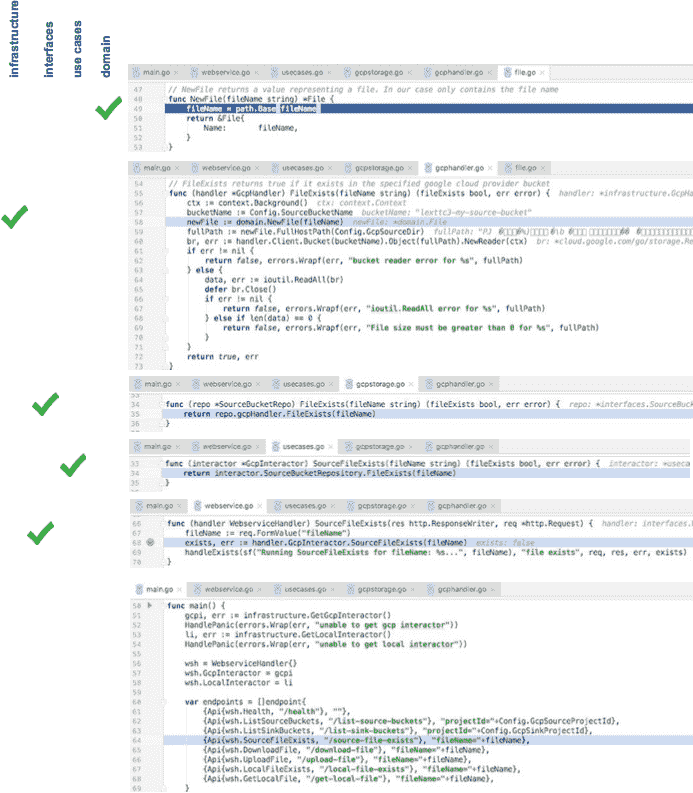

##### 测试我们的接口

为了测试我们的应用程序，我们将在`interfaces`目录中创建一个`interfaces_test`目录。

由于`interfaces_test`与`interfaces`是不同的包，我们无法访问`interfaces`包中的私有函数和其他符号。我们能够在不破坏任何测试的情况下更改 web 服务的内部结构。这也有助于我们关注 API。我们可以看到 API 的任何其他客户端在部署时会看到什么，这简化了我们创建测试的任务。

我们使用 Go 标准库中的`testing`包：

```go
package interfaces_test

import (
   . "interfaces"
 . "utils"
 "infrastructure"
 "github.com/pkg/errors"
 "io/ioutil"
 "net/http"
 "net/http/httptest"
 "os"
 "strings"
 "testing"
)

const failure = "\u2717"
const defaultFileName = "eventset1.jsonl"

var fileName               string
var wsh                    WebserviceHandler
```

我们声明`fileName`和`WebserviceHandler`将填充到以下`init()`函数中：

```go
func init() {
   GetOptions()
   if Config.LogDebugInfoForTests {
      InitLog("trace-debug-log.txt", os.Stdout, os.Stdout, os.Stderr)
   } else {
      InitLog("trace-debug-log.txt", ioutil.Discard, os.Stdout, os.Stderr)
   }
   HandlePanic(os.Chdir(Config.ProjectRoot))
   Debug.Printf("Config: %+v\n", Config)
   // use a filename in a downloads subdirectory
 fileName = os.Getenv("TEST_FILENAME")
   if len(fileName) == 0 {
      fileName = defaultFileName
 }
   // instantiate interactors
 gcpi, err := infrastructure.GetGcpInteractor()
   HandlePanic(errors.Wrap(err, "unable to get gcp interactor"))
   li, err := infrastructure.GetLocalInteractor()
   HandlePanic(errors.Wrap(err, "unable to get local interactor"))
   // wire up interactors to webservice handler
 wsh = WebserviceHandler{}
   wsh.GcpInteractor = gcpi
   wsh.LocalInteractor = li
}
```

我们重用了我们在主应用程序中使用的`Api`结构。我们没有将 API 与示例 URL 关联，而是将`Api`与`expectedBody`关联：

```go
type endpoint struct {
   Api
   expectedBody   string
}
```

我们只需要一个函数来测试我们的端点。我们使用一个匿名结构和一组复合文本创建一个组，以简单易读的格式一起测试数据：

```go
func TestEndpoints(t *testing.T) {
   Debug.Printf("fileName: %s", fileName)

   var endpoints = []endpoint{
      {Api{wsh.Health, 
         "/health"}, 
         `{"alive": true}`},
      {Api{wsh.ListSourceBuckets, 
         "/list-source-buckets?projectId="+Config.GcpSourceProjectId}, 
         `{"buckets":[{"name":"my-backup-bucket"},{"name":"my-source-bucket"}]}`},
      {Api{wsh.ListSinkBuckets, 
         "/list-sink-buckets?projectId="+Config.GcpSinkProjectId}, 
         `{"buckets":[{"name":"my-backup-bucket"},{"name":"my-source-bucket"}]}`},
      {Api{wsh.SourceFileExists, 
         "/source-file-exists?fileName="+fileName}, 
         `{"exists":true}`},
      {Api{wsh.UploadFile, 
         "/upload-file?fileName="+fileName}, 
         `{"success":true}`},
      {Api{wsh.DownloadFile, 
         "/download-file?fileName="+fileName}, 
         `{"success":true}`},
      {Api{wsh.LocalFileExists, 
         "/local-file-exists?fileName="+fileName}, 
         `{"exists":true}`},
   }
```

当我们在端点切片上迭代时，我们将每个端点称为`Api.Url`：

```go
t.Log("Testing API endpoints...")
{
   for _, ep := range endpoints {
      {
         req, err := http.NewRequest("GET", ep.Api.Url, nil)
         if err != nil {
            t.Fatal(err)
         }
```

我们创建一个满足`http.ResponseWriter`接口的`ResponseRecorder`类型来记录响应：

```go
 rr := httptest.NewRecorder()
            handler := http.HandlerFunc(ep.Api.Handler)
```

由于我们的处理程序实现了`http.Handler`，如果状态码不正常，我们可以直接调用他们的`ServeHTTP`方法，测试失败：

```go
 handler.ServeHTTP(rr, req)
            t.Logf("\tChecking \"%s\" for status code \"%d\"",
               ep.Api.Url, http.StatusOK)
            if status := rr.Code; status != http.StatusOK {
               t.Errorf("\t\t%v handler returned wrong status code: got 
 %v want %v", failure, status, http.StatusOK)
            }
```

最后，我们将返回的响应与端点（`ep`的`expectedBody`字段中存储的值进行比较：

```go
            t.Logf("\tChecking \"%s\" for expected body", ep.Api.Url)
            Debug.Println("rr.Body.String(): ", rr.Body.String())
            if strings.TrimSpace(rr.Body.String()) != ep.expectedBody {
               t.Errorf("\t\t%v handler returned unexpected body: got 
 %v want %v", failure, rr.Body.String(), ep.expectedBody)
            }
         }
      }
   }
}
```

输出应如下所示：

```go
$ go test interfaces/interfaces_test -config ../../../config.toml
webservice_test.go:79: Testing API endpoints...
webservice_test.go:93: Checking "/health" for status code "200"
webservice_test.go:98: Checking "/health" for expected body
webservice_test.go:93: Checking "/list-source-buckets?projectId=rdbx-168418" for status code "200"
webservice_test.go:98: Checking "/list-source-buckets?projectId=rdbx-168418" for expected body
webservice_test.go:93: Checking "/list-sink-buckets?projectId=rdbx-168418" for status code "200"
webservice_test.go:98: Checking "/list-sink-buckets?projectId=rdbx-168418" for expected body
webservice_test.go:93: Checking "/upload-file?fileName=eventset1.jsonl" for status code "200"
webservice_test.go:98: Checking "/upload-file?fileName=eventset1.jsonl" for expected body
webservice_test.go:93: Checking "/download-file?fileName=eventset1.jsonl" for status code "200"
webservice_test.go:98: Checking "/download-file?fileName=eventset1.jsonl" for expected body
webservice_test.go:93: Checking "/source-file-exists?fileName=eventset1.jsonl" for status code "200"
webservice_test.go:98: Checking "/source-file-exists?fileName=eventset1.jsonl" for expected body
webservice_test.go:93: Checking "/local-file-exists?fileName=eventset1.jsonl" for status code "200"
webservice_test.go:98: Checking "/local-file-exists?fileName=eventset1.jsonl" for expected body
```

如果有任何错误，输出将如下所示：

```go
$ go test interfaces/interfaces_test -config ../../../config.toml
Failed to file exists. bucket reader error for source-events/eventset1.jsonl: storage: object doesn't exist
Failed to upload file. unable to get file (eventset1.jsonl) from bucket(lexttc3-my-source-bucket): storage: object doesn't exist
--- FAIL: TestEndpoints (1.45s)
webservice_test.go:79: Testing API endpoints...
webservice_test.go:93: Checking "/health" for status code "200"
webservice_test.go:98: Checking "/health" for expected body
webservice_test.go:93: Checking "/list-source-buckets?projectId=rdbx-168418" for status code "200"
webservice_test.go:98: Checking "/list-source-buckets?projectId=rdbx-168418" for expected body
webservice_test.go:93: Checking "/list-sink-buckets?projectId=rdbx-168418" for status code "200"
webservice_test.go:98: Checking "/list-sink-buckets?projectId=rdbx-168418" for expected body
webservice_test.go:93: Checking "/source-file-exists?fileName=eventset1.jsonl" for status code "200"
webservice_test.go:98: Checking "/source-file-exists?fileName=eventset1.jsonl" for expected body
webservice_test.go:102: X handler returned unexpected body: got {"exists":false}
want {"exists":true}
webservice_test.go:93: Checking "/upload-file?fileName=eventset1.jsonl" for status code "200"
webservice_test.go:98: Checking "/upload-file?fileName=eventset1.jsonl" for expected body
webservice_test.go:93: Checking "/download-file?fileName=eventset1.jsonl" for status code "200"
webservice_test.go:98: Checking "/download-file?fileName=eventset1.jsonl" for expected body
webservice_test.go:102: X handler returned unexpected body: got {"success":false}
want {"success":true}
webservice_test.go:93: Checking "/local-file-exists?fileName=eventset1.jsonl" for status code "200"
webservice_test.go:98: Checking "/local-file-exists?fileName=eventset1.jsonl" for expected body
FAIL
FAIL interfaces/interfaces_test 1.475s
```

#### 基础结构层

本节现在将讨论基础架构层：

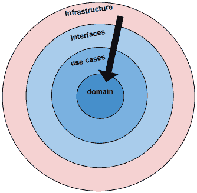

基础架构层是与外部服务（如数据库、云存储，甚至本地文件系统）进行通信的代码所在的层。

因为我们的代码是分为层的，所以我们应该能够从一个层中获取所有函数，并在不同的应用程序中使用它们。我们的基础架构层中的功能与我们当前的问题域关系最小，使它们更适用于需要与谷歌云平台交互的其他应用程序。

虽然我们的接口层中的`source`和`sink`功能可能只对我们的业务和我们想要完成的事情有意义，但基础结构层中的功能，如`FileExists`和`ListBuckets`不太具体，因此更易于重用。

我们在 Go 的标准库中找到的大部分内容（如以下列表所示）都属于基础结构层：

*   `database/sql`
*   `log/syslog`
*   `net/http`
*   `net/rpc`
*   `net/snmp`
*   `net/textproto`

如果包可能处理与外部系统的交互，那么它可能属于基础架构层。

这个函数签名也是惯用的。它接受一个参数并返回两个值。第一个是结果，第二个是错误：

```go
func (handler *GcpHandler) FileExists(fileName string) (fileExists bool, err error) {
   ctx := context.Background()
   bucketName := Config.SourceBucketName
   newFile := domain.NewFile(fileName)
   fullPath := newFile.FullHostPath(Config.GcpSourceDir)
```

如果文件存在于指定的 Google 云提供商 bucket 中，`FileExists()`函数返回`true`。我们构建了一个函数调用链来检索 bucket reader。按照 Go 惯用的方式，它返回两个值——一个用于 bucket 读取器，另一个用于潜在错误。

##### 上下文对象

我们必须传递一个上下文对象，该对象被传递给一个`withContext`函数，该函数根据上下文创建一个新的请求对象。然而，由于上下文是空的，所以我们可以将其称为**代码仪式**。请注意，在下一章的功能 API 中，我们将更深入地介绍传递请求上下文。在本例中，`ctx`是我们必须传递的内容，以便我们的代码能够编译：

```go
 ctx := context.Background()
 . . .
 br, err := handler.Client.Bucket(bucketName).Object(fullPath).NewReader(ctx)
```

我们的`errors`包允许我们用特定的错误信息包装错误，并且不会丢失 GCP 的错误信息：

```go
if err != nil {
   return false, errors.Wrapf(err, "bucket reader error for %s", fullPath)
} else {
```

我们再次看到两个值的惯用返回结果和错误。

我们使用另一个 idomatic Go 构造，使用`defer`调用关闭我们的 bucket reader。这是另一个例子，说明了 Go 如何通过简化正确的操作来帮助我们编写更好的代码。在没有`defer`语句的语言中，我们必须记住在完成工作后关闭连接。使用 Go，我们可以抓取数据读取器的句柄，并在函数退出时立即通知应用程序关闭连接：

```go
       data, err := ioutil.ReadAll(br)
      defer br.Close()
      if err != nil {
         return false, errors.Wrapf(err, "ioutil.ReadAll error for %s", 
         fullPath)
      } else if len(data) == 0 {
         return false, errors.Wrapf(err, "File size must be greater 
 than 0 for %s", fullPath)
      }
   }
   return true, err
}
```

通常，当我们遇到错误时，最好的做法是用上下文中有意义的消息包装错误，并立即返回错误以及对结果值有意义的任何内容。在本例中，由于这是对`FileExists`的调用，因此如果遇到任何错误，我们将返回`false`。

如果我们一直到最后一个 return 语句，那么所讨论的文件存在并且长度不为零。如果 GCPAPI 有一个公共的`FileExists`函数，我们可以调用它，但是这个方法就足够了。

我们将每一层设计得尽可能简单和简洁。接口层的工作是在数据在用例和底层基础设施之间流动时移动并可能转换数据。

现在，我们来看看`infrastructure/localhandler.go`文件。因为在我们的示例中只有一个本地文件系统，所以我们不需要提供注册`NewLocalHandler`的密钥：

```go
type LocalHandler struct {}

var LocalInteractor *usecases.LocalInteractor

func NewLocalHandler() *LocalHandler {
   gcpHandler := new(LocalHandler)
   return gcpHandler
}
```

`FileExists()`函数调用标准库`os.Stat`函数。我们示例应用程序中的所有文件都将存储在`download`目录中。由于两个返回值的名称已经在`FileExists()`函数签名中定义，我们只需要在适当的地方设置它们的值并执行一个简单的返回语句。

```go
func (handler *LocalHandler) FileExists(fileName string) (fileExists bool, err error) {
   _, err = os.Stat(fmt.Sprintf("%s/%s", Config.DownloadDir, fileName))
   if !os.IsNotExist(err) {
      fileExists = true
 }
   return
}
```

`GetLocalInteractor`函数将其存储库（本地文件系统）与其接口联系起来。我们的小示例只有一种方法，`FileExists`：

```go
func GetLocalInteractor() (localInteractor *usecases.LocalInteractor, err error) {
   if LocalInteractor == nil {
      localHandler := NewLocalHandler()
      localHandlers := make(map[string] interfaces.LocalHandler)
      localHandlers["LocalFileSystemRepo"] = localHandler
      localInteractor = new(usecases.LocalInteractor)
      localInteractor.LocalRepository = interfaces.NewLocalRepo(localHandlers)
      LocalInteractor = localInteractor
   }
   return LocalInteractor, nil
}
```

诚然，仅连接一个方法需要编写大量代码，但典型的企业应用程序具有外部持久性依赖项，每个依赖项都可能包含大量的方法。我们的分层架构提供了以最小的工作量扩展大型应用程序所需的结构。

简而言之，分层架构：

*   提供以最小的工作量扩展大型应用程序所需的结构
*   基于分层方法强制实现高内聚性
*   通过管理函数引用保持组件松散耦合
*   遵守依赖项规则
*   通过在应用程序初始化期间注入依赖项来使用好莱坞原则

如果您的应用程序越来越大，并且存在循环依赖性问题，那么分层架构值得您考虑。

### 滴滴涕的好处

以下是 DDD 技术的优点：

#### 适应性

DDD 使添加与应用程序交互的新方法变得简单。我们只需在`WebServiceHandler`中添加一个新的交互器，即我们的端口/适配器。在 onion.go 应用程序中，我们有两种不同的方式与应用程序通信：本地文件系统和 Google 云平台。

#### 持续性

通过将我们的应用程序业务逻辑与我们正在使用的工具（例如谷歌云平台）分离，我们可以减少供应商锁定、问题以及对失效或过时服务的依赖。

#### 可测试性

为了测试我们的应用程序服务和域代码，使用交互程序简化了 mock 的使用。在我们决定使用相应的端口/适配器插入哪种技术（REST、消息传递等）之前，可以为我们的应用程序服务层编写测试。

#### 可理解性

应用程序用例层清楚地表明了我们应用程序的功能意图。

### 坚实的建筑基础

这种分层架构可以形成支持其他架构模式的基础，包括 REST、CQR、事件驱动架构和事件源。这就是我们关注 DDD 的原因。

## FP 和微服务

让我们看看微服务和事件驱动架构、CQR、Lambda 架构和功能性反应式编程的相关架构中的 FP 哲学提示。

我们将考虑以不同的方式利用 FP 哲学来实现他们的目标：

*   事件驱动
*   可伸缩
*   反应敏捷的
*   有弹性的

### 消息传递

这些架构经常采用扇出策略来提高性能。例如，应用程序可能有一系列请求，这些请求在执行每个请求时会阻塞，如下所示：

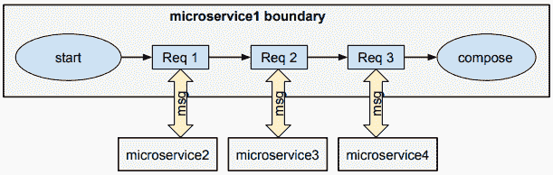

如果每个请求需要 1 秒，则发送、接收和撰写所有响应所需的总时间将为 3 秒。

在可能的情况下，我们应该选择异步执行每个请求，方法是按如下方式展开请求：

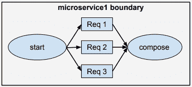

这将把处理所有请求所需的时间从 3 秒减少到 1 秒。

异步处理花费更少的时间，从而更快地释放资源。这可以最大限度地减少延迟，减少对共享资源的争用。我们刚刚解决了可扩展性的最大障碍之一，并提高了总体吞吐量和性能。

#### 各方必须参与

为了获得非阻塞执行的全部好处，请求/响应链中的所有部分都需要参与非阻塞异步调用。如果有任何资源，无论是在服务边界之内还是之外阻塞，那么我们就有问题了。

阻塞有什么问题？

通常，资源通过处理线程提供访问。线程是有限的。如果所有线程都很忙，后续请求必须等待一个线程可用。

异步消息传递帮助我们关注工作流和服务之间的交互模式。

### 跨界交流

在我们的独立、隔离的服务之间进行通信时，我们只能请求其状态。每个服务使用反映其当前状态的不可变数据响应请求。

#### 多克隆持久性

每个服务可能使用不同的存储库技术，例如：

*   事件日志
*   图形数据库
*   NoSQL
*   关系数据库
*   Timeseries 数据库

存储技术并不重要。重要的是，每个服务都对其状态负责，仅通过其 API 提供对不可变数据的访问。

### Lambda 架构

Lambda 架构是一种通用、可扩展和容错的数据处理架构，可处理静止数据和运动数据。它由三层组成：

#### 速度

该层用于实时处理。实时视图可能不如批处理层最终生成的视图准确或完整，但它们在收到数据后立即可用，并且可以在批处理层相同数据的视图可用时替换。

#### 一批

该层可以存储大量数据。输出通常存储在只读数据库中。任何错误都可以通过基于更新视图时的完整数据集重新计算来修复。ApacheHadoop 实际上是大多数高吞吐量架构中使用的标准批处理系统。响应时间可以用分钟甚至小时来衡量。

#### 服务

批处理层和速度层的输出存储在服务层中，服务层通过返回预计算视图或处理数据中的建筑视图来响应即席查询。


一些 Lambda 实现有各种存储和技术决策，但它们都有一个批处理和一个实时组件，这两个组件都使用相同的数据和一个实时视图，该视图可以通过批处理中更正的数据进行更新。

该架构的问题在于，相同的数据由 Speed 和批处理层接收，并且通常存储在两个独立的数据库中，即上面示例中的 Cassandra 和 HBASE。另外，当批处理作业返回需要合并到相关实时视图中的固定批处理视图数据时，会发生额外的处理。

#### 下一代大数据架构

下一代大数据架构已经完全放弃了批处理层。纯实时系统将流处理直接引入到服务架构中，数据通过事件日志存储在该架构中。最新数据存储在数据库中，事件历史记录存储在事件日志中。

### CQRS

**命令与查询责任分离**（**CQRS**是一种将读操作与写操作分离的架构风格。

传统上，相同的数据模型用于查询和更新数据库。然而，在更复杂的应用程序中，这种共享数据模型会出现问题。例如，为了满足写需求，我们的数据模型需要包含复杂的验证和业务逻辑。我们的阅读需求将不需要额外的逻辑。相反，它可能需要使用 write 组件所需的数据结构执行许多不同的查询。双方的复杂性都在增加。

CQR 通过将读写分离到单独的模型中、使用命令更新数据和查询读取数据来解决这些问题。

命令基于任务，而不是特定的创建或更新命令。例如，*升级车*，而不是*将 LX*追加到`model_name`字段。命令放置在队列上以进行异步处理。

查询返回没有行为或领域知识的普通数据对象。


#### CQR 的好处

CQRS**优化了性能**。命令服务/事件存储端可以针对更新进行优化，而查询服务/物化视图端可以针对查询进行优化。

CQRS**通过在 read 数据库中存储物化视图来简化查询**。可以避免复杂的联接并提高性能。

CQRS**将**的写入和读取分离，这大大简化了查询模型中的业务逻辑，并将复杂的验证和业务逻辑放在它所属的命令模型中。

CQRS 允许对**刻度****进行独立读写。**

CQR 依赖于消息传递，这非常适合基于消息的微服务。

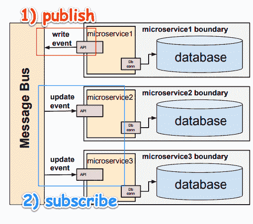

上面，microservice1 写入其数据库，该数据库发布写入事件。Microservice2 和 microservice3 订阅 microservice1 的写入事件，并在每次事件发生时更新。

### 基础架构

与设计、开发和配置基础设施相比，开发一个独立的微服务非常容易。基础设施包括以下内容：

*   访问和摄取日志
*   平衡负载
*   检查应用程序运行状况
*   数据库复制
*   调试应用程序
*   传播秘密
*   整合其他服务
*   监测资源
*   安装存储系统
*   命名与发现
*   编排/协调
*   提供身份验证和授权
*   复制应用程序实例
*   滚动更新
*   使用水平自动缩放

### 不共享架构

无共享架构（SN）是一种分布式计算架构，其中每个节点都是独立和自给自足的。节点不共享数据存储，系统中也没有单点争用。听起来很像微服务，对吧？

SN 架构的问题是节点之间的连接操作可能非常耗时。

SN 消除了共享可变状态，最大限度地减少了资源争用，并提高了可伸缩性。

### 集成服务

微服务无法控制外部或内部的其他微服务。重要的是，我们的微服务数字结构在可接受的通信协议上达成一致。

#### 议定议定书

协议应强制执行有关安全、数据流方向和速度以及流控制的策略。

#### 断路器

为了防止级联故障，应设置故障快速断路器等机制。对失败请求的重试管理应考虑如下事项：

*   我们应该等待多长时间重试？
*   我们是否应该监视端点并等待它重新联机，然后重试？
*   我们什么时候通知 devops 故障？

### 功能反应式架构

功能反应式架构（FRP）与其他架构类似，它包含许多 FP 概念，如不可变数据结构、事件流和数据转换，但不同之处在于它是一种前端架构。

反应式函数式编程（RFP）结合了反应式编程（RP）和函数式编程（FP）两个方面。

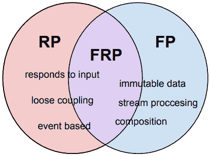

让我们看一个例子，更好地了解 FRP 和 FP 之间的联系。

假设我们有一个用户界面（UI）应用程序，它将两个数字相加：

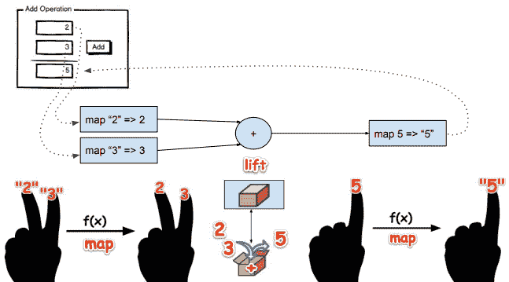

RFP 还有很多内容（不变的数据结构、备忘录、状态和事件管理等）。因为这是一种前端技术，所以逻辑不是 Go，而是 JavaScript（这是我的专长之一）。

所以，如果你喜欢我的写作风格，想让我写一本结合 Go、ReactJS 和一些分布式数据存储技术的书，让我听听你的意见。请在此处发布您的反馈：[https://www.amazon.com/Learning-Functional-Programming-Lex-Sheehan-ebook/dp/B0725B8MYW](https://www.amazon.com/Learning-Functional-Programming-Lex-Sheehan-ebook/dp/B0725B8MYW)

### Go 是构建微服务的理想选择

分布式计算涉及到微服务的水平扩展。我们已经看到，通过并行运行任务，我们可以显著提高性能。为了管理、排序和编排我们的工作负载，我们需要一个简单的机制。有什么更简单的解决方案可以同时创建和运行应用程序？（答：没有。）

以下是 Go 的一些功能，使其成为微服务环境的理想选择：

*   简单
*   并发性
*   编译时的速度
*   运行速度
*   安全
*   网络/gRPC/协议缓冲区
*   系统编程
*   小脚印

Go建立在简单的哲学基础上。编写 go 代码就是编写实用代码。

并发以 goroutine 和 channels 的形式嵌入到 Go 语言中。

有关使用 goroutine 和 channels 的编码示例，请参见[第 5 章](05.html)，*添加了装饰功能*。

Go 的编译时间非常快。编译后，Go 二进制文件是本机可执行文件。

没有可安装、配置、导入依赖项、部署和管理的虚拟环境。唯一的封装是一个小型的本机可执行文件。这减少了攻击者可利用的表面积。

#### 大小问题

让我们面对现实吧。大小很重要。如果您要为资源（CPU、存储、网络等）付费，您更愿意为哪种资源付费：

1000 个？


还是 1000 个？

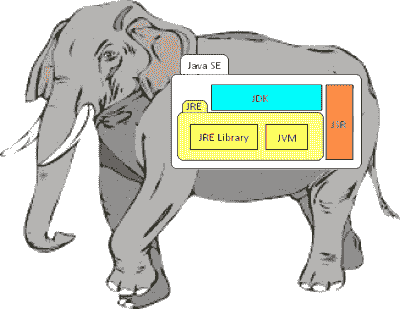

#### gRPC 的好处

如果您需要采用请求/响应架构，那么使用带有协议缓冲区的 gRPC 是一个不错的选择。gRPC 允许我们轻松发布 SDK。现在，集成是一个简单的问题，它要求其他开发人员复制用他们的语言编写的粘贴示例代码。这对于那些希望与我们的产品集成的公司来说是一个巨大的胜利，而不需要我们用我们的供应商和合作伙伴使用的各种语言实现整个 SDK。

gRPC 构建于 HTTP/2 HTTP/2 的客户端和/或服务器端流媒体之上，允许更快的响应时间，并支持批量接收和双向流媒体。我们可以异步传输请求/响应；服务器将流式返回状态消息，允许轻松的检查点操作。这使我们能够在不阻塞确认的情况下尽可能快地处理上传。

通过在 gRPC 中使用协议缓冲区，我们将提高序列化和反序列化性能。客户端接收类型化对象，而不是自由格式的 JSON。这使我们的客户可以从类型安全、IDE 中的自动完成和改进的版本管理中获益。

gRPC 使我们能够以 proto 格式为 API 的客户端和服务器端编写一个接口定义。接口驱动的开发使两个开发团队能够并行工作。这使我们更加精简，更快地提供更多价值。

#### 谁在用Go？

Go 中正在构建的系统和基础架构工具的简短列表包括：

*   码头工人
*   库伯内特斯
*   包装工
*   科雷奥斯
*   流入 xDB
*   Etcd
*   NSQ，

## 总结

在本章中，我们了解了依赖规则的重要性。我们了解到，我们只能从一个方向导入包。我们学习了如何将复杂的应用程序划分为多个层。

我们学习了如何使用依赖注入在应用程序层之间进行交互，并使用分层架构实现了一个应用程序。

选择正确架构的关键是深入了解系统的需求、现有组件和可用技术选择的能力。最终，系统工程师的工作是确保整个系统正常工作。

在下一章中，我们将学习函子、单群、类型类和其他函数编程问题。*