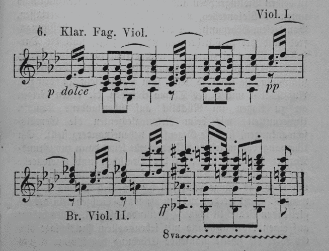
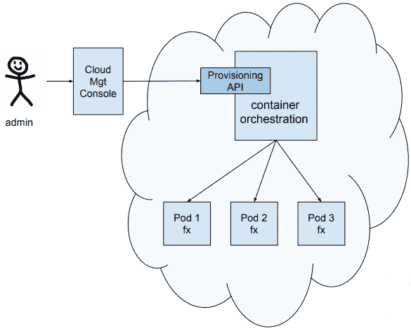
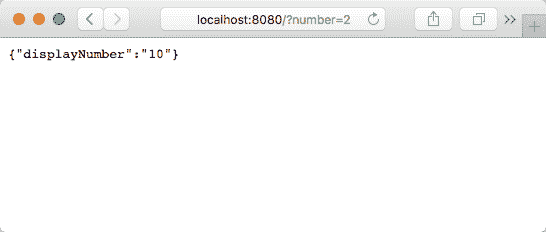
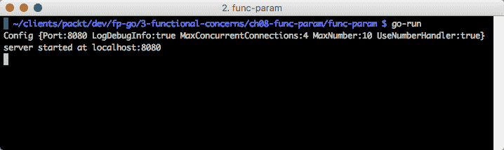
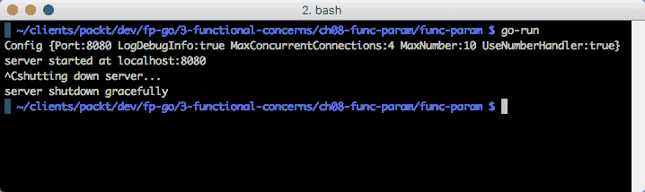
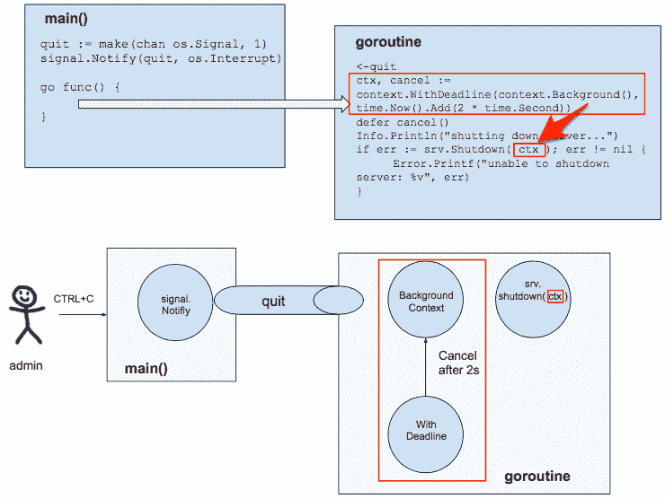
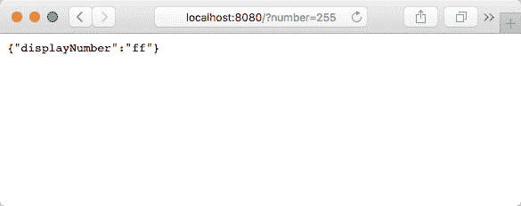
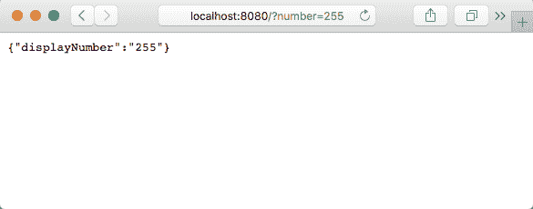

# 七、函数参数

在写这一章的时候，我的思绪回到了几年前我用 FoxPro 编程的时候。我记得，我用 FoxPro 编写了很多函数。我编写的函数通常用途单一，很少需要超过四个参数。在微软购买了 Fox 软件后，较新版本的 FoxPro 开始变得不那么实用。UI 生成器越来越像 Visual Basic。函数开始被类取代。曾经易于访问的逻辑隐藏在按钮和 GUI 对象后面。代码行增加了，测试花费了更多的时间，开发周期也延长了。我觉得工作效率低下，无法充分解释我的感受。

“不理解数学的最高确定性的人，是在困惑中打滚。”

-达芬奇

当我发现Go的时候，它就像重新获得了天堂；回归简单性，带来并发、网络、优秀的开发工具、一流的功能以及 OOP 的最佳部分的额外好处。

本章的目标是完成以下工作：

*   了解重构长参数列表的更好方法
*   识别失效数据对象和功能参数之间的差异
*   了解咖喱和部分应用之间的区别
*   了解如何应用部分应用程序创建具有较小算术数的另一个函数
*   使用上下文正常关闭服务器
*   使用上下文取消和回滚长时间运行的数据库事务
*   实现功能选项以改进我们的 API

如果您认为可以通过传递指向可变数据对象的指针或调用隐藏在函数中的其他函数来简化长参数列表，请以开放的心态阅读本章。

## 重构长参数列表

长参数列表通常被认为是代码气味。

多长时间太长？

当我们查看一个参数列表时，无法完全跟踪它，那么它可能太长了。

**发现了心灵的极限——一次 4 件事**

Working memory relates to the information we can pay attention to and grasp. Keeping our parameter lists short helps others easily understand our function's purpose.

[https://www.livescience.com/2493-mind-limit-4.html](https://www.livescience.com/2493-mind-limit-4.html)

四个或更少的参数是最佳点，但七个是最大值。

考虑一下我们的电话号码。多少位数？七例如：867-5309

你认为为什么七位数字被分成两组，最大的一组有四位数字？

### 具有七个以上参数的函数签名有什么问题？

函数签名不应该太长太复杂，以至于我们无法理解它。保持简单。使用深思熟虑、合理且有意义的参数名称。

有没有注意到，具有长参数列表的函数通常是某种类型的构造函数？随着时间的推移，这些函数很容易得到更多的参数？


软件工程师想要减少其函数的参数列表是很自然的。这是我们重构应用程序时所做的一部分。只要我们牢记可理解性的目标，我们就会很好。有时，我们可能有一个包含十个参数的函数签名。如果其他替代方案会使我们的函数签名变得模棱两可，那么就去做吧。清晰胜过含糊不清。我们应该使用多少参数？视情况而定。

重构代码是改变代码结构而不改变其行为的过程。我们没有添加功能。相反，我们正在使代码更具可读性，更易于维护。通常，我们使用大型函数（超过 200 行代码）并将它们分解为更小、更易于理解的代码单元。

完成这一壮举的某些方法比其他方法更好。

### 重构之书

读过《重构》一书吗？它涵盖了重构长参数列表的主题。

提出以下几点：

*   方法可以在内部查询其他对象的方法，以获取决策所需的数据
*   方法应该依赖于它们的宿主类来获取所需的数据
*   我们应该传递一个或多个对象以简化调用签名
*   我们应该使用一种称为*的技术，将参数替换为*方法，以减少所需参数的数量
*   传递具有所需属性的整个对象，以减少所需参数的数量
*   当我们要传递不相关的数据元素时，请使用参数对象
*   当我们不想在较大的参数对象上创建依赖项时，我们可以发送单独的参数；这是一个例外，我们可能不应该这样做
*   长参数列表会随着时间的推移而变化，并且本质上很难理解

此建议与纯面向对象语言设计方法一致。然而，作为优秀的程序员，我们只应该同意最后一点。为什么？

为什么许多人遵循了近 20 年的建议会如此可怕地错误？

### Edsger W.Dijkstra 说 OOP 是个坏主意

荷兰计算机科学家 Dijkstra 就 OOP 提供了以下见解：

“面向对象编程是一个非常糟糕的想法，它只能起源于加利福尼亚州。”

-埃德斯格·W·迪克斯特拉

什么 OOP 是一个*非常糟糕的主意*？为什么？

首先，让我们进一步了解一下埃德斯格·W·迪克斯特拉。

#### Edsger W.Dijkstra 还说了什么？

Dijkstra 说过这样的话：

“有能力的程序员充分意识到自己的头骨大小受到严格限制；因此，他在处理编程任务时非常谦虚，除其他外，他避免使用像瘟疫这样的聪明伎俩。”

-埃德斯格·W·迪克斯特拉

他还说：

“简单是可靠性的先决条件。”

-埃德斯格·W·迪克斯特拉


莫扎特作品

“无论是高度的智力还是想象力，或者两者都不能造就天才。爱，爱，爱，这是天才的灵魂。”

-莫扎特

Dijkstra 分享了他对软件开发中不同编程风格的看法。迪克斯特拉比较了莫扎特和贝多芬作曲方式的不同。Dijkstra 解释说，莫扎特在开始创作时考虑到了整个作品。另一方面，贝多芬会在作曲完成之前写下部分音乐，并将修改后的部分粘贴到最后的作曲中。



贝多芬作曲

埃德斯格似乎更喜欢莫扎特的编程风格。他自己的编程方法说明，程序应该设计和正确组合，而不仅仅是通过黑客攻击和调试来获得正确性。

莫扎特之所以能够在实施之前进行详细设计，是因为他是音乐创作艺术大师，经验丰富。有时候，在开发软件时，我们不会有那种奢侈。当我们无法确定适合我们项目的框架时，将会有更多的尝试和错误编程。

就我个人而言，当我不是在一个紧迫的期限内，我更喜欢贝多芬式的发展。我认为这是一种娱乐节目。这在本质上是自我探索。对我来说，莫扎特的发展需要更多的纪律。通常，最终结果是相同的。莫扎特的发展需要较少的时间来完成，但贝多芬的发展更令人愉快。我想这就是为什么开发者如此喜欢研发项目。

#### 底层 OOP 问题

正如[第 4 章](04.html)、*Go*中的 SOLID Design 所述，您了解了 Java（和 OOP 语言）是如何强调类型层次结构的。OOP 的设计者关注的是名词而不是动词。一切都是对象。对象具有属性（数据）并可以执行操作（方法）。


不活跃的名词

OOP 的一个潜在问题是它促进了在对象的属性/属性中存储和隐藏数据。假设我们的应用程序最终希望在执行一个或多个对象的方法时访问该对象的数据。

#### 面向对象不一致性

OOP 应用程序可以调用其隐藏信息并对其进行变异。在应用程序的生命周期中，可以多次调用对象的方法。对具有相同调用签名的相同方法的每次调用每次都会产生不同的结果。这种行为特征使得 OOP 不可靠，难以有效测试。

OOP 与基础数学不一致。在 OOP 中，由于对象的可变状态，我们不能每次都使用相同的参数调用一个方法并总是得到相同的结果。面向对象编程没有数学模型。例如，由于可变状态和对其他对象的内部调用，如果我们第一次调用`myMethod(1,2)`并得到 3，下一次得到 4，则无法定义 OOP 程序的正确性。

#### 函数式编程与云计算

函数式程序的本质与面向对象程序有很大的不同。给定相同的输入参数集，函数程序将始终产生相同的结果。我们可以轻松地并行运行它们。我们可以用 OOP 无法实现的更快的方式来链接/组合它们。

我们的部署模式已经从内部服务器发生了变化，管理员将花费大量时间对其进行配置和优化，从而给服务器起了昵称。我们过去常常看到名字遵循希腊诸神的模式。有*宙斯*是我们的数据库服务器，还有*阿波罗*是我们的人力资源服务器。

现在，我们的服务器部署在云中，我们的管理员只需点击一个按钮即可添加新服务器或设置自动扩展：如果平均 CPU 超过 80%，则添加一个新服务器。它看起来像这样：



上图中的 pod 表示一个服务器，它可能有几个相关的容器。吊舱中的一个容器将运行我们的`f(x)`功能。如果服务器崩溃，我们的容器编排器中运行的自动伸缩逻辑将被通知，它将自动启动另一台服务器来替换它。根据我们的云部署配置文件设置和网站流量模式，POD 可以快速配置并停止服务。由于现在服务器的来去自如，我们把它们称为牛而不是宠物。我们更关心我们的服务器群的健康，而不是任何一个特定的宠物服务器。

术语*Pod*取自库伯内特斯。参见[https://kubernetes.io/docs/concepts/workloads/pods/pod-overview/](https://kubernetes.io/docs/concepts/workloads/pods/pod-overview/) 想知道更多。

吊舱大致相当于 OpenShift v2 档位，逻辑上表示一个*逻辑主机*，其中所有服务容器都可以通过本地主机相互通信。

其他集装箱配器包括 Docker Swarm、Mesos、Marathon 和 Nomad。参见[https://github.com/KaivoAnastetiks/container-orchestration-comparison](https://github.com/KaivoAnastetiks/container-orchestration-comparison) 。

具有 FP 特征的应用程序在我们的云环境中表现可靠；但是，具有可变状态 OOP 特性的应用程序不会这样做。

##### 对 f（x）的更仔细的观察

让我们检查一个基本函数定义，其中**f**是函数名，**x**是输入值。**x**的另一个名称是输入参数。

整个表达式**f（x）**表示输出值：


如果*f（x）=x+1*，那么我们知道每次输入值 2 时，输出值总是 3。

这种纯粹而简单的特性正是函数式编程如此强大的原因。

另一方面，如果我们有一个对象的`AddOne`方法在给定值 2 时有时会返回 3，那么我们如何可靠地缩放`object.AddOne`方法？我们不能，这就是为什么在云计算环境中，以下等式是正确的主要原因：*FP>OOP*。

### 更仔细地看重构

让我们从函数式编程的角度来研究重构书中的每一点。

#### 传递函数完成其工作所需的每个参数不是一个好主意

为什么我们不希望我们的函数签名指示它做出决策所需的值（参数）？

我们如何减少函数所需的参数？

#### 方法可以在内部查询其他对象的方法，以获取决策所需的数据

因此，与其调用`GetTravelTime(startLocation, endLocation)`方法，不如调用`GetTravelTime()`？

我们从哪里获得`startLocation`和`endLocation`值？

我们如何确定没有其他值，例如`modeOfTransportation`，会影响我们的旅行时间结果？

这是否会创建内部的、未记录的依赖关系（假设我们记录了外部 API）？

#### 方法应该依赖于它们的宿主类来获取所需的数据

这是否意味着我们依赖于可以在函数调用之前和期间更新的可变数据？

如果我们想在函数运行期间防止数据更新，我们必须编写哪些额外的代码来确保数据一致性？我们需要实现哪些锁定机制？

这会阻止我们编写并行运行的代码吗？

并发编程可能吗？

#### 传递具有所需属性的整个对象，以减少所需参数的数量

因此，我们的呼叫应该是这样的：`GetTravelTime(info)`，而不是`GetTravelTime(startLocation, endLocation, speed)`。

有时像这样的函数调用`Initialize(Config)`是有意义的，这取决于我们的用例。

然而，也许我们应该努力简化我们的函数，这样它自然需要更少的参数，而不是找到方法将更多的参数值塞进单个输入参数对象中。

#### 用方法技术替换参数，以减少所需参数的数量

此技术指示我们删除参数，并让接收方调用该方法。

##### 在应用“用方法替换参数”技术之前

我们从一个`getDiscountedPrice`函数开始，该函数包含两个参数：`lineItemPrice`和折扣：

```go
 lineItemPrice := quantity * itemPrice;
 discount := getDiscount();
 totalPrice := getDiscountedPrice(lineItemPrice, discount);
```

*用*方法替换参数，积极努力减少参数数量。

在这种情况下，我们有两个参数。这显然少于四个参数。为什么要减少这么少的参数？

##### 应用“参数替换法”技术后

按照指令重构代码后，我们删除了一个参数。现在我们只有一个参数：

```go
 lineItemPrice := quantity * itemPrice;
 totalPrice := getDiscountedPrice(lineItemPrice);
```

代码维护人员如何知道可以通过折扣来减少`totalPrice`？

隐藏折扣参数是提高了可理解性还是实际上增加了代码复杂性？

#### 当我们要传递不相关的数据元素时，请使用参数对象

参数对象只包含字段和用于访问它们的原始方法（getter 和 setter）。它是一种死数据结构，仅用于传输数据。

如果我们将大量不相关的数据项传递到一个函数中，那么函数失败单一责任原则的可能性有多大？

如果我们想添加可以根据运行时上下文修改数据值的逻辑，该怎么办？

但是，如果我们有一组描述新客户的参数，我们可以考虑将它们分组到数据对象中。类似于以下的事情可以被认为是一件合理的事情：


我们将`FullName`属性（称呼、`firstName`、`middleName`、`lastName`、后缀）组合在一起，形成一个`FullName`数据对象。我们还将地址属性分组以创建一个`Address`数据对象。现在，我们可以调用`CreateCustomer`只传递两个属性：

```go
CreateCustomer(fullName, address)
```

具有两个参数的调用比以下具有八个参数的调用有所改进：

```go
CreateCustomer(salutation, firstName, middleName, lastName, suffix, street1, street2, city, state, zip)
```

因此，与世界上大多数事情一样，正确的做法取决于我们的处境。

你能想到这种方法有什么问题吗？

这不就是对`fullName`和地址对象的依赖吗？

如果`fullName`或地址数据对象在我们开始执行`CreateCustomer`函数后但在它完成之前发生了变化，该怎么办？那么，我们会有哪些数据不一致？

#### 长参数列表会随着时间的推移而变化，并且本质上很难理解

这句话很有道理。本章其余部分将阐述这一说法。我们将探讨如何管理一个 API，该 API 可能会随着时间的推移而变化，并且可能需要更多的参数来获取完成任务所需的信息。

如果我们像贝多芬那样编写我们的应用程序，从我们想要完成什么的一般想法开始，并将我们的程序敲定，那么我们可能不知道 API 一开始需要什么样的参数。


动作动词

我们如何设计一个 API，它需要几个以上的参数，但又具有以下特性？

*   提供合理的默认值
*   指示哪些参数是必需的/可选的
*   提供语言的全部功能来初始化复杂值，而不是通过死结构进行中继
*   可以随时间增长
*   是安全的
*   是可以发现的
*   是自我记录吗
*   是高度可配置的

传递配置结构怎么样？

像我们前面看到的`fullName`和 address 数据对象一样，传递配置数据对象会创建依赖关系。配置对象由`caller`和功能`called`保留。

如果我们传递指向配置对象的指针，那么如果调用方或被调用方发生任何突变，就会使问题复杂化。

### 解决方案

我们正在寻找的解决方案将允许新构造函数接受具有以下特征的可变数量的参数：

*   预定义默认值（没有为特定设置传递任何参数）
*   仅传递有意义的值
*   利用 Go 编程语言的强大功能定制传递的参数值

这个设计的大部分来自 Rob Pike 的一篇博客文章。

参考 Rob Pike 在其博客文章[中的自我参考功能和选项设计 https://commandcenter.blogspot.com/2014/01/self-referential-functions-and-design.html](https://commandcenter.blogspot.com/2014/01/self-referential-functions-and-design.html) 。

分享了返回函数文本的闭包技术，我们在其中设置了服务器设置的值，这是值得称赞的。我们将在本章后面详细了解这一点。


#### 传递多个参数的三种方法

让我们记住，有三种方法可以将多个参数传递给函数。我们将在下一节中讨论它们。

##### 简单地传递多个参数

这里，我们将四个参数传递给`InitLog`函数：

```go
func InitLog (
   traceFileName string,
   debugHandler io.Writer,
   infoHandler io.Writer,
   errorHandler io.Writer,
) {
// . . .
}
```

##### 传递包含多个属性的配置对象/结构

在这里，我们传递`ClientConfig`配置数据对象并打印其值：

```go
func printClientConfig(config *ClientConfig) {
   Info.Printf(" - security params: %v", config.SecurityParams)
   Info.Printf(" - core limit: %v", config.CoreLimit)
   Info.Printf(" - payload config: %v", config.PayloadConfig)
   Info.Printf(" - channel number: %v", config.ClientChannels)
   Info.Printf(" - load params: %v", config.LoadParams)
   // . . .
```

这种方法的一个缺点是我们在调用者和被调用者之间创建了依赖关系。如果调用方或调用方系统的其他部分在函数处理时修改了配置对象，该怎么办？

有时，如前面提供的示例所示，假设配置对象不会更改是相当安全的。在这种情况下，传递配置对象是正确的做法。它简单有效，几乎不存在突变导致不一致状态的可能性。

但是，如果由于被调用函数内部的额外复杂性，可能需要修改参数，该怎么办？来自死结构的静态值也无济于事。

##### 部分应用

我们的第三个选项称为**部分应用**。我们可以通过咖喱来实现这一点。

Curry 的思想是通过部分应用其他更通用的函数来创建新的、更具体的函数。

考虑到我们有一个两个数的函数：

```go
func add(x, y int) int {
   return x + y
}
```

我们可以创建另一个函数，该函数返回带有一个预插入参数的`add`函数。我们将举一个简单的例子，向任何其他数字中添加一个：

```go
func addOnePartialFn() func(int) int {
   return func(y int) int {
      return add(1, y)
   }
}
```

调用`add(1,2)`的结果与调用`addOne(2)`的结果相同：

```go
func main() {
   fmt.Printf("add(1, 2): %d\n", add(1, 2))
   addOne := addOnePartialFn()
   fmt.Printf("addOne(2): %d\n", addOne(2))
}
```

以下是上述代码的输出：

```go
add(1, 2): 3
addOne(2): 3
```

**Currying** is the ability of a function to return a new single argument function until the original function receives all of its arguments.

Calling a curried function with only a few of its arguments is called **partial application**.

函数套用是一种技术，我们可以使用它将复杂的功能分割成更容易推理的小部分。更小的逻辑单元也更容易测试。我们的应用程序由更小的部分组成。

然而，我们在本章中所追求的解决方案将是第一种，也就是说，我们将通过所有必需的参数。但是，我们只需要传递所需的参数，对于未提供的参数，我们将使用合理的默认值。

我们如何才能做到这一点？通过使用功能参数！

## 功能参数

我们将像前面章节一样使用`GetOptions()`utils 函数，我们将在 init 函数中调用`GetOptions`和`InitLog`，以便在运行`main`包中的任何命令之前设置配置值和记录器：

```go
package main

import (
   "server"
 . "utils"
 "context"
 "io/ioutil"
 "net/http"
 "os"
 "os/signal"
 "time"
 "fmt"
)

func init() {
   GetOptions()
   InitLog("trace-log.txt", ioutil.Discard, os.Stdout, os.Stderr)
}
```

让我们使用信号`Notify`订阅`SIGINT`信号。现在，我们可以在程序突然停止之前捕获一个*Ctrl*+*C*事件。我们将创建一个退出通道来保持信号。它只需要缓冲区大小为 1。

当我们的`quit`通道收到`SIGINT`信号时，我们可以开始优雅有序的关机程序：

```go
func main() {
   quit := make(chan os.Signal, 1)
   signal.Notify(quit, os.Interrupt)
```

请密切注意以下代码。这就是我们传递函数参数的地方！

```go
newServer, err := server.New(
   server.MaxConcurrentConnections(4),
   server.MaxNumber(256), // Config.MaxNumber
 server.UseNumberHandler(true),
   server.FormatNumber(func(x int) (string, error) { return fmt.Sprintf("%x", x), nil }), 
 //server.FormatNumber(func(x int) (string, error) { return "", errors.New("FormatNumber error") }), // anonymous fcn
)
```

在我们的示例中，我们选择向服务器的`New`构造函数提供四个参数（`MaxConcurrentConnections`、`MaxNumber`、`FormatNumber`和`UseNumberHandler`。

请注意，参数名称是自解释的。我们传递了前三个参数的实际标量值（4256，true）。我们可以选择使用配置值（`Config.MaxConcurrentConnections`、`Config.MaxNumber`和`Config.UseNumberHandler`）或使用环境变量。我们也可以使用环境变量。我们可能不会为`UseNumberHandler`使用环境变量。大多数情况下，环境变量用于可能与开发、测试、QA 和生产环境不同的设置，例如，`IPADDRESS`和`PORT`。

这里有一个方便的库，用于处理 Go 中的环境变量：

[https://github.com/caarlos0/env](https://github.com/caarlos0/env)

最后一个参数`FormatNumber`接受匿名函数来更改号码的显示格式：

```go
server.FormatNumber(func(x int) (string, error) { return fmt.Sprintf("%x", x), nil }) 
```

`fmt.Sprintf`语句中的`%x`参数指示我们的处理程序以二进制格式显示输入的数字。

当用户在请求中输入数字**2**时，显示如下：



如果调用`Server.New`失败，则记录错误并退出程序：

```go
if err != nil {
   Error.Printf("unable to initialize server: %v", err)
   os.Exit(1)
}
```

接下来，我们提供运行 HTTP 服务器所需的参数。`Addr`参数是服务器侦听的地址。

我们不让`http.Server`默认使用`http.DefaultServeMux`来处理请求，而是传递`newServer`函数类型变量来接受自定义`ServerOption`函数参数来定制其行为：

```go
srv := &http.Server{
   Addr:    ":"+Config.Port,
   Handler: newServer,
}
```

接下来，我们将为匿名函数调用创建一个 Goroutine。

我们的 Goroutine 将等待用户触发`SIGINT`中断（在服务器启动的终端会话中按*Ctrl*+*C*）。此时，退出通道将接收信号。

虽然`Context`可以用来传递请求范围内的变量，但我们只会用它来传递一个取消信号。我们将在下一节中详细介绍`Context`。

当 2 秒截止日期到期或调用返回的`cancel`函数时，`quit`通道关闭。只要服务器关闭逻辑不到两秒钟，就会调用延时`cancel()`；否则，截止日期将关闭`quit`频道：

```go
go func() {
   <-quit
   ctx, cancel := context.WithDeadline(context.Background(), time.Now().Add(2 * time.Second))
   defer cancel()
   Info.Println("shutting down server...")
   if err := srv.Shutdown( ctx ); err != nil {
      Error.Printf("unable to shutdown server: %v", err)
   }
}()
```

对`Shutdown`的调用将在不中断任何活动连接的情况下停止服务器。首先，`Shutdown`关闭打开的侦听器，然后关闭空闲连接。如果没有最后期限，它可能会无限期地等待连接返回空闲状态，然后再关闭它们。

`ListenAndServe`函数监听本地主机端口`Config.Port`并调用以处理传入连接的请求：

```go
Error.Println("server started at localhost:"+Config.Port)
err = srv.ListenAndServe()
```

此时，我们的服务器将侦听请求，我们的终端将如下所示：



请注意，我们可以通过在`main`函数的第一行插入以下内容来获得打印到终端的配置信息：

```go
Info.Printf("Config %+v", Config)
```

`%+v`中的“【T0]”告诉`Printf`函数打印字段名和值。

当我们按下*Ctrl*+*C*时，以下行中的代码表示我们在`quit`频道上的 Goroutine：

```go
signal.Notify(quit, os.Interrupt)
```



`srv.Shutdown`方法运行，然后`main`中的最后一行执行打印`server shutdown gracefully`。

在深入研究我们的`func-param`项目代码之前，让我们更仔细地看看 ToGo 的`Context`包功能。

## 上下文

上下文主要用于跨越多个进程和 API 边界的请求。上下文有助于在进程生命周期的不同阶段维护有关对象状态的背景信息，因为对象遍历各种 API 边界进程。

下面是一个例子（来自[https://blog.golang.org/context 传递一个`Context`参数的](https://blog.golang.org/context)：

```go
func httpDo(ctx context.Context, req *http.Request, f func(*http.Response, error) error) error {
    // Run the HTTP request in a goroutine and pass the response to f.
    tr := &http.Transport{}
    client := &http.Client{Transport: tr}
    c := make(chan error, 1)
    go func() { c <- f(client.Do(req)) }()
    select {
    case <-ctx.Done():
        tr.CancelRequest(req)
        <-c // Wait for f to return.
        return ctx.Err()
    case err := <-c:
        return err
    }
 }
```

将`Context`参数传递给每个请求中的每个函数，可以控制跨 API 和进程边界的请求的超时和取消。此外，它有助于确保安全凭据等关键值在传输过程中的停留时间不会超过必要的时间。

第三方库和框架，例如 Gorilla 的（[http://github.com/gorilla/context](http://github.com/gorilla/context) ）包，在其包和其他采用上下文请求范围参数的包之间提供一个桥梁。这在构建可扩展服务时提高了异构包之间的互操作性。

我们将使用应用程序上下文来控制停止服务器。截止日期确保我们的关闭过程不会超过合理的时间量（在我们的示例中为 2 秒）。此外，通过发送取消信号，我们为服务器提供了在关闭之前运行清理过程的机会。

下面是我们的`Context`参数的说明：



当管理员用户按下*Ctrl*+*C*时，`os.interrupt`向`quit`（缓冲）通道发送信号。创建一个截止时间为 2 秒的`Context`（`ctx`）。该上下文参数被发送到`srv.Shutdown`函数，在该函数中执行服务器的清理代码。如果超过 2 秒，我们的 Goroutine 将被取消。结果是我们的服务器被正常关闭，我们可以确信它不会超过 2 秒。

我们可以建造像这里这样精致的树木：


然而，在这样做之前，我们应该意识到我们的`Context`限制，我们将在下面讨论。

### 上下文限制

树可以向上遍历，即从子节点到父节点（而不是相反）。

我们应该只使用建议的值，例如，该用户的 localname 是`en_US`。`en_US`可以用来增强用户体验，但不能改变应用程序的流程。我们不应在`Context`包中存储可能影响控制流的值。

#### 报告示例

作为存储在 PROT0T 中的控制值流所造成的影响的一个例子，让我们考虑如下：

```go
func Report(ctx context.Context)  {
   reportName, _ := ctx.Value("reportName").(string)
   filter, _ := ctx.Value("filter").(string)
   RunReport(reportName, filter)
}
```

在前面的示例中，我们仅将上下文作为参数传递。在我们的`Report`函数中，我们提取控制修改值、`reportName`和过滤器的流程。现在，我们有了`Report`函数需要执行其工作的格式。

为什么有些人认为最好在内部查询其他对象的方法，以获取决策所需的数据，或者养成传递大型无定形对象的习惯，然后在函数中提取数据，以便知道下一步要做什么？

传递函数所需的所有参数通常是最佳做法。这种编码风格创建自文档化 API。如果我们发现我们的参数列表越来越大，也就是说，超过六个参数，那么我们应该考虑我们的函数是否应该重构。在我们的大函数中是否有可重用的代码？也许我们可以创建一个 helper 函数并减少参数占用？

让我们不要忘记我们在[第 4 章](04.html)、*Go*实体设计中讨论的内容。*单一责任原则*规定，一个类别只应承担一项责任。

如果我们正在传递大量参数，我们的函数是否可能执行多个任务？

### 编写好的代码就像一场精彩的足球赛

简单点。让你的传球干净利落。有意为之。保持对球的控制。始终注意球。

观看娱乐玩家，然后观看**精英玩家**（**EP**）玩游戏。主要区别是什么？EP 接到球的情况如何？EP 传球有多好？EP 是在队友的路径上将球踢入空间，还是在对手球门的大致方向上踢长球？

移动（到开阔地），接球，然后传球。做得好的球队总是赢。我们在说什么？接口。有效地将球从一个球员传给另一个球员的球队赢得更多的比赛。

我们可以从中学习。如果我们努力编写自文档化 API（迁移到开放空间），那么我们的 API 将更容易被客户访问。当我们调用的 API 设计类似时（尽可能简单，只需要强制参数，带有合理的默认值），我们的系统将具有高度的互操作性和效率。


皇家马德里，一支了不起的球队，打组合和传球。我们的 API 应该像[视频中的皇家马德里队那样互操作 https://www.youtube.com/watch?v=b6_IUVBAJJ0](https://www.youtube.com/watch?v=b6_IUVBAJJ0) 。

这是一个典型的用例吗？假设足球是我们的数据/消息，我们什么时候希望传递消息，避开对手，移动 API 端点并将其保存在目标中？

#### 功能参数-Rowe

看向罗投球。Kelyn Rowe 对 ball 所做的就像函数参数在其被调用方中所做的一样。将这种魔力与我们在休闲足球中看到的传球或在`Context`中传球的死球相比较。


多姆·德怀尔（Dom Dwyer）为美国队 1-0 战胜巴拿马队得分；参见[处的本视频 https://www.youtube.com/watch?v=CVXPeGhPXkE](https://www.youtube.com/watch?v=CVXPeGhPXkE) 。

#### 报告示例

`Context`中的值影响应用程序的控制流。让我们重构它：

```go
RunReport(reportName, filter)
```

在这种情况下，使用`Context`传递值只会混淆我们的意图，并降低代码的可读性。在现实应用中，我们很难找到一个好的`Context`值用例。

### 更实用的上下文用例

更实用的`Context`用例是向长时间运行的函数发送`Cancel`消息。

在处理数据库事务时，会想到几个用例。

在某些情况下，一个请求可能会生成多个子请求，每个子请求的运行时间和消耗的资源各不相同。如果在我们的数据库事务期间，我们的一个子请求出现恐慌，我们可以使用`Context`来通知所有例程取消，并释放所有与事务相关的资源：

```go
import (
   "database/sql"
 "github.com/pkg/errors"
)
```

提供对`sql.DB`提交和回滚的访问：

```go
type Transaction interface {
   Commit() error
   Rollback() error
}
```

`TxFunc`参数是提供给`db.WithTransaction`功能的功能参数。它将在数据库事务的上下文中执行给定的函数。如果发生错误，事务将回滚：

```go
type TxFunc func(tx Transaction) error
```

Db 使用`sql.DB`实现访问`Begin`和`Commit`事务：

```go
type Dbms struct {
   db *sql.DB
}
```

`WithTransaction`函数是一个提供`Transaction`接口的函数，可用于在事务中执行 SQL 操作。如果函数返回错误，则事务将回滚：

```go
func (s Dbms) WithTransaction(fn TxFunc) error {
   var tx         Transaction
   var isCommitted bool
   var err        error
```

开始交易：

```go
tx, err = s.db.Begin()
if err != nil {
   return errors.Wrap(err, "error starting transaction")
}
```

如果事务期间发生错误，则回滚：

```go
defer func() {
   if isCommitted != true {
      tx.Rollback()
   }
}()
```

执行在事务中执行 SQL 操作的函数。

看到`fn(tx)`功能了吗？

这就是执行函数参数的地方。这才是真正的工作。它是执行 SQL 查询的逻辑运行的地方。它在事务的上下文中执行。因此，如果任何查询或子查询失败，整个事务将回滚：

```go
if err = fn(tx); err != nil {
   return errors.Wrap(err, "error in TxFunc")
}
```

提交事务并将`isCommitted`设置为 true 表示成功：

```go
    if err = tx.Commit(); err != nil {
      return errors.Wrap(err, "error committing transaction")
   }
   isCommitted = true
 return nil
}
```

我们已经看完了上下文。现在，回到函数参数解决方案。。。

#### src/server/server.go

我们可以浏览一下导入内容，了解我们将在该文件中执行的操作。我们将处理一些 HTTP 请求，封送一些将字符串转换为整数的 JSON，处理错误，并为我们的服务器实现一个记录器：

```go
package server

import (
   "encoding/json"
 "fmt"
 "github.com/pkg/errors"
 "log"
 "net/http"
 "os"
 "strconv"
)
```

我们将定义三个常量，并在定义默认值时使用它们：

```go
const (
   defaultServerMaxMessageSize = 1024 * 1024 * 4
 defaultMaxNumber = 30
 defaultMaxConcurrentConnections = 2
)

var defaultServerOptions = options {
   maxMessageSize:          defaultServerMaxMessageSize,
   maxNumber:               defaultMaxNumber,
   maxConcurrentConnections:  defaultMaxConcurrentConnections,
}
```

我们的`Server`结构有三个字段：

```go
type Server struct {
   logger  Logger
   opts options
   handler http.Handler
}
```

以下是`Logger`类型：

```go
type Logger interface {
   Printf(format string, v ...interface{})
}
```

我们使用处理程序提供`ServeHTTP`，这是一个响应 HTTP 请求的`Handler`：

```go
func (s *Server) ServeHTTP(w http.ResponseWriter, r *http.Request) {
   s.handler.ServeHTTP(w, r)
}
```

新的是我们的服务器构造函数。New 是一种可变函数，可接收任意数量的`ServerOption`类型的函数参数。

注意，`opt`参数是`ServerOption`类型的可变参数。

我们返回一个指向新创建的`Server`对象的指针和惯用的`error`值：

```go
func New(opt ...ServerOption) (*Server, error) {
```

首先，我们用默认值预先填充选项：

```go
   opts := defaultServerOptions
```

然后，我们迭代每个`ServerOption`。以下是`ServerOption`的签名。我们看到，我们使用它来定义函数类型变量，这些变量接受指向选项的指针：

```go
type ServerOption func(*options) error
```

如果发现错误，我们将包装要返回的错误并退出此函数：

```go
   for _, f := range opt {
      err := f(&opts)
      if err != nil {
         return nil, errors.Wrap(err, "error setting option")
      }
   }   
```

在这里，我们创建`Server`变量，并用函数参数（`opts`和`logger`填充它：

```go
   s := &Server{
      opts:  opts,
      logger: log.New(os.Stdout, "", 0),
   }
   s.register()
   return s, nil
}
```

在返回呼叫之前，我们的服务器的`register`方法与我们的 HTTP 多路复用器（mux）连接。mux 将 URL 传入请求与注册的模式相匹配，并为与请求的 URL 最匹配的模式调用处理程序。

以下是`register`方法：

```go
func (s *Server) register() {
   mux := http.NewServeMux()
   if s.opts.useNumberHandler {
      mux.Handle("/", http.HandlerFunc(s.displayNumber))
   } else {
      mux.Handle("/", http.FileServer(http.Dir("./")))
   }
   s.handler = mux
}
```

请注意，我们使用`useNumberHandler`选项来确定与根路径“`/`关联的处理程序。

这是一个人为的 mux 示例，用于说明服务器选项的用法。在生产中，您可能最好使用[之类的软件包 https://github.com/gorilla/mux](https://github.com/gorilla/mux) 和[https://github.com/justinas/alice](https://github.com/justinas/alice) 在[之上 https://golang.org/pkg/net/http/](https://golang.org/pkg/net/http/) 。

如果`s.opts.useNumberHandler`为`true`，则 mux 将调用`http.HandlerFunc`函数并传递`displayNumber`函数作为其唯一的功能参数。

HTTP 中的`displayNumber`函数使用一些服务器选项来确定如何处理`request:handler`：

```go
func (s *Server) displayNumber(w http.ResponseWriter, r *http.Request) {
   s.logger.Printf("displayNumber called with number=%s\n", r.URL.Query().Get("number"))
   if numberParam := r.URL.Query().Get("number"); numberParam != "" {
      number, err := strconv.Atoi(numberParam)
      if err != nil {
         writeJSON(w, map[string]interface{}{
            "error": fmt.Sprintf("invalid number (%v)", numberParam),
         }, http.StatusBadRequest)
      }
```

在下面的代码块中，我们将用户输入的数字与`maxNumber`服务器选项值进行比较。如果输入值大于最大值，则显示错误消息；否则，我们将继续处理：

```go
      if number > s.opts.maxNumber {
         writeJSON(w, map[string]interface{}{
            "error": fmt.Sprintf("number (%d) too big. Max number: %d", number, s.opts.maxNumber),
         }, http.StatusBadRequest)
      } else {
```

如果没有转换功能（`convertFn`），则我们将要显示的数字（`displayNumber`设置为用户输入的值。

但是，如果定义了`convertFn`，我们将数字传递给它，执行它，并将返回值赋给`displayNumber`：

```go
         var displayNumber string
         if s.opts.convertFn == nil {
            displayNumber = numberParam
         } else {
            displayNumber, err = s.opts.convertFn(number)
         }        
```

看看我们如何使用`main()`中的函数文字和`fmt.Sprintf`命令来影响显示的数字？

```go
server.FormatNumber(func(x int) (string, error) { return fmt.Sprintf("%x", x), nil }),
```

要以十六进制格式查看我们的号码，我们将打开 web 浏览器并在地址栏中输入： `http://localhost:8080/?number=255`：



想看不同格式的`displayNumber`吗？如果是：在终端控制台中输入*Ctrl*+*C*停止应用程序。在`main.go`中，将 `fmt.Sprintf("%x", x)`更改为 `fmt.Sprintf("%b", x)`并通过输入`go-run`命令重新启动应用程序。

```go
server.FormatNumber(func(x int) (string, error) { return fmt.Sprintf("%b", x), nil }),
```

当我们返回 web 浏览器并刷新时，我们会看到二进制格式的 255 号：


如果我们要注释掉`server.FormatNumber`参数，我们将得到用户输入的数字，而无需格式化：

```go
//server.FormatNumber . . .  <= comment out FormatNumber parameter
```



更多`Sprintf`选项[请参考以下资源 http://lexsheehan.blogspot.com/search?q=octal+十六进制+打印 F](http://lexsheehan.blogspot.com/2015/02/fmtprintf-format-reference.html)。

如果有错误，我们将显示它。如果没有错误，我们将显示我们的（可能已格式化）编号：

```go
         if err != nil {
            writeJSON(w, map[string]interface{}{
               "error": "error running convertFn number",
            }, http.StatusBadRequest)
         } else {
            writeJSON(w, map[string]interface{}{
               "displayNumber": displayNumber,
            })
         }
      }
   } else {
      writeJSON(w, map[string]interface{}{
         "error": "missing number",
      }, http.StatusBadRequest)
   }
}
```

我们将要检查的最后一个项目文件包含我们的`ServerOption`函数。

#### src/server/server_options.go 文件

我们将使用 Go 标准库错误包，因为我们只想创建一个错误对象：

```go
package server

import (
   . "utils"
 "errors"
)
```

我们定义了一个`ServerOption`类型来简化我们的函数签名：

```go
type ServerOption func(*options) error
```

Currying 允许函数生成新函数作为其返回值。这就是`MaxNumber`正在做的吗？`MaxNumber`是一个函数，返回一个`ServerOption`。`SeverOption`是一个函数。所以，是的。我们这里有一些咖喱菜。

我们的第一个`ServerOption`函数是`MaxNumber`。它有一个简单的职责：将其参数（`n`的值分配给我们期权的`maxNumber`字段：

```go
func MaxNumber(n int) ServerOption {
   return func(o *options) error {
      o.maxNumber = n
      return nil
   }
}
```

注意，`MaxNumber`是一个返回错误的函数。由于此函数中不可能发生错误，因此我们只返回 nil。

其他`ServerOption`函数可能更复杂，我们可能会在其中一个非平凡函数中遇到错误，需要返回错误。

`MaxConcurrenConnections`函数有一个条件语句，如下所示：

```go
func MaxConcurrentConnections(n int) ServerOption {
   return func(o *options) error {
      if n > Config.MaxConcurrentConnections {
         return errors.New("error setting MaxConcurrentConnections")
      }
      o.maxConcurrentConnections = n
      return nil
   }
}
```

接下来的两个函数提供格式化输入编号的功能。

`convert`类型是一种函数类型，它接受 int 并返回字符串，还可能返回错误：

```go
type convert func(int) (string, error)
```

`FormatNumber`功能是另一个`ServerOption`。与接受标量输入值的其他参数不同，`FormatNumber`接受类型为`convert`的函数参数：

```go
func FormatNumber(fn convert) ServerOption {
   return func(o *options) (err error) {
      o.convertFn = fn
      return
 }
}
```

让我们再看一看`main()`，其中`FormatNumber`被称为：

```go
server.FormatNumber(func(x int) (string, error) { return fmt.Sprintf("%x", x), nil }),
```

`FormatNumber`函数的参数作为函数参数传入。它是一个匿名函数，满足转换函数类型的签名：

```go
type convert func(int) (string, error)
```

函数接受一个`int`并返回一个字符串和一个错误。

`FormatNumber`有一条语句——return 语句。执行转换函数（fn）后返回一个`ServerOption`函数。

我们知道 convert 函数接收 int，但在匿名返回函数`o.convertFn = fn`中没有看到它，请不要对此感到困惑。

代码行`o.convertFn = fn`由`main()`执行；当它运行时，它会创建`newServer`值：

```go
newServer, err := server.New( . . .
```

它所做的是将`fn`函数赋值给`convertFn`函数的`SeverOption`值：

```go
func New(opt ...ServerOption) (*Server, error) {
   opts := defaultServerOptions
   for _, f := range opt {
      err := f(&opts)
```

直到用户提交请求并且该请求由`displayNumber`函数处理后，才会执行以下行：

```go
displayNumber, err = s.opts.convertFn(number)
```

这就是`int`号实际传递给`convertFn`函数的地方。

最后一个`ServerOption`函数是`UserNumberHandler`。很简单，很像`MaxNumber`：

```go
func UseNumberHandler(b bool) ServerOption {
   return func(o *options) error  {
      o.useNumberHandler = b
      return nil
   }
}
```

## 总结

Go 的设计使用了 FP 和 OOP 世界的优秀思想。例如，从 OOP 世界借用接口、duck 类型和组合而不是继承，并作为 FP 世界的一等公民发挥作用。

Go是务实的完美例子。Go 从 OOP 和 FP 范例中汲取了更好的原则，但显然忽略了其中的许多想法。也许，这种完美平衡的设计让 Go 如此特别？这样，Go 就是软件语言的完美比例。

参见[第 11 章](11.html)，应用的*范畴论，了解关于黄金配给的讨论。*

在下一章中，我们将更深入地研究纯函数式编程。我们将看到如何利用范畴论和类类型来抽象细节，以便收集新的见解。我们将研究函子，以及更强大、更有用的函子版本，称为应用函子。您还将学习如何使用 monad 和 Monoids 控制副作用的世界。