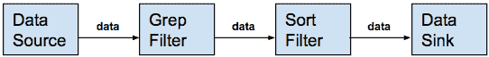
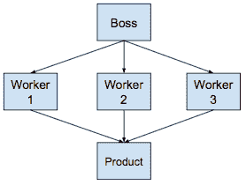
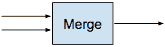
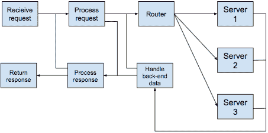
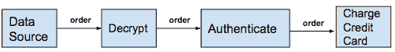
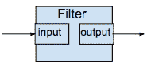

# 使用流水线提高性能

通常，我们觉得需要处理一些数据，并通过一系列步骤进行传递，在数据到达目的地之前进行转换。我们在现实生活场景中遇到了这类过程，尤其是在工厂装配线环境中。

在本章中，我们将了解如何使用管道模式构建基于组件的应用程序。我们将了解如何使用函数组合数据流编程技术来创建灵活的解决方案，这些解决方案不仅健壮，而且在当今的分布式处理环境中性能优异。

本章的目标是完成以下工作：

*   能够确定何时使用管道模式
*   了解如何构建管道
*   了解如何利用缓冲来提高吞吐量
*   使用 Goroutines 和 channels 更快地处理数据
*   使用接口提高 API 的可读性
*   实现有用的过滤器
*   建立一个灵活的管道
*   查看更改筛选器顺序并提交无效数据时发生的情况

## 介绍管道模式

管道软件设计模式用于数据流经一系列阶段的情况，其中前一阶段的输出是下一阶段的输入。每一步都可以看作是以某种方式转换数据的过滤操作。当一个过滤器比连接到它的另一个过滤器运行得快时，经常在过滤器之间实现缓冲，以防止死锁或数据丢失。将过滤器连接到管道类似于函数合成。

下图描述了来自数据源（例如文件）的数据流。数据在从一个过滤器传递到下一个过滤器时进行转换，直到结果最终显示在控制台的 standard out 上：



### Grep 排序示例

`/etc/group`文件是数据源。Grep 是第一个过滤器，它的输入是`/etc/group`文件中的所有行。`grep`命令删除所有不以`"com"`开头的行，然后将其输出发送到 Unix 管道，Unix 管道将该数据发送到`sort`命令：

```go
$ grep "^com" /etc/group | sort com.apple.access_disabled:*:396: com.apple.access_ftp:*:395: com.apple.access_screensharing:*:398: com.apple.access_sessionkey:*:397: com.apple.access_ssh:*:399:
```

让我们说清楚。我们在本章中介绍的行为类似于 Unix 管道，但我们将研究的是在 Go 中实现的管道，主要使用 Go 通道和 Goroutine。同样，我们将不讨论 Go 管道（[https://golang.org/pkg/os/#Pipe](https://golang.org/pkg/os/#Pipe) ）而不是说它们是无缓冲、无结构的字节流。

### 管道特性

管道模式提供了许多在适当设计的应用中所需要的有价值的好处；这些好处如下：

*   提供处理数据的系统的结构
*   将任务划分为连续步骤
*   将每个步骤封装在筛选器中
*   具有一组输入和输出的独立过滤器（独立运行）
*   数据沿一个方向通过管道
*   可配置模块化（读、写、拆分和合并操作）
*   高内聚性，其中过滤器逻辑是自包含的
*   低耦合，过滤器通过连接管道进行通信
*   批处理和在线处理之间的区别消失了

管道模式具有许多特性，使其适合各种用例。我们看到它在从持续集成和部署管道到批处理和流数据处理等技术中得到了应用。如果需要以流水线的方式处理数据流，那么我们应该考虑使用这种流水线模式。

让我们来看看它的优点：

*   **扩展性**：在管道中添加另一个过滤器
*   **灵活性**：连接过滤器的功能组合
*   **性能**：采用多处理器系统
*   **可测试性**：易于分析、评估和测试管道过滤系统

与任何模式一样，我们必须考虑其潜在的问题。

以下是一些缺点：

*   潜在的数据转换开销
*   潜在的死锁和缓冲区溢出
*   如果基础结构丢失过滤器之间的数据流，则可能存在可靠性问题
*   如果筛选器在向下游发送结果后但在指示处理已成功完成之前失败，则可能会重新处理数据（将管道中的筛选器设计为幂等）
*   潜在的大上下文，因为必须为每个筛选器提供足够的上下文来执行其工作

以下是一些高级用例，如果适用，这些用例使此管道模式成为一个有吸引力的候选设计解决方案：

*   处理需求可以分解为一组独立的步骤
*   过滤器操作可以利用多核处理器或分布式计算
*   每个过滤器都有不同的可伸缩性要求
*   必须适应处理步骤重新排序的系统

### 例子

现在，让我们看一些例子来帮助理解这个管道模式的价值和适用性。

#### 网站订单处理

下图描述了从网站向用户显示订单表单的订单流程。沿途的过滤器执行各种任务，例如解密请求负载、验证用户凭据、向客户的信用卡收费、向客户发送确认电子邮件，最后显示感谢页面：


#### 老板-工人模式

在 boss-worker 模式中，**boss**过滤器将数据向下推送到处理数据的工作人员，并将结果合并到**产品**：



#### 负载平衡器

下面的示例显示了一个**负载平衡器**，它接收来自客户端的请求，并将它们发送到积压最少且最有可能处理请求信息包的服务器：


#### 数据流类型

数据流类型可以看作是**读取**、**拆分**、**合并**、**写入**操作：

| **过滤器类型** | **图像** | **接收** | **发送** | **说明** |
| **读** |  |  |  | **读取**过滤器从数据源读取数据，并将信息包发送到下游。 |
| **拆分** |  |  |  | 从同一通道读取多个函数，直到该通道关闭。它通过在一组工作人员之间分配工作以并行化 CPU 使用来提高性能。 |
| **变换** |  |  |  | 此筛选器从上游接收数据，对其进行转换，然后将其发送到下游。 |
| **合并** |  |  |  | 此函数从多个输入通道读取到单个通道，当所有输入关闭时，该通道关闭。工作可以分配到多个 goroutine，这些 goroutine 都从同一个输入通道读取。 |
| **写入** |  |  |  | 此筛选器从上游接收数据并将其写入接收器。 |

##### 积木

这些是基于流的编程系统的基本构建块。通过这些基本操作，我们可以构建任何基于组件的系统：


基于流的编程是一种基于组件的编程模型，它将应用程序定义为交换流的异步处理操作（aka 过滤器）网络（[https://en.wikipedia.org/wiki/Stream_（计算）](https://en.wikipedia.org/wiki/Stream_(computing))）具有定义寿命的结构化信息包，命名端口，以及连接的单独定义。

#### 通用业务应用程序设计

下图描述了处理输入请求并将请求路由到后端服务器的通用业务应用程序的组件组成图。随后将处理、处理和返回来自服务器的响应。对于需要重新路由或重新处理的响应，存在一些备用数据流：



请注意，每个操作都可以交换，只要其输入和输出集相同，而不会影响数据流或应用程序的整体操作。

## 示例实现

现在我们看到了管道模式的价值，让我们开始规划一个 Go 实现。

在 Go 中，管道使用一系列由 Go 通道连接的级来实现。Go 管道从数据源（也称为生产者）开始，具有通过通道连接的阶段，并以数据接收器（称为消费者）结束。

数据源可以是一个生成器函数，它向第一级发送数据，然后关闭初始出站通道。

管道中的每个过滤器（步骤或阶段）：

*   由一个或多个运行相同函数的 goroutine 组成（aka filter）
*   通过一个或多个入站通道接收上游数据
*   以某种方式转换数据
*   通过一个或多个出站通道向下游发送数据
*   在所有发送操作完成时关闭其出站通道
*   保持从入站通道接收值，直到这些通道关闭

变压器功能示例包括：

*   累加器
*   聚合器
*   增量（用于计算资源的两个样本数据点之间的变化）
*   算术

示例数据接收器包括以下各项：

*   文件存储（例如，对 NAS 或 DAS 的 NFS 和 CIFS/SMB 协议访问）
*   消息代理（例如，Kafka、NATS 和 RabbitMQ）
*   数据库（例如，PostgreSQL、MongoDB 和 DynamoDB）
*   云存储（例如 S3、OpenStack Swift 和 Ceph）

### 强制执行

让我们从最简单的管道形式开始我们的编码示例，这当然是使用命令式编程风格实现的。

#### 解密、认证、电荷流图

我们将根据以下流程图编写示例：



我们将从一个阶段到另一个阶段传递订单数据，直到整个流程完成。订单数据可以沿途转换，例如，当**解密**步骤将信用卡号转换为纯文本时。我们将每个阶段或步骤称为过滤器。在我们的示例中，每个过滤器将从上游接收一个订单，并向下游发送一个订单。流动是单向的。从数据源开始，进入**解密**过滤器，然后进入**认证**过滤器，最后进入**收费信用卡**过滤器：

```go
package main

import (
       "fmt"  gc "github.com/go-goodies/go_currency" )
```

我们将进口`go_currency`包，这将帮助我们处理订单行项目中的价格：

```go
type Order struct {
       OrderNumber int
       IsAuthenticated bool
       IsDecrypted bool
       Credentials string
       CCardNumber string
       CCardExpDate string
       LineItems []LineItem
}
type LineItem struct {
       Description string
       Count       int
       PriceUSD    gc.USD
}
```

`GetOrders()`功能将是我们的订单生成数据源。请注意，信用卡号以加密格式存储。我们需要在以后对其进行解密，以便向信用卡收费：

```go
func GetOrders() []*Order {

       order1 := &Order{
              10001,
              false,
              false,
              "alice,secret",
              "7b/HWvtIB9a16AYk+Yv6WWwer3GFbxpjoR+GO9iHIYY=",
              "0922",
              []LineItem{
              LineItem{"Apples", 1, gc.USD{4, 50}},
              LineItem{"Oranges", 4, gc.USD{12, 00}},
              },
       }
```

请注意，我们的信用卡号是加密的，最后一个字段是`LineItem`结构的一部分：

```go
        order2 := &Order{
              10002,
              false,
              false,
              "bob,secret",
              "EOc3kF/OmxY+dRCaYRrey8h24QoGzVU0/T2QKVCHb1Q=",
              "0123",
              []LineItem{
                     LineItem{"Milk", 2, gc.USD{8, 00}},
                     LineItem{"Sugar", 1, gc.USD{2, 25}},
                     LineItem{"Salt", 3, gc.USD{3, 75}},
              },
       }
       orders := []*Order{order1, order2}
       return orders
}
```

在我们的示例中，我们只处理两个订单。我们从`GetOrders()`函数返回它们作为`Order`结构的一部分。

我们调用`GetOrder()`函数来生成订单。接下来，我们对订单进行分类，通过订单处理管道依次运行每个订单：

```go
func main() {
       orders := GetOrders()
       for _, order := range orders {
              fmt.Printf("Processed order: %v\n", Pipeline(*order))
       }
}
```

我们的管道有三个步骤。每个步骤都是一个函数，我们称之为过滤器。我们的订单在处理过程中会经过三个顺序过滤器：

```go
func Pipeline(o Order) Order {
       o = Authenticate(o)
       o = Decrypt(o)
       o = Charge(o)
       return o
}
```

以下是输出：

```go
Order 10001 is Authenticated
Order 10001 is Decrypted
Order 10001 is Charged
Processed order: {10001 true alice,secret 7b/HWvtIB9a16AYk+Yv6WWwer3GFbxpjoR+GO9iHIYY= 0922 [{Apples 1 4.50} {Oranges 4 12.00}]}
Order 10002 is Authenticated
Order 10002 is Decrypted
Order 10002 is Charged
Processed order: {10002 true bob,secret EOc3kF/OmxY+dRCaYRrey8h24QoGzVU0/T2QKVCHb1Q= 0123 [{Milk 2 8.00} {Sugar 1 2.25} {Salt 3 3.75}]}
```

因为我们从可能的最简单示例开始，每个过滤器中都有发生过滤操作的输出，我们在这个简单示例中传递顺序，而不以任何方式转换它：

```go
func Authenticate(o Order) Order  {
       fmt.Printf("Order %d is Authenticated\n", o.OrderNumber)
       return o
}

func Decrypt(o Order) Order {
       fmt.Printf("Order %d is Decrypted\n", o.OrderNumber)
       return o
}

func Charge(o Order) Order {
       fmt.Printf("Order %d is Charged\n", o.OrderNumber)
       return o
}
```

这是管道的基本概念。我们以一个数据包（例如，一个订单）为例，将其从一个步骤传递到另一个步骤，其中每个步骤都是一个具有特定特性的过滤函数。数据可以沿途转换，并沿一个方向从数据源传输到接收器，从而结束该过程。

### 并行实现

为了提高性能，我们应该同时考虑运行。Go 有一些我们可以使用的并发结构：Goroutines 和 channels。让我们试一试：

```go
func main() {
       input := make(chan Order)
       output := make(chan Order)

       go func() {
              for order := range input {
                     output <- Pipeline(order)
              }
       }()

       orders := GetOrders()
       for _, order := range orders {
              fmt.Printf("Processed order: %v\n", Pipeline(*order))
       }
       close(input)
}
```

我们为管道创建了一个输入通道和一个输出通道。

接下来，我们创建了一个立即可执行的 Goroutine 函数。注意 Goroutine 块末尾的开/闭括号：`}()`。在我们关闭主函数最后一行的输入通道之前，这个 Goroutine 不会退出。

我们生成一个订单，就像我们的命令式示例一样。然后，我们通过将下一个订单传递到管道来处理每个订单。

输出与命令示例相同，并且运行速度较慢。因此，我们降低了性能，增加了代码复杂性。我们可以做得更好。

### 缓冲实现

让我们尝试使用输入/输出缓冲区。

在下图中，管道的每个阶段从其输入缓冲区读取数据，并写入其输出缓冲区。例如，**解密**过滤器从数据源读取其流内缓冲区，并写入其输出缓冲区：


因为有两个订单，所以缓冲区大小是两个。由于并发队列的缓冲区共享输入和输出，如果我们有四个命令，那么管道中的所有过滤器都可以同时执行。如果我们有四个可用的 CPU 核，那么所有的过滤器都可以并发运行。

只要输出缓冲区中有空间，管道的一个阶段就可以将它产生的值添加到输出队列中。如果输出缓冲区已满，则新值的生产者将等待空间变为可用。

过滤器可以阻塞，等待命令到达其流内缓冲区或直到其输入通道关闭。

可以有效地使用一次保存多个订单的缓冲区，这可以补偿每个过滤器处理每个订单所需时间的变化。

在最佳情况下，管道中的每个过滤器处理其输入顺序的时间大约与其他过滤器相同。但是，如果**解密**过滤器处理订单的时间远远长于**认证**过滤器，则**认证**过滤器将阻塞，等待**解密**将解密后的订单发送到其输入缓冲区。

下面是我们将如何修改程序以包括缓冲通道：

```go
func main() {
       orders := GetOrders()
       numberOfOrders := len(orders)
       input := make(chan Order, numberOfOrders)
       output := make(chan Order, numberOfOrders)
       for i := 0; i < numberOfOrders; i++ {
              go func() {
                     for order := range input {
                            output <- Pipeline(order)
                     }
              }()
       }
       for _, order := range orders {
              input <- *order
       }
       close(input)
       for i := 0; i < numberOfOrders; i++ {
              fmt.Println("The result is:", <-output)
       }
}
```

以下是输出：

```go
Order 10001 is Authenticated
Order 10001 is Decrypted
Order 10001 is Charged
Order 10002 is Authenticated
Order 10002 is Decrypted
Order 10002 is Charged
The result is: {10001 true alice,secret 7b/HWvtIB9a16AYk+Yv6WWwer3GFbxpjoR+GO9iHIYY= 0922 [{Apples 1 4.50} {Oranges 4 12.00}]}
The result is: {10002 true bob,secret EOc3kF/OmxY+dRCaYRrey8h24QoGzVU0/T2QKVCHb1Q= 0123 [{Milk 2 8.00} {Sugar 1 2.25} {Salt 3 3.75}]}
```

这很好，对吗？我们通过添加缓冲通道来提高性能。我们的解决方案同时在多个核上运行过滤器。

那太好了，但是如果我们处理大量订单呢？

#### 利用所有 CPU 核心

我们可以根据可用的 CPU 内核数量增加缓冲区的数量：

```go
func main() {
       orders := GetOrders()
       numberOfOrders := len(orders)
       cpus := runtime.NumCPU()
       runtime.GOMAXPROCS(cpus)
       input := make(chan Order, cpus)
       output := make(chan Order, cpus)
       for i := 0; i < numberOfOrders; i++ {
              go func() {
                     for order := range input {
                            output <- Pipeline(order)
                     }
              }()
       }
       for _, order := range orders {
              input <- *order
       }
       close(input)
       for i := 0; i < numberOfOrders; i++ {
              fmt.Println("The result is:", <-output)
       }
}
```

使用 I/O 缓冲区是对我们设计的改进，但实际上有更好的解决方案。

### 改进的实施

让我们再看看我们的订单处理流程：


现在，让我们用一个更接近现实的例子来实现**解密、验证**和**信用卡收费**过滤器。

`Order`和`LineItem`结构将保持不变，`GetOrders()`生成器也将保持不变。

#### 进口

我们有更多的进口产品。我们将使用`go_utils`的`Dashes`功能匿名化信用卡号。此外，我们还将导入一些用于解密信用卡号的`crypto`包：

```go
package main

import (
       "log"  "fmt"  gc "github.com/go-goodies/go_currency"  gu "github.com/go-goodies/go_utils"  "strings"  "crypto/aes"  "crypto/cipher"  "crypto/rand"  "encoding/base64"  "errors"  "io"  "bytes" )
```

#### 建筑管道

我们有一个新函数，`BuildPipeline()`，它获取一个过滤器列表，并使用每个过滤器的输入和输出通道连接它们。`BuildPipeline()`功能铺设管道，从数据源开始，到接收器结束，即`Charge`过滤器：

```go
func main() {
       pipeline := BuildPipeline(Authenticate{}, Decrypt{}, Charge{})
```

#### 立即可执行 Goroutine

接下来是立即可执行的 Goroutine，它迭代生成的订单，并将每个订单发送到该过滤器的输入：

```go
go func(){
       orders := GetOrders()
       for _, order := range orders {
              fmt.Printf("order: %v\n", order)
              pipeline.Send(*order)
       }
       log.Println("Close Pipeline")
       pipeline.Close()
}()
```

当所有订单都已发送到管道中时，是时候关闭管道的输入通道了。

#### 接单

接下来，我们执行管道的`Receive()`功能，等待订单到达输出通道，然后打印出订单：

```go
        pipeline.Receive(func(o Order){
              log.Printf("Received: %v", o)
       })
}
```

以下是输出：

```go
order: &{10001 true alice,secret 7b/HWvtIB9a16AYk+Yv6WWwer3GFbxpjoR+GO9iHIYY= 0922 [{Apples 1 4.50} {Oranges 4 12.00}]}
order: &{10002 true bob,secret EOc3kF/OmxY+dRCaYRrey8h24QoGzVU0/T2QKVCHb1Q= 0123 [{Milk 2 8.00} {Sugar 1 2.25} {Salt 3 3.75}]}
Credit card XXXXXXXXXXXX1111 charged 16.50
Credit card XXXXXXXXXXXX5100 charged 14.00
2017/03/08 03:05:36 Close Pipeline
2017/03/08 03:05:36 Received: {10001 true alice,secret 4111111111111111 0922 [{Apples 1 4.50} {Oranges 4 12.00}]}
2017/03/08 03:05:36 Received: {10002 true bob,secret 5105105105105100 0123 [{Milk 2 8.00} {Sugar 1 2.25} {Salt 3 3.75}]}
```

#### 过滤器接口

我们的管道 API 围绕`Filterer`接口构建：

```go
type Filterer interface {
       Filter(input chan Order) chan Order
}
```

#### 过滤物

Filterer 对象有一个方法`Filter`，该方法具有类型为`Order`的输入通道，并返回类型为`Order`的输出通道：



我们定义类型作为`Filter`执行的接收者。管道中遇到的第一个筛选器是 Authenticate 筛选器。下面的验证过滤器有一个类型为`Order`通道的单一输入参数，它返回一个类型为`Order`通道的单一值。

#### 验证过滤器

我们的认证逻辑是硬编码和简单的，也就是说，不是我所说的生产就绪。密码`secret`适用于任何用户名。如果`Authenticate`在`Credentials`字段中遇到`secret`，订单将不变地流向管道中的下一步。但是，如果密码不是`secret`，则订单的`isValid`字段将设置为`false`。管道中的行为或后续过滤器可能受此值的影响：

```go
type Authenticate struct {}
func (a Authenticate) Filter(input chan Order) chan Order {
       output := make(chan Order)
       go func(){
              for order := range input {
                     usernamePwd := strings.Split(order.Credentials, ",")
                     if usernamePwd[1] == "secret" {
                            order.IsAuthenticated = true
                            output <- order
                     } else {
                            order.IsAuthenticated = false
                            errMsg := fmt.Sprintf("Error: Invalid password for order Id: %d", order.OrderNumber)
                            log.Println("Error:", errors.New(errMsg))
                            output <- order
                     }
              }
              close(output)
       }()
       return output
}
```

#### 解密过滤器

下面的`Decrypt`过滤器有一个`Order`通道类型的单一输入参数，它返回一个`Order`通道类型的单一值：

```go
type Decrypt struct {}
func (d Decrypt) Filter(input chan Order) chan Order {
       output := make(chan Order)
       go func(){
              for order := range input {
                     creditCardNo, err := decrypt(order.CCardNumber)
                     if err != nil {
                            order.IsDecrypted = false
                            log.Println("Error:", err.Error())
                     } else {
                            order.IsDecrypted = true
                            order.CCardNumber = creditCardNo
                            output <- order
                     }
              }
```

注意，我们通过记录错误来处理错误。即使我们被告知`IsDecrypted`字段值从源到达时总是错误的，我们也会谨慎行事，如果遇到错误，我们会设置`order.IsDecrypted = false`。

我们仅在订单有效的情况下处理此订单。如果解密函数失败，则顺序可能无效，请参阅前面的代码。订单也可以在流程中的前一步中失效，例如，如果订单的`Authenticate`过滤器失败。

##### 完全处理

当此过滤器的处理完成时，我们关闭其输出通道：

```go
               close(output)
       }()
       return output
}
```

##### ChargeCard 辅助功能

`ChargeCard`函数是`Charge`过滤器用于对订单中找到的信用卡号充值的辅助函数。这个实现只是打印出信用卡是收费的。这是一个很好的占位符，用于真正的信用卡收费逻辑：

```go
func ChargeCard(ccardNo string, amount gc.USD) {
       fmt.Printf("Credit card %v%v charged %v\n", gu.Dashes(len(ccardNo)-4, "X"), ccardNo[len(ccardNo)-4:], amount)
}
```

#### 电荷过滤器

与 API 中的所有其他过滤器一样，`Charge`接受类型为`Order`的输入通道，并返回类型为`Order`的输出通道。

如果订单有效，那么我们使用`total := gc.USD{0, 0}`语句将总额初始化为$0.00，并迭代订单的行项目，执行`Add`函数以获得订单的总额。然后，我们将该金额传递给`ChargeCard`助手函数以收集我们的资金：

```go
type Charge struct {}
func (c Charge) Filter(input chan Order) chan Order {
       output := make(chan Order)
       go func(){
              for order := range input {
                     if order.IsAuthenticated && order.IsDecrypted {
                            total := gc.USD{0, 0}
                            for _, li := range order.LineItems {
                                   total, _ = total.Add(li.PriceUSD)
                            }
                            ChargeCard(order.CCardNumber, total)
                            output <- order
                     } else {
                            errMsg := fmt.Sprintf("Error: Unable to charge order Id: %d", order.OrderNumber)
                            log.Println("Error:", errors.New(errMsg))
                     }
              }
              close(output)
       }()
       return output
}
```

#### encrypt 和 decrypt 助手函数

以下代码中的`decrypt`辅助函数由`Decrypt`过滤器使用。我们也有`encrypt`助手函数，虽然不在我们的管道中，但它可以很好地用于加密纯文本和测试目的。

`decrypt`函数接受加密的字符串值。`aes.NewCipher`接受我们 32 字节长的 AES 加密密钥并返回一个 AES-256 密码块，该密码块被传递给`NewCBCDecrypter`。`NewCBCDecrypter`函数还接受一个初始化向量（`iv`，用于在密码块链接模式下解密块。它的`CryptBlocks`函数用于解密值，`RightTrim`用于切掉尾随的`\x00`。瞧！我们得到了已解密的字符串值：

```go
var AESEncryptionKey = "a very very very very secret key"  func encrypt(rawString string) (string, error) {
       rawBytes := []byte(rawString)
       block, err := aes.NewCipher([]byte(AESEncryptionKey))
       if err != nil {
              return "", err
       }
       if len(rawBytes)%aes.BlockSize != 0 {
              padding := aes.BlockSize - len(rawBytes)%aes.BlockSize  padText := bytes.Repeat([]byte{byte(0)}, padding)
              rawBytes = append(rawBytes, padText...)
       }
       ciphertext := make([]byte, aes.BlockSize+len(rawBytes))
       iv := ciphertext[:aes.BlockSize]
       if _, err := io.ReadFull(rand.Reader, iv); err != nil {
              return "", err
       }
       mode := cipher.NewCBCEncrypter(block, iv)
       mode.CryptBlocks(ciphertext[aes.BlockSize:], rawBytes)
       return base64.StdEncoding.EncodeToString(ciphertext), nil
}
```

```go
func decrypt(encodedValue string) (string, error) {
       block, err := aes.NewCipher([]byte(AESEncryptionKey))
       if err != nil {
              return "", err
       }
       b, err := base64.StdEncoding.DecodeString(encodedValue)
       if err != nil {
              return "", err
       }
       if len(b) < aes.BlockSize {
              return "", errors.New("ciphertext too short")
       }
       iv := b[:aes.BlockSize]
       b = b[aes.BlockSize:]
       if len(b)%aes.BlockSize != 0 {
              return "", errors.New("ciphertext is not a multiple of the block size")
       }
       mode := cipher.NewCBCDecrypter(block, iv)
       mode.CryptBlocks(b, b)
       b = bytes.TrimRight(b, "\x00")
       return string(b), nil
}
```

### 测试应用程序如何处理无效数据

让我们看看我们的应用程序如何处理坏数据。

#### 无效的信用卡密码文本

请注意已附加到加密信用卡号值的 XXX：

```go
func GetOrders() []*Order {

       order1 := &Order{
              10001,
              true,
              "alice,secret",
              "7b/HWvtIB9a16AYk+Yv6WWwer3GFbxpjoR+GO9iHIYY=XXX",
              "0922",
              []LineItem{
                     LineItem{"Apples", 1, gc.USD{4, 50}},
                     LineItem{"Oranges", 4, gc.USD{12, 00}},
              },
       }
```

以下是输出：

```go
2017/03/08 04:23:03 Error: illegal base64 data at input byte 44
2017/03/08 04:23:03 Close Pipeline
2017/03/08 04:23:03 Received: {10002 true bob,secret 5105105105105100 0123 [{Milk 2 8.00} {Sugar 1 2.25} {Salt 3 3.75}]}
order: &{10001 true alice,secret 7b/HWvtIB9a16AYk+Yv6WWwer3GFbxpjoR+GO9iHIYY=XXX 0922 [{Apples 1 4.50} {Oranges 4 12.00}]}
order: &{10002 true bob,secret EOc3kF/OmxY+dRCaYRrey8h24QoGzVU0/T2QKVCHb1Q= 0123 [{Milk 2 8.00} {Sugar 1 2.25} {Salt 3 3.75}]}
Credit card XXXXXXXXXXXX5100 charged 14.00
```

信用卡号无效的订单未完全处理。请注意日志中的错误消息。

#### 无效密码

请注意已附加到凭据字段值的 XXX：

```go
func GetOrders() []*Order {

       order1 := &Order{
              10001,
              false,
              "alice,secretXXX",
              "7b/HWvtIB9a16AYk+Yv6WWwer3GFbxpjoR+GO9iHIYY=",
              "0922",
              []LineItem{
                     LineItem{"Apples", 1, gc.USD{4, 50}},
                     LineItem{"Oranges", 4, gc.USD{12, 00}},
              },
       }
```

以下是输出：

```go
order: &{10001 false alice,secretXXX 7b/HWvtIB9a16AYk+Yv6WWwer3GFbxpjoR+GO9iHIYY= 0922 [{Apples 1 4.50} {Oranges 4 12.00}]}
2017/03/08 04:49:30 Close Pipeline
order: &{10002 false bob,secret EOc3kF/OmxY+dRCaYRrey8h24QoGzVU0/T2QKVCHb1Q= 0123 [{Milk 2 8.00} {Sugar 1 2.25} {Salt 3 3.75}]}
2017/03/08 04:49:30 Error: Error: Invalid password for order Id: 10001
Credit card XXXXXXXXXXXX5100 charged 14.00
2017/03/08 04:49:30 Received: {10002 true bob,secret 5105105105105100 0123 [{Milk 2 8.00} {Sugar 1 2.25} {Salt 3 3.75}]}
```

密码无效的订单未完全处理。请注意日志中的错误消息。

#### 更改身份验证和解密筛选器的顺序

此前，订单为`Decrypt{},Authenticate{}, Charge{}`：

```go
func main() {
       pipeline := BuildPipeline(Authenticate{}, Decrypt{}, Charge{})
```

以下是输出：

```go
order: &{10001 false alice,secret 7b/HWvtIB9a16AYk+Yv6WWwer3GFbxpjoR+GO9iHIYY= 0922 [{Apples 1 4.50} {Oranges 4 12.00}]}
2017/03/08 04:52:46 Close Pipeline
order: &{10002 false bob,secret EOc3kF/OmxY+dRCaYRrey8h24QoGzVU0/T2QKVCHb1Q= 0123 [{Milk 2 8.00} {Sugar 1 2.25} {Salt 3 3.75}]}
2017/03/08 04:52:46 Received: {10001 true alice,secret 4111111111111111 0922 [{Apples 1 4.50} {Oranges 4 12.00}]}
Credit card XXXXXXXXXXXX1111 charged 16.50
2017/03/08 04:52:46 Received: {10002 true bob,secret 5105105105105100 0123 [{Milk 2 8.00} {Sugar 1 2.25} {Salt 3 3.75}]}
Credit card XXXXXXXXXXXX5100 charged 14.00
```

有区别。在这两种情况下，两张发票都得到了充分处理。

#### 试图在解密信用卡号和身份验证之前收费

我们首先构建我们的功能管道：充电、解密和认证。

```go
func main() {
       pipeline := BuildPipeline(Charge{}, Decrypt{}, Authenticate{})
```

以下是输出：

```go
order: &{10001 false alice,secret 7b/HWvtIB9a16AYk+Yv6WWwer3GFbxpjoR+GO9iHIYY= 0922 [{Apples 1 4.50} {Oranges 4 12.00}]}
order: &{10002 false bob,secret EOc3kF/OmxY+dRCaYRrey8h24QoGzVU0/T2QKVCHb1Q= 0123 [{Milk 2 8.00} {Sugar 1 2.25} {Salt 3 3.75}]}
2017/03/08 04:58:27 Error: Error: Unable to charge order Id: 10001
2017/03/08 04:58:27 Error: Error: Unable to charge order Id: 10002
2017/03/08 04:58:27 Close Pipeline
```

#### 试图在身份验证之前收费

这也不足为奇。如果我们在验证请求之前尝试向信用卡收费，则不会处理收费：

```go
func main() {
       pipeline := BuildPipeline(Decrypt{}, Charge{}, Authenticate{})
```

以下是输出：

```go
2017/03/08 05:10:32 Close Pipeline
2017/03/08 05:10:32 Error: Error: Unable to charge order Id: 10001
2017/03/08 05:10:32 Error: Error: Unable to charge order Id: 10002
order: &{10001 false false alice,secret 7b/HWvtIB9a16AYk+Yv6WWwer3GFbxpjoR+GO9iHIYY= 0922 [{Apples 1 4.50} {Oranges 4 12.00}]}
order: &{10002 false false bob,secret EOc3kF/OmxY+dRCaYRrey8h24QoGzVU0/T2QKVCHb1Q= 0123 [{Milk 2 8.00} {Sugar 1 2.25} {Salt 3 3.75}]}
```

### 进一步阅读

关于管道模式的主题可以写一整本书。

本章未涉及的一些主题，但您应自行研究，包括以下内容：

*   `Split`和`Merge`滤波器的设计与实现
*   了解`sync.WaitGroup`类型如何帮助您管理通道通信的同步
*   向管道中添加分支和条件工作流模式

好读：*Go 并发模式：管道和取消*（[https://blog.golang.org/pipelines](https://blog.golang.org/pipelines) 、*举例：频道*（[https://gobyexample.com/channels](https://gobyexample.com/channels)

## 总结

构建具有高内聚性和低耦合性的应用程序是软件工程的一个主要目标。在本章中，我们探讨了管道模式，您学习了如何使用**基于流的编程**（**FPB**技术构建基于组件的系统。我们研究了 FPB 模式和用例，它们将从应用管道模式中受益。

我们研究了一个示例订单处理流程。我们使用 Goroutines 和 channels 从命令式实现发展到并发实现。我们了解了如何有效地使用 I/O 缓冲区一次保存多个订单，以及如何补偿每个过滤器处理每个订单所需时间的变化。

我们上次的实施是对先前尝试的改进。我们基于`Filterer`接口创建了一个优雅的 API。我们能够通过以下命令定义和控制整个订单处理流程：

```go
pipeline := BuildPipeline(Decrypt{}, Charge{}, Authenticate{})
```

最后，我们实现了各种 FPB 错误处理技术，并测试了它们的有效性。

在下一章中，我们将研究另一种用于提高性能的技术：懒惰。