# 单子、类型类和泛型

Go 中的函数式编程：

“我不知道这是不是个好主意，不过我们还是试试吧。”

“考虑起来很有趣；不知道如何使用它。”

“Y 组合子是一个没有实际价值的理论概念。”

“谁能理解这个 Monad 包中的代码。Lambda 什么？泛型？”

请抛开偏见，完成本章，然后问问自己，函数式编程在围棋中有多重要？

本章的目标如下：

*   了解单子是如何工作的
*   学习如何使用`bind`操作组合函数
*   了解`Success`和`Failure`路径是如何工作的
*   了解单子如何处理不纯运算
*   在 Go 中执行一元工作流
*   了解什么是 Lambda 演算，以及它与 monad 的关系
*   查看 Lambda 演算如何实现递归
*   了解 Y 组合器是如何工作的
*   使用 Y-Combinator 控制工作流
*   学习编写简明的工作流程代码，并在最后处理所有错误
*   了解`Type`类是如何工作的，并在 Go 中实现一些
*   回顾仿制药的优缺点

## 特蕾莎·莫纳德修女

你是谁？你是好人还是坏人？其他人会怎么说？你是怎么变成现在这个样子的？

思考这些问题几分钟。

什么是单子？

这个解释就像回答一个问题：你小时候是怎样长大的，现在变成了什么样？

在下图中，我们将探索一个单子：


蓝色的盒子链代表了特蕾莎修女生命中的瞬间。

封闭的蓝色盒子代表她从出生到死亡的私人时间。这些打开的盒子代表了她开放自己与周围世界互动的事件。

让我们假设她在婴儿时期接受了积极的输入（蓝色的箭头）。还假设在这个过程中，她接触到了一些消极的输入（黑暗的箭头）和积极的输入。在每次互动中，她的生活（数据）都以某种方式发生了变化。随着她的成长，她的行为是她的副作用（从打开的盒子中射出的箭头）。

成功可以被定义为死后进入天堂（或者失败后进入地狱）。

那么，什么是单子？这是一种机制，数据流入其中，与不纯净的环境相互作用，转化，最终从另一端出来；它是一种在与外部端点（如日志文件、外部 API、通知等）交互的实际应用程序中构造和控制工作流的方法。

前面的图表应该会提示一些问题。


在[第 4 章](04.html)*中，Go*中的 SOLID Design 中，我们看到了**f**函数如何接收**a**并返回**b**，但我们也认识到，在现实世界中，连接失败，RAM 和磁盘空间可能会填满，错误可能会发生：


为了保持图表的整洁，我们只需向上移动错误箭头，并将其从右侧射出，而不是从下方射出。我们还将把输入和输出箭头涂成蓝色。这是我们纯洁快乐的道路。看见无副作用：

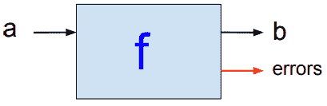

但真正的程序可能会有副作用，对吗？真正的程序与外部 API 接口，接受用户输入，打印发票，发送电子邮件，对吗？真正的东西在哪里？


我们有两个输入匹配我们的两个输出，这样我们就可以很容易地将我们的蓝框链接成一个链。还记得我们讨论有限状态机分解的时候吗？我们拆开了我们申请的各个部分（**C1**、**C2**和**C5**。这些是我们的*可重用组件*。


这样做是为了用单个组件填充我们的工具箱，我们随后可以使用这些组件重新组合我们的应用程序：


有没有想过我们的碎片会重新组合在一起？

如果我们所有的作品都是这样的，那就行不通了：

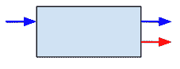

但是，想想这些作品是这样的：


然后它们会像乐高积木一样合二为一！看看它们是如何结合在一起的？

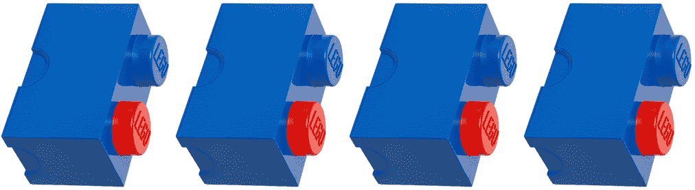

我们怎样才能从一个输入变成两个输入？

### 绑定操作

我们使用 Monad 的 bind 操作完成这一壮举：


在哈斯克尔，这被称为`bind`手术。bind 的其他名称包括`flatMap`、`flatten`、`andThen`、`collect`和`SelectMany`。（这是函数式编程令人困惑的部分原因——不同的语言对同一事物使用不同的名称。）词法工作流称之为`Next`。

更具描述性的名称可能是 adapt、link，甚至是 hard-steff。（在我们的代码示例中，我们将使用名称`Next`，因为它在移动到`Next`步骤的上下文中最有意义。）Bind 是一种模式，它将单输入双输出块调整为双输入双输出块。

现在，让我们来谈谈这两条路径——最上面的蓝色路径是`Success`路径。这就是我们的*快乐之路*，只要一切顺利，我们的数据就会通过这条路流动。底部的红色路径是错误发生的地方。


### 升降机操作

让我们检查一下当链条中第二个部件的提升操作发生错误时会发生什么：

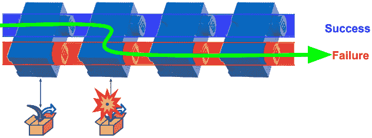

提升将功能提升为*包装的*类型。电梯将我们的功能从一个世界连接到另一个世界。

函子提升单参数函数。一个实用函子提升第二个多参数函数。

这是 Haskell 中电梯操作的类型定义：

`liftA2 :: Applicative f => (a -> b -> c) -> f a -> f b -> f c`

请参见以下终端控制台，了解使用提升操作（`liftA2`将`replicate`功能转换为包装类型的示例。我们使用的是*应用程序样式*，因为我们使用的是任意数量的参数。


请注意，我们不会抛出异常（或恐慌）；相反，我们将应用程序流从`Success`路径移动到`Failure`路径。实际上，这意味着我们不再需要在执行每个可能在代码中失败的命令后检查错误。使用 monad 模式，我们能够将程序流重定向到`Failure`路径，并在后端处理该执行链的所有错误。

现在，我们了解了为什么以及如何获得两个输入和两个输出，让我们看看蓝盒链下发生了什么：

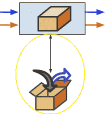

看到箭头进出的打开的盒子了吗？那些是不纯的箭。

还记得我们在[第 9 章](09.html)、*函子、幺半群和泛型、*中关于将元素降低到突变沟中的作用的讨论吗？

这就是我们的单子允许我们在 FP 的纯世界之外打开我们的盒子的地方。我们的单子是一个函子，在这里，我们使用提升的函子运算。

For details about lifting, see the previous chapter.

in 箭头表示与外部世界的交互。例如：

*   管理状态
*   读取日志文件
*   接受来自外部 API 的输入
*   并行处理

向外箭头表示与外部世界的交互。例如：

*   管理状态
*   写入日志文件
*   将输出发送到外部 API
*   并行处理

请记住，在纯函数式编程中，如果程序接收到某个输入值，那么它将始终返回相同的输出。然而，当程序写入日志文件时，它怎么可能每次都有相同的时间戳？单子允许纯 FP 程序保持纯净，并且仍然与不纯净的世界交互。


这是映射/数据转换功能应用于数据的地方。

在我们的特蕾莎修女生命单子的例子中，这（在盒子里）是积极的互动发生的地方，也许是与她亲爱的母亲，这有助于为她指明一个积极的方向。还有什么其他的互动可能会改变她的生活？

任何有用的应用程序如何不管理状态？FP 应用程序如何管理状态并保持纯净？单子。（请参见下表中的状态单子。）

为什么使用 monad 来管理状态？monad 允许以优雅、类型安全、受限、延迟和受控的方式操纵状态。

优雅的单子有什么优雅之处？情人眼里出西施。优雅不再妨碍你。它简单、明显、直截了当，并允许我们通过很少的智力努力立即理解代码的目的：

```go
step := Get(lineBase64)
step = Next(step, Base64ToBytes)
step = Next(step, BytesToData)
step = Next(step, TimestampData)
step = Next(step, DataToJson)
```

那是单子。它没有杂乱，并且很容易看到工作流的作用。

推迟？我们在说什么？为什么不把所有的控制流逻辑放在前面呢？我们知道在所有用例中应该发生什么。为什么不编写所有的 if/then/else 逻辑和 for 循环，并将它们全部烘焙到一个可执行文件中呢？

对于 monad，我们尝试使用尽可能多的纯的、无副作用的函数来编写应用程序。这种编程风格主要将关于如何以及何时改变状态的决定推迟到需要它们的时候。这就是我们打开盒子时发生的事情。

受限有什么限制？嗯，这是一个超负荷的术语。从框架的角度来看，我们正在限制/隔离我们的副作用和现实世界的接口代码到这个有目的的小盒子。它的工作是执行提供给它的特定数据映射转换功能。如果出现任何错误，框架将捕获它们并为我们打包错误，并将确保它们快速沿着`Failure`路径移动，直到它们从执行管道的末端吐出，在那里处理此执行链的所有错误。从数据的角度来看，我们使用类型系统将输入限制为仅有效的数据类型。（如果我们有一个除法运算，我们可以将输入类型限制为`PositiveNumbers`，以确保永远不会发生被零除的异常。）从类型类的角度来看，我们的运算受到单子定律的约束。

什么行动？什么法律？这些操作是一系列任务，我们将这些任务链在一起，对数据执行各种操作。如果我们从汽车列表开始，我们可能希望通过应用以下转换来转换列表：

```go
Filter(ByDomestic()).Map(Upgrade()).Reduce(JsonReducer())
```

最后，我们所说的受控是什么意思？这就是单子闪耀的地方。Monad 提供了链接转换操作的结构。它提供了`Success`和`Failure`路径。现在，我们可以将所有错误处理逻辑放在我们需要为特定用例执行的所有步骤的末尾，而不是在代码中乱丢`if err != nil`错误检查块。

再来一次：什么是单子？Monad 是一种设计模式，它提供了一种将操作链接在一起的方法。`bind`功能是将操作链接在一个链中；它从一个步骤中获取输出并将其输入到下一个步骤中。

我们可以直接使用`bind`运算符编写调用，也可以使用 sugar 语法，使用 Haskell 之类的语言，使编译器插入这些函数调用以供使用。但无论哪种方式，每个步骤都由对`bind`函数的调用分隔开。

由于 Haskell 是一种完全成熟的纯函数式编程语言，我们将经常参考它的 FP，以便思考如何最好地将这种思维/设计方法融入到我们的 Go 解决方案中。

在哈斯克尔，有很多种单子。除了`bind`操作之外，使每个 monad 独特且特别有用的是它所做的事情。我们可以使用 Haskell 中的单子表作为在 Go 中构建单子包的起点：

| **单子** | **说明** |
| **或者** | `Either`类型与`Maybe`类型相似，有一个关键区别——它可以携带`Success`和`Failure`的附加数据。`Left`返回值 to 表示失败，`Right`表示成功。这里有一个有用的双关语：使用*或*来获得*正确的*答案。 |
| **错误** | 允许我们精确定义应用程序的异常处理工作方式。例如，如果在过去 60 秒内处理了类似的异常，我们可以选择忽略特定的异常。 |
| **评估** | 用于通过将算法与并行性分离来模块化并行代码，允许我们通过替换`Strategy`函数来改变并行代码的方式。`Eval`和可交换`Strategies`利用延迟求值来表示并行性。 |
| **故障** | 自动中止执行步骤链，而无需在每次函数调用后进行`if err != nil`条件错误检查。 |
| **免费** | 允许我们从任意类型构造 monad。免费的 monad 允许我们抽象地指定纯函数之间的控制流，并单独定义一个实现。我们使用 monad 将纯函数与特殊用途的控制流粘合在一起，例如故障快速错误处理（`Maybe/Either`或异步计算。 |
| **身份** | `Identity`单子是一个不包含任何计算策略的单子。它只是将绑定函数应用于其输入，无需任何修改。在计算上，没有理由使用`Identity`单子，而不是将函数应用于其参数的简单操作。`Identity`单子的目的是它在单子变压器理论中的基本作用。应用于`Identity`单子的任何单子转换器都会生成该单子的非转换器版本。`Identity`单子与数字零相加。你不能用零来增加另一个数字，但是当你需要写一个`Reduce`函数时，零就很有用了。 |
| **如果** | 如果逻辑条件为 true，则提供简单的控制流来评估子句的结果，否则它将评估 false 块（如果提供）。 |
| **IO** | 将 I/O 与（纯）语言的其余部分分离。在 Haskell 中，返回语句接收不纯净的 I/O 并将其放入`IO`单子。它允许访问不纯净的 I/O 源，如内存、全局变量、网络、本机操作系统调用、标准输入等。下面的 Haskell 代码示例演示了 IO monad：

```go
loveGo :: IO Bool
 loveGo =
 do putStrLn "Do you love Go? (yes/no)"
 inpStr <- getLine
 return ((inpStr) == "yes")
```

 |
| **懒惰** | 它与`StateThread`（ST）monad 相同，只是该 monad 延迟状态操作的评估，直到需要依赖于它们的值为止。 |
| **列表** | 我们可以让每个步骤返回一个结果列表。我们的 bind 函数可以迭代列表，将每个列表输入下一步。这样就不需要编写循环构造来迭代元素列表。写一次并重复使用。 |
| **可能** | 用于处理 nil 值，因为它处理可能不会返回结果的计算。一元操作不返回 nil（或引发异常/恐慌），而是返回一个`Just`值或`Nothing`。错误沿着 monad 结构向下传播，直到到达处理所有错误的出口点。以下是 Haskell 对它的定义：`data Maybe a = Nothing &#124; Just a` |
| **选项** | 用作可能返回 nil/null 值的数据的返回类型。如果数据无效，则返回`Option`单子内的`None`，否则返回`Some`单子内的有效数据。然后，一元函数将链接失败状态，因此，如果函数要求数据有效，但接收到一个包含`None`的`Option`，它将简单地将`Option None`返回到`Next`函数。这种模式类似于命令式语言中的返回`Null`，它解决了[十亿美元的错误](https://en.wikipedia.org/wiki/Null_pointer)。 |
| PARTY T1 | 通过要求程序员提供更多关于数据依赖性的细节，用于模块化并行代码。PAR 提供更多的控制，不依赖于懒惰的评估来管理并行任务。 |
| **解析器** | 用于创建解析器。例如，我们的语法可能如下所示：

```go
addop = "+" &#124; "-".
digit = "0" &#124; "1" &#124; ... &#124; "8" &#124; "9".
expr = term { addop term }.
factor = "(" expr ")" &#124; number.
mulop = "*".
number = [ "-" ] digit { digit }.
term = factor { mulop factor }.
```

我们可以使用解析器 monad 执行数学操作，例如：

```go
ghci> 1+2
 3
```

 |
| **暂停** | 当需要中断和恢复计算时使用。可以提供一个 step 函数，该函数运行计算，直到调用暂停计算的 yield 函数为止，并向调用方返回足够的信息，以便稍后继续计算。有关十几种可能实现的示例，请参见[stackoverflow.com/questions/10236953/the-pause-monad](https://stackoverflow.com/questions/10236953/the-pause-monad)[。](https://stackoverflow.com/questions/10236953/the-pause-monad) |
| **读卡器** | 提供对全局状态的访问。在初始化期间，应用程序可以将配置读取到单个上下文中，该上下文可以传递给后续步骤。也称为**环境**。 |
| **状态** | 提供对状态值的访问。执行某些计算的 run 函数将更新状态并返回最终状态。例如，在在线第一人称射击游戏中，玩家需要知道玩家在游戏的每个阶段的状态：他们的健康状况、弹药量、手上武器的类型、位置或周围区域的地图。状态不是全局的，而是在游戏的每一步中创建的新状态。由于该状态实际上没有执行破坏性更新，因此恢复到旧版本或执行撤消操作更容易。 |
| **ST** | 允许我们在可变状态下安全工作。例如，我们可以解冻一个不可变/冻结的数组，并在适当的位置对其进行修改，然后冻结一个新的不可变数组。ST 还允许我们创建可以修改的数据结构，就像我们在命令式语言中所做的那样。也称为**状态线程 monad**。 |
| **STM** | **软件事务性内存**（**STM**）monad 通过防止我们意外执行可能导致死锁的非事务性 I/O 操作，帮助我们解决同步多个任务的问题。为了在命令式编程中执行并发编程，我们使用必须共享数据的线程。我们必须注意，不同的线程不会不正确地更新共享数据。我们通常使用一种称为**信号量锁**的技术来锁定数据块。使用 STM，我们不需要担心信号量，因为我们的代码不包含锁。注意，在 Go 中，我们用来执行并发编程的语言结构包括 goroutine、channels 和`sync.WaitGroup`。 |
| **作者** | 用来表示一些副作用。通常用于日志记录或调试打印。 |

除了学习 Haskell 的 Monads 实现之外，我们还可以学习其他功能，包括：

*   惰性评估
*   类型类
*   基于布局的语法
*   数据结构的模式匹配
*   有界和参数多态性

更多关于 Haskell 的信息，请访问以下资源：

*   [https://en.wikipedia.org/wiki/Haskell_（编程语言）](https://en.wikipedia.org/wiki/Haskell_(programming_language))
*   [https://www.haskell.org/](https://www.haskell.org/)
*   [http://learnyouahaskell.com/](http://learnyouahaskell.com/)
*   [https://www.huffingtonpost.com/aaroncontorer/haskell-the-language-most_b_4242119.html](https://www.huffingtonpost.com/aaroncontorer/haskell-the-language-most_b_4242119.html)

### 一元函数

Monad 被实现为一个类型类，有两种方法，`return`和 bind（`>>=`：

```go
class Monad m where
 return :: a -> m a 
 (>>=) :: m a -> (a -> m b) -> m b
```

注意，`m`是指实现`Monad`类型类的类型构造函数，如`Either`或`Maybe,`。

我们将在下表中包括标准库中的一些更多的一元函数：

| **功能** | **说明** |
| **失败** | fail 函数支持 monad 的 failure 实现。我们从`Monad`类型类中获得`fail`函数，它允许失败的模式匹配在当前 monad 的上下文中导致失败，而不是程序崩溃。例如，当 do 表达式中的模式匹配失败时，调用`fail`函数。`fail :: Monad m => String -> m a` |
| **fmap** | `fmap`来自函子类型类。`fmap`对普通值`a -> b`应用函数，并将其提升为容器`f a -> f b`上的函数，其中`f`为容器类型：`fmap :: Functor f => (a -> b) -> f a -> f b` |
| **mplus****mzero** | 

`MonadPlus`是扩展`Monad`类的类型类，提供`mzero`和`mplus`：

`class Monad m => MonadPlus m where`
`mzero :: m a`
`mplus :: m a -> m a -> m a``mplus`将两个结果合并为一个结果。`mzero`表示一个空结果。 |
| **返回** | 返回是我们的提升功能。不要把`return`和围棋中的“回报”混淆起来。这样想：**将**一个纯值**a**（属于**a**类型）返回到一个单子**MA**（属于**单子 a**类型）。词法工作流解决方案调用此函数`Get`。 |
| **（>>=）** | （`>>=`）运行操作，然后将其结果传递给也返回操作的函数。两个操作都将运行，最终结果是第二个操作的结果。我们可以将（`>>=`视为我们的链接功能：

```go
main.hs:

module Main (main) where
 import Lib
 main :: IO ()
 main = do
 putStrLn "Enter your first name:" >>
 getLine >>=
 (\yourName -> putStrLn $ "Hello, " ++ yourName)
```

将以下内容添加到 Haskell ghci 控制台：

```go
*Main Lib> main
 Enter your first name:
 CocoPuff
 Hello,
CocoPuff
```

（`>>=`也称为**结合**。词法工作流解决方案调用此函数`Get`。下面是它的类型定义：

```go
(>>=) :: Monad m => m a -> (a -> m b) -> m b
```

 |
| **（>>** | （`>>`按顺序执行两个动作。第一个操作的结果是放弃。我们保留的是第二次操作的结果：

```go
*Main Lib> putStr "Hello, " >> putStrLn "CocoPuff"
 Hello, CocoPuff
```

（`>>`是根据丢弃其参数的`bind`操作定义的。以下说明（`>>`有一个左右参数，该参数是一元的，类型为`m a`和`m b`：

```go
(>>) :: Monad m => m a -> m b -> m
```

 |

#### 基本一元函数

下表包括一些更常用的单子（用于合成、循环和映射）：

| **功能** | **说明** |
| **表格** | `forM`就像一个迭代器，将一个动作映射到一个列表上，并返回转换后的列表。`forM`的用途与`mapM`相同，存在的目的是为了可读性。经验法则是，如果 for 循环中有多行代码，则使用`forM`。例如：

```go
results <- forM items $ \item -> do
    -- A big do-block using `item`.
forM :: (Monad m, Traversable t) => t a -> (a -> m b) -> m (t b)
```

 |
| **永远** | 

`forever`是用于重复动作 `forever`的组合符，如下所示：

```go
forever :: Applicative f => f a -> f b
```

 |
| **mapM** | `map`操作在转换列表中的元素时执行突变，对吗？但这怎么可能呢？纯函数不能改变变量。我们可以使用`mapM`间接执行动作。`mapM`可以更改列表中元素的值，因为它在 IO monad 中运行，如下所示：

```go
mapM :: (Monad m, Traversable t) => (a -> m b) -> t a -> m (t b)
```

 |
| **序列** | 用于按从左到右的顺序评估每个动作并收集结果，如下所示：

```go
sequence :: (Monad m, Traversable t) => t (m a) -> m (t a)
```

 |
| **无效** | 用于丢弃 IO 操作的返回值，如下所示：

```go
void :: Functor f => f a -> f ()
```

 |
| **（<<** | 这与`>>=`相同，但参数互换，如下所示：

```go
(=<<) :: Monad m => (a -> m b) -> m a -> m b
```

 |
| **（>=>** | 用于通过从左到右的 Kleisli 合成来合成单子，如下所示：

```go
(>=>) :: Monad m => (a -> m b) -> (b -> m c) -> a -> m c
```

 |
| **（<=<** | 这与`>=>`相同，但参数互换（使用从右到左的 Kleisli 组合），如下所示：

```go
(<=<) :: Monad m => (b -> m c) -> (a -> m b) -> a -> m c
```

 |

注意此处未列出的`functionName_`功能用于副作用。例如，当我们想要评估这样一个列表的效果时，我们使用`sequence_`和`mapM_`，这两个选项会丢弃结果。

### 一元列表函数

列表需要记住的是，它们是非决定论的模型。值列表`a`表示`a`值的多种不同可能性。

| **功能** | **说明** |
| **过滤器项** | 在单子内代替`filter`使用，如下所示：

```go
filterM :: Applicative m => (a -> m Bool) -> [a] -> m [a]
```

 |
| **foldM** | 用于代替 foldl，其中从列表构建的一元计算从左向右绑定，如下所示：

```go
foldM  :: (Monad m, Foldable t) => (b -> a -> m b) -> b -> t a -> m b
```

 |
| **加入** | 用于展平组的嵌套，如下所示：

```go
> join [[[1]]]
 [[1]]

 > join [[1]]
 [1]
join :: Monad m => m (m a) -> m a
```

 |
| **msum** | 下面的示例最好地描述了基于列表的 concat 函数：

```go
> msum [Nothing, Nothing, Just "A", Just "B"]
 Just "A"

> msum [[],[1,2],[],[3]]
 [1,2,3]
msum :: (MonadPlus m, Foldable t) => t (m a) -> m a
```

 |
| **复制项目** | 用于执行一个动作`n`次并收集结果，如下所示：

```go
replicateM :: Applicative m => Int -> m a -> m [a]
```

 |
| **zipWithM** | 用于合并两个列表，在此过程中应用特殊规则。`zipWithM`是列表上`zipWith`函数的一元版本。当只有一元计算的副作用时，它是有用的，如下所示：

```go
zipWithM :: Applicative m => (a -> b -> m c) -> [a] -> [b] -> m [c]
```

 |

## 一元工作流的实现

首先，我们从一个文件中读取汽车数据，该文件包含表示汽车的 base64 编码文本字符串，可在`cars.base64`中找到：

```go
4-purely-functional/ch10-monads/01_car_steps/data/cars.base64
eyJjYXIiOnsidmluIjoiREc1NDVIRzQ5NDU5WiIsIm1ha2UiOiJUb3lvdGEiLCJtb2RlbCI6IkhpZ2hsYW5kZXIiLCJvcHRpb25zIjp7Im9wdGlvbl8xIjoiSGVhdGVkIFNlYXRzIiwib3B0aW9uXzIiOiJQb3dlciBTdGVlcmluZyIsIm9wdGlvbl8zIjoiR1BTIn19fQ0K
eyJjYXIiOnsidmluIjoiMzQ4NTQzOTg1QVpERCIsIm1ha2UiOiJMZXh1cyIsIm1vZGVsIjoiSVMgMjUwIiwib3B0aW9ucyI6eyJvcHRpb25fMSI6IlN0aWNrIFNoaWZ0Iiwib3B0aW9uXzIiOiJNb29uIFJvb2YiLCJvcHRpb25fMyI6IkxlYXRoZXIifX19DQo=
eyJjYXIiOnsidmluIjoiTUZORkg2NkZCWlE5OSIsIm1ha2UiOiJIb25kYSIsIm1vZGVsIjoiQWNjb3JkIiwib3B0aW9ucyI6eyJvcHRpb25fMSI6IkFsbG95IFdoZWVscyIsIm9wdGlvbl8yIjoiUG93ZXIgU3RlZXJpbmcifX19
```

我们的 car 处理 monad 将获取该 base64 文本、时间戳并输出 JSON，如下代码所示：

```go
{
  "car": {
    "vin": "MFNFH66FBZQ99",
    "make": "Honda",
    "model": "Accord",
    "options": {
      "option_1": "GPS",
      "option_2": "Alloy Wheels"
 }
  },
  "timestamp": "20171030003135"
}
```

让我们从`main.go`开始。我们进口两个项目包，`workflow`和`utils`。我们还从 Go 标准库中导入`bufio`和`os`以处理我们的`base64`文本文件。

我们将项目包放在导入包列表的顶部。我们导入*工作流*和*utils*。在本书中，我们大量使用了 utils 包中的日志记录和配置功能。为了变得懒惰，我们只需要记住，我们可以在任何地方使用`Config`对象，并引用`config.toml`文件中的值。同样，要使用我们的信息记录器，我们可以简单地键入`Info.Println`。

在 Go 中，首先编写测试被认为是最佳实践。这就是所谓的**测试驱动开发**。我们在第一章中讨论了这一点。您应该以这种方式编写应用程序。然而，在[第 2 章](02.html)之后，M*操作集合，*示例代码更频繁地出现在`main.go`文件中（没有测试文件）。我之所以这么做，是因为我是一个懒惰的程序员，不喜欢键入超出绝对必要的内容，我认为这能更快/更好地传达这一教训。当我选择在调用 Config 和 Info、Debug 和 Error 记录器时消除包引用需求时，我使用了类似的推理。您应该在工作中使用全局记录器和配置对象吗？可能不会。为什么？因为它们是依赖项，应该显式地传递到使用它们的每个函数中。[第 7 章](07.html)*功能参数*说明了如何实现这一点。更多信息，请参见[http://peter.bourgon.org/go-best-practices-2016/](http://peter.bourgon.org/go-best-practices-2016/) 。

在下面的`main.go`中，我们导入包并运行初始值设定项。

```go
package main

import (
   "workflow"
 . "utils"
 "bufio"
 "os"
)

func init() {
   GetOptions()
   InitLog("trace.log", os.Stdout, os.Stdout, os.Stderr)
   Info.Println("AppEnv:", Config.AppEnv)
}

```

`init`函数将在我们的`main`函数之前执行。我们调用`GetOptions`将`config.toml`文件中的值读入全局`Config`变量。

对这是一个全局变量。还有更多。例如，Debug、Info 和 Error 是我们的全局记录器。

您是否想知道为什么我敢使用纯 FP 概念（如 Monads）将全局变量放入示例应用程序中？

这本书是关于改进应用程序开发方法的。Go 是一种多范式语言，允许我们将纯 FP 与现有代码混合使用。`01_car_steps`应用程序包括一个带有全局记录器对象的命令式框架，以及一些处理工作流的纯 FP 代码。

这是一个小型应用程序，因此拥有一个全局记录器非常方便。如果这是一个更大的项目，那么最好为每个服务实例使用一个记录器。
虽然本书确实涵盖了理论以及纯 FP 的一些历史，但本书的主要目标是实用。我希望您能够在自己的项目（或至少是一些概念）中使用本书中的一些代码，自己构建更好的应用程序。

调试、信息和错误都分配了一个`log.New`对象（[https://golang.org/pkg/log/#New 返回一个`*Logger`的](https://golang.org/pkg/log/#New)。如果您想从各种 goroutine 中同时使用它，那么应该将这些记录器对象作为指针传递。

我们可以在`config.toml`文件中调整我们的应用程序设置，如下所示：

```go
# Full path to the file containing the base64 car strings
data_filepath = "./data/cars.base64"

# Runtime environment
app_env = "development"

# Level options: panic, error, info, debug
log_level = "debug"

# The character(s) used to preface debug lines
log_debug_chars = ">>"

# Whether to include timestamps and log level on all log entries
log_verbose = true

# Enable or disable logging of utils/TimeTrack() (For benchmarking/debugging)
log_timetrack = true

# i18n translation file name, see github.com/nicksnyder/go-i18n
i18n_filename = "en-us.all.json"
```

最后一个设置可以告诉我们的应用程序使用哪个翻译文件。在本章后面，我们将了解如何使用`go-i18n`使用消息 ID 引用适当的消息，以及如何根据适当的语言/区域设置更改翻译文本。在第一个示例中，我们不会添加错误消息的国际化（I18N）来保持简单，这样我们就可以专注于理解 monad 是如何工作的。

`log_ settings`会影响应用程序运行时记录的内容。我们将在本章后面看到一些如何使用它们的示例。

我们的`main`函数初始化一个`carCntr`来计算我们已经处理了多少辆车。接下来，我们使用配置文件中设置的`Config.DataFilepath`值打开数据文件。

习语是以某种语言为母语的人所固有的一种说话方式。在英语中，习语通常有比喻的意思，利用图片帮助我们形象化这个意思。例如，*击中头部*、*烫手山芋*、*探戈需要两个人*等等。

下面的`if`语句以 idomatic 样式 Go 打开文件。

`Config.DataFilepath`值`./data/cars.base64`来自我们的`config.toml`文件：

```go
# Full path to the file containing the base64 car strings
data_filepath = "./data/cars.base64"
```

让我们仔细看看这一行代码，看看我们能学到什么：


我们从 if 语句开始，就像在典型的`if...then`else 语句中一样，但是在`if`之后，我们执行一个打开数据文件的语句，而不是立即检查布尔值（true/false）。该语句为 err 赋值。如果`err == nil`，则我们知道文件已成功打开。这个特殊的习惯用法在 Go 标准库中使用了大约 100 次。我们在 Go 标准库中找到的编码样式应该被模拟，特别是那些出现过多次的样式。

本书的目的不是要从工具箱中删除惯用的 Go，而是向工具箱中添加简单而强大的 FP 工具。*如果你的唯一锤子在编程中是必须的，那么每个迭代钉子看起来就像一个 for 循环*。事实并非如此。使用映射、过滤器、约化、函子、幺半群和/或单子可以更好地解决某些迭代任务。

在下面的`main`函数中，我们初始化汽车计数器并打开配置文件。

```go
func main() {
   carCntr := 0
 if file, err := os.Open(Config.DataFilepath); err == nil {
```

打开文件后，最好立即推迟关闭文件。（Go 标准库使用 defer 超过 100 次。）这样，我们就不会忘记关闭文件，这是一个经常发生的错误，会导致内存泄漏，并且很难排除故障。defer 是 Go 为我们提供的另一个令人愉快的工具，帮助我们编写更好的代码。

我们执行 bufio 的`NewScanner`命令打开文件，并将其内容加载到 scanner 变量中，以便逐行读取文件。

为简单起见，我们选择从文件中读取 cars，但我们可以从来自其他 I/O 源的输入流中读取数据，例如：

*   ActiveMQ
*   纳茨
*   卡夫卡
*   红隼
*   NSQ
*   兔子
*   雷迪斯
*   Ruby-NATS
*   ZeroMQ

重要的是，您从中读取的源代码的接口需要实现`Reader`接口。如果我们查看 Go 标准库中的`NewScanner`实现，我们可以看到它需要一个`io.Reader:`

```go
// NewScanner returns a new Scanner to read from r.
// The split function defaults to ScanLines.
func NewScanner(r io.Reader) *Scanner {
   return &Scanner{
      r:            r,
      split:        ScanLines,
      maxTokenSize: MaxScanTokenSize,
   }
}
```

`io.Reader`是一个具有一种方法`Read`的接口。因此，换句话说，我们从中获取数据的 API 需要有一个`Read`方法：

```go
type Reader interface {
   Read(p []byte) (n int, err error)
}
```

这是我们应该学习模仿的另一种模式，从 Go 标准库：*程序到接口*。这里，感兴趣的接口是一个具有`Read`方法的对象。

我们可以在 for 循环中使用扫描仪的`Scan`方法。我们将继续迭代，直到没有更多的行可读取：

```go
   defer file.Close()
Info.Println("----")
   scanner := bufio.NewScanner(file)
   for scanner.Scan() {
       carCntr += 1
 Info.Println("Processing car #", carCntr)
       line :=  scanner.Text()
       Info.Println("IN :", line)
```

现在，我们已进入循环，并已打印出第一行内容（第一辆车）：

```go
Processing car # 1
IN : eyJjYXIiOnsidmluIjoiREc1NDVIRzQ5NDU5WiIsIm1ha2UiOiJUb3lvdGEiLCJtb2RlbCI6IkhpZ2hsYW5kZXIiLCJvcHRpb25zIjp7Im9wdGlvbl8xIjoiSGVhdGVkIFNlYXRzIiwib3B0aW9uXzIiOiJQb3dlciBTdGVlcmluZyIsIm9wdGlvbl8zIjoiR1BTIn19fQ0K
```

接下来，我们调用 monad 来执行处理输入行（我们的第一辆车）所需的工作流：

```go
err, carJson := workflow.ProcessCar(line)

if err == nil {
Info.Println("OUT:", carJson)
}
```

处理输入后，我们检查错误并输出结果：

```go
OUT: {"car":{"vin":"DG545HG49459Z","make":"Toyota","model":"Highlander","options":{"option_1":"Heated Seats","option_2":"Power Steering","option_3":"GPS"}},"timestamp":"20171030145251"}
```

`main`的其余部分打印一些破折号，检查扫描仪错误并关闭另一个 if-else 块。

```go
          Info.Println("----")
       }
       if err = scanner.Err(); err != nil {
         Error.Error(err)
       }
   } else {
      Error.Error(err)
   }
}
```

上述代码的输出如下所示：

```go
AppEnv: development
----
Processing car # 1
IN : eyJjYXIiOnsidmluIjoiREc1NDVIRzQ5NDU5WiIsIm1ha2UiOiJUb3lvdGEiLCJtb2RlbCI6IkhpZ2hsYW5kZXIiLCJvcHRpb25zIjp7Im9wdGlvbl8xIjoiSGVhdGVkIFNlYXRzIiwib3B0aW9uXzIiOiJQb3dlciBTdGVlcmluZyIsIm9wdGlvbl8zIjoiR1BTIn19fQ0K
OUT: {"car":{"vin":"DG545HG49459Z","make":"Toyota","model":"Highlander","options":{"option_1":"Heated Seats","option_2":"Power Steering","option_3":"GPS"}},"timestamp":"20171030145251"}
----
Processing car # 2
IN : eyJjYXIiOnsidmluIjoiMzQ4NTQzOTg1QVpERCIsIm1ha2UiOiJMZXh1cyIsIm1vZGVsIjoiSVMgMjUwIiwib3B0aW9ucyI6eyJvcHRpb25fMSI6IlN0aWNrIFNoaWZ0Iiwib3B0aW9uXzIiOiJNb29uIFJvb2YiLCJvcHRpb25fMyI6IkxlYXRoZXIifX19DQo=
OUT: {"car":{"vin":"348543985AZDD","make":"Lexus","model":"IS 250","options":{"option_1":"Stick Shift","option_2":"Moon Roof","option_3":"Leather"}},"timestamp":"20171030145251"}
----
Processing car # 3
IN : eyJjYXIiOnsidmluIjoiTUZORkg2NkZCWlE5OSIsIm1ha2UiOiJIb25kYSIsIm1vZGVsIjoiQWNjb3JkIiwib3B0aW9ucyI6eyJvcHRpb25fMSI6IkFsbG95IFdoZWVscyIsIm9wdGlvbl8yIjoiUG93ZXIgU3RlZXJpbmcifX19
OUT: {"car":{"vin":"MFNFH66FBZQ99","make":"Honda","model":"Accord","options":{"option_1":"Alloy Wheels","option_2":"Power Steering"}},"timestamp":"20171030145251"}
----
```

让我们看看运行这一行时会发生什么：

```go
err, carJson := workflow.ProcessCar(line)
```

我们导入`utils`以便记录错误：

```go
//src/workflow/process_car_steps.go

package workflow

import (
   . "utils"
)
```

我们的`ProcessCar`功能清楚地表达了我们的业务意图。它接受 base64 编码的字符串，并以惯用的 Go 样式返回错误和结果（`carJson`。如果一切顺利，我们的错误将为零，`carJson`将被填充。

工作流体现了我们的业务逻辑。代码的其余部分是框架。

请注意，`ProcessCar`中并没有错误检查代码，而是工作流中的每个步骤都是不言自明的。

此图说明了我们工作流程中的每个步骤：


我们通过使用输入`lineBase64`调用`Get`函数来初始化 step 变量。这将启动我们的工作流程：

```go
func ProcessCar(lineBase64 string) (err error, carJson string) {
   step := Get(lineBase64)
   step = Next(step, Base64ToBytes)
   step = Next(step, BytesToData)
   step = Next(step, TimestampData)
   step = Next(step, DataToJson)
   json, err := step(nil)
   if err != nil {
      Error.Error(err)
   } else {
      carJson = json.(string)
   }
   return
}
```

让我们在`monad.go`中查看`Get`函数的实现：

`src/workflow/monad.go`

```go
package workflow

type Data interface{}
```

这就是空界面！小心海盗！


这个海盗是对的。在我们的示例中，我们确实在函数工具箱中使用了反射。例如，为了获得传递给`ioutil.Readfile`函数的文件名，我们必须将文件名参数从空`interace{}`数据向下转换为字符串。

以下是一段来自`src/workflow/toolbox.go`的片段：

```go
func Base64ToBytes(d Data) Monad {
   dString := d.(string)
   return func(e error) (Data, error) {
      return base64.StdEncoding.DecodeString(dString)
   }
}
```

如果 Go 支持泛型，我们就不需要这样做。我们只需要稍微修改代码以接受泛型数据类型。那么上面的`ReadFile`函数应该是这样的：

```go
func Base64ToBytes(<T>) Monad {
   return func(e error) (Data, error) {
      return base64.StdEncoding.DecodeString(T)
   }
}
```

这大约减少了 30%的代码，而且运行速度更快，因为类型转换是一个相对昂贵的操作。在这种情况下，如果 Go 支持泛型，编译器将在编译的`ReadFile`函数中创建一个字符串形状的孔，我们可以将字符串传递到该孔中。

在这种情况下，如果 Go 支持泛型，我们可以少写大约 30%的代码，我们的代码将是类型安全的，并且速度非常快。

很容易理解为什么这么多程序员对这个话题如此重视。

如果反射的运行时成本太高，那么我们可以利用元编程工具，如`clipperhouse/gen`生成重复的样板代码，以处理反射将为我们处理的所有数据类型。（如果我们采用这种类型安全的方法，并将支持类型安全、无反射代码所需的代码与支持泛型的情况下所需编写的代码进行比较，我们可能会发现要维护的代码比使用泛型时少 80%左右。）

在开始考虑跳到 Haskell 或 java 泛泛型之前，考虑一下 GO 的好处：简单性、性能、并发支持等等。使用工具生成类型安全代码非常容易，当 Go 有一天（祈求好运）支持泛型时，我们应该能够相当容易地删除生成的样板代码并简单地使用泛型。

这是我们的`Monad`类型。该函数接受一个`error`并返回转换后的`Data`和`error`：

```go
type Monad func(error) (Data, error)
```

关于`Monad`的工作方式，我们能猜到什么？也许如果它得到一个错误，它会很快失败并传递错误，或者，它会继续处理并传递数据以及错误的 nil？

听起来有点像`Continuation Passing Style`（`CPS`）编程，但它是如何工作的？还记得在[第 4 章](04.html)*中，围棋中的立体设计*中，当我们得知单子是紫色的时候吗？

我们看到了如下函数的组合：

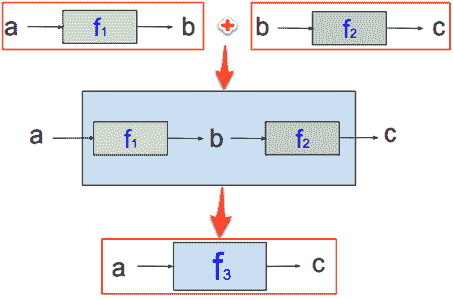

我们了解到，为了成为 Monad，我们需要我们的函数接受**a**并返回如下所示的 a：


这会给我们联想性：


我们将调用`Get`方法，将数据提升到纯 FP 的世界中。它接受数据并返回一个`Monad`。请注意，我们的`Data`、`d`是咖喱：

```go
func Get(d Data) Monad {
   return func(e error) (Data, error) {
      return d, e
   }
}
```

这是我们将数据放在 monad 链的第一个蓝色框中的地方：


初始化步骤后，我们调用第一个数据转换函数`Base64ToBytes`（在`workflow/process_car_steps.go`中）：

```go
step := Get(lineBase64)
```

让我们回到`monad.go`来看`Next`函数的实现：

```go
func Next(m Monad, f func(Data) Monad) Monad {
   return func(e error) (Data, error) {
      newData, newError := m(e)
      if newError != nil {
         return nil, newError
      }
      return f(newData)(newError)
   }
}
```

`Next`函数接受一个单子和一个函数，该函数返回一个单子，自身返回一个单子。

就这样。这就是我们得到紫色单子的方法，它取 a，返回 a。


我们`Next`函数的第一行看起来很熟悉：

```go
return func(e error) (Data, error) {
```

这是因为该行与 Get 方法中的第一行完全相同。在下面的行中，我们调用我们的 monad，将我们的错误作为其参数传递，并得到转换后的数据`newData`，以及返回的`newError`值：

```go
newData, newError := m(e)
```

就是在这里，我们的堆栈填满了`workflow.Next`monad 函数。我们的调用堆栈如下所示：

```go
workflow.Next (Base64ToBytes)
workflow.Next (BytesToData)
workflow.Next (TimestampData)
workflow.Next (DataToJson)
workflow.ProcessCar
main.main
```

这是我们连接步骤并跳回`Get`以获取数据的地方（在 return 语句中）：

```go
func Get(d Data) Monad {
   return func(e error) (Data, error) {
      return d, e
   }
}
```

如果我们是电工，我们会关掉电源，给房子里的灯接上电线，然后再打开电源，看看我们的接线是否正确。

一旦执行从`return d, e`语句返回，我们就点击`if newError != nil`错误检查块：

```go
func Next(m Monad, f func(Data) Monad) Monad {
   return func(e error) (Data, error) {
      newData, newError := m(e)
      if newError != nil {
         return nil, newError
      }
      return f(newData)(newError)
   }
}
```

如果出现错误，则返回数据为零，返回`newError`；所有后续的错误检查都将传递相同的`newError`，直到我们的执行在 monad 链的末尾吐出错误为止。

如果没有发生错误，则执行最后一次返回：`return f(newData)(newError)`。这是什么？以前见过这样的函数调用吗？

```go
someFunction(val1)(val2)
```

这种语言结构被称为 Y 组合子。在深入研究 Go 中 Y-Combinator 实现的细节之前，让我们先想想它是什么以及它的起源，Lambda 演算。

### λ演算

Lambda 演算从计算的角度定义了函数。它由三部分组成：

*   变量（x、y、z 等）
*   创建函数的一种方法（使用“\”符号）
*   应用函数的方法（替换）

其他的一切都是根据编码这三件事来定义的。

在[第 7 章](07.html)中，我们定义了一个函数，其中**f**是函数名，**x**是输入值，结果是整个表达式**f（x）**：


如果*f（x）=x+2*，那么我们知道每次输入值 3 时，输出值总是 5。所以，函数就像黑匣子，我们在其中输入值，然后输出不同的值。既没有内部隐藏数据，也没有副作用。

然而，在 lambda 演算中，我们使用匿名的、未命名的函数。在 lambda 微积分中，我们如何表达*f（x）=x+2[T1”？*

我们在 lambda 演算中构建函数的方法是使用表达式，如下图所示：


`\x`之后的句点只是一个符号，它将函数签名（其参数 x）与其主体（在我们的示例中为`x+2`）分开。

在下面的示例中，`3`是输入参数：

```go
(\x. x+2) 3
```

结果是`5`。

在数学课上，我们习惯于这样编写函数应用程序：f（3）。在 lambda 微积分中，我们说（f3）。

函数应用程序关联到左侧，因此`(f a b c) = (((f a) b) c)`。

当应用一个函数时，我们只是简单地用我们的参数替换我们身体中的 x，在那里执行计算，例如`x+2`。让我们尝试另一个需要两个参数的方法：

```go
(\x.\y. (x+y)/2) 3 5
```

这将返回一个参数函数，该函数还返回一个参数函数，然后返回结果：

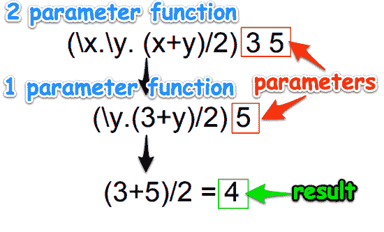

我们刚才所做的被称为**currying**，其中多个参数的函数实际上只是接受一个参数并返回函数的高阶函数。

我们前面使用的数字（**2**、**3**、**5**）和运算符（+、/）不是 lambda 演算的一部分。我们只是用它们来编码计算。

Lambda 演算没有数据类型，但我们可以使用函数表示数据类型。让我们创建布尔数据类型：

| **布尔函数** | **说明** |
| `true := \x.\y.x` | `true`函数是两个参数（x 和 y）的函数，返回第一个参数（x）。 |
| `false := \x.\y.y​` | `false`函数是两个参数（x 和 y）的函数，返回第二个参数（y）。 |

让我们定义逻辑求反函数，而不是：

| **布尔表达式** | **说明** |
| （\b.b 假-真）真 | 应用于 false 和 true 的 lambda b 返回 true |
| （\b.b true false）false | 应用于 true 和 false 的 lambda b 返回 false |

我们已经看到斐波那契函数是递归的：


我们根据`fib`函数本身定义了它。这使得 fib 函数递归。

让我们从使用 Lambda 演算定义 for 循环开始。

也许我们可以形成一个表达式 a 来调用它自己，比如，将函数应用到它自己。那会是什么样子？

```go
forLoop := (\x.x x) (\x.x x)
```

让我们看看它是如何工作的：


`\x.x x`接受输入`x`并将`x`应用于自身。我们的函数以`x`为输入，复制`x`两份。这就是所谓的自我应用。

递归是关于根据自身定义某些东西。

让我们看看执行两次递归时的情况：


我们可以看到这一进程如何无限期地继续下去。这就是我们如何使用 Lambda 演算编码循环行为。

既然我们知道了如何对 for 循环进行编码，那么如何对递归进行编码呢？

让我们定义一个通用递归函数，如下所示：

```go
recursive f = f(recursive f)
```

也就是说，递归`f`等于应用于递归`f`的`f`。

当我们运行这个函数时，它会重复应用`f`，我们会得到：`f(f(f(...)))`。以下是 Y 组合器：

```go
Y = \f.(\x.f(x x)) (\x.f(x x)) 
```

它不是递归的，但它编码递归。这就是我们如何在不支持递归的语言中实现递归的方法。

准备好看看如何在 Go 中实现 Y-Combinator 了吗？

但是等等，还有更多。

让我们停下来思考一下 Y-Combinator 在生物工程中的应用。递归基因组函数可以使用 Y 组合器建模。有什么证据证明 Lambda 演算是实用的？照镜子：


有关*递归基因组功能的更多信息——佩利奥尼斯原理*，请参见[http://www.junkdna.com/recursivegenomefunction/](http://www.junkdna.com/recursivegenomefunction/) 。

你知道吗，你的基因可以被测序和异常检测，以表明你对某些疾病的易感性，比如帕金森病？你越早知道，就越早采取预防措施。
见[https://en.wikipedia.org/wiki/Disease_gene_identification](https://en.wikipedia.org/wiki/Disease_gene_identification) 。

Lambda 演算（提供递归）和 monad（控制操作的组合）深深地融入了生活的结构中。我们睡觉时会发生什么？你是否曾经为了解决一个问题而长时间工作，但没有成功，第二天早上醒来却想到了解决方案？你知道吗，当我们睡眠不足时，我们对疾病的易感性会增加 25%左右？你认为是什么导致 DNA 突变导致癌细胞生长？什么是恢复性时间（睡眠）使我们的身体能够正常合成？

当我们遵循基本规则时，我们就会茁壮成长。

早睡早起使人健康、富有、聪明

-本杰明·富兰克林

## Y 组合器

Y-combinator 是所有编程中最漂亮的想法之一。这段代码展示了函数式编程的简单思想是多么强大。Y 组合子是一个高阶函数。它只接受一个参数，这是一个非递归函数。它返回递归函数的副本。它要求我们的语言支持第一类函数，并且函数可以命名或匿名。Go 支持所有这些。

### Y-组合子中的 Y

有没有想过 Y 组合子中的 Y 来自哪里？

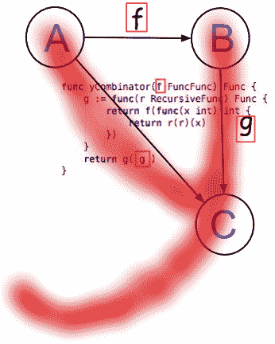

看看**A**和**B**和**C**如何将这些点连接起来，形成“y”的顶部？

### Y 组合器的工作原理

下图说明了 Y-Combinator 的工作原理：

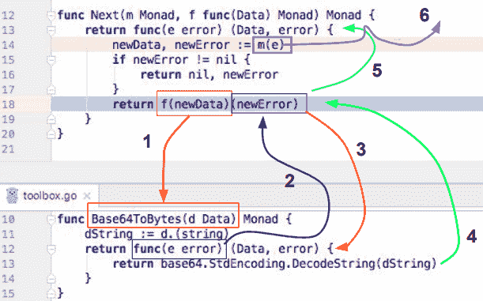

以下是连接 Y 组合器的步骤：

1.  `f(newData)`使用`base64`编码文本调用`Base64ToByes`。`dString`被下压成一条线。

2.  执行`return func(e error) (Data, error) {`语句，并将执行返回给`Next`函数中的 return 语句。

3.  当时，`f(newData)`本身就是一个函数，已经填充了它的`newError`参数，现在可以执行了。

4.  运行时执行返回到`Base64ToBytes`中的`return func(e error) (Data, error)`行并输入其代码块，这是将`base64`字符串解码为常规字符串的返回语句。

5.  执行再次返回到最后一个返回行中的`Next`。这就是递归发生的地方。它调用自身，传递错误值。

6.  在*第 14*行，我们叫下一个单子。这就是连续传递发生的地方。

我们编写了一个有界变量的递归函数，只使用一个变量的函数，不使用赋值。Y-combinator 执行将匿名内部函数（`func(e error) (Data, error) {`与最初传递给`Next`的函数（`f`的参数名（`newError`相关联的魔术。

既然我们已经知道了`toolbox.go`中的一个可重用函数是如何工作的，我们就不需要再讨论其余的函数了。他们都以同样的方式工作。我们可以简单地通过我们的工作流程的每一行进入`Next`步骤，直到我们从另一端出来。如果在我们的任何可重用函数中遇到错误，我们只需顺其自然。

这使得处理错误变得简单易行。错误只需要在流程的最后一个地方处理。易于理解的

#### 词法工作流解决方案

以下是我们的整个`ProcessCar`工作流程：

```go
func ProcessCar(lineBase64 string) (err error, carJson string) {
   step := Get(lineBase64)
   step = Next(step, Base64ToBytes)
   step = Next(step, BytesToData)
   step = Next(step, TimestampData)
   step = Next(step, DataToJson)
   json, err := step(nil)
   if err != nil {
      Error.Error(err)
   } else {
      carJson = json.(string)
   }
   return
}
```

为了清楚起见，这是怎么回事？每一步都是一步接一步，最后是错误处理。

这个 Go 惯用的一元工作流解决方案需要一个标签，因为我首先想到了它，它的名字是词汇工作流。这就是我们如何在 Go 中进行不纯净成分的一元合成。Lex 的意思是**法律**，因为它控制和管理我们的工作流程，所以这个名字很合适。（里面有我的名字，这纯粹是巧合！）

### 我们的 ProcessCar 方法是 idomatic Go 代码吗？

让我们从非惯用语开始。

#### 非惯用部分

在我们的处理管道结束之前，不会进行 if`err != nil`错误检查。那是故意的。

使用一元管道的好处如下：

*   使我们能够清晰地表达业务逻辑，而不会出现混乱
*   消除了在每行操作代码后进行的 if`err != nil`错误检查
*   提供用于管道处理的结构
*   订购我们工作流程中的所有`Next`步骤
*   提供用于插入可重用组件的框架

#### 惯用部分

我们在管道末端有一个典型的 if`err != nil`错误检查：

```go
if err != nil {
   Error.Error(err)
} else {
   carJson = json.(string)
}
```

这是我们应该执行错误检查的地方，因此进行错误检查是很自然的。

我们可以选择实现一个`Either`monad，将我们的响应封装在一个结构中，该结构可能如下所示：

```go
type Either struct {
   Value interface{}
   Error error
}
```

我们可以包括只返回`Success()`或`Failure()`的总和或联合类型：

```go
type SuccessOrFailure interface {
   Success() bool
   Failure() bool
}
```

然后我们必须创建另一个接口来将我们的`Either`转换为`Success`或`Failure`。它可能看起来像这样：

```go
type Either interface {
   SuccessOrFailure
   Succeeded() StringOption
   Failed() ErrorOption
}
```

但我们将不再追求这些一元错误处理技术。Go 惯用错误检查对于我们的目的（处理此工作流的错误）非常有效，并且它不会增加额外的接口层或其他外部依赖项的复杂性（我们将在本章末尾讨论）。

## 另一个工作流选项

假设我们有一个如下所示的文本文件：

```go
4-purely-functional/ch10-monads/02_error_checker/alphabet.txt
ABCDEFGHIJKLMNOP
```

此代码将读取三组两个字符：

```go
func main() {
    file, err := os.Open("alphabet.txt")
    if err != nil {
        log.Fatal(err)
    }

    byteSlice := make([]byte, 2)
    numBytesRead, err := io.ReadFull(file, byteSlice)
    if err != nil {
        log.Fatal(err)
    }
    logInfo(numBytesRead, byteSlice)

    byteSlice = make([]byte, 2)
    numBytesRead, err = io.ReadFull(file, byteSlice)
    if err != nil {
        log.Fatal(err)
    }
    logInfo(numBytesRead, byteSlice)

    byteSlice = make([]byte, 2)
    numBytesRead, err = io.ReadFull(file, byteSlice)
    if err != nil {
        log.Fatal(err)
    }
    logInfo(numBytesRead, byteSlice)

```

我们可以通过定义带有错误字段和`io.Reader`字段的结构来改进代码：

```go
type twoByteReader struct {
    err      error
    reader io.Reader
}
```

您可能还记得[第三章](03.html)*使用高阶函数*时`io.Reader`接口只需要一种方法，请阅读。因此，我们实现了这一点，并添加了`logInfo`调用：

```go
func (tbr *twoByteReader) read() (numBytesRead int, byteSlice []byte)  {
    if tbr.err != nil {
        return
 }
    byteSlice = make([]byte, 2)
    numBytesRead, tbr.err = io.ReadFull(tbr.reader, byteSlice)
    logInfo(numBytesRead, byteSlice)
    return
}
```

现在，我们打印三组两字节的代码如下所示：

```go
    tbr := &twoByteReader{reader: file}
    byteSlice = make([]byte, 2)
    tbr.read()
    tbr.read()
    tbr.read()
}
```

好多了！但这更像是一个实用功能，而不是一个工作流解决方案。它简化了我们的代码并减少了 `if err != nil`块的数量。

然而，对于我们工作流程中的每个步骤，如果可能的话，我们需要创建一个单独的实用程序函数，并且每个都有自己的`if err != nil`块。

与我们的 monad 工作流管道相比，它只需要一个`if err != nil`块。

## 业务用例场景

monad 工作流为业务用例场景提供了解决方案。如果我们与使用用例场景实现应用程序功能或管理任务的团队合作，monad 工作流管道中的步骤可能会直接对应于我们任务的需求。使用此工作流可以简化测试和开发。

下面是一个需要五个步骤的示例：


每个需求直接映射到工作流步骤（以及测试）。

如果我们顺利完成了最后一步，没有出现错误，那么我们将数据向下转换为字符串。它将包含 JSON，如下所示：

```go
{
  "car": {
    "vin": "348543985AZDD",
    "make": "Lexus",
    "model": "IS 250",
    "options": {
      "option_1": "Stick Shift",
      "option_2": "Moon Roof",
      "option_3": "Leather"
 }
  },
  "timestamp": "20171030205535"
}
```

## Y-组合子再检验

让我们看一下 Go 中的另一个 Y-Combinator 示例，以提高对该主题的理解。还记得[第一章](01.html)中的`Fibonacci`函数吗？*Go*中的纯函数编程？看起来是这样的：

```go
func fib(x int) int {
    if x == 0 {
        return 0
 } else if x <= 2 {
        return 1
 } else {
        return fib(x-2) + fib(x-1)
    }
}
```

如果它通过了一个`0`、`1`或`2`，它只返回一个值（`0`或`1`。否则，它将使用如下两个函数调用自己（递归）——`fib(x-2) + fib(x-1)`。由于值不断递减 2 或 1，因此处理最终将完成，此时累积值将相加。

下图说明了这种递归处理。橙色和红色框突出显示只需执行一次的函数。引用完整性允许我们存储这些函数的值。后续执行只需查找存储值，而无需重新执行函数：

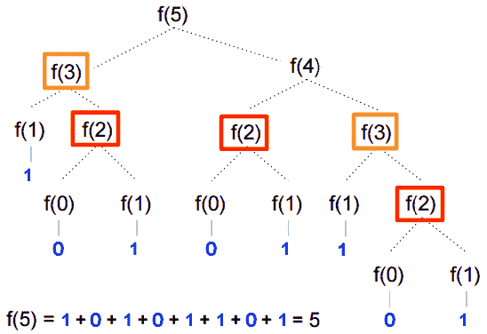

我们在`main.go`中定义了三种功能类型，如下所示：

*   `Func`：一个简单的函数，它接受一个 int 并返回一个`int`
*   `FuncFunc`：接受`Func`类型函数并返回`Func`类型函数的函数
*   `RecursiveFunc`：接受`RecursiveFunc`函数并返回`Func`类型函数的函数

```go
//4-purely-functional/ch10-monads/03_y_combinator/main.go

package main

import "fmt"

type Func func(int) int
type FuncFunc func(Func) Func
type RecursiveFunc func (RecursiveFunc) Func
```

让我们看看初始化`yCombo`变量时会发生什么：

```go
yCombo := yCombinator(fibFuncFunc)
```

调用`yCombinator`函数，我们用递归 lambda 表达式初始化`g`变量。

让我们仔细看看当我们初始化变量 T0 变量时发生的布线：

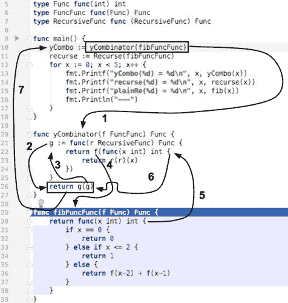

将其与基本递归变量初始化所需的最小接线进行比较：


当我们在*第 13 行*和*第 14 行*上计算 Lambda 表达式时，执行路径看起来几乎相反。稍宽的红线是`yCombo`函数计算表达式所需的两个步骤。较细的黑线是计算正则递归函数所需的八个（加一个）步骤：


这些执行模式表明存在重大差异。`yCombinator`（lambda 表达式）不保留状态，只引用参数（`x`。相反，正则递归函数在到达`Recurse`函数后保持`x`状态（*步骤 2*。当`Recurse`到达*步骤 6*（*行 43*时，`x`的值由*行 42*提供（从*步骤 2*左起）。

由于`yCombinator`（lambda 表达式）已预连线，因此在评估 lambda 表达式时（*第 13 行*只需要两个步骤。将其与计算常规递归函数（`Recurse`所需的十二个步骤进行比较。

由于递归在我们的 lambda 表达式实现中是必需的，现在是重新强调 Go 编译器支持**尾部调用优化**（**TCO**的好时机。[第 3 章](03.html)*使用高阶函数*提到 TCO 通过在递归中调用函数本身来避免创建新堆栈。

### 什么是尾部递归？

递归是函数调用自身的地方。尾部递归是递归调用是函数的最后一行。例如，`fib`函数的最后一行调用自身两次：

```go
func fib(x int) int {
    if x == 0 {
        return 0
 } else if x <= 2 {
        return 1
 } else {
        return fib(x-2) + fib(x-1)
    }
}
```

在这种情况下，没有理由保留国家。函数中没有其他代码行可以执行，我们也不关心在到达返回语句之前可能已分配的任何变量的任何值。

如果我们的返回语句发生在我们的函数中间，则 GO 运行时需要记住我们的函数的地址以便返回它，并且当我们的递归调用完成并返回到恢复执行时，它需要存储函数局部变量值。

我们目前的问题是 Go 对所有递归调用的处理是相同的。即使尾部递归不需要返回地址，也不需要访问任何其他函数局部变量值，Go 还是会这样做。

如果 Go 对尾部调用进行了优化，那么它不会在堆栈上分配额外的空间，而是直接从尾部调用执行一个`GOTO`语句。这将提高性能并节省堆栈空间。

为什么不优化尾部调用？一个原因是插入`GOTO`语句可能会使调试堆栈帧信息更加困难。

上次调试堆栈帧是什么时候？我相信系统程序员整天都在调试堆栈框架，但我们大多数人都不这么做。假设我们都关心性能，这可能是安全的。也许一个折衷办法是允许函数式程序员在尾部调用上方添加注释，以指示编译器为我们执行 TCO？

如果没有 TCO，我们需要了解递归深度，因为在 Go 中，每一级递归都意味着 Go 运行时需要存储在堆栈上的另一层信息。

如果我们遍历二叉树，我们的递归算法很可能是**O（logn）**，这意味着我们可能不会遇到运行时性能问题。

然而，如果我们的递归深度是**O（n）**，这可能会导致堆栈出现一些问题。任何超过这一点的事情都应该避免。

### 大 Oh 符号

大 Oh 符号经常用于表示算法的相对复杂度。

它用于指示算法的顺序。例如，如果我们有三个算法，一个 O（n）、一个 O（n log n）和一个 O（n2），则不同 n 的时间为：

| **n** | **O（n）** | **O（n 对数 n）** | **O（n2）** |
| 10 | 10 | 33 | 100 |
| 100 | 100 | 664 | 10000 |
| 500 | 500 | 4483 | 250000 |
| 1000 | 1000 | 9966 | 1000000 |
| 5000 | 5000 | 61438 | 25000000 |

让我们假设我们的测量单位是每次操作 1 秒。表中的第一行告诉我们，执行 10 个操作所需时间从**O（n）**算法的 10 秒到**O（n2）**算法的 1.5 分钟不等。最后一行告诉我们，执行 5000 个操作将花费**O（n）**1.4 小时到**O（n2）**算法大约一年四分之三的时间。数量级很重要。

这与尾部递归有什么关系？递归函数调用使堆栈线性增长**O（n）**。因此，TCO 的缺乏可能不会使我们的应用程序崩溃，但它肯定会减慢它们的速度。执行数量级大于**O（n）**的计算充其量是困难的。

换句话说，当我们使用递归函数调用时，我们可能会很快耗尽堆栈空间。TCO 可以重新组织/优化我们的代码，以便我们的程序使用恒定的堆栈空间，这将防止堆栈过大并减少堆栈错误。

TCO 的好处是：

*   提高了执行速度，因为不需要堆栈推送和 POP
*   函数递归深度不再是约束
*   堆栈溢出运行时错误不会成为问题

支持 TCO 的语言有：

*   公共口齿不清
*   JavaScript（ECMAScript 6.0）
*   卢阿
*   python
*   计划
*   球拍
*   Tcl
*   科特林
*   万能药
*   Perl
*   斯卡拉

哈斯克尔在哪里？Haskell 执行了比尾部调用消除更优化的优化。Haskell 使用*保护的*递归。它是一个懒惰的运行时系统，除非必须，否则不会对 thunk 进行计算。

有几个理由不包括它。启用 TCO 后，调用将不再清晰地划分，这使得调试堆栈帧变得更加困难。TCO 将如何影响延期声明？

如果 Go 支持注释（如`//@tco`），允许我们为特定函数调用启用 TCO，该怎么办？

有关 Go 和 TCO 的更多信息，请参见附录的*如何提出 Go 变更*部分。

#### 国际化（I18N）包

还记得在本章的前面，当我们研究 monad 工作流时，我们看到如何将任何步骤中发生的所有错误推送到错误管道中，并等到最后再处理它们吗？

当我们处理错误时，我们可能需要做的一件事是将错误消息本地化为负责阅读它们的个人的语言。

这个示例应用程序探索了如何使用`go-i18n`库实现这一点。

Go 包**Go-i18n**[https://github.com/nicksnyder/go-i18n](https://github.com/nicksnyder/go-i18n) ）一个命令（[https://github.com/nicksnyder/go-i18n#goi18n-命令](https://github.com/nicksnyder/go-i18n#goi18n-command)，帮助您将 Go 程序翻译成多种语言。支持复数字符串（[http://cldr.unicode.org/index/cldr-spec/plural-rules **Unicode 通用语言环境数据库**（**CLDR**）](http://cldr.unicode.org/index/cldr-spec/plural-rules)[中所有 200 多种语言的](http://www.unicode.org/cldr/charts/28/supplemental/language_plural_rules.html)）http://www.unicode.org/cldr/charts/28/supplemental/language_plural_rules.html 。

在`main.go`中，我们从 Go 的标准库导入`github.com/nicksnyder/go-i18n/i18n`库以及文本/模板库：

```go
package main

import (
"os"
 "text/template"
 "github.com/nicksnyder/go-i18n/i18n"
 "fmt"
)
```

这里，我们用`"T"`键初始化`funcMap`函数，并给它值`i18n.TranslateFunc`：

```go
var funcMap = map[string]interface{}{
"T": i18n.IdentityTfunc,
}
```

接下来，我们定义模板：

```go
var tmplIllegalBase64Data = template.Must(template.New("").Funcs(funcMap).Parse(`
{{T "illegal_base64_data" .}}
`))
var tmplUnexpectedEndOfJson= template.Must(template.New("").Funcs(funcMap).Parse(`
{{T "unexpected_end_of_json_input"}}
`))
var tmplJsonUnsupportedValue = template.Must(template.New("").Funcs(funcMap).Parse(`
{{T "json_unsupported_value" .}}
`))
```

我们定义了它们相应的功能：

```go
func illegalBase64(T i18n.TranslateFunc, bytePos string) {
   tmplIllegalBase64Data.Execute(os.Stdout, map[string]interface{}{
      "BytePos":    bytePos,
   })
}
func unexpectedEndOfJson(T i18n.TranslateFunc) {
   tmplUnexpectedEndOfJson.Execute(os.Stdout, map[string]interface{}{
   })
}
func jsonUnsupportedValue(T i18n.TranslateFunc, bytePos string) {
   tmplJsonUnsupportedValue.Execute(os.Stdout, map[string]interface{}{
      "Val":    bytePos,
   })
}
```

请注意，如果我们的错误消息接受参数，那么我们将在 Execute 函数体中定义它们。例如，`illegalBase64`定义了`BytePos`。以下是它的输出方式：

```go
illegal base64 data at input byte 136
```

在我们的主要功能中，我们加载翻译文件。在此示例应用程序中，我们将显示对英语和德语的支持：

```go
func main() {
   i18n.MustLoadTranslationFile("en-us.all.json")
   i18n.MustLoadTranslationFile("de-de.all.json")
```

接下来，我们在两种语言`en-US`和`de-DE`的列表中进行分类，为每种语言打印三条消息：

```go
for _, locale := range []string{"en-US", "de-DE"} {
   fmt.Println("\nERROR MESSAGES FOR", locale)
   T, _ := i18n.Tfunc(locale)
   tmplIllegalBase64Data.Funcs(map[string]interface{}{
      "T": T,
   })
   tmplUnexpectedEndOfJson.Funcs(map[string]interface{}{
      "T": T,
   })
   tmplJsonUnsupportedValue.Funcs(map[string]interface{}{
      "T": T,
   })

    illegalBase64(T, "136")
    unexpectedEndOfJson(T)
    jsonUnsupportedValue(T, "+Inf")
  }
}

```

这就是我们告诉`i18n`使用哪种翻译的地方：

```go
T, _ := i18n.Tfunc(locale)
```

下面是三行，其中我们将我们的 en-US 翻译函数分配给我们的`tmplIllegalBase64Data`变量的`"T"`键：

```go
tmplIllegalBase64Data.Funcs(map[string]interface{}{
   "T": T,
})
```

当对其进行评估时，将执行`text/template/template.go`中的`Funcs`方法并将其传递给我们的`funcMap`变量。

这就是`Funcs`的样子（我的在`/usr/local/Cellar/go/1.9/libexec/src/text/template/template.go`中）：

```go
func (t *Template) Funcs(funcMap FuncMap) *Template {
   t.init()
   t.muFuncs.Lock()
   defer t.muFuncs.Unlock()
   addValueFuncs(t.execFuncs, funcMap)
   addFuncs(t.parseFuncs, funcMap)
   return t
}
```

请注意，由于`Func`是`*Template`的一个方法，并返回一个`*Template`，因此可以链接`Func`。

在范围循环结束时，我们调用错误消息打印函数：

```go
illegalBase64(T, "136")
unexpectedEndOfJson(T)
jsonUnsupportedValue(T, "+Inf")
```

结果如下：

```go
ERROR MESSAGES FOR en-US
illegal base64 data at input byte 136
unexpected end of JSON input
json: unsupported value: +Inf

ERROR MESSAGES FOR de-DE
ungültige base64-Daten am Eingangsbyte 136
unerwartetes Ende der JSON-Eingabe
json: nicht unterstützter Wert: +Inf
```

英文翻译文件`4-purely-functional/ch10-monads/04_i18n/en-us.all.json`包含以下内容：

```go
{
  "illegal_base64_data": {
    "other": "illegal base64 data at input byte {{.BytePos}}"
 },
  "json_unsupported_value": {
    "other": "json: unsupported value: {{.Val}}"
 },
  "unexpected_end_of_json_input": {
    "other": "unexpected end of JSON input"
 }
}
```

德文翻译文件`4-purely-functional/ch10-monads/04_i18n/de-de.all.json`包含以下内容：

```go
{
  "illegal_base64_data": {
    "other": "ungültige base64-Daten am Eingangsbyte {{.BytePos}}"
 },
  "json_unsupported_value": {
    "other": "json: nicht unterstützter Wert: {{.Val}}"
 },
  "unexpected_end_of_json_input": {
    "other": "unerwartetes Ende der JSON-Eingabe"
 }
}

```

我用谷歌翻译。只需在左侧窗格（英语）中键入您的母语句子，然后在右侧窗格的下拉列表中选择您希望翻译成的语言（德语）。

我们可以使用谷歌翻译将句子翻译成其他语言：

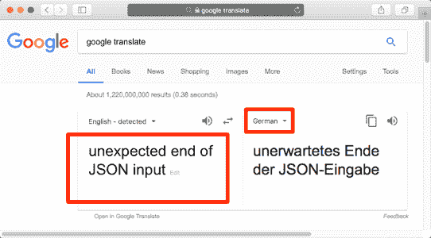

假设您正在使用本书的每个 Go 项目中包含的 init 脚本，您应该在 shell 中加载`get-go-binary`Bash 函数并准备好使用。

以下是初始化项目并安装 i18n 的工作流：


i18n 站点描述了一个工作流，如果我们要将文件发送给翻译服务，可以使用该工作流。

## 类型类

类型类允许我们定义类型的行为。

如[第 3 章](03.html)所述，*使用高阶函数*，类型类为我们的类型系统添加了一个附加层。

我们通过以下方式实现这一目标：

1.  使用 Go 接口定义行为（父类型类）
2.  声明新类型（基类型类）以包装基类型
3.  在新类型类上实现行为

让我们看看我们的`Equals`类型类实现。

父类定义：

```go
//4-purely-functional/ch11-monads/05_typeclasss/src/typeclass/equals.go
package typeclass

import (
   "strconv"
)
type Equals interface {
   Equals(Equals) bool
}
```

Equals 是我们的父类型类。所有基类都必须实现`Equals`方法。

### 基类定义

我们将定义两种基本类型，`Int`和`String`。

#### Int 基类

Int 的`Equals`方法将使用我们认为合适的逻辑检查其他类型是否相等：

```go
type Int int

func (i Int) Equals(e Equals) bool {
   intVal := int(i)
   switch x := e.(type) {
   case Int:
      return intVal == int(x)
   case String:
      convertedInt, err := strconv.Atoi(string(x))
      if err != nil {
         return false
 }
      return intVal == convertedInt
   default:
      return false
 }
}
```

#### 字符串基类

就像`Int`类，但对于字符串：

```go
type String string

func (s String) Equals(e Equals) bool {
   stringVal := string(s)
   switch x := e.(type) {
   case String:
      return stringVal == string(x)
   case Int:
      return stringVal == strconv.Itoa(int(x))
   default:
      return false
 }
}
```

#### 我们的 main.go 文件

我们首先导入我们的 typeclass 代码（位于`src`目录中，存储所有项目本地包）：

```go
package main

import (
    "typeclass"
 "fmt"
)

func main() {
    int42 := typeclass.Int(42)
    str42 := typeclass.String("42")
    fmt.Println("str42.Equals(int42):", str42.Equals(int42))
```

结果如下：

```go
str42.Equals(int42): true
```

#### 和父类型类

让我们创建另一个类型类来求和值：

```go
4-purely-functional/ch10-monads/05_typeclasss/src/typeclass/sum.go
package typeclass

type Sum interface {
   Sum(Sum) int64
}
```

Sum 是我们的父类型类。所有基类型类都必须实现`Sum`方法。

#### 和基类

以下是我们的基类：

```go
type Int32 int32
type Int64 int64
type Float32 float32
type IntSlice []int
```

我们可以从类型定义中看出，我们将能够对这些基本类型中的任意两个进行求和。

以下是`Sum`的`Int32`实现：

```go
func (i Int32) Sum(s Sum) int64 {
   it := int64(i)
   switch x := s.(type) {
   case Int64:
      return it + int64(x)
   case Int32:
      return it + int64(x)
   case Float32:
      return it + int64(x)
   case IntSlice:
      sum := int64(0)
      for _, num := range x {
         sum += int64(num)
      }
      return it + sum
   default:
      return 0
 }
}
```

请注意，如果我们试图将`Int32`添加到的值不在可接受的类型列表中，则返回零。

另一种选择是实现结果类型，如 Haskell 的任意一种类型。这是最近添加的 Golang 规范，但被拒绝。详见[https://github.com/golang/go/issues/19991](https://github.com/golang/go/issues/19991) 。

`Int64`和`Float64`的总和实现类似：

```go
func (i Int64) Sum(s Sum) int64 {
   it := int64(i)
   switch x := s.(type) {
   case Int64:
      return it + int64(x)
   case Int32:
      return it + int64(x)
   case Float32:
      return it + int64(x)
   case IntSlice:
      sum := int64(0)
      for _, num := range x {
         sum += int64(num)
      }
      return it + sum
   default:
      return 0
 }
}

func (i Float32) Sum(s Sum) int64 {
   it := int64(i)
   switch x := s.(type) {
   case Int64:
      return it + int64(x)
   case Int32:
      return it + int64(x)
   case Float32:
      return it + int64(x)
   case IntSlice:
      sum := int64(0)
      for _, num := range x {
         sum += int64(num)
      }
      return it + sum
   default:
      return 0
 }
}
```

在我们的 int 切片实现中，我们为希望添加到 int 切片中的每种类型实现一个范围迭代：

```go
func (i IntSlice) Sum(s Sum) int64 {
   it := i
   switch x := s.(type) {
   case Int64:
      sum := int64(0)
      for _, num := range it {
         sum += int64(num)
      }
      return int64(x) + sum
   case Int32:
      sum := int64(0)
      for _, num := range it {
         sum += int64(num)
      }
      return int64(x) + sum
   case Float32:
      sum := int64(0)
      for _, num := range it {
         sum += int64(num)
      }
      return int64(x) + sum
   case IntSlice:
      sum := int64(0)
      for _, num := range it {
         sum += int64(num)
      }
      for _, num := range x {
         sum += int64(num)
      }
      return sum
   default:
      return 0
 }
}
```

在这里，我们练习`Sum`类型的课程：

```go
    int64One := typeclass.Int64(1)
    int64Two := typeclass.Int64(2)
    fmt.Println("int64Two.Sum(int64One):", int64Two.Sum(int64One))

    int32One := typeclass.Int32(1)
    fmt.Println("int32One.Sum(int64One):", int32One.Sum(int64One))

    float32Five := typeclass.Float32(5)
    fmt.Println("int32One.Sum(int64One):", float32Five.Sum(int64One))

    int64Slice123 := typeclass.IntSlice([]int{1, 2, 3})
    int64Slice234 := typeclass.IntSlice([]int{2, 3, 4})
    fmt.Println("int64Slice123.Sum(int64Slice234):", int64Slice123.Sum(int64Slice234))
}
```

结果如下：

```go
int64Two.Sum(int64One): 3
int32One.Sum(int64One): 2
int32One.Sum(int64One): 6
int64Slice123.Sum(int64Slice234): 15
```

## 再访仿制药

在最后一章中，我们讨论了泛型的一些好处：

*   类型安全
*   无需编写重复的样板代码
*   重用和共享不同类型的代码
*   跨不同类型强制实施一致的 API
*   花在优化泛型代码上的时间影响更大
*   不需要重新实现难以正确实现的算法
*   能够指定域约束

给定以下类型定义：

```go
type Car struct {
   Make, Model string
   Price Dollars
}
type Truck struct {
   Make, Model string
   BedSize int
   Price Dollars
}
price := func (c T) Dollars {
   return c.Price
}
```

而不是写这两个：

```go
type CarSlice []Car
func (rcv CarSlice) SumDollars(fn func(Car) Dollars) (result Dollars) {
   for _, v := range rcv {
      result += fn(v)
   }
   return
}

type TruckSlice []Truck
func (rcv TruckSlice) SumDollars(fn func(Truck) Dollars) (result Dollars) {
   for _, v := range rcv {
      result += fn(v)
   }
   return
}
```

我们可以按如下方式打印价格总额：

```go
fmt.Println("Car Prices:", cars.SumDollars(price))
fmt.Println("Truck Prices:", trucks.SumDollars(price))
```

如果 Go 支持泛型，我们可以编写一次。它看起来像这样：

```go
func (rcv []T) SumDollars(fn func(T) Dollars) (result Dollars) {
   for _, v := range rcv {
      result += fn(v)
   }
   return
}
```

我们可以按如下方式打印价格总额：

```go
fmt.Println("Car Prices:", cars.SumDollars(<Car>))
fmt.Println("Truck Prices:", trucks.SumDollars(<Truck>))
```

协方差和反方差（[https://www.ibm.com/developerworks/library/j-jtp01255/index.html](https://www.ibm.com/developerworks/library/j-jtp01255/index.html) 是指使用比最初指定的更不特定或更特定类型的能力。协变和逆变泛型类型参数在指定和使用泛型类型时提供了更大的灵活性。

考虑到这个示例代码，泛型有什么不好呢？

Go 的快速编译速度部分归功于增量编译。对于泛型，增量编译是不可能的，因为具体类型只知道泛型函数在运行时的使用位置，而不知道泛型函数的定义位置。

如果不考虑将泛型实现到 Go 编译器中会非常复杂这一事实，从语义和实现的角度来看，从开发人员的角度来看，将泛型添加到 Go 编译器中有一些缺点：

*   通用算法倾向于积累特征（影响代码质量）。
*   很难优化通用算法。
*   调试泛型代码很困难。
*   错误处理的复杂性。
*   使用复杂度：协方差、逆变换、擦除。
*   减慢编译时间（或运行时）。
*   通用/现有非通用代码不兼容。

第四个和第七个缺点以及第七个缺点是最令人担忧的。

首先，让我们更好地理解什么是错误处理复杂性。那么`Maybe`、`Either`和`Option`如何解决零指针错误呢？

为了使纯 FP 一元错误处理能够工作，我们的应用程序中引用的所有包都需要返回一元错误类型，如。（它成功与否，但 nil 将永远不会返回。）

当然，这将消除对以下无处不在的错误检查的需要：

```go
if err != nil {
 return nil, err
}
```

然而，我们现在需要改变处理错误的方式，使用新的语言扩展，如`Maybe`单子、`Either`、`Option`、`Nothing`、`Just`等等。（有关一些代码示例，请参见`2-design-patterns/ch04-solid/02_maybe`）这是另一层复杂性。

此外，我们如何将这种新的错误处理范例集成到现有的应用程序中？如果我们正在创建一个新的应用程序，但希望使用任何标准库包或任何尚未转换为使用泛型兼容错误处理的包，我们会编写一个适配层吗？这是另一层复杂性。

通用化的影响将是有意义的。Go 标准库需要更改的百分比是多少？

我们是否用集合类型替换无处不在的切片？有多少现有代码会受到影响？

对泛型的支持将如何影响并发性？

如果 go 丢失类型擦除并实现具体化以便向泛型参数添加显式类型注释，那么性能会受到怎样的影响？

### 戈朗的影响

需要修改的最小语言结构集包括：

*   类型断言
*   类型开关
*   范围语句
*   函数调用

它们都具有深远的影响，最后一个影响深远而广泛。

整个类型系统可能需要大修。

#### 个人意见

在写这本书之前，我认为泛型的好处远远大于它的缺点。写这本书迫使我认真思考。

我考虑了利弊以及其他选择，比如使用元编程和代码生成工具（参见上一章中的 clipperhouse/gen 工具）。

我思考了一元错误处理的工作原理，以及它与 Go 的`return successValue, err error`处理习惯用法的相似之处（以及它与 Unix`stdout`/`stderr`的相似之处）。我找到了一种方法，在保持 Go 的错误处理习惯用法的同时，让纯 FP（monad）的最重要特性在 Go 中工作。

在 Go 中使用词法（一元）工作流解决方案的好处是：

*   类型安全
*   不需要空接口/取消装箱/向下投射/反射
*   表达力强、易于理解的工作流代码
*   `Get(data)`然后`Next(step)`、`Next(step)`直到完成
*   在一个地方（最后）处理大多数惯用的错误
*   直接反映业务需求
*   允许我们使用可重用的组件轻松构建新的工作流（请参见`toolbox.go`）
*   设计用于优化水平缩放
*   不对外部包施加任何要求
*   不需要额外的一元错误处理逻辑

由于此解决方案使用 lambda 表达式，因此存在递归，并且由于 Go 当前不提供 TCO，因此会影响性能，但递归仅限于控制工作流。

负担是我必须手动创建重复代码或生成泛型代码（使用 clipperhouse/gen 之类的工具），以避免使用空的`interface{}`和反射带来的性能损失。

我得出结论，泛型是编译时间、运行时间和我的时间之间的权衡。考虑到添加泛型的风险和缺点，我可以做更多的工作。

“简单和优雅不受欢迎，因为它们需要努力工作和纪律才能实现，需要教育才能被欣赏。”

-埃德斯格迪杰斯特拉酒店

## 总结

Go 中的函数编程是一种范式转换，一种与我们编写软件的方式根本不同的方法。就像我们可以通过命令式图灵机或 Lambda 演算获得我们想要的结果一样，我们可以选择使用惯用 Go 命令式编码，或者使用 FP 风格的编程进行声明式编码。

我们以对 FP 的简单介绍开始了我们的旅程。我们学习了如何编写中间函数，如`Map`、`Filter`和`Sort`，以及终端函数，如`Reduce`和`Join`，来转换集合。我们了解了如何使用 Gleam 和 Itertool 等工具，并使用 Go 例程和 Go 通道实现了惰性评估。

我们考虑了 FP 的特性，并通过函数组合、闭包和高阶函数的示例进行了研究。

我们研究了软件设计的命令式功能风格和纯功能风格（后来混合了这两种风格）。我们学习了 Go 中的读写器接口如何实现单一责任原则。仅仅一点点 OOP 就让我们欣赏到了纯 FP 的简单性（和诚实性）。（FP 合同不会说谎。）功能组合的秘密被揭示给我们：单子链的延续。

我们学习了`Map`和`Reduce`的工作原理。随着不断流动的图表开始提高我们对 FP 价值的认识，我们又回到了使用函数进行命令式编程的世界。

Duck 类型、嵌入、装饰器、策略和管道模式、控制反转、依赖项注入、使用通道控制并发程序中的事件流。。。我们甚至学习了如何使用分层应用程序体系结构避免循环依赖。我们学习了 curry 和 partial 应用程序之间的区别，以及如何实现函数参数来改进我们的 API。

范畴理论是以一种前所未有的方式提出的：使用了 100 多幅图像、17 个信息表和代码样本，以及简单简洁的措辞。我们带领您了解了函数式编程的历史，并学习了范畴理论、逻辑和类型理论之间的深刻联系。我们了解到，我们在小学、中学和高中所学的数学适用于函数式编程。（也许这甚至激发了一些人给他们的老数学老师发一封感谢信？）

随着对范畴理论的深入理解，我们开始了一次纯粹的 FP 之旅，在那里我们学会了如何使用函子在世界之间映射。我们构建了一些幺半群，并学习了如何编写 reduce 函数。我们还学习了如何使用泛型代码生成工具来解决样板问题。

凭借纯粹的命令式函数式编程知识，我们潜入了单子的世界。我们学习了 Lambda 演算和 Y-Combinator 的工作原理，以及如何使用它来控制工作流。

我们实现了词汇工作流解决方案，该解决方案利用 Y-Combinator 控制一系列不纯操作。我们见证了数据从一个步骤转换到下一个步骤的过程。我们了解了`Success`和`Failure`管道的工作原理，以及如何使用惯用的 Go 技术处理管道末端的所有错误。我们对添加泛型的利弊有了更好的理解。

### 从这里到哪里去

以下是一些想法：

*   寻找使用词法工作流解决方案控制数据转换工作流的位置
*   构建一组可重用的组件，放在工具箱中，您可以在我们的工作流中使用
*   在 Go 中构建自己的类型类、monad 和纯 FP 组件
*   支持将 TCO 添加到 Go 的请求（参见[附录](https://cdp.packtpub.com/learning_functional_programming_in_go/wp-admin/post.php?post=7&action=edit)、*杂项信息和操作方法*）

我希望您在本书中找到的信息对您今天和明天正在构建的内容有用，并激励您继续改进这些想法，以便我们能够构建更好的应用程序。

“说话很便宜。给我看看密码。”

-莱纳斯·托瓦尔兹