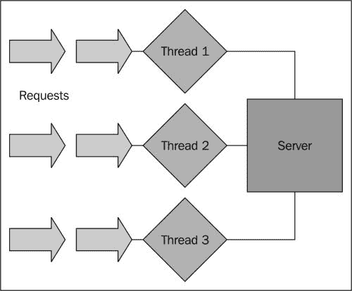
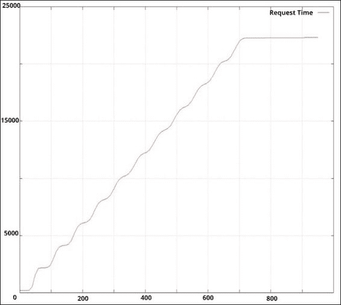
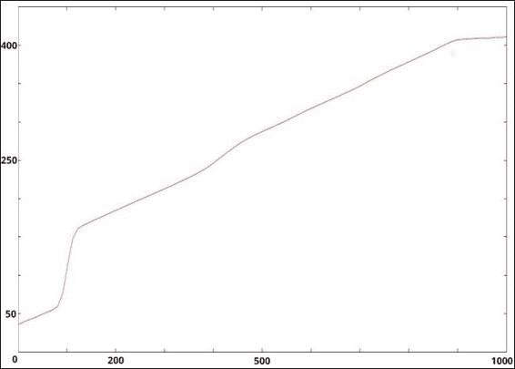
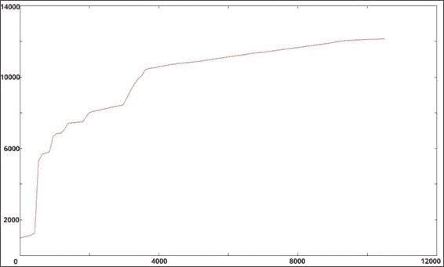
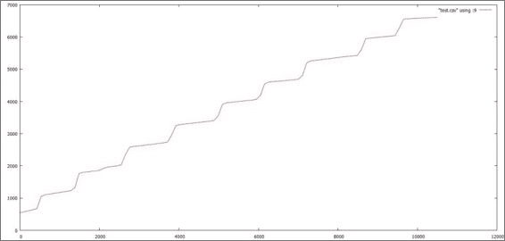

# Chapter 6. C10K – A Non-blocking Web Server in Go

到目前为止，我们已经构建了一些可用的应用程序；我们可以开始使用的东西，然后跳转到日常使用的真实系统中。通过这样做，我们已经能够演示 Go 并发语法和方法中涉及的基本和中间级别的模式。

然而，现在是我们着手解决一个现实问题的时候了，这个问题在 Web 的早期历史中一直困扰着开发人员（以及他们的经理和副总裁）。

为了解决这个问题，我们将能够开发一个高性能的 web 服务器，它可以处理大量的活动流量。

多年来，这个问题的解决方案仅仅是用硬件或侵入式缓存系统来解决这个问题；因此，交替地，用编程方法解决它应该会激发任何程序员。

我们将使用到目前为止所学的每一种技术和语言结构，但我们将以一种比目前更加结构化和深思熟虑的方式进行。到目前为止，我们所探索的一切都将发挥作用，包括以下几点：

*   创建并发应用程序的可视化表示
*   Utilizing goroutines to handle requests in a way that will scale
*   建立可靠的渠道来管理 goroutine 和将管理它们的循环之间的通信
*   分析和基准测试工具（JMeter，ab）来检查事件循环的实际工作方式
*   必要时进行超时和并发控制，以确保数据和请求的一致性

# 攻克 C10K 问题

C10K 问题的起源植根于串行、分块编程，这使得它非常适合展示并发编程的优势，尤其是在 Go 中。

提出的问题来自开发商 Dan Kegel，他提出了一个著名的问题：

|   | *现在是 web 服务器同时处理一万个客户端的时候了，你不觉得吗？毕竟，网络现在是一个大地方。* |   |
|   | --*丹可格尔（[http://www.kegel.com/c10k.html](http://www.kegel.com/c10k.html)* |

当他在 1999 年提出这个问题时，对于许多服务器管理员和工程师来说，为 10000 名并发访问者提供服务是一件需要硬件解决的事情。对于大多数人来说，公共硬件上的一台服务器可以处理这种类型的 CPU 和网络带宽而不会崩溃的概念似乎是陌生的。

他提出的解决方案的关键在于生成非阻塞代码。当然，在 1999 年，并发模式和库并不普遍。C+有一些轮询和排队选项可用，通过一些第三方库和最早的前导到多线程语法，稍后通过 Boost 和 C++ C++获得。

在接下来的几年里，这个问题的解决方案开始涌入各种语言、编程设计和通用方法。在本书出版时，C10K 问题并非没有解决方案，但它仍然是一个极好的平台，可以对高性能 Go 进行非常现实的挑战。

任何性能和可伸缩性问题最终都会与底层硬件有关，因此一如既往，您的里程可能会有所不同。在一个拥有 500 MB 内存的 486 处理器上压缩 10000 个并发连接肯定比在一个内存和多核的裸体 Linux 服务器上压缩 10000 个并发连接更具挑战性。

还值得注意的是，一个简单的 echo 服务器显然能够比一个功能性的 web 服务器承担更多的核心，后者返回更多的数据，并接受更复杂的请求、会话等，我们将在这里讨论。

## 服务器在 10000 个并发连接时发生故障

正如您可能记得的，当我们在[第 3 章](03.html#page "Chapter 3. Developing a Concurrent Strategy")中讨论并发策略时，*开发并发策略*，我们讨论了一些 Apache 及其负载平衡工具。

当网络诞生和互联网商业化时，互动的水平非常低。如果你是一个灰胡子，你可能还记得从 NNTP/IRC 之类的过渡，以及网络是多么的原始。

To address the basic proposition of [page request] → [HTTP response], the requirements on a web server in the early 1990s were pretty lenient. Ignoring all of the error responses, header readings and settings, and other essential (but unrelated to the in → out mechanism) functions, the essence of the early servers was shockingly simple, at least compared to the modern web servers.

### 注

第一台web 服务器是由 web 之父 Tim Berners Lee 开发的。

CERN httpd 是由 CERN 开发的（比如 WWW/HTTP 本身），它处理了许多您今天在 web 服务器中所期望的事情。通过查找代码，您将发现许多符号，它们将提醒您 HTTP 协议的核心基本上没有改变。与大多数技术不同，HTTP 具有超长的保存期限。

它在 1990 年用 C 编写，无法利用 Erlang 等语言中的许多并发策略。坦率地说，这样做可能是不必要的——大多数 web 流量都是基本的文件检索和协议问题。web 服务器的核心不是处理流量，而是处理围绕协议本身的规则。

您仍然可以访问原始的 CERN httpd 站点，并从[下载源代码 http://www.w3.org/Daemon/](http://www.w3.org/Daemon/) 。我强烈建议您这样做，因为这既是一堂历史课，也是了解最早的 web 服务器解决一些最早问题的方式的一种方式。

然而，1990 年的网络和 C10K 问题首次提出时的网络是两个截然不同的环境。

到 1999 年，大多数站点都有第三方软件、CGI、数据库等提供的一定程度的二级或三级延迟，所有这些都使问题进一步复杂化。同时为 10000 个平面文件提供服务的概念本身就是一个挑战，但是试着在一个 Perl 脚本上运行它们，该脚本不需要任何缓存层就可以访问 MySQL 数据库；这一挑战立即加剧。

到 20 世纪 90 年代中期，ApacheWeb 服务器已经占据了市场并在很大程度上控制了市场（到 2009 年，它已经成为第一个服务于 1 亿多个网站的服务器软件）。

Apache 的方法深深植根于互联网的早期。在启动时，连接最初是先入先出的。很快，每个连接都从线程池中分配了一个线程。Apache 服务器有两个问题。详情如下:

*   阻塞连接可能会导致多米诺效应，其中一个或多个缓慢解析的连接可能会雪崩而无法访问
*   Apache 对可以使用的线程/工作线程的数量有严格限制，而不考虑硬件限制

在这里很容易看到机会，至少回顾一下。使用 actors（Erlang）、agent（Clojure）或 goroutines（Go）的并发服务器似乎完全符合这一要求。并发本身并没有*解决*C10k 问题，但它绝对提供了一种方法来促进它。

如今，解决 C10K 问题的最显著、最明显的示例是 Nginx，它是使用并发模式开发的，到 2002 年在 C 中广泛使用，以解决并最终解决 C10K 问题。如今，Nginx 代表世界上的#2 或#3 web 服务器，具体取决于源。

## 利用并发攻击 C10K

There are two primary approaches to handle a large volume of concurrent requests. The first involves allocating threads per connection. This is what Apache (and a few others) do.

一方面，将一个线程分配给一个连接很有意义，因为它是隔离的，通过应用程序和内核的上下文切换可以控制，并且可以随着硬件的增加而扩展。

对于大多数 Web 所在的 Linux 服务器来说，一个问题是，默认情况下，每个分配的线程为其堆栈保留 8MB 的内存。这可以（也应该）重新定义，但这会增加单个服务器所需的大量内存。即使您将默认堆栈大小设置为 1MB，我们也需要至少 10GB 的内存来处理开销。

这是一个极端的例子，不太可能是一个真正的问题，原因有两个：第一，因为您可以指定每个线程可用的最大资源量；第二，因为您可以轻松地跨几个服务器和实例进行负载平衡，而不是添加 10 GB 到 80 GB 的 RAM。

Even in a threaded server environment, we're fundamentally bound to the issue that can lead to performance decreases (to the point of a crash).

首先，让我们看一看连接绑定到线程的服务器（如下图所示），并想象这如何导致日志阻塞，最终导致崩溃：



这显然是我们想要避免的。任何 I/O、网络或外部进程都会造成一定程度的减速，从而导致我们前面提到的雪崩效应，从而导致可用线程被占用（或积压），传入请求开始堆积。

We can spawn more threads in this model, but as mentioned earlier, there are potential risks there too, and even this will fail to mitigate the underlying problem.

## 采取另一种方式

为了创建能够处理 10000 个并发连接的 web 服务器，我们显然会利用 goroutine/channel 机制在内容交付之前设置一个事件循环，以保持新频道的循环或不断创建。

在本例中，我们假设我们正在为一家快速扩张的公司构建一个公司网站和基础设施。为此，我们需要能够同时提供静态和动态内容。

The reason we want to introduce dynamic content is not just for the purposes of demonstration—we want to challenge ourselves to show 10,000 true concurrent connections even when a secondary process gets in the way.

一如既往，我们将尝试将并发策略直接映射到 goroutine 和 channels。在许多其他语言和应用程序中，这直接类似于事件循环，我们将这样处理它。在我们的循环中，我们将管理可用的 goroutine，终止或重用已完成的 goroutine，并在必要时生成新的 goroutine。

在这个可视化示例中，我们展示了事件循环（以及相应的 goroutines）如何允许我们在不使用太多*硬*资源（如 CPU 线程或 RAM）的情况下扩展连接：


在这里，我们最重要的一步是管理事件循环。我们希望创建一个开放的、无限的循环来管理 goroutine 和相应通道的创建和过期。

作为的一部分，我们还希望对正在发生的事情进行一些内部日志记录，用于基准测试和调试我们的应用程序。

# 构建我们的 C10K 网络服务器

我们的 web服务器将负责接收请求、路由请求，并使用针对几个不同数据源解析的模板为平面文件或动态文件提供服务。

如前所述，如果我们专门为平面文件提供服务，并消除大部分处理和网络延迟，那么处理 10000 个并发连接就会容易得多。

我们的目标是尽可能多地接近真实世界的场景，因为我们可以看到很少的 Web 以静态方式在单个服务器上运行。大多数网站和应用程序使用数据库、**CDN**（**内容交付网络**）、动态和未缓存模板解析等。我们需要尽可能地复制它们。

为了简单起见，我们将按类型分离内容，并通过 URL 路由进行过滤，如下所示：

*   `/static/[request]`: This will serve `request.html` directly
*   `/template/[request]`：此通过 Go 解析后将服务于`request.tpl`
*   `/dynamic/[request][number]`：这也将服务于`request.tpl`并根据数据库源的记录解析它

通过这样做，我们应该能够更好地混合可能的 HTTP 请求类型，这可能会妨碍同时为大量用户提供服务的能力，特别是在阻塞的 web 服务器环境中。

我们将利用`html/template`包进行解析，之前我们已经简要介绍了语法，深入研究并不一定是本书目标的一部分。然而，如果您打算将这个示例应用到您的环境中，或者对构建框架感兴趣，那么您应该研究一下它。

### 提示

您可以在[找到 Go 的异常库，以生成安全的数据驱动模板 http://golang.org/pkg/html/template/](http://golang.org/pkg/html/template/) 。

安全起见，我们主要指的是能够接受数据并将其直接移动到模板中，而不必担心大量恶意软件和跨站点脚本背后的注入问题。

对于数据库源代码，我们将在这里使用 MySQL，但是如果您对其他数据库更熟悉，可以随意尝试。像`html/template`包一样，我们不会花太多时间来概述 MySQL 和/或其变体。

## 针对阻塞 web 服务器的基准测试

首先针对阻塞的 web 服务器添加一些初始基准测试是公平的，这样我们就可以测量并发架构和非当前架构的效果。

对于我们的起始基准测试，我们将避开任何框架，我们将使用我们的老顽固 Apache。

为了完整起见，我们将使用具有 8GB RAM 的 Intel i5 3GHz 机器。在这里，我们将在 Ubuntu、Windows 和 OSX 上对我们的最终产品进行基准测试，我们将以 Ubuntu 为例。

我们的本地主机域将在`/static`中有三个普通 HTML 文件，每个文件被裁剪为 80KB。因为我们不使用框架，所以不需要担心原始的动态请求，而只需要担心静态和动态请求以及数据源请求。

对于所有示例，我们将使用一个 MySQL 数据库（名为`master`）和一个名为`articles`的表，该表将包含 10000 个重复条目。我们的结构如下：

```go
CREATE TABLE articles (
  article_id INT NOT NULL AUTO_INCREMENT,
  article_title VARCHAR(128) NOT NULL,
  article_text VARCHAR(128) NOT NULL,
  PRIMARY KEY (article_id)
)
```

With ID indexes ranging sequentially from 0-10,000, we'll be able to generate random number requests, but for now, we just want to see what kind of basic response we can get out of Apache serving static pages with this machine.

对于这个测试，我们将使用 Apache 的 ab 工具，然后使用 gnuplot 将请求时间顺序映射为并发请求和页面的数量；我们也会为最终产品做这项工作，但我们也会使用其他一些基准测试工具来获得更好的细节。

### 注

Apache 的 AB自带 Apache web 服务器本身。您可以在[上了解更多信息 http://httpd.apache.org/docs/2.2/programs/ab.html](http://httpd.apache.org/docs/2.2/programs/ab.html) 。

您可以从[下载适用于 Linux、Windows、OS X 及更多的版本 http://httpd.apache.org/download.cgi](http://httpd.apache.org/download.cgi) 。

gnuplot实用程序可用于[上的相同操作系统 http://www.gnuplot.info/](http://www.gnuplot.info/) 。

那么，让我们看看我们是如何做到的。请看下图：



哎哟甚至不接近。我们可以做一些事情来优化 Apache 中可用的连接（以及相应的线程/工作线程），但这并不是我们真正的目标。最重要的是，我们想知道使用现成的 Apache 服务器会发生什么。在这些基准测试中，我们开始删除或拒绝大约 800 个并发连接。

更麻烦的是，当这些请求开始堆积时，我们看到一些请求超过 20 秒或更长。当这种情况发生在阻塞服务器中时，它后面的每个请求都会排队；后面的请求同样排队，整个过程开始崩溃。

即使我们不能达到 10000 个并发连接，也有很大的改进空间。虽然任何容量的单一服务器都不再是我们所期望的 web 服务器环境的设计方式，但我们的目标应该是能够通过并发、事件驱动的方法从该服务器中挤出尽可能多的性能。

## 处理请求

在前面的章节中，我们使用Gorilla 处理 URL 路由，这是一个紧凑但功能完整的框架。Gorilla 工具包当然让这变得更容易，但我们还应该知道如何拦截功能以强制使用我们自己的自定义处理程序。

这里是一个简单的 web 路由器，我们在其中使用自定义的`http.Server`结构来处理和引导请求，如下代码所示：

```go
var routes []string

type customRouter struct {

}

func (customRouter) ServeHTTP(rw http.ResponseWriter, r 
  *http.Request) {

  fmt.Println(r.URL.Path);
}

func main() {

  var cr customRouter;

  server := &http.Server {
      Addr: ":9000",
      Handler:cr,
      ReadTimeout: 10 * time.Second,
      WriteTimeout: 10 * time.Second,
      MaxHeaderBytes: 1 << 20,
  }

  server.ListenAndServe()
}
```

在这里，我们不使用内置的 URL 路由 muxer 和 dispatcher，而是创建一个自定义服务器和自定义处理程序类型来接受 URL 和路由请求。这使我们在 URL 处理方面更加健壮。

在本例中，我们创建了一个名为`customRouter`的基本空结构，并将其传递给自定义服务器创建调用。

我们可以向`customRouter`类型添加更多元素，但对于这个简单的示例，我们真的不需要这样做。我们需要做的就是能够访问 URL 并将它们传递给处理函数。我们将有三个：一个用于静态内容，一个用于动态内容，另一个用于数据库中的动态内容。

在我们走到目前为止之前，我们可能应该先看看我们用 go 编写的绝对赤裸裸的 HTTP 服务器在提供与 Apache 相同的流量时会做什么。

所谓旧式，我们的意思是服务器将简单地接受一个请求并传递一个静态的平面文件。你可以像我们之前做的那样，使用定制路由器完成这项工作，接收请求，打开文件，然后为它们提供服务，但是 Go 提供了一种更简单的模式来处理`http.FileServer`方法中的这项基本任务。

因此，为了获得针对 Apache 的最基本的 Go 服务器的一些基准测试，我们将使用一个简单的文件服务器，并针对一个`test.html`页面（其中包含与 Apache 相同的 80KB 文件）进行测试。

### 注

As our goal with this test is to improve our performance in serving flat and dynamic pages, the actual specs for the test suite are somewhat immaterial. We'd expect that while the metrics will not match from environment to environment, we should see a similar trajectory. That said, it's only fair we supply the environment used for these tests; in this case, we used a MacBook Air with a 1.4 GHz i5 processor and 4 GB of memory.

首先，我们将使用 Apache 提供的绝对最佳性能来实现这一点，Apache 拥有 850 个并发连接和 900 个总请求。



与 Apache 相比，结果无疑是令人鼓舞的。我们的两个测试系统都没有做过太多的调整（安装了 Apache，Go 中有基本的文件服务器），但 Go 的文件服务器处理 1000 个并发连接，没有太多的点，最慢的时间为 411 毫秒。

### 提示

在过去的五年中，Apache 在并发性和性能选项方面取得了很大的进步，但要实现这一点，确实需要进行一些调整和测试。这个实验的目的不是诋毁 Apache，Apache 已经过很好的测试和建立。取而代之的是，将世界排名第一的 web 服务器的开箱即用性能与我们使用 Go 所能做的进行比较。

为了真正了解我们在 Go 中可以实现的功能，让我们看看 Go 的文件服务器是否可以在一台普通的机器上实现 10000 个连接：

```go
ab -n 10500 -c 10000 -g test.csv http://localhost:8080/a.html
```

我们将获得以下输出：



成功 Go 的文件服务器本身可以轻松处理 10000 个并发连接，提供平面的静态内容。

当然，这并不是这个特定项目的目标，我们将实施现实世界中的障碍，如模板解析和数据库访问，但这本身就应该向您展示 Go 为任何需要能够处理大量基本 web 流量的响应服务器的人提供的起点。

## Routing requests

So, let's take a step back and look again at routing our traffic through a traditional web server to include not only our static content, but also the dynamic content.

我们将创建三个函数，它们将路由来自`customRouter:serveStatic():: read`函数的流量，并提供平面文件`serveRendered():`、解析模板以显示`serveDynamic():`、连接到 MySQL、将数据应用到结构以及解析模板。

为了处理我们的请求并重新路由，我们将修改`customRouter`结构的`ServeHTTP`方法以处理三个正则表达式。

为了简洁明了，我们将只返回三个可能请求的数据。其他任何事情都将被忽略。

在现实世界中，我们可以采取这种方法，积极主动地拒绝我们认为无效的请求的连接。这将包括蜘蛛和邪恶的机器人和进程，它们作为非用户没有任何实际价值。

# 服务页面

首先是我们的静态页面。虽然我们在前面以惯用的方式处理这个问题，但通过使用`http.ServeFile`函数，我们可以重写请求，更好地处理特定的 404错误页面，等等，如下代码所示：

```go
  path := r.URL.Path;

  staticPatternString := "static/(.*)"
  templatePatternString := "template/(.*)"
  dynamicPatternString := "dynamic/(.*)"

  staticPattern := regexp.MustCompile(staticPatternString)
  templatePattern := regexp.MustCompile(templatePatternString)
  dynamicDBPattern := regexp.MustCompile(dynamicPatternString)

  if staticPattern.MatchString(path) {
    page := staticPath + staticPattern.ReplaceAllString(path, 
     "${1}") + ".html"

    http.ServeFile(rw, r, page)
  }
```

在这里，我们只是将所有以`/static/(.*)`开头的请求降级，以匹配`.html`扩展之外的请求。在我们的例子中，我们将测试文件（80KB 的示例文件）命名为`test.html`，因此对它的所有请求都将转到`/static/test`。

我们用`staticPath`作为前缀，这是一个常量定义的升级码。在我们的例子中，它是`/var/www/`，但您需要根据需要修改它。

那么，让我们看看引入一些正则表达式会带来什么样的开销，如下图所示：



How about that? Not only is there no overhead imposed, it appears that the FileServer functionality itself is heavier and slower than a distinct `FileServe()` call. Why is that? Among other reasons, not explicitly calling the file to open and serve imposes an additional OS call, one which can cascade as requests mount up at the expense of concurrency and performance.

### 提示

**有时候是小事情**

除了在这里严格提供平面页面之外，我们实际上使用以下代码行为每个请求执行另一项任务：

```go
fmt.Println(r.URL.Path)
```

虽然这最终可能不会对您的最终性能产生影响，但我们应该注意避免不必要的日志记录或相关活动，因为这些活动可能会带来看似最小的性能障碍，并在规模上变得更大。

## Parsing our template

在我们的下一阶段，我们将测量读取和解析模板的影响。为了有效地匹配前面的测试，我们将获取 HTML 静态文件并对其施加一些变量。

如果您还记得的话，我们的目标是尽可能地模拟真实世界的场景。真实世界的 web 服务器肯定会处理大量静态文件服务，但如今，动态调用构成了 web 流量的绝大部分。

我们的数据结构类似于最简单的数据表，无需访问实际数据库：

```go
type WebPage struct {
  Title string
  Contents string
}
```

我们希望获取此表单的任何数据，并使用它呈现模板。请记住，Go 通过大写（public）或小写（private）值的语法糖创建公共或私有变量的概念。

如果您发现模板无法呈现，但控制台中没有给您显式错误，请检查您的变量命名。从 HTML（或文本）模板调用的私有值将导致渲染在该点停止。

现在，我们将获取该数据并将其应用于模板，以便对以`/(.*)`模板开头的 URL 进行任何调用。我们当然可以使用该正则表达式的通配符部分做一些更有用的事情，因此让我们使用以下代码将其作为标题的一部分：

```go
  } else if templatePattern.MatchString(path) {

    urlVar := templatePattern.ReplaceAllString(path, "${1}")
    page := WebPage{ Title: "This is our URL: "+urlVar, Contents: 
      "Enjoy our content" }
    tmp, _ := template.ParseFiles(staticPath+"template.html")
    tmp.Execute(rw,page)

  }
```

点击`localhost:9000/template/hello`应该呈现具有以下代码主体的模板：

```go
<h1>{{.Title}}</h1>
<p>{{.Contents}}</p>
```

我们将使用以下输出执行此操作：


One thing to note about templates is that they are not compiled; they remain dynamic. That is to say, if you create a renderable template and start your server, the template can be modified and the results are reflected.

This is noteworthy as a potential performance factor. Let's run our benchmarks again, with template rendering as the added complexity to our application and its architecture:


哎呀！怎么搞的？我们已经从简单地处理 10000 个并发请求变成勉强处理 200 个。

To be fair, we introduced an intentional stumbling block, one not all that uncommon in the design of any given CMS.

您会注意到，我们正在对每个请求调用`template.ParseFiles()`方法。这是一种看似便宜的调用，当您开始堆叠请求时，它实际上可以累加起来。

然后将文件操作移到请求处理程序之外可能是有意义的，但我们需要做更多的事情来消除开销和阻塞调用，我们需要为请求设置一个内部缓存。

最重要的是，如果您想保持服务器的非阻塞性、快速性和响应性，所有模板创建和解析都应该在实际请求处理程序之外进行。下面是另一个例子：

```go
var customHTML string
var customTemplate template.Template
var page WebPage
var templateSet bool

func main() {
  var cr customRouter;
  fileName := staticPath + "template.html"
  cH,_ := ioutil.ReadFile(fileName)
  customHTML = string(cH[:])

  page := WebPage{ Title: "This is our URL: ", Contents: "Enjoy 
    our content" }
  cT,_ := template.New("Hey").Parse(customHTML)
  customTemplate = *cT
```

即使我们在请求之前使用了`Parse()`函数，我们仍然可以使用`Execute()`方法修改特定于 URL 的变量，该方法不会带来与`Parse()`相同的开销。

当我们将此移到`customRouter`结构的`ServeHTTP()`方法之外时，我们又回到了业务中。这就是我们将从这些更改中得到的响应：


## External dependencies

最后，我们需要引入我们最大的潜在瓶颈，那就是数据库。如前所述，我们将通过生成 1 到 10000 之间的随机整数来模拟随机流量，以指定我们想要的文章。

随机化不仅仅在前端有用，我们还希望解决 MySQL 本身中的任何查询缓存问题，以限制非服务器优化。

### 连接 MySQL

我们可以使用 native Go 通过自定义连接将路由到 MySQL，但通常情况下，有一些第三方软件包可以让这个过程轻松得多。考虑到这里的数据库（以及相关的库）是主要练习的第三级，我们不太关心这里的细节。

The two mature MySQL driver libraries are as follows:

*   **Go-MySQL-Driver** ([https://github.com/go-sql-driver/mysql](https://github.com/go-sql-driver/mysql))
*   **MyMySQL** ([https://github.com/ziutek/mymysql](https://github.com/ziutek/mymysql))

对于本例，我们将使用 go MySQL 驱动程序。我们将使用以下命令快速安装它：

```go
go get github.com/go-sql-driver/mysql

```

这两种方法都在 Go 中实现了核心 SQL 数据库连接包，它提供了一种标准化的方法来连接到 SQL 源并对行进行迭代。

一个警告是，如果您从未在 Go 中使用过 SQL 包，但在其他语言中使用过，通常在其他语言中，`Open()`方法的概念意味着打开连接。在 Go 中，这只是为数据库创建结构和相关的实现方法。这意味着简单地在`sql.database`上调用`Open()`可能不会给您带来相关的连接错误，例如用户名/密码问题等。

这样做的一个优点（或缺点取决于您的优势）是，在对 web 服务器的请求之间，与数据库的连接可能不会保持打开状态。在大计划中，开放和重新开放连接的影响可以忽略不计。

当我们使用伪随机文章请求时，我们将构建一个 MySQL piggyback 函数，以按 ID 获取文章，如下代码所示：

```go
func getArticle(id int) WebPage {
  Database,err := sql.Open("mysql", "test:test@/master")
  if err != nil {
    fmt.Println("DB error!!!")
  }

  var articleTitle string
  sqlQ := Database.QueryRow("SELECT article_title from articles 
    where article_id=? LIMIT 1", 1).Scan(&articleTitle)
  switch {
    case sqlQ == sql.ErrNoRows:
      fmt.Printf("No rows!")
    case sqlQ != nil:
      fmt.Println(sqlQ)
    default:

  }

  wp := WebPage{}
  wp.Title = articleTitle
  return wp

}
```

然后我们将直接从`ServeHTTP()`方法调用该函数，如下代码所示：

```go
  }else if dynamicDBPattern.MatchString(path) {
    rand.Seed(9)
    id := rand.Intn(10000)
    page = getArticle(id)
    customTemplate.Execute(rw,page)
  }
```

我们在这里做得怎么样？请看下图：


毫无疑问，速度会慢一些，但我们最多支持 10000 个并发请求，全部来自未缓存的 MySQL 调用。

考虑到我们无法使用默认安装的 Apache 来处理 1000 个并发请求，这没什么好担心的。

# 多线程和利用多核

You may be wondering how performance may vary when invoking additional processor cores—as mentioned earlier, this can sometimes have an unexpected effect.

在这种情况下，我们应该只期望在动态请求和静态请求中提高性能。任何时候，操作系统中上下文切换的成本可能会超过额外内核的性能优势，我们都会看到自相矛盾的性能下降。在这种情况下，我们没有看到这种效果，而是看到了一条相对类似的线，如下图所示：


# 探索我们的网络服务器

我们的最终 web 服务器能够在范围内很好地服务静态、模板呈现和动态内容，即使是最普通的硬件上也能实现 10000 个并发连接。

与本书中的代码非常相似的代码可以被视为一个起点，如果投入生产，则需要改进。该服务器缺少任何形式的错误处理，但能够毫无问题地为有效请求提供服务。让我们看看下面的服务器代码：

```go
package main

import
(
"net/http"
"html/template"
"time"
"regexp"
"fmt"
"io/ioutil"
"database/sql"
"log"
"runtime"
_ "github.com/go-sql-driver/mysql"
)
```

我们这里的大多数导入都是相当标准的，但请注意 MySQL 行，它被称为数据库/SQL 驱动程序的副作用：

```go
const staticPath string = "static/"
```

相对的`static/`路径是我们将查找前面提到的任何文件请求的地方，这没有额外的错误处理，但是`net/http`包本身将在对不存在的文件的请求命中时传递 404 个错误：

```go
type WebPage struct {

  Title string
  Contents string
  Connection *sql.DB

}
```

Our `WebPage` type represents the final output page before template rendering. It can be filled with static content or populated by data source, as shown in the following code:

```go
type customRouter struct {

}

func serveDynamic() {

}

func serveRendered() {

}

func serveStatic() {

}
```

如果您选择扩展 web 应用程序，请使用这些选项，这将使代码更干净，并删除`ServeHTTP`部分中的大量积垢，如以下代码所示：

```go
func (customRouter) ServeHTTP(rw http.ResponseWriter, r 
  *http.Request) {
  path := r.URL.Path;

  staticPatternString := "static/(.*)"
  templatePatternString := "template/(.*)"
  dynamicPatternString := "dynamic/(.*)"

  staticPattern := regexp.MustCompile(staticPatternString)
  templatePattern := regexp.MustCompile(templatePatternString)
  dynamicDBPattern := regexp.MustCompile(dynamicPatternString)

  if staticPattern.MatchString(path) {
     serveStatic()
    page := staticPath + staticPattern.ReplaceAllString(path, 
      "${1}") + ".html"
    http.ServeFile(rw, r, page)
  }else if templatePattern.MatchString(path) {

    serveRendered()
    urlVar := templatePattern.ReplaceAllString(path, "${1}")

    page.Title = "This is our URL: " + urlVar
    customTemplate.Execute(rw,page)

  }else if dynamicDBPattern.MatchString(path) {

    serveDynamic()
    page = getArticle(1)
    customTemplate.Execute(rw,page)
  }

}
```

我们这里的所有路由都基于正则表达式模式匹配。有很多方法可以做到这一点，但`regexp`给了我们很大的灵活性。只有当你有这么多潜在的模式，它可能会导致性能命中，这意味着数以千计。流行的 web 服务器 Nginx 和 Apache 通过正则表达式处理许多可配置路由，因此这是一个相当安全的领域：

```go
func gobble(s []byte) {

}
```

众所周知，Go 对未使用的变量非常敏感，虽然这并不总是最佳做法，但在某个时候，您最终会得到一个函数，该函数对数据不做任何特定的处理，但会让编译器满意。对于生产，这不是您希望处理此类数据的方式。

```go
var customHTML string
var customTemplate template.Template
var page WebPage
var templateSet bool
var Database sql.DB

func getArticle(id int) WebPage {
  Database,err := sql.Open("mysql", "test:test@/master")
  if err != nil {
    fmt.Println("DB error!")
  }

  var articleTitle string
  sqlQ := Database.QueryRow("SELECT article_title from articles 
    WHERE article_id=? LIMIT 1", id).Scan(&articleTitle)
  switch {
    case sqlQ == sql.ErrNoRows:
      fmt.Printf("No rows!")
    case sqlQ != nil:
      fmt.Println(sqlQ)
    default:

  }

  wp := WebPage{}
  wp.Title = articleTitle
  return wp

}
```

我们的`getArticle`函数演示了如何在非常基本的级别上与`database/sql`包交互。在这里，我们打开一个连接，用`QueryRow()`函数查询一行。还有存在`Query`命令，这是通常也是一个`SELECT`命令，但可以返回多行。

```go
func main() {

  runtime.GOMAXPROCS(4)

  var cr customRouter;

  fileName := staticPath + "template.html"
  cH,_ := ioutil.ReadFile(fileName)
  customHTML = string(cH[:])

  page := WebPage{ Title: "This is our URL: ", Contents: "Enjoy 
    our content" }
  cT,_ := template.New("Hey").Parse(customHTML)
  customTemplate = *cT

  gobble(cH)
  log.Println(page)
  fmt.Println(customTemplate)

  server := &http.Server {
      Addr: ":9000",
      Handler:cr,
      ReadTimeout: 10 * time.Second,
      WriteTimeout: 10 * time.Second,
      MaxHeaderBytes: 1 << 20,
  }

  server.ListenAndServe()

}
```

我们的主要功能设置服务器，构建默认`WebPage`和`customRouter`，并开始监听端口`9000`。

## 超时并继续

我们在服务器中没有关注的一点是延迟连接缓解的概念。我们之所以不太担心它，是因为我们能够在所有三种方法中实现 10000 个并发连接，而没有太多问题，严格地说是通过利用 Go 强大的内置并发功能实现的。

特别是在使用第三方或外部应用程序和服务时，我们必须知道，我们可以而且应该准备好在连接时终止连接（如果我们的应用程序设计允许的话）。

请注意自定义服务器实现和两个 notes 特定属性：`ReadTimeout`和`WriteTimeout`。这些允许我们精确地处理这个用例。

在我们的示例中，这被设置为荒谬的高 10 秒。对于要接收、处理和发送的请求，最多可以传输 20 秒。这在网络世界中是永恒的，有可能削弱我们的应用程序。那么，我们的 C10K 两端各有 1 秒时是什么样子？让我们来看看下面的图表：


在这里，我们从并发请求的最高数量的末尾节省了近 5 秒，几乎可以肯定，这是以每个请求的完整响应为代价的。

这取决于您决定保持低速运行的连接可以接受多长时间，但这是保持服务器快速响应的另一个工具。

当你过早地决定终止一个连接时，总会有一个权衡，你会对一个无响应或容易出错的服务器有很多抱怨；太晚了，您将无法以编程方式处理连接卷。这是需要 QA 和硬数据的考虑因素之一。

# 总结

C10K 问题在今天看来似乎是一个遗物，但行动要求是系统应用程序方法类型的症状，在并发语言和应用程序设计快速扩展之前，主要采用这种方法。

就在 15 年前，这似乎是全世界系统和服务器开发人员面临的一个基本上无法克服的问题；现在，服务器设计者只需稍加调整和考虑即可处理它。

Go makes it easy to get there (with a little effort), but reaching 10,000 (or 100,000 or even 1,000,000) concurrent connections is only half the battle. We must know what to do when problems arise, how to seek out maximum performance and responsiveness out of our servers, and how to structure our external dependencies such that they do not create roadblocks.

在下一章中，我们将通过测试一些分布式计算模式和最好地利用内存管理来研究如何从并发应用程序中挤出更多的性能。